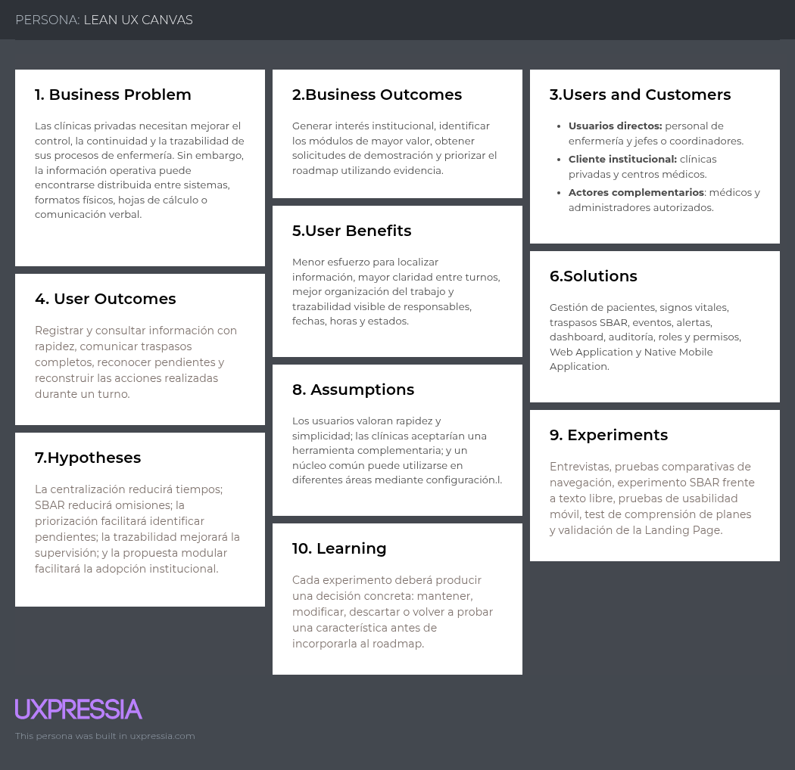

  

<strong>Universidad Peruana de Ciencias Aplicadas</strong>

<strong>Carrera de Ingeniería de Software</strong>

<strong><big>1ASI0732</big></strong>

<strong><big>Diseño de Experimentos de Ingeniería de Software</big></strong>

<strong>NRC</strong>

<strong><big>9095</big></strong>

<strong><big>Informe del Trabajo Final</big></strong>

<strong>Docente</strong>

<strong><big>Julio Manuel Noriega Melendez</big></strong>

<strong>Startup</strong>

<strong><big>Nurse Pulse</big></strong>

<strong>Producto</strong>

<strong><big>Nurse Pulse</big></strong>

<strong>Integrantes</strong>

| Código UPC   | Apellidos y nombres             |
|--------------|---------------------------------|
| u202414510   | Mansilla Rivero, Carlos Marcelo |
| u202313458   | Taipe Sangama, Jorge Fracisco   |
| [Código UPC] | [Paredes Davila, Jose Adrian]   |
| [Código UPC] | [Apellidos y nombres]           |
| [Código UPC] | [Apellidos y nombres]           |

<strong>Periodo 202620</strong>

<strong>Septiembre de 2026</strong>

# Part I: As-Is Software Project

## Capítulo I: Introducción

### 1.1. Startup Profile

#### 1.1.1. Descripción de la Startup

**Nurse Pulse** es una startup tecnológica conformada por estudiantes de la carrera de Ingeniería de Software de la Universidad Peruana de Ciencias Aplicadas. El equipo se orienta al diseño y desarrollo de soluciones digitales que ayuden a mejorar la organización, continuidad y trazabilidad de los procesos realizados por el personal de enfermería en instituciones privadas de salud.

La startup identifica que, aunque las clínicas utilizan distintos sistemas y métodos de trabajo, gran parte de las actividades de enfermería comparte necesidades comunes: consultar información relevante del paciente, registrar signos vitales, comunicar novedades entre turnos, reconocer eventos que requieren atención y conocer quién realizó cada acción. Cuando estos procesos dependen de fuentes separadas o de comunicación no estructurada, el personal puede invertir más tiempo buscando información y los responsables de supervisión encuentran dificultades para reconstruir lo ocurrido durante un turno.

Frente a esta situación, la startup propone **Nurse Pulse**, una plataforma digital dirigida principalmente al personal de enfermería de clínicas privadas. El producto busca centralizar los procesos operativos más frecuentes de enfermería y presentar la información de manera clara, accesible y trazable. Su diseño considera que una clínica puede contar con diferentes áreas, como hospitalización, emergencia, cuidados intensivos, pediatría o atención ambulatoria, sin asumir que todas trabajan de la misma forma.

Por esta razón, Nurse Pulse organiza sus funcionalidades en módulos preconstruidos que pueden habilitarse mediante configuración. La modularidad no significa desarrollar un software distinto para cada clínica, sino mantener una sola plataforma cuyos módulos y permisos se activan de acuerdo con el plan contratado y las necesidades de la institución. De esta forma, el producto conserva un alcance sostenible y puede crecer progresivamente sin depender de personalizaciones individuales.

Entre los módulos principales considerados para la plataforma se encuentran la gestión de pacientes, el registro de signos vitales, los traspasos de turno con la estructura SBAR, los eventos y alertas clínicas, y la visualización de indicadores y registros de auditoría. En futuras versiones podrán evaluarse módulos relacionados con tareas de enfermería, asignación de turnos, gestión de camas o administración de medicamentos, siempre que su incorporación sea sustentada mediante investigación y experimentos.

Nurse Pulse no pretende sustituir una historia clínica electrónica, un Hospital Information System completo ni el criterio profesional del personal de salud. La solución se plantea como una herramienta complementaria y enfocada en la operación de enfermería, capaz de integrarse progresivamente con el ecosistema tecnológico de una institución.

**Misión:** Desarrollar soluciones digitales accesibles, seguras y centradas en el usuario que ayuden a las instituciones privadas de salud a mejorar el control, la continuidad y la trazabilidad de sus procesos de enfermería.

**Visión:** Ser una startup reconocida por transformar la gestión de enfermería mediante productos tecnológicos confiables, escalables y adaptables a diferentes áreas clínicas, contribuyendo a una atención mejor organizada.

---

#### 1.1.2. Perfiles de integrantes del equipo

<table>
  <tr>
    <th colspan="2">Mansilla Rivero, Carlos Marcelo</th>
  </tr>
  <tr>
    <td>
      
    </td>
    <td>
      <b>Código:</b> u202414510 
      <b>Carrera:</b> Ingeniería de Software  
      Soy estudiante de Ingeniería de Software en la Universidad Peruana de Ciencias Aplicadas. Cuento con conocimientos en programación, desarrollo web, servicios RESTful, bases de datos y arquitectura de software, utilizando tecnologías como C++, Python, JavaScript, Angular y .NET. Dentro de Nurse Pulse, aporto en el análisis de la solución, desarrollo técnico, documentación del proyecto y revisión de la coherencia entre los requerimientos, los experimentos y las funcionalidades propuestas. También contribuyo con responsabilidad, organización, pensamiento crítico y trabajo colaborativo.
    </td>
  </tr>

  <tr>
    <th colspan="2">Taipe Sangama, Jorge Francisco</th>
  </tr>
  <tr>
    <td>
      
    </td>
    <td>
      <b>Código:</b> u202313458 
      <b>Carrera:</b> Ingeniería de Software  
        Soy estudiante de Ingenieria de Software en la Universidad Peruana de Ciencias Aplicadas. Cuento con conocimientos en desarrollo Front-end y desarrollo Backend. Dentro de Nurse Pulse, aportare como lider de equipo las habilidades adquiridos de ciclos anteriores como trabajo en equipo y puntualidad.
    </td>
  </tr>

  <tr>
    <th colspan="2">Paredes Davila, Jose Adrian</th>
  </tr>
  <tr>
    <td>
      
    </td>
    <td>
      <b>Código:</b> u202216163 
      <b>Carrera:</b> Ingeniería de Software  
     Soy estudiante de Ingeniería de Software en la Universidad Peruana de Ciencias Aplicadas. Cuento con conocimientos en desarrollo de software, gestión de bases de datos y metodologías ágiles. En el proyecto NursePulse, aportaré en la implementación técnica, pruebas de calidad y elaboración de la documentación integral, contribuyendo con atención al detalle, proactividad y trabajo en equipo.
    </td>
  </tr>

  <tr>
    <th colspan="2">[Apellidos y nombres del integrante 4]</th>
  </tr>
  <tr>
    <td>
      
    </td>
    <td>
      <b>Código:</b> [Código UPC] 
      <b>Carrera:</b> Ingeniería de Software  
      [Redactar una presentación que incluya los principales conocimientos técnicos, habilidades interpersonales y responsabilidades que el integrante aportará al desarrollo de Nurse Pulse.]
    </td>
  </tr>

  <tr>
    <th colspan="2">[Apellidos y nombres del integrante 5]</th>
  </tr>
  <tr>
    <td>
      
    </td>
    <td>
      <b>Código:</b> [Código UPC] 
      <b>Carrera:</b> Ingeniería de Software  
      [Redactar una presentación que incluya los principales conocimientos técnicos, habilidades interpersonales y responsabilidades que el integrante aportará al desarrollo de Nurse Pulse.]
    </td>
  </tr>
</table>

---

### 1.2. Solution Profile

#### 1.2.1. Antecedentes y problemática

Nurse Pulse surge como una evolución conceptual de **PulseReport**, una solución académica desarrollada previamente por el equipo BrainSpark para apoyar el registro de signos vitales, la comunicación mediante SBAR, el seguimiento de eventos clínicos y la trazabilidad de la atención cardiovascular. Este antecedente permitió identificar que varias de las necesidades abordadas no son exclusivas de cardiología, sino que también están presentes en otras áreas donde el personal de enfermería registra, consulta y comunica información de manera constante.

El informe y los productos del proyecto anterior se encuentran disponibles en la organización pública de GitHub de BrainSpark: https://github.com/NursePulse. Nurse Pulse reutiliza el conocimiento adquirido sobre el dominio, pero redefine el problema, los segmentos, el alcance y las hipótesis para orientarse al sector de enfermería de clínicas privadas. Cualquier artefacto o código que sea reutilizado deberá identificarse y atribuirse adecuadamente.

En una clínica, el personal de enfermería participa continuamente en el monitoreo del paciente, el registro de información, la coordinación con otros profesionales y la transferencia de responsabilidad entre turnos. Dependiendo de la institución y del área clínica, estos procesos pueden apoyarse en historias clínicas electrónicas, sistemas internos, hojas de cálculo, formatos impresos o comunicación verbal. La coexistencia de varios medios puede dificultar el acceso oportuno a la información y reducir la visibilidad sobre las acciones realizadas.

El problema no consiste únicamente en digitalizar formularios. Una herramienta que solo traslade los mismos procesos a una pantalla puede conservar la duplicidad y la sobrecarga administrativa. El reto consiste en organizar la información alrededor de las tareas reales del personal de enfermería, mostrar primero aquello que requiere atención y conservar trazabilidad sin añadir pasos innecesarios.

##### A. Quiénes están involucrados (Who)

Los principales involucrados son:

- **Personal de enfermería:** registra signos vitales, eventos, observaciones y traspasos de turno; además, consulta información para organizar sus actividades.
- **Jefes y coordinadores de enfermería:** supervisan al equipo, verifican pendientes y requieren conocer responsables, horarios y estados.
- **Médicos y otros profesionales autorizados:** consultan la evolución del paciente y determinados eventos registrados por enfermería.
- **Administradores de la clínica:** gestionan usuarios, roles, permisos, áreas y módulos habilitados.
- **Clínicas privadas y centros médicos:** adquieren la solución y definen las políticas institucionales para su utilización.
- **Pacientes:** reciben indirectamente el impacto de una atención con procesos mejor organizados y mayor continuidad.

##### B. Qué problema resuelve la solución (What)

Nurse Pulse busca resolver la fragmentación y la baja trazabilidad de la información operativa utilizada por el personal de enfermería. Cuando los registros relevantes se encuentran separados, el usuario puede tener dificultades para responder preguntas básicas: ¿qué ocurrió con el paciente?, ¿qué actividad está pendiente?, ¿quién realizó el último registro?, ¿qué información dejó el turno anterior? y ¿qué situación requiere atención prioritaria?

La plataforma centraliza estos flujos y relaciona cada registro con un paciente, un área, un turno, una fecha, una hora y un responsable autorizado. De esta manera, la información deja de presentarse como registros aislados y forma parte de un historial consultable.

##### C. Cuándo ocurre el problema (When)

El problema puede aparecer en diferentes momentos de la operación clínica:

- Al iniciar un turno y revisar los pacientes o actividades asignadas.
- Durante el registro periódico de signos vitales.
- Cuando se documenta una novedad o evento clínico.
- Al identificar una situación que requiere seguimiento.
- Durante el cambio de turno y la transferencia de información.
- Cuando un supervisor revisa el cumplimiento de actividades.
- Cuando es necesario reconstruir lo ocurrido durante un periodo específico.

##### D. Dónde ocurre el problema (Where)

La problemática puede presentarse en distintas áreas de una clínica privada. Nurse Pulse se diseña con un núcleo común aplicable a hospitalización, emergencia, cuidados intensivos, pediatría y otras áreas que compartan procesos de registro, seguimiento y traspaso de responsabilidad.

Para mantener un alcance verificable, la primera investigación y validación se concentrará en **hospitalización general**. Este escenario permite estudiar procesos recurrentes de enfermería sin afirmar que los resultados serán automáticamente iguales en todas las áreas. La incorporación de nuevos contextos deberá sustentarse posteriormente con evidencia.

##### E. Por qué es relevante este problema (Why)

El personal de enfermería necesita tomar decisiones operativas con información disponible y comprensible. Cuando encontrar o comunicar esa información requiere revisar diversas fuentes, aumenta el esfuerzo necesario para realizar el trabajo y se dificulta mantener una visión común entre turnos.

Para las instituciones privadas, la trazabilidad también resulta importante porque permite verificar actividades, identificar responsables, revisar incidentes y generar información para la mejora de procesos. Una solución enfocada puede aportar valor sin sustituir todo el ecosistema hospitalario existente.

##### F. Cómo se gestiona actualmente el problema (How)

Las prácticas actuales pueden variar entre instituciones. Algunas clínicas utilizan plataformas integrales, mientras que otras complementan sus sistemas con formatos impresos, hojas de cálculo, documentos compartidos o comunicación verbal. Esta descripción constituye un punto de partida y deberá validarse mediante entrevistas con representantes reales de los segmentos objetivo.

Nurse Pulse propone un flujo centralizado en el que cada usuario accede según su rol, consulta los pacientes o eventos relevantes para su área y registra información dentro del módulo correspondiente. Los módulos forman parte de una misma plataforma y pueden habilitarse por configuración, sin crear una versión de software diferente para cada clínica.

##### G. Cuánto impacta el problema (How much)

En esta etapa todavía no existe evidencia suficiente para afirmar cuánto tiempo se pierde, con qué frecuencia ocurren omisiones o qué proporción de clínicas presenta el problema. Para evitar conclusiones no sustentadas, el impacto se medirá durante la investigación utilizando indicadores como:

- Tiempo empleado para localizar información prioritaria.
- Porcentaje de información requerida omitida en un traspaso.
- Cantidad de medios consultados para completar una tarea.
- Tasa de tareas completadas correctamente.
- Tiempo necesario para identificar al responsable de una acción.
- Percepción de claridad y facilidad de uso.

Los valores obtenidos permitirán establecer una línea base y diseñar posteriormente experimentos con metas y tamaños de efecto justificables.

##### Puntos principales que debe resolver la solución

- Centralizar información operativa relevante para enfermería.
- Facilitar el registro y consulta de signos vitales.
- Estructurar los traspasos de turno mediante SBAR.
- Registrar eventos y alertas asociados al paciente.
- Mostrar responsables, fechas, horas y estados de las acciones.
- Ofrecer una vista resumida de pendientes e información prioritaria.
- Aplicar roles y permisos según la responsabilidad del usuario.
- Permitir que los módulos preconstruidos sean habilitados por configuración.
- Mantener una experiencia comprensible en la aplicación web y móvil.

##### Objetivos de la solución

**Objetivo general**

Desarrollar una plataforma digital que ayude a las clínicas privadas a mejorar el control, la continuidad y la trazabilidad de sus procesos de enfermería en diferentes áreas clínicas.

**Objetivos específicos**

- Centralizar los registros principales de enfermería relacionados con pacientes, signos vitales, traspasos y eventos.
- Reducir el esfuerzo necesario para localizar información prioritaria durante un turno.
- Mejorar la completitud y estructura de la información comunicada entre turnos.
- Proporcionar a los supervisores una vista trazable de actividades, responsables y estados.
- Validar mediante experimentos cuáles funcionalidades producen resultados útiles para los usuarios y el negocio.
- Construir una solución con arquitectura escalable, control de acceso y soporte para web y aplicación móvil nativa.

##### Restricciones y alcance del proyecto

- Nurse Pulse será una herramienta de soporte operativo y no realizará diagnósticos ni indicaciones médicas.
- El MVP no reemplazará el EHR o HIS de la clínica.
- Los experimentos académicos utilizarán datos sintéticos y no historias clínicas reales.
- El producto tendrá un núcleo común; la modularidad se resolverá mediante configuración y no mediante desarrollos distintos por cliente.
- La validación inicial se realizará en hospitalización general y su generalización a otras áreas requerirá evidencia adicional.
- Las funcionalidades deberán respetar los roles y permisos definidos para cada tipo de usuario.
- El alcance inicial incluirá Landing Page, Frontend Web Application, Native Mobile Application y RESTful API conforme al enunciado del curso.

---

#### 1.2.2. Lean UX Process

El Lean UX Process de Nurse Pulse se plantea como un ciclo de aprendizaje continuo orientado a resultados y no únicamente a la producción de funcionalidades. Su aplicación permite transformar la problemática identificada en supuestos e hipótesis que puedan ser comprobados mediante entrevistas, pruebas de usabilidad y experimentos controlados.

La lógica del proceso será:

**problema -> outcomes -> supuestos -> hipótesis -> experimentos -> aprendizaje -> iteración**

Para el proyecto se consideran dos segmentos principales de usuarios directos: el personal de enfermería y los jefes o coordinadores de enfermería de clínicas privadas. Además, se reconoce a las clínicas privadas y centros médicos como clientes institucionales, debido a que son quienes evalúan, adquieren y habilitan la solución dentro de sus áreas.

##### Business Outcomes y User Outcomes

**Business Outcomes**

- Incrementar el interés de clínicas privadas en solicitar información o una demostración de Nurse Pulse.
- Identificar los módulos que generan mayor valor percibido para una adopción inicial.
- Construir una propuesta SaaS sostenible basada en módulos preconstruidos y configurables.
- Evitar que el crecimiento del producto dependa de desarrollar una versión diferente para cada institución.
- Obtener evidencia que permita priorizar el roadmap y reducir el riesgo de invertir en funcionalidades no validadas.

**User Outcomes**

- El personal de enfermería encuentra con mayor rapidez la información relevante para su turno.
- Los enfermeros registran signos vitales, observaciones y eventos mediante flujos breves y comprensibles.
- Los equipos comunican los cambios de turno de manera estructurada mediante SBAR.
- Los jefes y coordinadores identifican pendientes, alertas, responsables y estados sin revisar múltiples fuentes.
- Los usuarios reconocen quién realizó una acción, cuándo ocurrió y a qué paciente o área pertenece.

---

##### 1.2.2.1. Lean UX Problem Statements

###### Problem Statement 1 - Personal de enfermería

**Domain:** Gestión de información y continuidad de los procesos de enfermería durante los turnos de atención.

**Customer segment:** Enfermeros y enfermeras de clínicas privadas que registran signos vitales, observaciones, eventos y traspasos de turno.

**Pain points:** Información distribuida entre diferentes medios; duplicidad de registros; dificultad para reconocer pendientes; comunicación no estructurada; y pérdida de tiempo al buscar información relevante.

**Gap:** Los sistemas existentes pueden cubrir numerosos procesos hospitalarios, pero no siempre ofrecen un flujo simple y enfocado en las actividades cotidianas del personal de enfermería.

**Vision / Strategy:** Nurse Pulse busca centralizar los procesos operativos más frecuentes de enfermería mediante módulos configurables, trazables y fáciles de utilizar.

**Initial segment:** Personal de enfermería que trabaja en hospitalización general de clínicas privadas.

**Problem Statement:**

El personal de enfermería de clínicas privadas necesita una manera rápida, estructurada y trazable de registrar, consultar y transferir información porque los datos necesarios para realizar sus actividades pueden encontrarse distribuidos entre diferentes medios y sistemas. Esta situación dificulta la continuidad del trabajo entre turnos y aumenta el esfuerzo requerido para reconocer pendientes y novedades importantes.

**Pregunta clave:**

¿Cómo podríamos centralizar la información operativa de enfermería sin añadir complejidad ni sustituir los sistemas clínicos existentes?

###### Problem Statement 2 - Jefes y coordinadores de enfermería

**Domain:** Supervisión, control y trazabilidad de las actividades realizadas por el equipo de enfermería.

**Customer segment:** Jefes, supervisores y coordinadores de enfermería responsables de organizar equipos y revisar el cumplimiento de actividades.

**Pain points:** Baja visibilidad sobre actividades pendientes; dificultad para identificar responsables; revisión manual de diferentes fuentes; e información tardía sobre incidentes o eventos relevantes.

**Gap:** Las herramientas actuales no siempre presentan una vista resumida de la operación de enfermería ni permiten reconstruir con facilidad lo ocurrido durante un turno.

**Vision / Strategy:** Nurse Pulse busca proporcionar un dashboard trazable que consolide estados, alertas, responsables y acciones relevantes sin convertir la plataforma en un mecanismo de vigilancia excesiva.

**Initial segment:** Jefes y coordinadores responsables del área de hospitalización general en clínicas privadas.

**Problem Statement:**

Los jefes y coordinadores de enfermería necesitan supervisar actividades, responsables, alertas y pendientes porque la información fragmentada dificulta obtener una visión clara de lo ocurrido durante cada turno y evaluar la continuidad de los procesos.

**Pregunta clave:**

¿Cómo podríamos ofrecer una visión trazable y resumida de la operación de enfermería que facilite la supervisión y respete el propósito clínico de la información?

###### Problem Statement 3 - Clínicas privadas

**Domain:** Adopción institucional de soluciones digitales para la gestión de enfermería.

**Customer segment:** Clínicas privadas y centros médicos que buscan mejorar el control y la trazabilidad de sus procesos sin reemplazar toda su infraestructura tecnológica.

**Pain points:** Alto costo y complejidad de los sistemas hospitalarios integrales; procesos fragmentados entre áreas; necesidad de capacitación; y riesgo de adquirir funcionalidades que no se ajusten al flujo real del personal.

**Gap:** Existe espacio para una solución SaaS enfocada en enfermería que pueda adoptarse progresivamente y configurarse mediante módulos preconstruidos.

**Vision / Strategy:** Nurse Pulse ofrecerá una sola plataforma con un núcleo común, roles definidos y módulos que puedan habilitarse según el plan y las necesidades de la institución, sin desarrollar un sistema distinto para cada cliente.

**Initial segment:** Clínicas privadas de Lima Metropolitana que cuenten con un área de hospitalización general y estén dispuestas a participar en la validación inicial.

**Problem Statement:**

Las clínicas privadas necesitan mejorar el control de sus procesos de enfermería sin asumir la complejidad y el costo de sustituir toda su infraestructura tecnológica. Las soluciones hospitalarias integrales pueden cubrir numerosos procesos, pero no siempre presentan de manera simple las actividades específicas que el personal de enfermería necesita consultar durante su jornada.

**Pregunta clave:**

¿Cómo podríamos ofrecer una solución SaaS enfocada y escalable que pueda ser adoptada progresivamente por distintas áreas clínicas?

---

##### 1.2.2.2. Lean UX Assumptions

###### Supuestos sobre los usuarios

- El personal de enfermería registra y consulta información varias veces durante un turno.
- Los enfermeros necesitan acceder a información del paciente desde distintos puntos del área clínica.
- Los cambios de turno requieren transferir información sobre el estado del paciente y las actividades pendientes.
- Los coordinadores necesitan consultar responsables, horarios y estados sin revisar múltiples fuentes.
- Los usuarios tienen distintos niveles de experiencia con herramientas digitales.
- El uso de una aplicación móvil estará condicionado por las políticas y recursos de cada institución.

###### Supuestos sobre las necesidades

- La fragmentación de información aumenta el tiempo necesario para completar tareas de consulta y registro.
- Los traspasos de turno no estructurados pueden omitir información relevante.
- La visualización priorizada de alertas y pendientes ayuda a organizar el turno.
- La trazabilidad visible resulta útil para supervisores y profesionales autorizados.
- Los usuarios necesitan flujos breves que no incrementen innecesariamente su carga administrativa.
- Las necesidades comunes de enfermería pueden representarse mediante un núcleo funcional reutilizable entre áreas.

###### Supuestos sobre la solución

- Un dashboard centralizado permitirá reconocer con mayor rapidez los elementos que requieren atención.
- La estructura SBAR facilitará la completitud de la información durante el cambio de turno.
- Relacionar cada registro con su responsable, fecha y hora mejorará la trazabilidad.
- La separación por roles reducirá el acceso innecesario a información o acciones restringidas.
- Los módulos preconstruidos permitirán atender diferentes necesidades sin modificar el código para cada cliente.
- Una aplicación móvil nativa facilitará determinados registros realizados cerca del paciente.

###### Supuestos sobre el negocio

- Las clínicas privadas reconocerán valor en una solución enfocada en procesos de enfermería.
- El modelo SaaS reducirá la barrera de adopción frente a una implementación hospitalaria integral.
- Las instituciones preferirán comenzar con un conjunto limitado de módulos y ampliar su uso progresivamente.
- Seguridad, soporte, trazabilidad y facilidad de implementación influirán en la decisión de compra.
- Hospitalización general es un escenario adecuado para la primera validación del producto.

###### Lean UX Assumption Prioritization

La priorización inicial considera dos criterios: el riesgo de que el supuesto sea incorrecto y el impacto que tendría sobre la viabilidad del producto. Las puntuaciones deberán revisarse después de las entrevistas.

| ID | Supuesto | Riesgo | Impacto | Prioridad inicial |
| -- | -------- | ------ | ------- | ----------------- |
| A-01 | El personal utiliza múltiples medios para consultar o registrar información durante un turno. | Alto | Alto | 1 |
| A-02 | Un traspaso SBAR reduce omisiones frente a un registro no estructurado. | Alto | Alto | 2 |
| A-03 | Un dashboard priorizado reduce el tiempo para identificar pendientes y alertas. | Alto | Alto | 3 |
| A-04 | Las clínicas privadas valoran una solución enfocada específicamente en enfermería. | Alto | Alto | 4 |
| A-05 | Los módulos preconstruidos facilitan una adopción progresiva. | Alto | Medio | 5 |
| A-06 | El personal puede utilizar una aplicación móvil durante actividades cercanas al paciente. | Medio | Alto | 6 |
| A-07 | Hospitalización representa adecuadamente el primer escenario de validación. | Medio | Medio | 7 |

---

##### 1.2.2.3. Lean UX Hypothesis Statements

Los umbrales incluidos en esta primera versión son metas provisionales. Deberán ajustarse cuando el equipo obtenga una línea base, defina el tamaño de muestra y realice los cálculos de escala correspondientes.

###### Hipótesis 1 - Acceso centralizado a la información

Creemos que el personal de enfermería de clínicas privadas reducirá el tiempo necesario para localizar información prioritaria si utiliza un dashboard centralizado de Nurse Pulse en lugar de consultar vistas o medios separados.

Sabremos que la hipótesis obtiene evidencia favorable si, durante tareas controladas con datos sintéticos, el tiempo medio hasta encontrar la información correcta disminuye al menos un 20 % y no aumenta la tasa de errores.

###### Hipótesis 2 - Traspaso de turno mediante SBAR

Creemos que el personal de enfermería comunicará información más completa si utiliza un formulario de traspaso estructurado mediante SBAR en lugar de un campo de texto libre.

Sabremos que la hipótesis obtiene evidencia favorable si la condición SBAR presenta una tasa de omisión de elementos relevantes al menos 25 % menor que la condición de control.

###### Hipótesis 3 - Visualización de pendientes y alertas

Creemos que mostrar pendientes y alertas organizados por prioridad permitirá al personal identificar con mayor rapidez la siguiente acción requerida durante el turno.

Sabremos que la hipótesis obtiene evidencia favorable si al menos el 80 % de los participantes identifica correctamente la primera acción y el tiempo medio es menor que en una navegación organizada únicamente por módulos.

###### Hipótesis 4 - Trazabilidad para supervisión

Creemos que mostrar responsable, fecha, hora y estado en los registros permitirá a los coordinadores reconstruir con mayor precisión lo ocurrido durante un turno.

Sabremos que la hipótesis obtiene evidencia favorable si al menos el 80 % de las preguntas de auditoría planteadas durante la prueba son respondidas correctamente utilizando Nurse Pulse.

###### Hipótesis 5 - Aplicación móvil nativa

Creemos que una aplicación móvil nativa facilitará el registro de información durante actividades cercanas al paciente frente a una experiencia que dependa únicamente de una estación de trabajo fija.

Sabremos que la hipótesis obtiene evidencia favorable si la aplicación móvil mejora la tasa de finalización y reduce el tiempo de registro sin incrementar los errores ni generar una percepción negativa sobre la carga de trabajo.

###### Hipótesis 6 - Propuesta modular para clínicas privadas

Creemos que presentar módulos preconstruidos y planes definidos permitirá a los responsables de clínicas privadas comprender con mayor facilidad cómo adoptar Nurse Pulse.

Sabremos que la hipótesis obtiene evidencia favorable si al menos el 70 % de los participantes institucionales puede seleccionar correctamente el plan apropiado para un escenario y explicar las capacidades incluidas sin asistencia del equipo.

###### Hipótesis 7 - Landing Page

Creemos que una Landing Page que explique el problema, la solución, los módulos y los límites del producto aumentará el interés de responsables de clínicas privadas en conocer Nurse Pulse.

Sabremos que la hipótesis obtiene evidencia favorable si la variante propuesta mejora la tasa de selección del llamado a solicitar una demostración frente a la versión de referencia, manteniendo una comprensión correcta del producto.

###### Lean UX Experiments and Learning

| Hipótesis | Método inicial | Evidencia principal | Aprendizaje esperado |
| --------- | -------------- | ------------------- | -------------------- |
| H-01 | Prueba comparativa de navegación | Tiempo y errores | Conocer si el dashboard mejora el acceso a información. |
| H-02 | Experimento SBAR vs. texto libre | Tasa de omisión | Conocer si la estructura mejora la completitud. |
| H-03 | Prueba de priorización | Primera acción correcta y tiempo | Conocer si la jerarquía ayuda a organizar el trabajo. |
| H-04 | Escenario de auditoría | Respuestas correctas | Conocer si la trazabilidad satisface la supervisión. |
| H-05 | Prueba de usabilidad móvil | Finalización, tiempo y errores | Conocer si el móvil aporta valor en el escenario estudiado. |
| H-06 | Test de comprensión de planes | Selección y explicación correctas | Conocer si la modularidad es comprensible. |
| H-07 | Prueba de Landing Page | Comprensión y conversión | Conocer si la comunicación genera interés calificado. |

---

##### 1.2.2.4. Lean UX Canvas

El Lean UX Canvas resume la relación entre el problema de negocio, los usuarios, los resultados esperados, las soluciones propuestas y los experimentos que permitirán aprender antes de ampliar el alcance del producto.

| Sección | Descripción para Nurse Pulse |
| ------- | ---------------------------- |
| **1. Business Problem** | Las clínicas privadas necesitan mejorar el control, la continuidad y la trazabilidad de sus procesos de enfermería. Sin embargo, la información operativa puede encontrarse distribuida entre sistemas, formatos físicos, hojas de cálculo o comunicación verbal. |
| **2. Business Outcomes** | Generar interés institucional, identificar los módulos de mayor valor, obtener solicitudes de demostración y priorizar el roadmap utilizando evidencia. |
| **3. Users and Customers** | **Usuarios directos:** personal de enfermería y jefes o coordinadores. **Cliente institucional:** clínicas privadas y centros médicos. **Actores complementarios:** médicos y administradores autorizados. |
| **4. User Outcomes** | Registrar y consultar información con rapidez, comunicar traspasos completos, reconocer pendientes y reconstruir las acciones realizadas durante un turno. |
| **5. User Benefits** | Menor esfuerzo para localizar información, mayor claridad entre turnos, mejor organización del trabajo y trazabilidad visible de responsables, fechas, horas y estados. |
| **6. Solutions** | Gestión de pacientes, signos vitales, traspasos SBAR, eventos, alertas, dashboard, auditoría, roles y permisos, Web Application y Native Mobile Application. |
| **7. Hypotheses** | La centralización reducirá tiempos; SBAR reducirá omisiones; la priorización facilitará identificar pendientes; la trazabilidad mejorará la supervisión; y la propuesta modular facilitará la adopción institucional. |
| **8. Assumptions** | Los usuarios valoran rapidez y simplicidad; las clínicas aceptarían una herramienta complementaria; y un núcleo común puede utilizarse en diferentes áreas mediante configuración. |
| **9. Experiments** | Entrevistas, pruebas comparativas de navegación, experimento SBAR frente a texto libre, pruebas de usabilidad móvil, test de comprensión de planes y validación de la Landing Page. |
| **10. Learning** | Cada experimento deberá producir una decisión concreta: mantener, modificar, descartar o volver a probar una característica antes de incorporarla al roadmap. |

> **Artefacto pendiente:** LEAN UX CANVAS

  

---

### 1.3. Segmentos objetivo

Nurse Pulse diferencia entre los usuarios que interactúan con la plataforma durante la operación clínica y el cliente institucional que evalúa, adquiere y habilita la solución. Esta separación permite diseñar la experiencia alrededor de las tareas reales del personal de enfermería sin perder de vista las necesidades de seguridad, control y sostenibilidad de la clínica.

#### Segmento objetivo #1: Personal de enfermería de clínicas privadas

Este segmento está conformado por enfermeros y enfermeras que trabajan en hospitalización y otras áreas clínicas de instituciones privadas. Sus actividades incluyen el monitoreo de pacientes, el registro de signos vitales y observaciones, la documentación de eventos, la coordinación con otros profesionales y la comunicación durante los cambios de turno.

**Características demográficas y profesionales preliminares:**

- Profesionales de salud con formación técnica o universitaria en enfermería.
- Edad aproximada entre 22 y 60 años; este rango deberá precisarse mediante la investigación con usuarios.
- Experiencia variable, desde personal que inicia su práctica profesional hasta enfermeros con amplia trayectoria clínica.
- Trabajo frecuente en turnos rotativos, guardias diurnas o nocturnas y escenarios de presión operativa.
- Uso de computadoras institucionales, tablets o dispositivos móviles según la disponibilidad y las políticas de la clínica.
- Diferentes niveles de familiaridad con sistemas clínicos y herramientas digitales.

**Características clave del segmento:**

- Registra y consulta información varias veces durante un turno.
- Necesita reconocer con rapidez qué pacientes o actividades requieren atención.
- Transfiere información y responsabilidad al equipo del siguiente turno.
- Puede utilizar medios físicos o aplicaciones complementarias cuando el sistema institucional no cubre un flujo concreto.
- Valora interfaces claras, rápidas y con pocos pasos.
- Requiere acceso limitado a los pacientes, áreas y acciones que le corresponden.

**Necesidades principales:**

- Consultar con rapidez la información relevante para el turno.
- Registrar signos vitales, observaciones y eventos sin pasos innecesarios.
- Reconocer pendientes y alertas importantes.
- Comunicar información estructurada durante el cambio de turno.
- Evitar la duplicidad entre diferentes medios de registro.
- Mantener evidencia de las acciones realizadas.

---

#### Segmento objetivo #2: Jefes y coordinadores de enfermería

Este segmento está compuesto por profesionales responsables de supervisar equipos de enfermería, distribuir responsabilidades, revisar actividades y mantener la continuidad de los procesos dentro de un área clínica.

**Características demográficas y profesionales preliminares:**

- Profesionales de enfermería con experiencia clínica y responsabilidades de coordinación o supervisión.
- Edad aproximada entre 28 y 65 años; el rango deberá validarse con participantes reales.
- Experiencia previa en gestión de turnos, asignación de personal, revisión de incidentes o seguimiento de indicadores.
- Trabajo en contacto permanente con enfermeros, médicos, administradores y responsables institucionales.
- Uso de reportes, sistemas clínicos, hojas de cálculo u otros medios para consolidar información operativa.

**Características clave del segmento:**

- Necesita una visión resumida del estado del área y del turno.
- Supervisa responsables, fechas, horas, pendientes y eventos relevantes.
- Requiere información confiable para revisar incidentes y mejorar procesos.
- Valora la trazabilidad, pero necesita que esta se utilice con una finalidad operativa y clínica clara.
- Participa en la evaluación de nuevas herramientas y en la capacitación del personal.

**Necesidades principales:**

- Visualizar el estado general de las actividades del turno.
- Identificar responsables y registros pendientes.
- Reconocer eventos que requieren seguimiento.
- Consultar información resumida sin revisar múltiples fuentes.
- Obtener evidencia trazable para auditoría y mejora continua.
- Configurar flujos que puedan ser adoptados por el equipo sin aumentar su carga administrativa.

---

#### Cliente objetivo: Clínicas privadas y centros médicos

Las clínicas privadas constituyen el cliente institucional de Nurse Pulse. Estas organizaciones pueden presentar distintos tamaños, especialidades, niveles de madurez digital y sistemas internos. La propuesta no presupone que todas necesiten las mismas funcionalidades ni que deban reemplazar su infraestructura tecnológica actual.

**Características del cliente institucional:**

- Instituciones privadas de salud registradas como IPRESS.
- Clínicas o centros médicos con servicios de hospitalización, emergencia, cuidados intensivos, pediatría u otras áreas con procesos de enfermería.
- Organizaciones que pueden contar con un sistema hospitalario, pero requieren mejorar la visibilidad de determinados flujos de enfermería.
- Instituciones interesadas en seguridad, trazabilidad, continuidad de atención y mejora de procesos.
- Clientes que prefieren una adopción progresiva mediante planes o módulos definidos.

**Necesidades principales:**

- Mejorar el control y la trazabilidad de los procesos de enfermería.
- Adoptar una solución sin reemplazar inmediatamente todo su ecosistema tecnológico.
- Administrar usuarios, roles, permisos, áreas y módulos habilitados.
- Evitar proyectos largos de personalización individual.
- Obtener indicadores que apoyen la supervisión y la mejora continua.
- Contar con soporte, seguridad y una propuesta de costos comprensible.

---

#### Actores complementarios: Médicos y administradores del sistema

Los médicos y otros profesionales autorizados pueden consultar información relacionada con la evolución del paciente y los eventos registrados por enfermería. Los administradores del sistema gestionan usuarios, roles, permisos, áreas y módulos. Estos actores participan en el ecosistema del producto, pero la experiencia principal de Nurse Pulse se diseña alrededor de los procesos de enfermería y de su supervisión.

---

### Sustento estadístico de los segmentos

La elección del personal de enfermería como segmento principal se sustenta en el tamaño y la relevancia de esta fuerza laboral dentro del sistema de salud peruano. De acuerdo con el Instituto Nacional de Estadística e Informática, el número de enfermeras y enfermeros colegiados en el Perú aumentó de **69 264 profesionales en 2013 a 111 083 en 2023**. Asimismo, la institución mantiene información desagregada por departamento, lo que permite observar la distribución territorial de estos profesionales y sustentar una validación inicial del producto en Lima Metropolitana (Instituto Nacional de Estadística e Informática [INEI], s. f.).

Por otro lado, la Organización Mundial de la Salud reporta para el Perú una densidad aproximada de **27 profesionales de enfermería y obstetricia por cada 10 000 habitantes**, según los datos correspondientes a 2022. Este indicador evidencia la presencia significativa del personal de enfermería dentro del sistema de salud y refuerza la relevancia de estudiar herramientas orientadas a mejorar sus procesos de registro, consulta y coordinación durante la atención de pacientes (Organización Mundial de la Salud [OMS], s. f.).

En el ámbito regional, la Organización Panamericana de la Salud señala que los profesionales de enfermería representan aproximadamente el **56 % de la fuerza laboral de salud de las Américas** y que alrededor del **89 % del personal de enfermería está conformado por mujeres**. Estas cifras corresponden al contexto regional y no deben interpretarse como proporciones exactas para el Perú; sin embargo, permiten dimensionar la relevancia de este grupo profesional dentro de los servicios de salud y sirven como referencia para la planificación de la investigación con usuarios (Organización Panamericana de la Salud [OPS], s. f.).

Respecto al segmento institucional, la Superintendencia Nacional de Salud mantiene el Registro Nacional de Instituciones Prestadoras de Servicios de Salud (RENIPRESS), el cual contiene información sobre establecimientos de salud públicos, privados y mixtos registrados a nivel nacional. Esta fuente permite identificar instituciones según departamento, provincia, distrito, categoría y otras características, por lo que puede utilizarse como referencia para delimitar clínicas privadas ubicadas en Lima Metropolitana que formen parte del mercado objetivo de Nurse Pulse (Superintendencia Nacional de Salud [SUSALUD], s. f.).

### Justificación de selección de segmentos

Los segmentos seleccionados se relacionan directamente con el problema central de Nurse Pulse: la gestión, continuidad y trazabilidad de los procesos de enfermería. El personal de enfermería representa el flujo principal de registro, monitoreo y transferencia de información durante el turno. Los jefes y coordinadores de enfermería representan el flujo de supervisión, seguimiento de actividades, identificación de pendientes y revisión de la trazabilidad de las acciones realizadas. Finalmente, las clínicas privadas y centros médicos representan al cliente institucional que evalúa, adquiere y habilita la solución dentro de la organización.

Esta separación permite mantener coherencia entre el análisis del problema, las entrevistas, los User Personas, el diseño de la solución y las futuras validaciones del producto. Asimismo, permite diferenciar las necesidades de los usuarios que interactúan directamente con Nurse Pulse de los objetivos institucionales relacionados con control, seguridad, trazabilidad y adopción tecnológica.

La validación inicial se concentrará en personal de enfermería y coordinadores pertenecientes al área de **hospitalización general de clínicas privadas de Lima Metropolitana**. Esta delimitación permite estudiar un escenario concreto antes de evaluar la posible aplicación de Nurse Pulse en otras áreas clínicas.

---

#### Alcance y generalización de los segmentos

El dominio general del proyecto es la gestión de procesos de enfermería en instituciones privadas de salud. Sin embargo, el primer experimento no intentará representar simultáneamente hospitalización, emergencia, UCI, pediatría y atención ambulatoria. La investigación inicial se realizará con participantes y escenarios de **hospitalización general en clínicas privadas de Lima Metropolitana**.

La aplicación del producto a otras áreas se considerará una hipótesis posterior. Antes de habilitar módulos adicionales deberán investigarse los actores, tareas, restricciones e indicadores propios de cada contexto. Este enfoque mantiene la visión escalable de Nurse Pulse sin convertir la primera versión en un producto desarrollado a medida para cada clínica.
