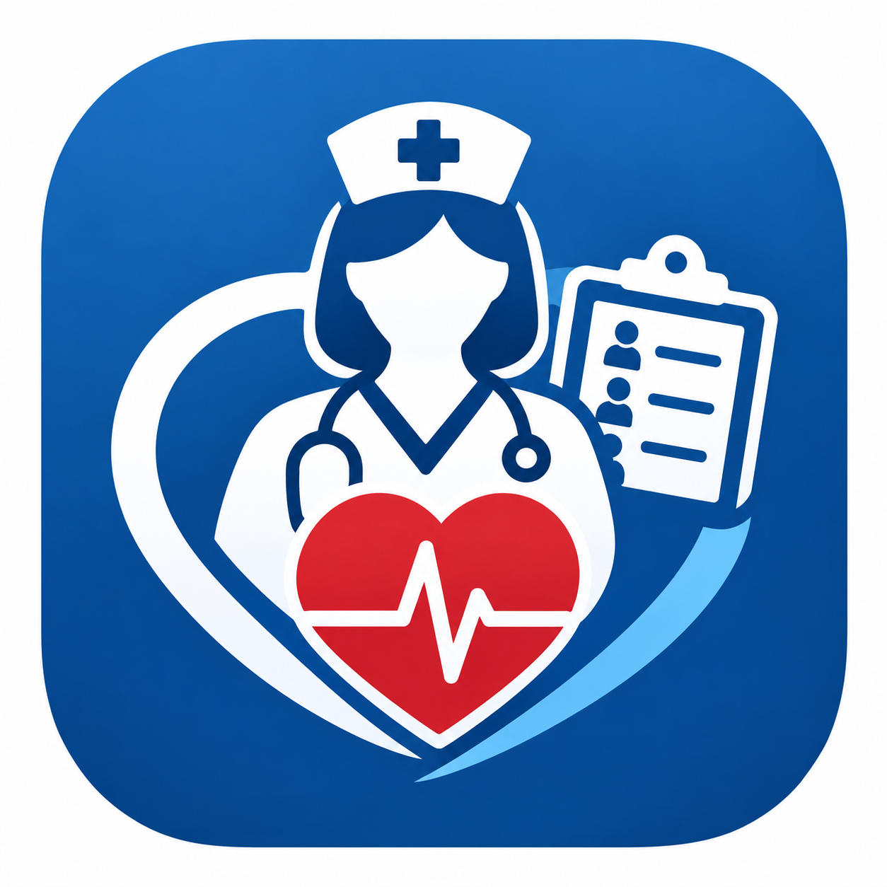
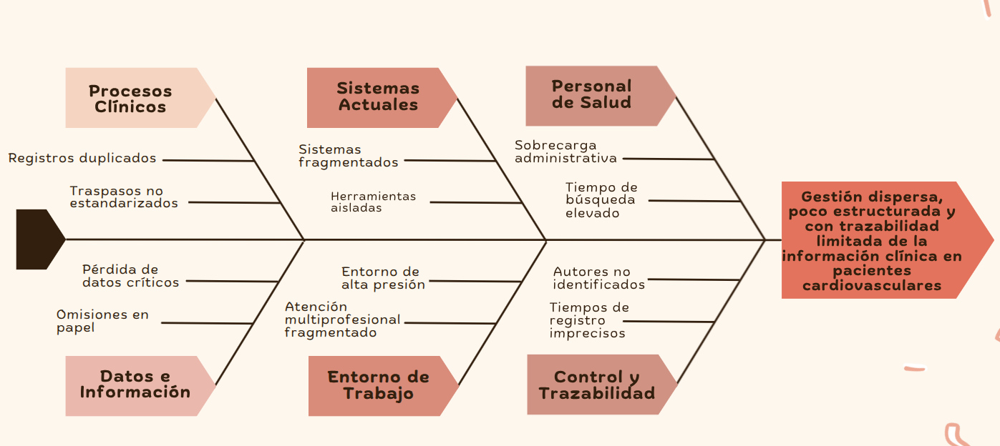

  

<strong>Universidad Peruana de Ciencias Aplicadas</strong>

<strong>Carrera de Ingeniería de Software</strong>

<strong><big>1ASI0732</big></strong>

<strong><big>Diseño de Experimentos de Ingeniería de Software</big></strong>

<strong>NRC</strong>

<strong><big>9095</big></strong>

<strong><big>Informe del Trabajo Final</big></strong>

<strong>Docente</strong>

<strong><big>Julio Manuel Noriega Melendez</big></strong>

<strong>Startup</strong>

<strong><big>Nurse Pulse</big></strong>

<strong>Producto</strong>

<strong><big>Nurse Pulse</big></strong>

<strong>Integrantes</strong>

| Código UPC   | Apellidos y nombres             |
|--------------|---------------------------------|
| u202414510   | Mansilla Rivero, Carlos Marcelo |
| u202313458   | Taipe Sangama, Jorge Francisco   |
| u202216163   | Paredes Davila, Jose Adrian     |
| u20211A574   | Navarro Flores, Renzo Jesus     |
| u20221c275   | Luque Minaya, Renzo Andres      |

<strong>Periodo 202620</strong>

<strong>Septiembre de 2026</strong>

## Registro de Versiones del Informe

<table>
  <thead>
    <tr>
      <th>Versión</th>
      <th>Fecha</th>
      <th>Autor</th>
      <th>Descripción</th>
    </tr>
  </thead>
  <tbody>
    <tr>
      <td rowspan="5" style="text-align: center; vertical-align: middle;"><b>AV1</b></td>
      <td>14/09/2026</td>
      <td>Mansilla Rivero, Carlos Marcelo</td>
      <td>Encargado de la validacion y realizacion del capitulo I , asi como los segmentos objetivos, tambien encargado del despligue de la aplicacion movil perimera version</td>
    </tr>
    <tr>
      <td>14/09/2026</td>
      <td>Taipe Sangama, Jorge Francisco</td>
      <td>Corrección de paridad funcional en Flutter respecto a Angular: gestión completa de pacientes (editar, dar de alta, eliminar, búsqueda), cálculo correcto de riesgo clínico en signos vitales, registro de alertas manuales, validación de política de contraseñas en el registro, y unificación de la paleta de colores con la aplicación web. </td>
    </tr>
    <tr>
      <td>14/09/2026</td>
      <td>Paredes Davila, Jose Adrian</td>
      <td>Elaboración del Capítulo II (investigación de usuarios, entrevistas, segmentos y validación) y del Capítulo V. Encargado del despliegue de la aplicación web en Render.</td>
    </tr>
    <tr>
      <td>14/09/2026</td>
      <td>Navarro Flores, Renzo Jesus</td>
      <td>Elaboración del Capítulo III (Impact Mapping, Product Backlog y User Stories). Encargado de la validación funcional de todo el software: pruebas end-to-end sobre backend, aplicación web y aplicación móvil.</td>
    </tr>
    <tr>
      <td>13/09/2026</td>
      <td>Luque Minaya, Renzo Andrés</td>
      <td>Actualización de la documentación de NursePulse: incorporación del índice de los capítulos I–IV, Registro de Versiones, Project Report Collaboration Insights y estructura del Student Outcome.</td>
    </tr>
    <tr>
      <td rowspan="5" style="text-align: center; vertical-align: middle;"><b>TB1</b></td>
      <td></td>
      <td>Mansilla Rivero, Carlos Marcelo</td>
      <td></td>
    </tr>
    <tr>
      <td></td>
      <td>Taipe Sangama, Jorge Francisco</td>
      <td></td>
    </tr>
    <tr>
      <td></td>
      <td>Paredes Davila, Jose Adrian</td>
      <td></td>
    </tr>
    <tr>
      <td></td>
      <td>Navarro Flores, Renzo Jesus</td>
      <td></td>
    </tr>
    <tr>
      <td></td>
      <td>Luque Minaya, Renzo Andrés</td>
      <td></td>
    </tr>
    <tr>
      <td rowspan="5" style="text-align: center; vertical-align: middle;"><b>AV2</b></td>
      <td></td>
      <td>Mansilla Rivero, Carlos Marcelo</td>
      <td></td>
    </tr>
    <tr>
      <td></td>
      <td>Taipe Sangama, Jorge Francisco</td>
      <td></td>
    </tr>
    <tr>
      <td></td>
      <td>Paredes Davila, Jose Adrian</td>
      <td></td>
    </tr>
    <tr>
      <td></td>
      <td>Navarro Flores, Renzo Jesus</td>
      <td></td>
    </tr>
    <tr>
      <td></td>
      <td>Luque Minaya, Renzo Andrés</td>
      <td></td>
    </tr>
    <tr>
      <td rowspan="5" style="text-align: center; vertical-align: middle;"><b>TB2</b></td>
      <td></td>
      <td>Mansilla Rivero, Carlos Marcelo</td>
      <td></td>
    </tr>
    <tr>
      <td></td>
      <td>Taipe Sangama, Jorge Francisco</td>
      <td></td>
    </tr>
    <tr>
      <td></td>
      <td>Paredes Davila, Jose Adrian</td>
      <td></td>
    </tr>
    <tr>
      <td></td>
      <td>Navarro Flores, Renzo Jesus</td>
      <td></td>
    </tr>
    <tr>
      <td></td>
      <td>Luque Minaya, Renzo Andrés</td>
      <td></td>
    </tr>
  </tbody>
</table>

## Project Report Collaboration Insights

**URL del repositorio del informe:** https://github.com/NursePulse/NursePulse-Report

### AV1

**Descripción de la colaboración en la elaboración del informe:**

Durante el Avance 1, el equipo de NursePulse organizó la elaboración del informe mediante la asignación de tareas a cada integrante, distribuidas por capítulos y apartados. Se coordinaron los avances, se identificaron contenidos pendientes y se acordaron ajustes en las entrevistas, el Product Backlog, el Impact Mapping y los flujos de usuario. Asimismo, se asignó la preparación de la carátula, el índice y la estructura del Student Outcome en el documento Markdown. Esta distribución de responsabilidades facilitó el seguimiento de las tareas y la integración de los aportes del equipo para la entrega.

## Contenido

- [Registro de Versiones del Informe](#registro-de-versiones-del-informe)
- [Project Report Collaboration Insights](#project-report-collaboration-insights)
- [Contenido](#contenido)
- [Student Outcome](#student-outcome)
- [Part I: As-Is Software Project](#part-i-as-is-software-project)
- [Capítulo I: Introducción](#capítulo-i-introducción)
  - [1.1. Startup Profile](#11-startup-profile)
    - [1.1.1. Descripción de la Startup](#111-descripción-de-la-startup)
    - [1.1.2. Perfiles de integrantes del equipo](#112-perfiles-de-integrantes-del-equipo)
  - [1.2. Solution Profile](#12-solution-profile)
    - [1.2.1. Antecedentes y problemática](#121-antecedentes-y-problemática)
    - [1.2.2. Lean UX Process](#122-lean-ux-process)
      - [1.2.2.1. Lean UX Problem Statements](#1221-lean-ux-problem-statements)
      - [1.2.2.2. Lean UX Assumptions](#1222-lean-ux-assumptions)
      - [1.2.2.3. Lean UX Hypothesis Statements](#1223-lean-ux-hypothesis-statements)
      - [1.2.2.4. Lean UX Canvas](#1224-lean-ux-canvas)
  - [1.3. Segmentos objetivo](#13-segmentos-objetivo)
- [Capítulo II: Requirements Elicitation & Analysis](chapter-2.md#capítulo-ii-requirements-elicitation--analysis)
  - [2.1. Competidores](chapter-2.md#21-competidores)
    - [2.1.1. Análisis competitivo](chapter-2.md#211-análisis-competitivo)
    - [2.1.2. Estrategias y tácticas frente a competidores](chapter-2.md#212-estrategias-y-tácticas-frente-a-competidores)
  - [2.2. Entrevistas](chapter-2.md#22-entrevistas)
    - [2.2.1. Diseño de entrevistas](chapter-2.md#221-diseño-de-entrevistas)
    - [2.2.2. Registro de entrevistas](chapter-2.md#222-registro-de-entrevistas)
    - [2.2.3. Análisis de entrevistas](chapter-2.md#223-análisis-de-entrevistas)
  - [2.3. Needfinding](chapter-2.md#23-needfinding)
    - [2.3.1. User Personas](chapter-2.md#231-user-personas)
    - [2.3.2. User Task Matrix](chapter-2.md#232-user-task-matrix)
    - [2.3.3. User Journey Mapping](chapter-2.md#233-user-journey-mapping)
    - [2.3.4. Empathy Mapping](chapter-2.md#234-empathy-mapping)
    - [2.3.5. As-Is Scenario Mapping](chapter-2.md#235-as-is-scenario-mapping)
  - [2.4. Ubiquitous Language](chapter-2.md#24-ubiquitous-language)
- [Capítulo III: Requirements Specification](chapter-3.md#capítulo-iii-requirements-specification)
  - [3.1 To-Be Scenario Mapping](chapter-3.md#31-to-be-scenario-mapping)
  - [3.2. User Stories](chapter-3.md#32-user-stories)
  - [3.3. Product Backlog](chapter-3.md#33-product-backlog)
  - [3.4. Impact Mapping](chapter-3.md#34-impact-mapping)
- [Capítulo IV: Product Design](chapter-4.md#capítulo-iv-product-design)
  - [4.1. Style Guidelines](chapter-4.md#41-style-guidelines)
    - [4.1.1. General Style Guidelines](chapter-4.md#411-general-style-guidelines)
    - [4.1.2. Web Style Guidelines](chapter-4.md#412-web-style-guidelines)
    - [4.1.3. Mobile Style Guidelines](chapter-4.md#413-mobile-style-guidelines)
      - [4.1.3.1 IOS Mobile Style Guidelines](chapter-4.md#4131-ios-mobile-style-guidelines)
      - [4.1.3.2 Android Mobile Style Guidelines](chapter-4.md#4132-android-mobile-style-guidelines)
  - [4.2. Information Architecture](chapter-4.md#42-information-architecture)
    - [4.2.1. Organization Systems](chapter-4.md#421-organization-systems)
    - [4.2.2. Labeling Systems](chapter-4.md#422-labeling-systems)
    - [4.2.3. SEO Tags and Meta Tags](chapter-4.md#423-seo-tags-and-meta-tags)
    - [4.2.4. Searching Systems.](chapter-4.md#424-searching-systems)
    - [4.2.5. Navigation Systems.](chapter-4.md#425-navigation-systems)
  - [4.3. Landing Page UI Design.](chapter-4.md#43-landing-page-ui-design)
    - [4.3.1. Landing Page Wireframe.](chapter-4.md#431-landing-page-wireframe)
    - [4.3.2. Landing Page Mock-up](chapter-4.md#432-landing-page-mock-up)
  - [4.4. Mobile Application UX/UI Design](chapter-4.md#44-mobile-application-uxui-design)
    - [4.4.1. Mobile Applications Wireframes](chapter-4.md#441-mobile-applications-wireframes)
    - [4.4.2. Mobile Applications Wireflow Diagrams](chapter-4.md#442-mobile-applications-wireflow-diagrams)
    - [4.4.3. Mobile Applications Mock-ups](chapter-4.md#443-mobile-applications-mock-ups)
    - [4.4.4. Mobile Applications User Flow Diagrams](chapter-4.md#444-mobile-applications-user-flow-diagrams)
  - [4.5. Mobile Applications Prototyping](chapter-4.md#45-mobile-applications-prototyping)
    - [4.5.1. Android Mobile Applications Prototyping](chapter-4.md#451-android-mobile-applications-prototyping)
    - [4.5.2. iOS Mobile Applications Prototyping](chapter-4.md#452-ios-mobile-applications-prototyping)
  - [4.6. Web Applications UX/UI Design](chapter-4.md#46-web-applications-uxui-design)
    - [4.6.1. Web Applications Wireframes](chapter-4.md#461-web-applications-wireframes)
    - [4.6.2. Web Applications Wireflow Diagrams](chapter-4.md#462-web-applications-wireflow-diagrams)
    - [4.6.3. Web Applications Mock-ups](chapter-4.md#463-web-applications-mock-ups)
    - [4.6.4. Web Applications User Flow Diagrams](chapter-4.md#464-web-applications-user-flow-diagrams)
  - [4.7. Web Applications Prototyping.](chapter-4.md#47-web-applications-prototyping)
  - [4.8. Domain-Driven Software Architecture](chapter-4.md#48-domain-driven-software-architecture)
    - [4.8.1. Software Architecture Context Diagram](chapter-4.md#481-software-architecture-context-diagram)
    - [4.8.2. Software Architecture Container Diagrams](chapter-4.md#482-software-architecture-container-diagrams)
    - [4.8.3. Software Architecture Components Diagrams](chapter-4.md#483-software-architecture-components-diagrams)
  - [4.9. Software Object-Oriented Design](chapter-4.md#49-software-object-oriented-design)
    - [4.9.1. Class Diagrams.](chapter-4.md#491-class-diagrams)
    - [4.9.2. Class Dictionary](chapter-4.md#492-class-dictionary)
  - [4.10. Database Design.](chapter-4.md#410-database-design)
    - [4.10.1. Relational/Non-Relational Database Diagram.](chapter-4.md#4101-relationalnon-relational-database-diagram)

    

## Student Outcome

El curso contribuye al cumplimiento del Student Outcome ABET:

**ABET – EAC - Student Outcome 4**

**Criterio:** La capacidad de reconocer responsabilidades éticas y profesionales en situaciones de ingeniería y hacer juicios informados, que deben considerar el impacto de las soluciones de ingeniería en contextos globales, económicos, ambientales y sociales.

En el siguiente cuadro se describe las acciones realizadas y enunciados de conclusiones por parte del grupo, que permiten sustentar el haber alcanzado el logro del ABET – EAC - Student Outcome 4.

| Criterio específico | Acciones realizadas | Conclusiones |
| --- | --- | --- |
| 4.c.1 Reconoce responsabilidad ética y profesional en situaciones de ingeniería de software | **Mansilla Rivero, Carlos Marcelo** **AV1:** Al validar y redactar el Capítulo I, cuidé que la descripción de los segmentos objetivo y del problema que resuelve NursePulse reflejara con precisión las necesidades reales del personal de enfermería cardiovascular, evitando sobredimensionar el alcance de la solución. En el despliegue de la primera versión de la aplicación móvil, prioricé verificar que la configuración de conexión al backend y las credenciales de prueba no quedaran expuestas antes de dejarla disponible, reconociendo que un descuido en ese punto compromete la confidencialidad de información clínica simulada.  **Taipe Sangama, Jorge Francisco** **AV1:** Durante la migración del módulo SBAR a campos estructurados y la revisión de paridad funcional en la aplicación móvil, encontré que el nivel de riesgo clínico de los signos vitales se mostraba siempre como "Sin evaluar", incluso en registros con valores claramente críticos, porque el backend nunca calculaba ese dato. Prioricé corregir este error antes de continuar con otras mejoras, ya que ocultar el riesgo real de un paciente en una aplicación clínica tiene consecuencias directas sobre decisiones de cuidado. También decidí no habilitar el registro de cuentas de médico en la aplicación móvil hasta implementar sus permisos reales, para evitar que el sistema mostrara acciones que luego serían rechazadas silenciosamente por el backend.  **Paredes Davila, Jose Adrian** **AV1:** Al elaborar el Capítulo II, procuré representar de forma fiel lo expresado por los usuarios entrevistados, sin ajustar sus respuestas para que coincidieran con la propuesta de valor que el equipo ya tenía en mente. En el despliegue de la aplicación web en Render, asumí la responsabilidad de mantener el servicio disponible y de comunicar al equipo cualquier cambio de configuración que pudiera afectar el acceso de los demás integrantes durante las pruebas.  **Navarro Flores, Renzo Jesus** **AV1:** Al redactar el Capítulo III y priorizar el Product Backlog, procuré que el orden de las historias respondiera al valor real para el usuario clínico y no únicamente a la facilidad de implementación. En la validación funcional del software, reporté los errores encontrados en backend, web y aplicación móvil tal como se presentaban, incluso cuando implicaba señalar funcionalidades que el equipo consideraba terminadas, entendiendo que ocultar fallos para acelerar la entrega compromete la calidad del producto final.  **Luque Minaya, Renzo Andres** **AV1:** Contribuí a la documentación de NursePulse y al código de la landing page. Verifiqué la implementación de las historias de usuario en la aplicación web y apoyé en la corrección de errores cuando el comportamiento no correspondía con lo especificado. Estas actividades contribuyeron a la responsabilidad profesional de comprobar la coherencia entre los requisitos, la documentación y el funcionamiento del software. Asimismo, en la documentación se reconoce a PulseReport como antecedente del proyecto. | **AV1:** Como equipo, la responsabilidad ética y profesional se reflejó en mantener coherencia entre lo documentado, lo especificado por los usuarios entrevistados y lo realmente implementado en el software, priorizando corregir errores y omisiones detectados (como el cálculo de riesgo clínico o la configuración de los despliegues) antes de reportar avances como concluidos. Se evitó exponer información sensible en los entornos desplegados y se reconoció explícitamente a PulseReport como antecedente del proyecto, sustentando un desarrollo transparente y honesto frente al usuario final y al equipo docente. |
| 4.c.2 Emite juicios informados considerando el impacto de las soluciones de ingeniería de software en contextos globales, económicos, ambientales y sociales | **Mansilla Rivero, Carlos Marcelo** **AV1:** Al definir los segmentos objetivo en el Capítulo I, consideré el contexto social de instituciones de salud con recursos limitados, para que la propuesta de NursePulse no asumiera una infraestructura tecnológica que estas no necesariamente tienen. En el primer despliegue de la aplicación móvil, tuve en cuenta que el personal de enfermería suele usar dispositivos compartidos o de gama media, por lo que evalué el rendimiento de la aplicación en condiciones similares a las de un entorno hospitalario real.  **Taipe Sangama, Jorge Francisco** **AV1:** Al corregir el cálculo de riesgo clínico faltante en signos vitales, consideré el impacto social que tiene para el personal de enfermería confiar en una indicación visual incorrecta durante el monitoreo de pacientes cardiovasculares, un contexto donde una alerta tardía puede tener consecuencias graves. Asimismo, al preparar el despliegue del backend en un contenedor Docker para Render, evalué el uso de una imagen liviana en tiempo de ejecución (JRE en lugar de JDK completo) para reducir el consumo de recursos del servicio desplegado, considerando el costo económico del hosting como parte de una decisión técnica responsable.  **Paredes Davila, Jose Adrian** **AV1:** Al desarrollar el Capítulo V y trabajar junto con el Capítulo II, tuve en cuenta el contexto económico de los clientes institucionales potenciales al describir los planes y el modelo de servicio de NursePulse, evitando plantear un costo que excluyera a instituciones de salud más pequeñas. En el despliegue de la aplicación web en Render, consideré el impacto económico de mantener el servicio activo de forma continua durante el desarrollo, optando por una configuración que equilibrara disponibilidad y costo.  **Navarro Flores, Renzo Jesus** **AV1:** Al validar de forma end-to-end el backend, la aplicación web y la aplicación móvil, consideré el impacto social de que los tres entornos se comportaran de manera consistente para el mismo usuario clínico, evitando que una enfermera experimentara funcionalidades distintas según el dispositivo que use. Esta validación cruzada también tuvo un componente económico, al identificar errores antes de una eventual puesta en producción, reduciendo el costo de corregirlos una vez el sistema estuviera en uso real.  **Luque Minaya, Renzo Andres** **AV1:** Al verificar las historias de usuario de la aplicación web, consideré cómo las diferencias entre los requisitos y su implementación podían afectar las tareas de los profesionales de salud. Apoyé en la identificación y corrección de errores para favorecer un funcionamiento acorde con las necesidades descritas. Esta revisión me permitió considerar el impacto social de la calidad del software en el contexto clínico de NursePulse, sin asumir que las correcciones realizadas demuestran por sí solas mejoras en la atención de pacientes. | **AV1:** Como equipo, los juicios sobre el impacto de las decisiones técnicas se orientaron a tres dimensiones: social, al cuidar que la información clínica mostrada al personal de enfermería y a los médicos fuera precisa y consistente entre plataformas; económica, al elegir configuraciones de despliegue que equilibraran disponibilidad y costo de infraestructura; y de accesibilidad, al considerar que las instituciones de salud objetivo pueden operar con recursos tecnológicos limitados. Estas consideraciones se aplicaron de forma incremental conforme el equipo detectaba brechas entre lo documentado y lo implementado. |

# Part I: As-Is Software Project

---
# Capítulo I: Introducción

---

## 1.1. Startup Profile

---

En esta sección, se presenta una descripción detallada de la startup, incluyendo su misión, visión y valores fundamentales así como una descripción de los integrantes que la conforman.

### 1.1.1. Descripción de la Startup

**Nurse Pulse** es una startup tecnológica conformada por estudiantes de la carrera de Ingeniería de Software de la Universidad Peruana de Ciencias Aplicadas. El equipo se enfoca en el desarrollo de soluciones digitales orientadas a mejorar procesos críticos dentro del sector salud, aplicando investigación con usuarios, diseño de experiencias digitales, desarrollo de aplicaciones y construcción de servicios de software.

La propuesta principal de la startup es **Nurse Pulse**, una solución digital orientada a mejorar la gestión de información clínica en entornos cardiovasculares. El producto busca apoyar a profesionales de la salud en actividades como el registro y consulta de signos vitales, documentación de eventos clínicos, comunicación durante cambios de turno y seguimiento de la evolución reciente del paciente.

Nurse Pulse surge a partir de una problemática relacionada con la dispersión de información clínica, la duplicidad de registros, la comunicación no estructurada entre profesionales y la dificultad para mantener trazabilidad sobre eventos, responsables, fechas y horarios. En escenarios cardiovasculares, donde el estado del paciente puede requerir seguimiento constante, disponer de información organizada y actualizada resulta especialmente relevante.

Frente a esta situación, Nurse Pulse propone centralizar información clínica relevante y estructurar determinados procesos utilizados por el personal de enfermería y los médicos especialistas. Entre las funcionalidades consideradas se encuentran el registro de signos vitales, los traspasos de turno mediante SBAR, el registro de eventos clínicos, la visualización de alertas, la consulta de la evolución del paciente y la trazabilidad de las acciones realizadas.

La solución no pretende reemplazar una Historia Clínica Electrónica (EHR), un Hospital Information System (HIS) completo ni el criterio profesional del personal de salud. Nurse Pulse se plantea como una herramienta digital complementaria enfocada en mejorar la comunicación, consulta y trazabilidad de información clínica dentro del contexto cardiovascular.

Como startup, Nurse Pulse busca desarrollar un producto digital accesible, seguro, escalable y centrado en las necesidades reales de sus usuarios. Para ello, el proyecto combina investigación del problema, experimentación, diseño centrado en el usuario, desarrollo de software, documentación técnica y validación de las funcionalidades propuestas.

|Mision|Vision|
|----|----|
|Desarrollar soluciones digitales que ayuden a mejorar la comunicación, trazabilidad y organización de procesos clínicos cardiovasculares, aportando valor a los profesionales de salud y a las instituciones que buscan fortalecer la continuidad de atención de sus pacientes |Ser una startup reconocida por crear soluciones tecnológicas confiables, accesibles y escalables para el sector salud, contribuyendo a una mejor gestión de información clínica y a la transformación digital de los procesos de atención|

#### 1.1.2. Perfiles de integrantes del equipo

<table>
  <tr>
    <th colspan="2">Mansilla Rivero, Carlos Marcelo</th>
  </tr>
  <tr>
    <td>
      
    </td>
    <td>
      <b>Código:</b> u202414510 
      <b>Carrera:</b> Ingeniería de Software  
      Soy estudiante de Ingeniería de Software en la Universidad Peruana de Ciencias Aplicadas. Cuento con conocimientos en programación, desarrollo web, servicios RESTful, bases de datos y arquitectura de software, utilizando tecnologías como C++, Python, JavaScript, Angular y .NET. Dentro de Nurse Pulse, aporto en el análisis de la solución, desarrollo técnico, documentación del proyecto y revisión de la coherencia entre los requerimientos, los experimentos y las funcionalidades propuestas. También contribuyo con responsabilidad, organización, pensamiento crítico y trabajo colaborativo.
    </td>
  </tr>

  <tr>
    <th colspan="2">Taipe Sangama, Jorge Francisco</th>
  </tr>
  <tr>
    <td>
      
    </td>
    <td>
      <b>Código:</b> u202313458 
      <b>Carrera:</b> Ingeniería de Software  
      Soy estudiante de Ingeniería de Software en la Universidad Peruana de Ciencias Aplicadas. Cuento con conocimientos en desarrollo Front-end y Backend. Dentro de Nurse Pulse, aportaré como líder del equipo las habilidades adquiridas durante ciclos anteriores, incluyendo trabajo colaborativo, organización y puntualidad.
    </td>
  </tr>

  <tr>
    <th colspan="2">Paredes Davila, Jose Adrian</th>
  </tr>
  <tr>
    <td>
      
    </td>
    <td>
      <b>Código:</b> u202216163 
      <b>Carrera:</b> Ingeniería de Software  
      Soy estudiante de Ingeniería de Software en la Universidad Peruana de Ciencias Aplicadas. Cuento con conocimientos en desarrollo de software, gestión de bases de datos y metodologías ágiles. En el proyecto Nurse Pulse, aportaré en la implementación técnica, pruebas de calidad y elaboración de la documentación integral, contribuyendo con atención al detalle, proactividad y trabajo en equipo.
    </td>
  </tr>

  <tr>
    <th colspan="2">Navarro Flores, Renzo Jesus</th>
  </tr>
  <tr>
    <td>
      
    </td>
    <td>
      <b>Código:</b> u20211A574 
      <b>Carrera:</b> Ingeniería de Software  
      Soy estudiante de Ingeniería de Software en la Universidad Peruana de Ciencias Aplicadas. Cuento con conocimientos de desarrollo de documentacion, requisitos y requerimientos, arquitectura de software. Dentro de Nurse Pulse, aportare mi logica de análisis para buscar vulnerabilidades en el sistema y preparar contramedidas, responsabilidad y trabajo colaborativo.
    </td>
  </tr>

  <tr>
    <th colspan="2">Luque Minaya, Renzo Andres</th>
  </tr>
  <tr>
    <td>
      
    </td>
    <td>
      <b>Código:</b> u20221C275 
      <b>Carrera:</b> Ingeniería de Software  
      Soy estudiante de Ingeniería de Software en la Universidad Peruana de Ciencias Aplicadas (UPC) con sólidos conocimientos en desarrollo de sistemas, gestión de bases de datos y metodologías ágiles. En NursePulse, mi rol se centra en la implementación técnica, el aseguramiento de la calidad y la elaboración de documentación clara.
    </td>
  </tr>
</table>

---

## 1.2. Solution Profile

---

En esta sección se describe el perfil de la solución propuesta, incluyendo los antecedentes y la problemática que aborda. Además, se usó la técnica de las 5W y 2H para comprender mejor el contexto y las necesidades del usuario. Finalmente, se desarrolló el proceso Lean UX para definir las posibles características y funcionalidades de la solución.

### 1.2.1. Antecedentes y problemática

#### Antecedentes:
Nurse Pulse toma como antecedente conceptual **PulseReport**, una solución académica desarrollada previamente por el equipo BrainSpark para apoyar la gestión de información clínica en entornos cardiovasculares. El proyecto anterior abordó procesos como el registro de signos vitales, los traspasos de turno mediante SBAR, el registro de eventos clínicos y la trazabilidad de las acciones realizadas por profesionales de la salud.

A partir de dicho antecedente, Nurse Pulse mantiene el enfoque en el contexto cardiovascular y utiliza los conocimientos obtenidos durante el desarrollo previo como punto de partida para una nueva etapa de investigación y experimentación. Las hipótesis, decisiones de diseño y resultados del proyecto actual deberán ser nuevamente evaluados dentro del contexto de este curso.

La problemática identificada se relaciona con la forma en que información clínica relevante puede encontrarse distribuida entre registros físicos, sistemas hospitalarios, hojas de cálculo, reportes escritos y comunicación verbal entre profesionales de la salud.

En áreas cardiovasculares, el personal de enfermería y los médicos especialistas requieren consultar, registrar y comunicar información con rapidez. Datos como signos vitales, eventos clínicos, tratamientos, evolución reciente del paciente y traspasos de turno deben encontrarse disponibles de manera clara y trazable. Cuando la información está fragmentada o no se comunica de manera estructurada, pueden producirse omisiones, duplicidad de registros, retrasos en la consulta y dificultades para reconstruir lo ocurrido durante la atención.

Nurse Pulse plantea una solución digital complementaria que permita centralizar información relevante del paciente cardiovascular y facilitar determinados procesos de comunicación y seguimiento clínico.

#### Técnica de las 5W's y 2H's:

##### A. Quiénes están involucrados (Who)

Los principales involucrados son los profesionales de salud y las instituciones relacionadas con la atención de pacientes cardiovasculares.

El **personal de enfermería cardiovascular** participa directamente en el monitoreo del paciente, registro de signos vitales, administración y seguimiento de tratamientos indicados, documentación de eventos clínicos y comunicación de información durante los cambios de turno. Estas actividades requieren rapidez, precisión y continuidad.

Los **médicos especialistas cardiovasculares**, como cardiólogos, intensivistas, cirujanos cardiovasculares y otros profesionales relacionados, necesitan consultar información clínica para evaluar la evolución del paciente, analizar eventos relevantes y tomar decisiones clínicas. Para ellos, la información debe estar disponible de manera organizada, resumida, confiable y actualizada.

También participan las **instituciones de salud**, incluyendo hospitales, clínicas privadas y centros especializados en cardiología, debido a que requieren organizar sus procesos, mantener trazabilidad de la información y garantizar continuidad entre los distintos profesionales que participan en la atención.

Finalmente, los **pacientes cardiovasculares** representan beneficiarios indirectos de la solución, dado que una gestión más organizada de la información puede contribuir a mejorar la continuidad y coordinación de su atención.

##### B. Qué problema resuelve la solución (What)

El problema principal que Nurse Pulse busca abordar es la **gestión dispersa, poco estructurada y con trazabilidad limitada de información clínica en entornos cardiovasculares**.

La información relevante para la atención puede encontrarse distribuida entre diferentes medios o depender de comunicación verbal entre profesionales. Esta situación puede generar dificultades como:

- Pérdida parcial de información durante cambios de turno.
- Duplicidad entre registros físicos y digitales.
- Retrasos al consultar información clínica relevante.
- Posibles omisiones de información durante eventos importantes.
- Dificultad para identificar quién registró una acción y cuándo ocurrió.
- Mayor carga operativa para el personal de salud.
- Dificultad para reconstruir la evolución reciente del paciente.
- Falta de una vista consolidada para la consulta de información relevante.

Nurse Pulse propone centralizar determinados registros clínicos y relacionarlos con el paciente, el profesional responsable, la fecha y la hora correspondiente. Además, plantea estructurar procesos como el traspaso de turno mediante SBAR y facilitar la visualización de signos vitales, eventos y evolución clínica.

##### C. Cuándo ocurre el problema (When)

La problemática puede presentarse durante diferentes momentos de la jornada clínica, especialmente cuando la información debe ser registrada, consultada o comunicada con rapidez.

Entre estos momentos se encuentran:

- Cambios de turno entre equipos de enfermería.
- Registro periódico de signos vitales.
- Aparición y documentación de eventos clínicos.
- Consulta de la evolución reciente del paciente.
- Seguimiento de tratamientos o indicaciones registradas.
- Situaciones en las que se requiere identificar información relevante rápidamente.
- Revisión posterior de eventos para seguimiento o auditoría.

En estos escenarios, la disponibilidad de información estructurada y trazable puede facilitar la continuidad entre los profesionales involucrados en la atención.

##### D. Dónde ocurre el problema (Where)

La problemática se presenta principalmente en instituciones de salud que atienden pacientes cardiovasculares, tales como:

- Hospitales.
- Clínicas privadas.
- Centros especializados en cardiología.
- Unidades de cuidados intensivos.
- Áreas de hospitalización cardiovascular.
- Servicios de emergencia.
- Otras unidades donde se realiza seguimiento de pacientes con condiciones cardiovasculares.

En estos espacios pueden participar diferentes profesionales en la atención de un mismo paciente, por lo que resulta necesario mantener información clínica organizada, accesible y correctamente registrada.

##### E. Por qué es relevante este problema (Why)

El problema resulta relevante porque la información clínica constituye un elemento importante para mantener la continuidad de atención y apoyar la toma de decisiones de los profesionales de salud.

Cuando los datos se encuentran incompletos, duplicados, dispersos o son difíciles de localizar, los usuarios pueden requerir más tiempo para buscar, validar o reconstruir la información disponible.

Esta situación puede relacionarse con:

- Menor eficiencia operativa durante el turno.
- Riesgo de omisiones de información.
- Dificultad para realizar seguimiento de eventos relevantes.
- Comunicación poco estructurada entre profesionales.
- Mayor carga administrativa para el personal de enfermería.
- Mayor tiempo de consulta para los médicos.
- Menor capacidad de auditoría y trazabilidad sobre las acciones realizadas.

Por ello, Nurse Pulse busca evaluar si una herramienta especializada puede reducir parte de esta fricción mediante una experiencia digital enfocada en los principales flujos de información cardiovascular.

##### F. Cómo se gestiona actualmente el problema (How)

La gestión de información clínica puede realizarse mediante una combinación de sistemas hospitalarios, historias clínicas electrónicas, registros físicos, hojas de cálculo, reportes y comunicación verbal.

La forma específica de trabajar depende de cada institución y deberá ser estudiada mediante la investigación con los usuarios objetivo. Nurse Pulse no parte de la premisa de que todos los establecimientos utilizan procesos deficientes ni los mismos sistemas.

Sin embargo, cuando la información necesaria para una actividad se encuentra distribuida entre diferentes fuentes, el profesional puede necesitar consultar varios medios antes de completar una tarea. Del mismo modo, los cambios de turno pueden depender de diferentes métodos de comunicación cuya estructura varía según la organización.

Nurse Pulse plantea evaluar un flujo digital centralizado para determinados procesos cardiovasculares, permitiendo que los profesionales autorizados registren y consulten información desde una misma plataforma.

##### G. Cuánto impacta el problema (How much)

En esta etapa del proyecto no se cuenta todavía con evidencia propia suficiente para determinar exactamente cuánto tiempo pierden los profesionales debido a la fragmentación de información, con qué frecuencia se producen omisiones o qué porcentaje de instituciones presenta esta problemática.

Por esta razón, el proyecto utilizará la investigación y los experimentos para establecer una línea base y medir indicadores como:

- Tiempo necesario para encontrar información clínica determinada.
- Cantidad de fuentes consultadas para completar una tarea.
- Tiempo requerido para registrar signos vitales.
- Porcentaje de elementos relevantes incluidos en un traspaso de turno.
- Tasa de tareas completadas correctamente.
- Tiempo necesario para identificar un evento, responsable, fecha u hora.
- Percepción de claridad, utilidad y facilidad de uso.

Estos resultados permitirán determinar si las funcionalidades propuestas producen mejoras medibles frente a las alternativas evaluadas durante los experimentos.

##### Puntos principales que debe resolver la solución

Nurse Pulse busca abordar los siguientes puntos:

- Centralizar información clínica relevante del paciente cardiovascular.
- Facilitar el registro y consulta de signos vitales.
- Estructurar la comunicación durante cambios de turno mediante SBAR.
- Registrar eventos clínicos relevantes.
- Presentar alertas e información que requiera atención.
- Permitir la consulta de la evolución reciente del paciente.
- Mantener trazabilidad sobre responsables, fechas, horas y acciones realizadas.
- Facilitar el acceso a información para personal de enfermería y médicos autorizados.
- Reducir la dependencia de registros complementarios cuando el flujo digital resulte adecuado.
- Mantener una experiencia clara y comprensible en los productos digitales desarrollados.

### Objetivos de la solución

**Objetivo general**

Desarrollar una solución digital que apoye la gestión de información clínica cardiovascular, facilitando la comunicación entre profesionales de salud, la trazabilidad de eventos y la continuidad de atención del paciente.

**Objetivos específicos**

- Diseñar una Landing Page que comunique claramente la propuesta de valor de Nurse Pulse.
- Implementar una Web Application que permita registrar y consultar información clínica relevante.
- Desarrollar una Native Mobile Application que permita acceder a los principales flujos definidos para el contexto móvil.
- Desarrollar un RESTful API que brinde soporte a los recursos principales del sistema.
- Integrar las aplicaciones cliente con los servicios desarrollados.
- Incorporar flujos para el registro de signos vitales, eventos clínicos, traspasos SBAR y consulta de evolución.
- Mantener trazabilidad sobre las acciones realizadas por los usuarios autorizados.
- Validar las principales funcionalidades mediante experimentos con usuarios representativos de los segmentos objetivo.
- Utilizar los resultados obtenidos para mantener, modificar o descartar las hipótesis planteadas.

##### Restricciones y alcance del proyecto

- Nurse Pulse será una herramienta de soporte y no realizará diagnósticos médicos.
- La solución no reemplazará una Historia Clínica Electrónica ni un Hospital Information System completo.
- Las decisiones médicas continuarán siendo responsabilidad exclusiva de profesionales autorizados.
- Los experimentos académicos utilizarán escenarios controlados y datos sintéticos, evitando el uso de historias clínicas reales.
- El alcance funcional inicial se concentrará en procesos relacionados con información clínica cardiovascular.
- La solución deberá aplicar roles y permisos para controlar el acceso a información y funcionalidades.
- El proyecto incluirá Landing Page, Frontend Web Application, Native Mobile Application y RESTful API conforme a los requerimientos del curso.
- Las funcionalidades propuestas deberán ser validadas mediante experimentos antes de asumir que generan los resultados esperados.

---

#### 1.2.2. Lean UX Process

El Lean UX Process de Nurse Pulse se plantea como un ciclo de aprendizaje continuo orientado a resultados y no únicamente a la construcción de funcionalidades.

Este proceso permite transformar la problemática identificada en supuestos e hipótesis que puedan ser evaluados mediante entrevistas, pruebas de usabilidad, tareas controladas y otros experimentos.

Siguiendo el enfoque de Lean UX, la lógica utilizada será:

**problema → outcomes → supuestos → hipótesis → experimentos → aprendizaje → iteración**

Para Nurse Pulse se consideran dos segmentos principales de usuarios directos:

1. **Personal de enfermería cardiovascular.**
2. **Médicos especialistas cardiovasculares.**

Además, se reconoce como cliente institucional a los **hospitales, clínicas y centros especializados en cardiología**, debido a que estas organizaciones son quienes podrían adoptar e implementar la solución dentro de sus procesos.

##### Business Outcomes y User Outcomes

**Business Outcomes**

- Reducir el tiempo necesario para registrar y consultar información clínica relevante.
- Disminuir la duplicidad de registros entre diferentes medios.
- Mejorar la trazabilidad de eventos, responsables, fechas y horas.
- Identificar cuáles funcionalidades generan mayor valor para los profesionales cardiovasculares.
- Incrementar el interés de instituciones de salud en conocer o evaluar Nurse Pulse.
- Obtener evidencia que permita priorizar el roadmap del producto.
- Reducir el riesgo de invertir recursos en funcionalidades que no produzcan resultados relevantes para los usuarios.

**User Outcomes**

- El personal de enfermería cardiovascular registra información clínica mediante flujos claros y comprensibles.
- Los enfermeros comunican los cambios de turno de forma estructurada mediante SBAR.
- Los médicos especialistas encuentran con mayor rapidez información sobre la evolución reciente del paciente.
- Los profesionales pueden consultar signos vitales y eventos clínicos desde una vista organizada.
- Los usuarios identifican con facilidad responsables, fechas y horas de los registros.
- Los profesionales reconocen rápidamente eventos o información que requiere atención.
- Los usuarios realizan sus tareas sin incrementar innecesariamente su carga operativa.

---

##### 1.2.2.1. Lean UX Problem Statements

###### Problem Statement 1 - Personal de enfermería cardiovascular

**Domain:** Gestión de información clínica cardiovascular durante los turnos de atención.

**Customer segment:** Personal de enfermería que trabaja con pacientes cardiovasculares y participa en el registro de signos vitales, eventos clínicos y traspasos de turno.

**Pain points:** Posible duplicidad de registros, utilización de múltiples fuentes de información, comunicación no estructurada durante cambios de turno y dificultad para mantener trazabilidad de determinadas acciones.

**Gap:** Los sistemas utilizados en una institución pueden cubrir numerosos procesos hospitalarios, pero determinados flujos de registro, consulta y comunicación pueden requerir varios pasos o encontrarse distribuidos entre diferentes medios.

**Vision / Strategy:** Nurse Pulse busca proporcionar una experiencia digital enfocada en determinados procesos cardiovasculares, incluyendo signos vitales, eventos clínicos, comunicación mediante SBAR y trazabilidad.

**Initial segment:** Enfermeros y enfermeras que atienden pacientes cardiovasculares en hospitalización, unidades críticas, emergencia o áreas especializadas.

**Problem Statement:**

El personal de enfermería que trabaja con pacientes cardiovasculares necesita una manera rápida, estructurada y trazable de registrar y comunicar información clínica relevante porque los datos utilizados durante el turno pueden encontrarse distribuidos entre diferentes medios o presentarse mediante flujos que dificultan su consulta y transferencia.

**Pregunta clave:**

¿Cómo podríamos ayudar al personal de enfermería cardiovascular a registrar y comunicar información clínica de manera rápida, clara y trazable durante su turno?

---

###### Problem Statement 2 - Médicos especialistas cardiovasculares

**Domain:** Consulta, seguimiento y toma de decisiones relacionadas con pacientes cardiovasculares.

**Customer segment:** Médicos cardiólogos, intensivistas, cirujanos cardiovasculares y otros especialistas que requieren consultar información clínica durante el seguimiento de pacientes.

**Pain points:** Necesidad de revisar información proveniente de diferentes registros, dificultad para visualizar rápidamente la evolución reciente y necesidad de validar cuándo y quién realizó determinados registros.

**Gap:** La información relevante para una consulta puede no encontrarse presentada en una única vista resumida que facilite identificar la evolución reciente, signos vitales y eventos registrados.

**Vision / Strategy:** Nurse Pulse busca proporcionar una vista clínica organizada que permita consultar información relevante del paciente y mantener trazabilidad sobre los registros realizados.

**Initial segment:** Médicos especialistas que atienden pacientes cardiovasculares en hospitalización, unidades críticas, emergencia o centros especializados.

**Problem Statement:**

Los médicos especialistas cardiovasculares necesitan acceder a información clínica consolidada, comprensible y trazable porque consultar datos distribuidos entre diferentes fuentes puede aumentar el tiempo requerido para comprender la evolución reciente de un paciente.

**Pregunta clave:**

¿Cómo podríamos ayudar a los médicos especialistas cardiovasculares a consultar información relevante del paciente de forma rápida, resumida y confiable?

---

###### Problem Statement 3 - Instituciones de salud

**Domain:** Gestión y supervisión de procesos relacionados con información clínica cardiovascular.

**Customer segment:** Hospitales, clínicas y centros especializados en cardiología que atienden pacientes cardiovasculares.

**Pain points:** Necesidad de mantener continuidad entre profesionales, supervisar determinados registros y garantizar trazabilidad sobre las actividades realizadas.

**Gap:** Los sistemas hospitalarios pueden abarcar numerosos procesos institucionales, mientras que ciertos flujos especializados de comunicación y seguimiento cardiovascular pueden encontrarse distribuidos entre diferentes herramientas o procedimientos.

**Vision / Strategy:** Nurse Pulse busca funcionar como una solución complementaria enfocada en comunicación, seguimiento y trazabilidad de información relacionada con pacientes cardiovasculares.

**Initial segment:** Instituciones de salud con servicios de atención cardiovascular interesadas en evaluar herramientas digitales complementarias para determinados procesos clínicos.

**Problem Statement:**

Las instituciones de salud que atienden pacientes cardiovasculares necesitan mantener información organizada y trazable entre los profesionales involucrados porque la fragmentación de determinados procesos puede dificultar la supervisión, seguimiento y continuidad de atención.

**Pregunta clave:**

¿Cómo podríamos ofrecer una solución digital complementaria que mejore la comunicación, trazabilidad y consulta de información clínica en entornos cardiovasculares?

---

##### 1.2.2.2. Lean UX Assumptions

###### Supuestos sobre los usuarios

- El personal de enfermería cardiovascular registra información clínica varias veces durante un turno.
- Los cambios de turno requieren transferir información relevante sobre el estado y evolución del paciente.
- Los médicos especialistas necesitan consultar información reciente antes de evaluar determinados casos.
- Los profesionales clínicos valoran interfaces claras y con pocos pasos.
- Los usuarios necesitan conocer quién realizó determinados registros y cuándo ocurrieron.
- Los profesionales estarán dispuestos a utilizar una nueva herramienta si esta aporta valor sin incrementar innecesariamente su carga operativa.
- Los dispositivos utilizados dependerán de las políticas y recursos disponibles en cada institución.

###### Supuestos sobre las necesidades

- La fragmentación de información puede aumentar el tiempo requerido para completar determinadas tareas.
- La comunicación no estructurada durante un cambio de turno puede provocar omisiones.
- El registro digital de signos vitales puede reducir la dependencia de registros complementarios.
- Una vista resumida de la evolución puede facilitar la consulta de información.
- Los eventos clínicos relevantes necesitan quedar registrados de manera clara y trazable.
- La identificación de responsables, fechas y horas genera mayor confianza en los registros.
- La presentación visual de alertas puede ayudar a reconocer información que requiere atención.

###### Supuestos sobre la solución

- Un formulario digital basado en SBAR puede ayudar a estructurar los traspasos de turno.
- Un módulo de signos vitales puede facilitar el registro y consulta de mediciones.
- Una vista de evolución clínica puede reducir el tiempo requerido para encontrar información relevante.
- Un dashboard puede ayudar a visualizar información reciente del paciente.
- Un registro de auditoría puede mejorar la trazabilidad de determinadas acciones.
- Una aplicación móvil puede resultar útil para ciertas actividades realizadas cerca del paciente.
- Una Landing Page clara puede permitir que potenciales usuarios y clientes comprendan la propuesta de valor de Nurse Pulse.

###### Supuestos sobre el negocio

- Hospitales, clínicas y centros especializados pueden reconocer valor en una solución complementaria enfocada en información clínica cardiovascular.
- Las instituciones pueden considerar una solución SaaS si ofrece una implementación comprensible y un costo razonable.
- La adopción dependerá de que Nurse Pulse sea percibido como útil, seguro y compatible con el flujo de trabajo.
- La facilidad de uso, trazabilidad, seguridad y soporte influirán en la decisión institucional.
- La validación con usuarios representativos permitirá identificar las funcionalidades de mayor valor antes de ampliar el producto.

###### Lean UX Assumption Prioritization

Las suposiciones se priorizan considerando principalmente su nivel de riesgo e incertidumbre. Se evaluarán primero aquellos supuestos que, en caso de resultar incorrectos, puedan afectar significativamente la propuesta de valor de Nurse Pulse.

| ID | Supuesto | Riesgo | Incertidumbre | Prioridad |
| -- | -------- | ------ | ------------- | --------- |
| A-01 | Un traspaso mediante SBAR reduce omisiones frente a una comunicación no estructurada. | Alto | Alto | Alta |
| A-02 | El registro digital de signos vitales reduce la dependencia de medios complementarios. | Alto | Alto | Alta |
| A-03 | Una vista resumida permite al médico encontrar información reciente con mayor rapidez. | Alto | Alto | Alta |
| A-04 | La trazabilidad mediante responsable, fecha y hora aporta valor a los usuarios clínicos. | Medio | Medio | Media |
| A-05 | Las instituciones de salud reconocen valor en una solución complementaria especializada. | Alto | Alto | Alta |
| A-06 | Una aplicación móvil facilita determinados registros realizados cerca del paciente. | Medio | Alto | Media |
| A-07 | Una Landing Page clara comunica adecuadamente la propuesta de valor del producto. | Medio | Medio | Media |

---

##### 1.2.2.3. Lean UX Hypothesis Statements

Las hipótesis de Nurse Pulse se redactan como afirmaciones comprobables que relacionan una funcionalidad o experiencia propuesta con un segmento de usuarios, un resultado esperado y una evidencia que permita evaluar el supuesto.

Los valores cuantitativos utilizados inicialmente representan objetivos provisionales y podrán ajustarse cuando se obtenga una línea base mediante investigación preliminar.

###### Hipótesis 1 - Traspaso de turno mediante SBAR

Creemos que proporcionar un **formulario digital estructurado mediante SBAR** al **personal de enfermería cardiovascular** permitirá comunicar información más completa durante los cambios de turno frente a un método no estructurado.

Sabremos que la hipótesis obtiene evidencia favorable si, durante un experimento controlado, los participantes que utilizan SBAR presentan una menor tasa de omisión de los elementos definidos como relevantes frente a la condición de comparación.

---

###### Hipótesis 2 - Registro de signos vitales

Creemos que proporcionar un **módulo digital de registro de signos vitales** al **personal de enfermería cardiovascular** facilitará el registro de las mediciones relevantes del paciente.

Sabremos que la hipótesis obtiene evidencia favorable si los participantes completan correctamente la tarea de registro con una alta tasa de finalización, sin omitir campos definidos como esenciales y sin aumentar los errores frente a la alternativa evaluada.

---

###### Hipótesis 3 - Consulta de evolución clínica

Creemos que proporcionar una **vista resumida de evolución clínica** a los **médicos especialistas cardiovasculares** permitirá localizar con mayor rapidez información relevante sobre el estado reciente de un paciente.

Sabremos que la hipótesis obtiene evidencia favorable si el tiempo medio necesario para encontrar la información solicitada es menor que en una vista donde los datos se encuentran distribuidos en diferentes secciones y no aumenta la tasa de respuestas incorrectas.

---

###### Hipótesis 4 - Trazabilidad clínica

Creemos que mostrar **responsable, fecha y hora** en los registros permitirá a los **profesionales clínicos** identificar con mayor facilidad el origen de una acción realizada durante la atención.

Sabremos que la hipótesis obtiene evidencia favorable si los participantes pueden responder correctamente preguntas relacionadas con quién realizó una acción, cuándo ocurrió y qué registro estuvo involucrado.

---

###### Hipótesis 5 - Alertas y eventos relevantes

Creemos que presentar **eventos y alertas clínicas mediante una jerarquía visual clara** permitirá a los **usuarios clínicos** reconocer con mayor rapidez información que requiere atención.

Sabremos que la hipótesis obtiene evidencia favorable si los participantes identifican correctamente el evento de mayor prioridad en menor tiempo que utilizando una visualización sin priorización.

---

###### Hipótesis 6 - Aplicación móvil

Creemos que proporcionar una **Native Mobile Application** al **personal de enfermería cardiovascular** facilitará determinadas tareas de registro y consulta realizadas cerca del paciente.

Sabremos que la hipótesis obtiene evidencia favorable si los participantes completan las tareas definidas con una tasa de finalización igual o superior a la alternativa de escritorio y reducen el tiempo requerido sin aumentar los errores.

---

###### Hipótesis 7 - Landing Page

Creemos que crear una **Landing Page con una propuesta de valor clara, funcionalidades principales y llamados a la acción** permitirá que los **visitantes y representantes de instituciones de salud** comprendan qué problema resuelve Nurse Pulse.

Sabremos que la hipótesis obtiene evidencia favorable si los participantes pueden explicar correctamente la finalidad del producto después de explorar la página e identificar sin asistencia la acción necesaria para solicitar información o conocer la solución.

---

###### Hipótesis 8 - Adopción institucional

Creemos que presentar Nurse Pulse como una **herramienta digital complementaria enfocada en comunicación, trazabilidad y seguimiento cardiovascular** permitirá que los **representantes de instituciones de salud** comprendan su función sin interpretarla como un reemplazo de su sistema hospitalario completo.

Sabremos que la hipótesis obtiene evidencia favorable si los participantes institucionales pueden diferenciar correctamente el alcance de Nurse Pulse frente a un HIS o EHR y muestran interés en evaluar su utilización dentro de un escenario definido.

---

###### Lean UX Experiments and Learning

Cada hipótesis será evaluada mediante experimentos orientados a obtener evidencia suficiente para tomar decisiones sobre el producto.

| Hipótesis | Experimento inicial | Evidencia principal | Aprendizaje esperado |
| --------- | ------------------- | ------------------- | -------------------- |
| H-01 - SBAR | Comparación entre formulario SBAR y registro no estructurado. | Omisiones, tiempo y errores. | Determinar si SBAR mejora la completitud de la información comunicada. |
| H-02 - Signos vitales | Prueba de registro con escenarios simulados. | Finalización, omisiones, tiempo y errores. | Determinar si el flujo de registro resulta comprensible y eficiente. |
| H-03 - Evolución clínica | Comparación de búsqueda de información entre dos interfaces. | Tiempo y respuestas correctas. | Determinar si una vista resumida facilita la consulta médica. |
| H-04 - Trazabilidad | Escenario simulado de revisión de registros. | Respuestas correctas sobre responsable, fecha y hora. | Evaluar si la trazabilidad permite reconstruir acciones con facilidad. |
| H-05 - Alertas | Prueba de reconocimiento y priorización visual. | Primera alerta identificada y tiempo. | Determinar si la jerarquía visual facilita reconocer eventos relevantes. |
| H-06 - Mobile | Comparación de tareas entre móvil y estación de trabajo. | Tiempo, errores y tasa de finalización. | Evaluar si el dispositivo móvil aporta valor en el escenario estudiado. |
| H-07 - Landing Page | Test de comprensión de propuesta de valor. | Comprensión y localización del CTA. | Determinar si los visitantes comprenden la finalidad del producto. |
| H-08 - Adopción institucional | Entrevista y escenario de evaluación institucional. | Comprensión, interés y objeciones. | Identificar condiciones y barreras para una posible adopción. |

Los experimentos se realizarán en ciclos de aprendizaje. Si una hipótesis obtiene evidencia favorable, podrá mantenerse y continuar su evaluación. Si los resultados contradicen el supuesto, la funcionalidad o planteamiento deberá modificarse, descartarse o someterse a un nuevo experimento.

---

##### 1.2.2.4. Lean UX Canvas

El Lean UX Canvas sintetiza los principales elementos del modelo de aprendizaje de Nurse Pulse y relaciona el problema de negocio con los usuarios, resultados, supuestos, soluciones e hipótesis que serán evaluadas.

| Sección | Descripción para Nurse Pulse |
| ------- | ---------------------------- |
| **1. Business Problem** | En entornos cardiovasculares, determinada información clínica puede encontrarse distribuida entre diferentes sistemas, registros físicos y procesos de comunicación. Esta fragmentación puede dificultar la consulta, comunicación y trazabilidad de información relevante. Nurse Pulse busca evaluar una solución digital complementaria enfocada en centralizar determinados flujos clínicos cardiovasculares. |
| **2. Business Outcomes** | Reducir fricción en procesos de registro y consulta, mejorar trazabilidad, identificar funcionalidades de mayor valor y generar interés institucional en la solución. |
| **3. Users and Customers** | **Usuarios directos:** personal de enfermería cardiovascular y médicos especialistas cardiovasculares. **Cliente institucional:** hospitales, clínicas y centros especializados en cardiología. |
| **4. User Outcomes** | Registrar signos vitales, comunicar traspasos SBAR, consultar evolución clínica, identificar eventos relevantes y conocer la trazabilidad de las acciones realizadas. |
| **5. User Benefits** | Menor esfuerzo para encontrar información, mayor claridad durante cambios de turno, mejor organización de registros y mayor visibilidad sobre responsables, fechas y eventos. |
| **6. Solutions** | Landing Page, Web Application, Native Mobile Application, registro de signos vitales, traspasos SBAR, eventos clínicos, alertas, vista de evolución, dashboard y registros de trazabilidad. |
| **7. Hypotheses** | SBAR puede reducir omisiones; el registro digital puede facilitar el flujo de signos vitales; una vista resumida puede reducir tiempos de consulta; la trazabilidad puede facilitar la revisión de registros; y la priorización visual puede facilitar el reconocimiento de eventos. |
| **8. Assumptions** | Los profesionales valoran rapidez, simplicidad y trazabilidad; determinadas tareas se ven afectadas por la fragmentación de información; y las instituciones pueden reconocer valor en una solución complementaria especializada. |
| **9. Experiments** | Entrevistas, pruebas comparativas, tareas de usabilidad, experimentos SBAR, evaluación de navegación, pruebas móviles y validación de Landing Page. |
| **10. Learning** | Los resultados determinarán qué funcionalidades deben mantenerse, modificarse, descartarse o someterse a nuevos experimentos antes de ampliar el producto. |

> **Artefacto:** Lean UX Canvas

  

---
### 1.3. Segmentos objetivo

Nurse Pulse diferencia entre los **usuarios directos** que interactúan con la plataforma dentro de las actividades relacionadas con la atención cardiovascular y el **cliente institucional** responsable de evaluar o adoptar la solución.

Los dos segmentos principales de usuarios definidos para la investigación son el **personal de enfermería cardiovascular** y los **médicos especialistas cardiovasculares**. Como cliente institucional se consideran hospitales, clínicas y centros especializados en cardiología dentro del ecosistema de salud peruano.

---

#### Segmento objetivo #1: Personal de enfermería cardiovascular

Este segmento está conformado por enfermeros y enfermeras que atienden pacientes cardiovasculares en áreas como hospitalización, unidades de cuidados intensivos, emergencia y centros especializados en cardiología. Sus actividades pueden incluir monitoreo del paciente, registro de signos vitales, seguimiento de tratamientos indicados, documentación de eventos clínicos y transferencia de información durante los cambios de turno.

**Características demográficas y profesionales preliminares:**
- Profesionales de salud con formación técnica o universitaria en enfermería.
- Edad aproximada entre 24 y 55 años, rango que deberá validarse mediante la investigación.
- Experiencia variable, desde profesionales en etapas iniciales hasta personal con amplia experiencia clínica.
- Participación frecuente en turnos rotativos y guardias.
- Trabajo en áreas donde la información del paciente puede cambiar constantemente.
- Uso de herramientas digitales y sistemas institucionales según los recursos disponibles en el establecimiento (frecuentemente combinados con registros en papel).

**Necesidades principales:**
- Registrar información clínica de manera rápida y comprensible.
- Consultar signos vitales y eventos recientes.
- Comunicar información estructurada durante el cambio de turno.
- Reducir omisiones durante la transferencia de información.
- Evitar duplicidad innecesaria entre diferentes medios (físico a digital).
- Mantener evidencia de las acciones realizadas durante el turno.

---

#### Segmento objetivo #2: Médicos especialistas cardiovasculares

Este segmento está compuesto por médicos cardiólogos, intensivistas, cirujanos cardiovasculares y otros profesionales médicos relacionados con la evaluación y seguimiento de pacientes cardiovasculares. Su interacción con Nurse Pulse se orienta principalmente a la consulta de información clínica, revisión de signos vitales, análisis de eventos recientes y seguimiento de la evolución del paciente.

**Características demográficas y profesionales preliminares:**
- Profesionales médicos con especialización o experiencia en cardiología, medicina intensiva, cirugía cardiovascular u otras áreas relacionadas.
- Edad aproximada entre 28 y 60 años, rango que deberá validarse mediante la investigación.
- Formación especializada y experiencia clínica variable.
- Trabajo en hospitales (MINSA, EsSalud), clínicas privadas, centros cardiovasculares, UCI o áreas de emergencia.
- Interacción frecuente con personal de enfermería y otros profesionales.

**Necesidades principales:**
- Consultar rápidamente información relevante del paciente.
- Visualizar la evolución reciente y revisar signos vitales registrados.
- Identificar eventos clínicos relevantes.
- Reconocer responsables, fechas y horas de determinados registros.
- Reducir el tiempo requerido para localizar información distribuida en distintos formatos.

---

#### Cliente objetivo: Hospitales, clínicas y centros especializados en cardiología

Además de los usuarios directos, Nurse Pulse considera como cliente objetivo a las instituciones de salud peruanas que atienden pacientes cardiovasculares. El sistema de salud en Perú (dividido entre MINSA, EsSalud y sector privado) presenta distintos niveles de digitalización y carencia de interoperabilidad. Nurse Pulse no pretende sustituir infraestructuras complejas (HIS), sino evaluar su valor como herramienta complementaria ágil.

**Necesidades principales:**
- Facilitar la comunicación entre profesionales mitigando la fragmentación del sistema.
- Reducir la pérdida u omisión de información relevante y mantener trazabilidad de registros.
- Facilitar la supervisión y revisión de determinadas acciones clínicas.
- Implementar soluciones digitales sin reemplazar inmediatamente toda su infraestructura existente ni requerir integraciones costosas.

---

#### Sustento estadístico del problema y los segmentos

Las enfermedades cardiovasculares representan un problema crítico de salud pública. A nivel global, la Organización Mundial de la Salud señala que constituyen la principal causa de muerte, evidenciando la magnitud de los procesos de monitoreo y atención (Organización Mundial de la Salud [OMS], s. f.). En el contexto local, la Encuesta Demográfica y de Salud Familiar correspondiente a 2024 reportó que aproximadamente el **14.2 % de las personas de 15 años a más en el Perú presentó presión arterial alta**, indicador fuertemente relacionado con el riesgo cardiovascular (Instituto Nacional de Estadística e Informática [INEI], 2025).

Sin embargo, el cuidado de estos pacientes se ve obstaculizado por la carga operativa derivada de la documentación clínica. De acuerdo con el estudio observacional clásico *A 36-hospital time and motion study: How do medical-surgical nurses spend their time?* (Hendrich et al., 2008), el personal de enfermería dedica en promedio un **35.3% de su turno a labores de documentación y coordinación**, en marcado contraste con un exiguo 19.3% destinado a las actividades de atención directa al paciente. Esta desproporción subraya la necesidad de rediseñar la arquitectura de la información en salud para que el registro actúe como un facilitador y no como un cuello de botella.

Esta vulnerabilidad alcanza su punto más crítico durante los cambios de turno (shift handover). The Joint Commission ha determinado que las deficiencias comunicacionales constituyen la causa raíz principal de los eventos adversos hospitalarios; **los errores u omisiones en la comunicación contribuyeron a un 64% de todos los eventos centinela** reportados, ascendiendo a un 81% en los casos con resultados fatales.

Para neutralizar estas fallas, la evidencia demuestra que la implementación de metodologías estructuradas como SBAR reduce drásticamente el riesgo. En el estudio de De Meester et al. (2013), la adopción de este protocolo incrementó la documentación estructurada del 4% al 35% (p < 0.001). De manera convergente, Randmaa et al. (2014) comprobó que la integración de SBAR logró una **reducción absoluta del 20% en la tasa de reportes de incidentes por errores de comunicación** (de un 31% a un 11%).

| Dimensión Operativa | Indicador Estadístico | Impacto Clínico y Operativo | Fuente de Evidencia |
| :--- | :--- | :--- | :--- |
| **Carga de Documentación** | 35.3% del turno en registros frente a 19.3% en cuidado directo. | Riesgo de sobrecarga cognitiva, burnout y reducción del tiempo de atención. | Hendrich et al. (2008) |
| **Fallas de Comunicación** | 64% de eventos centinela (81% en casos fatales). | Causa raíz primaria de eventos adversos, retrasos y daño permanente. | The Joint Commission |
| **Mitigación SBAR (Registro)** | Aumento en documentación estructurada del 4% al 35%. | Reducción empírica de muertes inesperadas y mejora en colaboración. | De Meester et al. (2013) |
| **Mitigación SBAR (Incidentes)**| Disminución de reportes por error del 31% al 11%. | Mejora estadísticamente significativa en el clima de seguridad. | Randmaa et al. (2014) |

---

#### Justificación de selección de segmentos

Los segmentos seleccionados se relacionan directamente con el problema central de Nurse Pulse: la gestión y trazabilidad de información clínica cardiovascular frente a la alta carga administrativa documentada.

El **personal de enfermería cardiovascular** representa los procesos de monitoreo, registro de signos vitales, y comunicación entre turnos (los principales afectados por el 35.3% de tiempo de documentación y los riesgos del traspaso). Los **médicos especialistas cardiovasculares** representan los procesos de consulta e interpretación de la evolución clínica rápida. Finalmente, los **hospitales y clínicas peruanas** representan al cliente institucional que requiere mitigar los riesgos de eventos adversos y mejorar la eficiencia sin enfrentarse a las barreras tecnológicas típicas del sector local.

