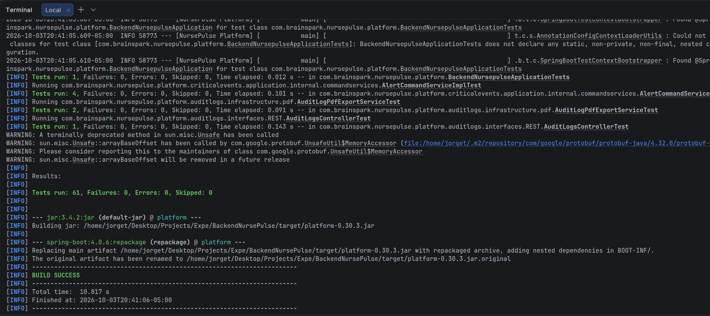
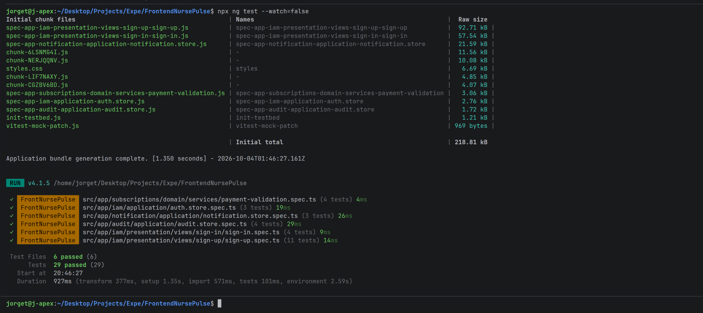
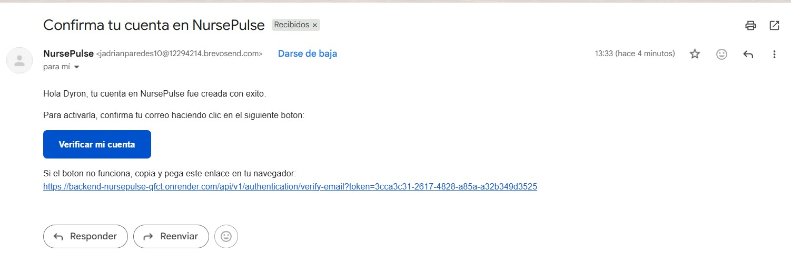
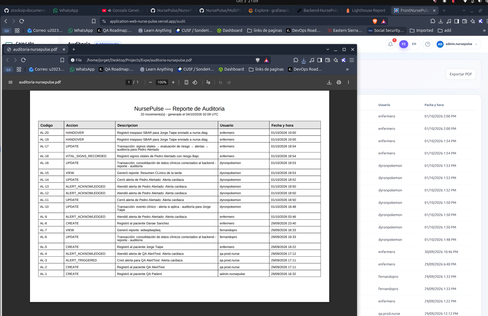
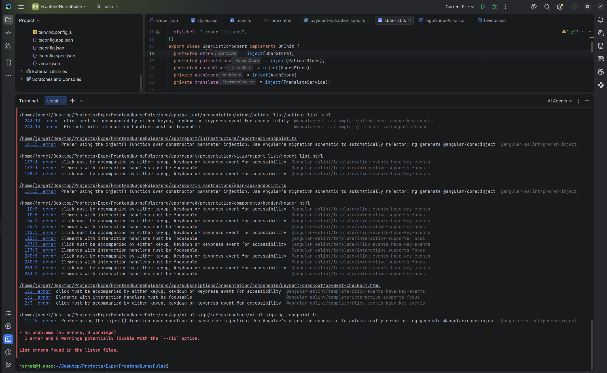
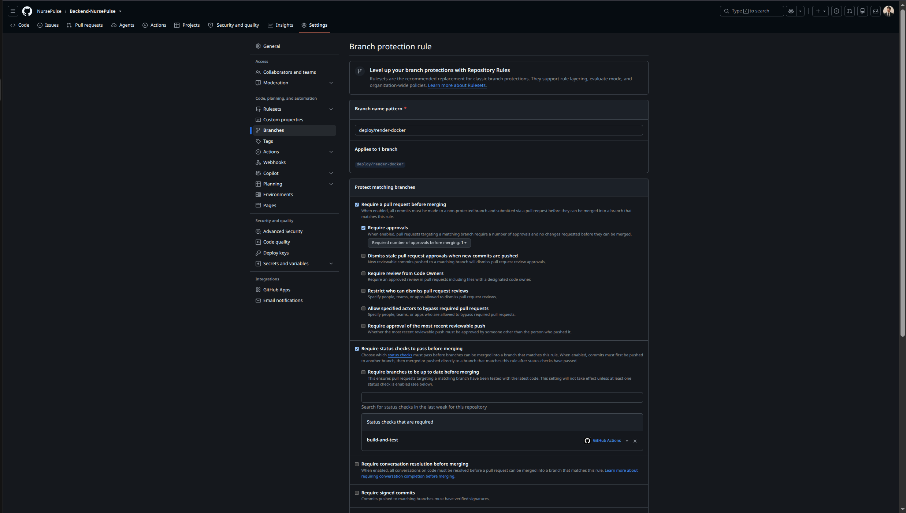
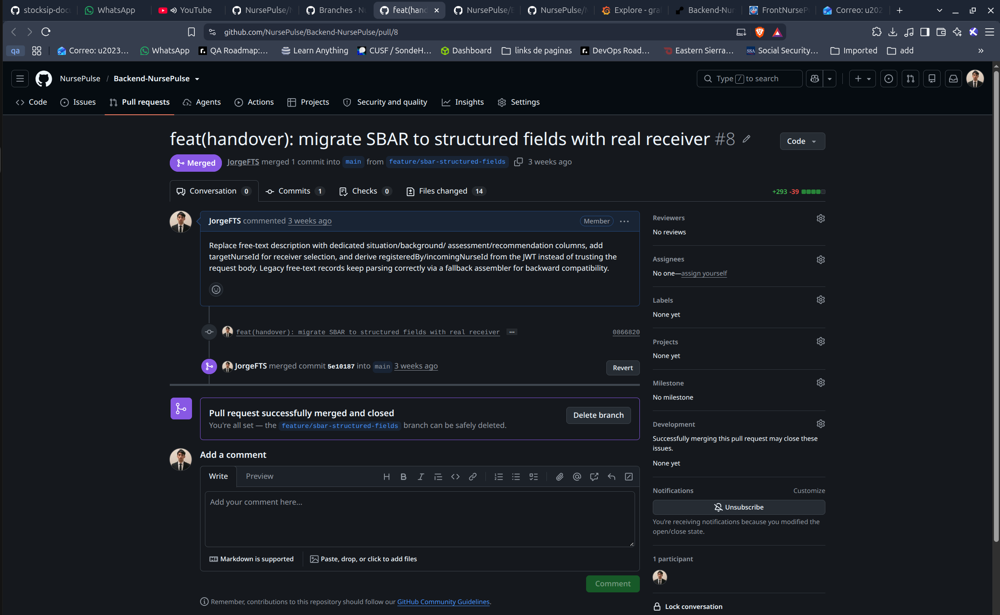

# Capítulo VI: Product Verification & Validation

## 6.1. Testing Suites & Validation

NursePulse cuenta con una suite de pruebas automatizadas de 121 pruebas en el backend (JUnit 5 + Mockito), 50 en el frontend (Vitest) y 902 en la aplicación móvil (`flutter test`), ejecutadas automáticamente en cada `push` y `pull request` hacia la rama principal mediante los workflows `Backend CI`, `Frontend CI` y `Mobile CI/CD`.

**Backend**



**Front-end**



### 6.1.1. Core Entities Unit Tests.

Pruebas unitarias puras sobre entidades y value objects del dominio, sin dependencias externas ni framework de Spring:

| Clase de prueba | Módulo | Qué valida |
| :--- | :--- | :--- |
| `RoleTest` | IAM | Reglas del value object `Role`: rol por defecto (`NURSE`), interpretación de nombres sin distinguir mayúsculas y rechazo de nombres vacíos. |
| `SignUpResourceValidationTest` | IAM | 10 casos de validación del registro (usuario, contraseña, nombre, email, teléfono, edad y rechazo del rol `ADMIN`) mediante Jakarta Bean Validation. |
| `SignUpCommandFromResourceAssemblerTest` | IAM | Transformación correcta de `SignUpResource` a `SignUpCommand`. |

### 6.1.2. Core Integration Tests.

Pruebas que levantan el contexto completo de Spring Boot (`@SpringBootTest`) para validar el comportamiento end-to-end de la capa de seguridad y los casos de uso de aplicación con sus colaboradores simulados:

| Clase de prueba | Tipo | Qué valida |
| :--- | :--- | :--- |
| `ClinicalAuthorizationIntegrationTest` | Integración (`@SpringBootTest` + `MockMvc`) | 19 escenarios de autorización por rol (NURSE/DOCTOR/ADMIN) contra los endpoints reales de pacientes, signos vitales, SBAR, alertas y auditoría. |
| `UserCommandServiceImplTest` | Unitaria con Mockito | Registro, inicio de sesión (incluyendo el bloqueo por email no verificado), conflictos de correo y de teléfono duplicados, y verificación de cuenta (token válido, desconocido y vencido). |
| `AlertCommandServiceImplTest` | Unitaria con Mockito | Envío de SMS a los médicos con teléfono cuando la alerta es crítica (y no cuando no lo es), atención de una alerta abierta y cierre de una alerta atendida. |
| `AuditLogsControllerTest` | Unitaria con Mockito | El actor de una entrada de auditoría se toma del usuario autenticado y no del cuerpo de la petición; cada exportación del PDF queda registrada en la auditoría con el usuario y la cantidad de entradas; y un fallo al registrar la exportación no impide la descarga. |
| `AuditLogPdfExportServiceTest` | Unitaria | Generación de un PDF válido (magic bytes `%PDF`) a partir de una lista de entradas de auditoría, también cuando la lista está vacía. |
| `BrevoEmailNotificationServiceTest` / `TwilioSmsNotificationServiceTest` | Unitaria | Manejo seguro de destinatario vacío, remitente o número de origen sin configurar y fallos del proveedor externo, sin interrumpir el flujo principal. |
| `TokenServiceImplTest` | Unitaria | Generación y validación de tokens JWT, rechazo de tokens mal formados y de secretos débiles. |
| `OpenApiConfigurationTest` | Unitaria | Configuración de la documentación Swagger/OpenAPI (origen de las peticiones interactivas de Swagger UI). |
| `BackendNursepulseApplicationTests` | Integración (`@SpringBootTest`) | Que el contexto completo de la aplicación arranque sin errores. |

**Pruebas de la aplicación móvil (Flutter).** La app móvil se verifica con `flutter test`: 902 pruebas unitarias, de widgets e integrales, con 0 fallos ni omitidas (ejecución del 4 de octubre de 2026 sobre la rama `test`, commit `789e70e`). Es un paso obligatorio del job `Verify Flutter` de `Mobile CI/CD` (ver Capítulo VII, sección 7.1.2). Cada módulo de la aplicación tiene su carpeta bajo `test/`:

| Carpeta de `test/` | Pruebas | Historias | Qué valida |
| :--- | :---: | :--- | :--- |
| `iam/` | 20 | US-23, US-25 | Reglas de registro (usuario, nombres, teléfono, edad, correo, contraseña, rechazo del rol Admin y payload exacto enviado a la API), restauración de sesión y cierre de sesión ante un 401, y la pantalla de registro. |
| `patient/` | 26 | US-27, US-28 | Validación del formulario de paciente (nombres, documento de 8 a 20 dígitos, fechas, género y longitudes), acceso a datos, notificador y vistas. |
| `vital-sign/` | 27 | US-16, US-17, US-22 | Rangos de cada medición, enteros y temperatura, presión sistólica mayor que la diastólica y `nurseId` tomado de la sesión autenticada. |
| `clinical_event/` | 68 | US-18, US-19, US-20 | Límites de título y descripción, responsable tomado de la sesión, notificador y vistas. |
| `sbar/` | 98 | US-13, US-14, US-15 | Campos Situación, Antecedentes, Evaluación y Recomendación con sus límites, rechazo sin escritura ante datos inválidos, y confirmación de recepción. |
| `notification/` | 133 | US-31, US-32, US-33 | Validación de alertas, atención y cierre según el rol, notificador y vistas. |
| `dashboard/` | 114 | US-29, US-30 | Dashboard de la unidad y monitoreo del paciente: validación de identificadores, refresco de datos y vistas. |
| `reports/` | 90 | US-34 | Reportes permitidos solo a médico y administrador, validación de título y periodo, y almacenamiento local. |
| `audit_users/` | 193 | US-26, US-35, US-36 | Consulta de auditoría, exportación y guardado del PDF, administración de usuarios y roles, y rechazo sin consultas ni escrituras para los roles sin permiso. |
| `subscriptions/` | 61 | US-39 | Catálogo de planes, validación del pago simulado y recibo. |
| `core/`, `integration/` y `widget_test.dart` | 72 | US-38 | Conexión (producción por defecto, mensajes del backend en español y errores de inicio de sesión), navegación, aislamiento entre sesiones, interfaz adaptable a pantallas pequeñas y el recorrido de un reporte clínico. |
| **Total** | **902** | | |

### 6.1.3. Core Behavior-Driven Development

El backend implementa BDD ejecutable con **Cucumber 8.0.4** (`cucumber-java`, `cucumber-spring` y `cucumber-junit-platform-engine`), integrado en la suite de JUnit 5 que se ejecuta en el CI ([Backend-NursePulse#14](https://github.com/NursePulse/Backend-NursePulse/pull/14), integrado). Los criterios de aceptación del Capítulo III se escribieron como escenarios Gherkin en español (`# language: es`, con `Dado`, `Cuando` y `Entonces`), guardados en `src/test/resources/features/`. Cada escenario arranca la aplicación completa con el perfil de pruebas (H2), llama a la API con seguridad real y comprueba la respuesta HTTP y el dato guardado.

| Archivo `.feature` | Escenarios | Historias |
| :--- | :-: | :--- |
| `pacientes.feature` | 2 | US-27, US-28, TS-02 |
| `signos_vitales.feature` | 2 | US-16, US-17, TS-03 |
| `eventos_clinicos.feature` | 1 | US-18, US-19, US-20 |
| `traspaso_sbar.feature` | 1 | US-13, US-14, US-15, TS-04 |
| `alertas.feature` | 1 | US-31, US-32 |
| `acceso_y_errores.feature` | 5 | TS-01, TS-06, TS-07 |

Ejemplo (`traspaso_sbar.feature`):

```gherkin
# language: es
Característica: Traspaso de turno SBAR (US-13, US-14, US-15, TS-04)

  Escenario: Registrar, consultar y confirmar un traspaso
    Dado que la enfermera inició sesión
    Y existe un paciente registrado
    Cuando registra un traspaso SBAR dirigido a la enfermera entrante
    Entonces el traspaso queda guardado con estado "PENDING"
    Cuando la enfermera entrante confirma la recepción
    Entonces el traspaso queda con estado "ACKNOWLEDGED"
```

Los pasos están implementados en `StepDefinitions.java` y el ejecutor es `CucumberBddTest`, que Maven recoge con el resto de las pruebas: los 12 escenarios se ejecutan en cada `push` junto con las demás pruebas del backend (121 en total, con 0 fallos). Los escenarios cubren únicamente comportamientos que el sistema cumple hoy; los casos que el backend aún no resuelve de la forma descrita (por ejemplo, rechazar un traspaso incompleto con 400) quedan fuera y se documentan como limitaciones en el Capítulo III. El resto de los criterios Gherkin de las historias se mantiene como especificación y se verifica con las pruebas unitarias e integrales de la sección 6.1.5.

### 6.1.4. Core System Tests

No existe automatización de pruebas de sistema end-to-end (tipo Selenium/Playwright/Cypress) contra la aplicación desplegada. La verificación a nivel de sistema se realizó de forma **manual y exploratoria directamente en producción** a lo largo del desarrollo, cubriendo flujos completos como:

- Registro de usuario → verificación de cuenta por correo (Brevo) → inicio de sesión.
- Creación de pacientes, registro de signos vitales, eventos clínicos y traspasos SBAR con las validaciones de formato (nombres, documento, fecha de nacimiento, límites de caracteres).
- Generación de una alerta crítica → solicitud de SMS a los médicos registrados (Twilio). La solicitud llega correctamente a la API de Twilio, pero la entrega del mensaje **no pudo completarse**: la cuenta de prueba (*trial*) de Twilio solo permite enviar a números verificados y exige una plantilla de contenido que requiere una cuenta de pago. Por eso esta integración queda validada a nivel de código y de pruebas unitarias (6.1.2), no de entrega real.
- Exportación del registro de auditoría a PDF, descargado y verificado directamente desde la interfaz. Cada exportación queda registrada en la propia auditoría (usuario y cantidad de entradas exportadas); el PDF en sí no se almacena.
- Flujo de permisos por rol (NURSE/DOCTOR/ADMIN) replicado en la interfaz real, no solo a nivel de API.

Evidencia del primer flujo: el correo de verificación recibido y la pantalla de confirmación de cuenta.




Evidencia del flujo de exportación de auditoría:



**Auditoría automatizada de calidad web (Lighthouse).** La única verificación automatizada que se ejecuta contra la aplicación desplegada es una auditoría de Lighthouse sobre la pantalla de inicio de sesión del frontend, integrada en `Frontend CI` (ver Capítulo VII, secciones 7.1.2 y 7.4.1). La medición del 3 de octubre de 2026 arrojó Rendimiento 96, Accesibilidad 100, Buenas prácticas 100 y SEO 82. Esta auditoría mide calidad no funcional (carga, accesibilidad, buenas prácticas); no recorre flujos de negocio ni reemplaza las pruebas de sistema.


### 6.1.5. Trazabilidad: historia de usuario → aplicación → base de datos → prueba

Para cada historia con prueba unitaria asociada se indica cómo ejecutarla en la aplicación, qué tabla de MySQL cambia (y la consulta para comprobarlo) y la prueba que la respalda. Las pruebas del backend se ejecutan con `./mvnw test -Dtest=<Clase>`; las del frontend con `npm test`; las de la aplicación móvil con `flutter test`.

| Historia | Cómo ejecutarla en la aplicación | Tabla y consulta de verificación | Prueba unitaria asociada |
| :--- | :--- | :--- | :--- |
| US-23 Registro, TS-01 | Web `/sign-up` o app móvil: completar el formulario. | `users`, `user_roles`: `SELECT id, username, email, email_verified FROM users ORDER BY id DESC LIMIT 1;` | `SignUpResourceValidationTest`, `SignUpCommandFromResourceAssemblerTest`, `UserCommandServiceImplTest` (`shouldCreateUserWithEncodedPasswordAndResolvedRole`, correo y teléfono duplicados), `sign-up.spec.ts`, `registration_test.dart` |
| US-24 Verificar correo | Abrir el enlace recibido por correo. | `users`: `SELECT username, email_verified, verification_token FROM users WHERE username = '<usuario>';` | `UserCommandServiceImplTest` (token válido, desconocido y vencido), `BrevoEmailNotificationServiceTest` |
| US-25 Iniciar sesión | Web `/sign-in` o app móvil. | No modifica tablas; el resultado es el token JWT. | `UserCommandServiceImplTest` (correo verificado, no verificado y credenciales inválidas), `TokenServiceImplTest`, `sign-in.spec.ts`, `auth.store.spec.ts`, `session_test.dart` |
| US-27 y US-28 Pacientes | Web `/patients`: registrar, editar, ver lista y detalle. | `patients`: `SELECT id, first_name, last_name, document_number, status FROM patients ORDER BY id DESC LIMIT 5;` | `PatientServicesTest` (alta con valores por defecto, documento duplicado, fechas inválidas, edición, 404, eliminación, consulta) |
| US-13, US-14 y US-15 Traspaso SBAR, TS-04 | Web `/sbar`: crear traspaso, consultar y confirmar recepción. | `handovers`: `SELECT id, patient_id, status, incoming_nurse_id, description FROM handovers ORDER BY id DESC LIMIT 5;` | `HandoverServicesTest` (estructura SBAR y estado `PENDING`, campos obligatorios, confirmación, 404, consulta por paciente y rango de fechas) |
| US-16 y US-17 Signos vitales, TS-03 | Web `/vital-signs`: registrar y ver historial del paciente. | `vital_sign_records`: `SELECT id, patient_id, heart_rate, oxygen_saturation, risk_level, recorded_at FROM vital_sign_records ORDER BY id DESC LIMIT 5;` | `VitalSignServicesTest` (registro válido, valores fuera de rango, presión arterial, historial y último registro) |
| US-18 y US-19 Eventos clínicos, TS-03 | Web `/clinical-events`: registrar y ver historial. | `clinical_events`: `SELECT id, patient_id, event_type, severity, registered_by, occurred_at FROM clinical_events ORDER BY id DESC LIMIT 5;` | `ClinicalEventServicesTest` (registro con responsable y fecha, error de persistencia, historial por paciente) |
| US-26 Gestionar usuarios y roles | Web `/users` como administrador: cambiar el rol de otro usuario. | `user_roles`: `SELECT u.username, r.name FROM users u JOIN user_roles ur ON ur.user_id = u.id JOIN roles r ON r.id = ur.role_id;` | `UpdateUserRolesTest` (asignar rol, lista vacía, usuario inexistente, cambio de rol propio bloqueado, rol inexistente) |
| US-22 y US-31 Riesgo y alertas | Web `/vital-signs`: registrar signos fuera de rango (por ejemplo FC 180 y SatO₂ 82) y revisar la alerta creada en `/alerts`. | `vital_sign_records` y `alerts` (consultas de las filas de signos vitales y alertas). | `vital-sign-assembler.spec.ts` (umbrales LOW, MEDIUM, HIGH y CRITICAL, riesgo del backend conservado) |
| US-31, US-32 y US-33 Alertas | Web `/alerts` o `/patients/:id/monitoring`: ver, atender y cerrar alertas. | `alerts`: `SELECT id, patient_id, severity, status FROM alerts ORDER BY id DESC LIMIT 5;` | `AlertCommandServiceImplTest` (alerta crítica y aviso por SMS a médicos, atender y cerrar), `notification.store.spec.ts` |
| US-35 y US-36 Auditoría y PDF, TS-05 | Web `/audit` como médico o administrador: consultar y exportar a PDF. | `audit_logs`: `SELECT id, entity_type, action_type, performed_by, performed_at FROM audit_logs ORDER BY id DESC LIMIT 5;` (la exportación genera una entrada nueva). | `AuditLogsControllerTest`, `AuditLogPdfExportServiceTest`, `audit.store.spec.ts` |
| TS-07 Control de acceso por rol | Iniciar sesión con otro rol e intentar una acción no permitida: el API responde 403. | No modifica tablas. | `ClinicalAuthorizationIntegrationTest` (19 casos), `RoleTest` |
| US-34 Reportes | Web `/reports`: generar un reporte de un periodo. | No usa tablas: el reporte se guarda en el navegador (`localStorage`) y deja una entrada en `audit_logs`. | `report.store.spec.ts` (conteo por periodo, alertas críticas, guardado y restauración, datos corruptos) |
| US-39 Suscripciones | Web `/subscriptions`: elegir un plan. | No usa tablas (se guarda en el navegador). | `subscription.store.spec.ts` |
| TS-06 Errores del API | Enviar una solicitud inválida (por ejemplo un registro con contraseña corta): el API responde con `code`, `message` y `details`. | No modifica tablas. | `ErrorHandlingTest` (estado HTTP por código de error, cuerpo y manejador global) |
| US-38 Aplicación móvil | `flutter run`: iniciar sesión y navegar. | Las mismas tablas que la web. | `core/connection_test.dart`, `iam/session_test.dart`, `iam/sign_up_view_test.dart`, `integration/navigation_test.dart` |

Las pruebas nuevas se entregaron en tres PR: pacientes, traspasos SBAR, signos vitales y eventos clínicos en [Backend-NursePulse#11](https://github.com/NursePulse/Backend-NursePulse/pull/11) y roles y errores del API en [Backend-NursePulse#12](https://github.com/NursePulse/Backend-NursePulse/pull/12), ambos integrados en `deploy/render-docker` (la suite del backend suma 99 pruebas con ambos, con 0 fallos); y reglas de riesgo, reportes, idioma y suscripciones en [Application-Web-Nurse-Pulse#5](https://github.com/NursePulse/Application-Web-Nurse-Pulse/pull/5), también integrado (el frontend suma 50 pruebas, con 0 fallos).

**Correcciones del backend detectadas al probar la aplicación móvil.** [Backend-NursePulse#15](https://github.com/NursePulse/Backend-NursePulse/pull/15), integrado en `deploy/render-docker` y desplegado, corrigió la exportación del PDF de auditoría cuando una entrada no tiene `metadata` (devolvía 500) y la fecha de generación (`triggeredAt`) de una alerta que se atiende o se cierra (llegaba vacía). Cada corrección tiene su prueba, que falla sin el arreglo, y con ellas la suite del backend suma 121 pruebas, con 0 fallos.

**Pruebas integrales por historia.** Además de las unitarias, `UserStoryJourneyIntegrationTest` ([Backend-NursePulse#13](https://github.com/NursePulse/Backend-NursePulse/pull/13), integrado) ejecuta recorridos completos por la capa HTTP real, con seguridad y una base H2, y comprueba tanto la respuesta como la fila guardada. Con sus 8 pruebas, la suite del backend llegó a 107 pruebas (119 con los escenarios BDD de la sección 6.1.3), con 0 fallos: US-27 y US-28 (alta, edición y consulta de pacientes, y 404 de un paciente inexistente), US-16 y US-17 (signos vitales y último registro, y 400 con un valor fuera de rango), US-18, US-19 y US-20 (evento clínico con el responsable tomado de la sesión), US-13, US-14 y US-15 (traspaso SBAR desde su creación hasta la confirmación por la enfermera entrante), US-21 (los datos del resumen disponibles juntos) y US-31 y US-32 (ciclo de la alerta, donde solo el médico puede cerrarla).

**Historias sin prueba automatizada propia:** US-01 a US-12 (Landing), US-29 y US-30 (en la web), TS-08 y TS-09. La Landing es un sitio informativo estático, sin lógica ni API, por lo que se verifica con Lighthouse en el CI (rendimiento, accesibilidad, buenas prácticas y SEO) y con revisión visual. TS-08 se demuestra con la ejecución del CI y TS-09 con las métricas visibles en Grafana Cloud. US-29 y US-30 se verifican en la web ejecutándolas en la aplicación y comprobando los datos que muestran; en la aplicación móvil sí tienen pruebas automatizadas (carpeta `test/dashboard/`, 114 pruebas). TS-02 se cubre con `PatientServicesTest` y con el recorrido de pacientes, y TS-10 con `OpenApiConfigurationTest`.

## 6.2. Static testing & Verification

A diferencia de la sección 6.1 (pruebas dinámicas, que ejecutan el código), esta sección cubre la verificación **estática** del proyecto: revisión de convenciones de código y de la calidad/seguridad del código fuente sin necesidad de ejecutarlo.

### 6.2.1. Static Code Analysis

#### 6.2.1.1. Coding standard & Code conventions

NursePulse define una guía de estilo de código explícita por tecnología (HTML/CSS, Angular/TypeScript, Java/Spring Boot), documentada en el Capítulo V, sección 5.1.3. El cumplimiento de esta guía se verifica de las siguientes formas:

- **ESLint** (`angular-eslint` + `typescript-eslint`) en el frontend: analiza el código TypeScript y las plantillas de Angular con las reglas recomendadas (por ejemplo, uso de `inject()`, accesibilidad de elementos interactivos en las plantillas y restricciones sobre el tipo `any`). Se ejecuta con `npm run lint` y como paso del pipeline `Frontend CI` (ver 6.2.1.2).
- **TypeScript Strict Mode**: el compilador de Angular (`tsc --strict`) rechaza el build (`ng build`, ejecutado en `Frontend CI`) ante tipos implícitos `any`, variables no inicializadas o accesos nulos no controlados, forzando el cumplimiento de la convención de "Seguridad de tipos" definida en 5.1.3.
- **Jakarta Bean Validation** en el backend actúa como verificación declarativa de las reglas de negocio en el límite de la API (`@NotBlank`, `@Pattern`, `@Size`, `@Email`), en línea con la convención de "Validación de datos" de 5.1.3.
- **Revisión por pares**: es una práctica prevista por el equipo para verificar la nomenclatura (`camelCase`/`PascalCase`/`kebab-case` según corresponda) y la arquitectura por capas (DDD) descrita en 5.1.3, pero hasta ahora no queda registrada en GitHub. Solo la exige el repositorio en la rama de producción del Backend, desde el 3 de octubre de 2026 (ver 6.2.2).

#### 6.2.1.2. Code Quality & Code Security

El frontend cuenta con **ESLint** como herramienta de análisis estático, integrada al repositorio (`eslint.config.js`, script `npm run lint`) y al pipeline `Frontend CI` como paso informativo: tiene `continue-on-error`, por lo que reporta hallazgos sin detener el pipeline. En la ejecución del 3 de octubre de 2026 detectó **45 problemas (todos de nivel error) en 19 archivos**, que corresponden a código previo a la incorporación de la herramienta y todavía no se han corregido:

| Regla | Hallazgos | Qué detecta |
| :--- | :---: | :--- |
| `@typescript-eslint/no-explicit-any` | 13 | Uso del tipo `any`, que desactiva la verificación de tipos. |
| `@angular-eslint/template/click-events-have-key-events` | 11 | Elementos con evento `click` sin equivalente de teclado (accesibilidad). |
| `@angular-eslint/prefer-inject` | 9 | Inyección por constructor en lugar de la función `inject()`. |
| `@angular-eslint/template/interactive-supports-focus` | 9 | Elementos interactivos que no reciben foco con el teclado (accesibilidad). |
| `@typescript-eslint/no-duplicate-enum-values` | 4 | Valores duplicados dentro de un `enum`. |
| `@angular-eslint/directive-selector` | 2 | Selectores de directiva que no siguen la convención configurada. |
| `@typescript-eslint/array-type` | 1 | Estilo de declaración de tipos de arreglo. |



La aplicación móvil tiene configurado el paquete `flutter_lints` (`analysis_options.yaml`), y el job `Verify Flutter` de `Mobile CI/CD` ejecuta `flutter analyze` y `dart format --set-exit-if-changed` como pasos obligatorios: a diferencia del lint del frontend, aquí un hallazgo detiene el pipeline. El backend **no cuenta con una herramienta dedicada de análisis estático** (como SonarQube o SonarLint) integrada al pipeline. La calidad y seguridad del código se sostienen adicionalmente mediante:

- **Inspecciones del IDE**: IntelliJ IDEA (backend) y WebStorm (frontend) señalan en tiempo real código muerto, imports no utilizados, complejidad excesiva y antipatrones comunes mientras se escribe el código, aunque sin un reporte centralizado ni umbrales de calidad exigidos por el pipeline.
- **Spring Security** gestiona la autorización por rol de forma centralizada (`WebSecurityConfiguration`), evitando que la lógica de permisos quede dispersa o implementada de forma inconsistente entre controladores.
- **Manejo centralizado de secretos**: credenciales de base de datos, JWT y de los proveedores externos (Brevo, Twilio) se inyectan exclusivamente mediante variables de entorno (`${VARIABLE:}`), nunca como valores hardcodeados en el repositorio.

> Quedan identificadas dos mejoras pendientes: (1) corregir los 45 hallazgos de ESLint y, una vez resueltos, volver el paso de lint bloqueante en el pipeline; y (2) incorporar análisis estático al backend (por ejemplo, SonarQube/SonarCloud). Hasta entonces, en el backend la detección de problemas de calidad depende del criterio del desarrollador y del revisor, no de una herramienta objetiva.

### 6.2.2. Reviews

La revisión de código en NursePulse se apoya en los **Pull Requests de GitHub**, como se describe en el Capítulo V (sección 5.1.2) y el Capítulo VII (sección 7.2.1). Según el historial de los repositorios al 3 de octubre de 2026, se registraron 21 Pull Requests: 10 en Backend (2 generados por una herramienta de despliegue), 4 en Frontend, 6 en la aplicación móvil y 1 en la Landing Page. Varios del Backend siguen la convención de ramas descrita en el Capítulo V (`feature/sbar-structured-fields`, `feature/password-policy-ts01`, `fix/audit-log-null-metadata-and-500-handling`, entre otras).

Alcance real de esta práctica:

- **La rama de producción del Backend tiene protección activa desde el 3 de octubre de 2026**: `deploy/render-docker`, cuyo `push` despliega automáticamente a Render, cuenta con una regla de protección de rama que exige (a) Pull Request antes de fusionar, (b) la aprobación de otro integrante y (c) que el check `build-and-test` del workflow `Backend CI` finalice en éxito. La regla rige también para los administradores y bloquea el *force push* y el borrado de la rama. Es el único caso en que la revisión y el CI son condiciones técnicamente forzadas.
- **El resto de las ramas principales no tiene protección**: `main` del Backend, `main` del Frontend, `main` de Mobile y `main` de Landing no tienen reglas de protección. En ellas la revisión y el CI en verde siguen siendo prácticas del equipo, no condiciones que GitHub verifique.
- **Parte de los cambios se integró por `push` directo**: antes de activar la protección, y todavía hoy en las ramas sin ella, muchos commits se publicaron directamente a la rama principal, y cada `push` dispara el despliegue automático (ver Capítulo VII, sección 7.3). En esos casos la verificación recae en el pipeline de CI posterior al `push` y en la comprobación manual en producción (6.1.4).
- **Las revisiones en Pull Request no quedan registradas**: ninguno de los 21 PRs tiene una revisión en GitHub, y los 19 abiertos por integrantes fueron fusionados por su propio autor. Si hubo revisión entre pares, fue informal y no quedó trazada. Solo los PRs de la aplicación móvil (#3 a #6) muestran verificaciones de CI.

Evidencia de la regla de protección activa en la rama de producción del Backend:



Ejemplo de la práctica anterior a esa regla, el Pull Request #8 del Backend, fusionado por su autor, sin revisores ni verificaciones de CI:



No se utiliza una herramienta externa de gestión de revisiones (como Gerrit o Crucible); el proceso ocurre dentro de la interfaz nativa de Pull Requests de GitHub.

> Extender las mismas reglas de protección de rama (CI exitoso y una aprobación obligatoria antes de fusionar) a `main` del Backend, del Frontend, de Mobile y de Landing queda identificado como una mejora pendiente, y exigir que los PRs tengan una revisión registrada, para que la práctica sea verificable en todos los repositorios y no dependa de la disciplina del equipo.

## 6.3. Validation Interviews

> **⚠️ Sección pendiente de completar con información real.** Las subsecciones 6.3.1, 6.3.2 y 6.3.3 requieren los datos originales de las Validation Interviews y de la evaluación heurística ya referenciadas en el documento de "Conclusiones y Recomendaciones" (rama `docs/Conclusions`), que cita explícitamente "sección 6.3" y "sección 6.3.2". Para completarlas se necesita:
>
> 1. Las notas, grabaciones o transcripciones de las Validation Interviews realizadas (participantes, rol/ocupación, fecha, hallazgos).
> 2. El resultado de la evaluación heurística (heurísticas evaluadas, hallazgos y severidades encontradas).
>
> No se completó esta sección con datos inventados para no comprometer la integridad de la investigación de usuario del informe.

### 6.3.1. Diseño de Entrevistas

*(pendiente — ver nota arriba)*

### 6.3.2. Registro de Entrevistas

*(pendiente — ver nota arriba)*

### 6.3.3. Evaluaciones según heurísticas

*(pendiente — ver nota arriba)*