# Capítulo V: Product Implementation, Validation & Deployment

## 5.1. Software Configuration Management.

En esta sección se describe la gestión de la configuración del software utilizado en el proyecto de NursePulse, la cual tiene como objetivo garantizar la trazabilidad y digitalización de procesos vitales durante la estadía de un paciente en un hospital cardiovascular.
Desde registro de pacientes hasta generación de alertas y traspasos SBAR. Esta gestión permite mantener la integridad, trazabilidad y consistencia del código fuente, así como coordinar de manera eficiente el trabajo colaborativo del equipo.

El Software Configuration Management en NursePulse se basa en el uso de herramientas de control de versiones y buenas prácticas profesionales de desarrollo que permiten administrar
las distintas versiones del sistema a lo largo del tiempo. Esto incluye la organización de los repositorios del proyecto, la definición de estrategias de ramificación, la gestión
de cambios mediante commits bien documentados y la integración del trabajo realizado por los diferentes miembros del equipo.

### 5.1.1. Software Development Environment Configuration.

En esta sección se describen las herramientas utilizadas por el equipo encargado de desarrollar NursePulse para colaborar de manera efectiva durante todo el ciclo de vida del producto digital. Estas herramientas han sido seleccionadas estratégicamente con el objetivo de optimizar la comunicación, organización, diseño, desarrollo, despliegue y documentación del sistema, permitiendo un trabajo colaborativo eficiente y escalable.

Las herramientas se organizan según las principales actividades del ciclo de vida del software: gestión del proyecto y requisitos, diseño UX/UI, desarrollo de software, despliegue y documentación técnica.

### Project Management y Requirements Management

- [**Jira Software**](https://www.atlassian.com/es/software/jira): Es la herramienta principal utilizada para la gestión del proyecto bajo un enfoque ágil. Permite organizar tareas en tableros, listas y tarjetas, facilitando el seguimiento del avance del Sprint, la asignación de actividades y el control del backlog del producto NursePulse. Gracias a su interfaz visual, el equipo puede mantener una visión clara del progreso del proyecto.

- [**Google Docs & Google Workspace**](https://docs.google.com/): Google Drive y Google Docs se utilizan como plataforma de almacenamiento y colaboración en la nube. Estas herramientas permiten al equipo crear, editar y compartir documentos en tiempo real, facilitando la elaboración de historias de usuario, informes, entregables y documentación general del proyecto.

### Product UX/UI Design

- [**Figma**](https://www.figma.com/files/team/1542201510350230976/recents-and-sharing?fuid=1227966816494785121): Es la herramienta principal utilizada para el diseño de la interfaz de usuario de NursePulse. Se emplea para crear wireframes, prototipos y diseños finales de la Landing Page. Su funcionalidad colaborativa permite que todo el equipo partícipe en el proceso de diseño de forma simultánea, asegurando coherencia visual y funcional.

- [**UXPressia**](https://uxpressia.com/): Se utiliza para la etapa de Needfinding y análisis centrado en el usuario. Permitió desarrollar los User Personas, así como elaborar el User Journey Mapping, Empathy Mapping e Impact Mapping, facilitando la identificación de necesidades, comportamientos, puntos de dolor y objetivos de los usuarios para estructurar de manera más precisa el diseño y enfoque del sistema.

- [**dbdiagram**](https://dbdiagram.io/): Se utiliza como herramienta de apoyo para la creación de diagramas de base de datos. Permite visualizar y diseñar la estructura de la base de datos de forma colaborativa.


### Software Development

- [**Webstorm**](https://www.jetbrains.com/webstorm/) Es el editor de código utilizado para el desarrollo de la Landing Page de NursePulse. Permite trabajar de manera eficiente con tecnologías como HTML, CSS y JavaScript, ofreciendo soporte para extensiones, terminal integrada y herramientas de depuración.

- [**IntelliJ IDEA**](https://www.jetbrains.com/idea/): Entorno de desarrollo integrado utilizado para la construcción del Server Side Software (RESTful API) implementado con Spring Boot y Java.

- [**Git**](https://git-scm.com/): Es el sistema de control de versiones utilizado para gestionar el código fuente del proyecto. Permite llevar un registro de los cambios realizados, trabajar de forma colaborativa y mantener un historial organizado del desarrollo del sistema.

- [**GitHub**](https://github.com/): Es la plataforma utilizada para alojar el repositorio del proyecto NursePulse. Facilita la colaboración entre los miembros del equipo, la revisión de código y la integración continua del desarrollo.


### Software Deployment

- [**GitHub Pages**](https://pages.github.com/):  Es el servicio utilizado para desplegar la Landing Page de NursePulse. Permite publicar el sitio web directamente desde el repositorio de GitHub, haciendo que esté disponible de forma pública y accesible desde internet.

- [**Vercel**](https://vercel.com/):  Es la plataforma en la nube utilizada para el despliegue del Frontend Web Application (Angular). Realiza despliegue continuo automático sobre la rama `main` del repositorio, generando una URL pública accesible desde cualquier dispositivo conectado a internet.

- [**Swagger / OpenAPI**](https://swagger.io/): Herramienta utilizada para la documentación interactiva y estandarizada del RESTful API.

El uso de estos entornos nos permitió mantener una estructura de trabajo clara, con seguimiento de cambios y separación
entre documentación e implementación. Asimismo, se facilita la revisión de avances por parte de los integrantes y se asegura
coherencia entre la propuesta del informe y el producto a desarrollar.

### 5.1.2. Source Code Management

En esta sección se describe la gestión del código fuente del proyecto NursePulse, el cual se ha implementado utilizando GitHub como plataforma principal de control de versiones. 
Este sistema permite al equipo trabajar de forma colaborativa, mantener un historial completo de cambios y asegurar la correcta integración de las funcionalidades desarrolladas durante el proyecto.

El repositorio principal del proyecto es el siguiente:

- **Landing Page Repository**: [https://github.com/NursePulse/Landing-NursePulse](https://github.com/NursePulse/Landing-NursePulse)
- **Frontend Web App Repository**: [https://github.com/NursePulse/Application-Web-Nurse-Pulse](https://github.com/NursePulse/Application-Web-Nurse-Pulse)
- **Backend (Web Services) Repository**: [https://github.com/NursePulse/Backend-NursePulse](https://github.com/NursePulse/Backend-NursePulse)
- **Mobile Multiplatform Application:**: [https://github.com/NursePulse/MultiPlatform-App-NursePulse](https://github.com/NursePulse/MultiPlatform-App-NursePulse)

### Flujo de ramas implementado

El equipo tomó GitFlow como referencia, pero en la práctica trabajó con un flujo simplificado, sin las ramas `develop` ni `release/` (no existen en ninguno de los cuatro repositorios). Las ramas utilizadas son:

- **main**: rama principal de cada repositorio; en Frontend, Landing Page y Mobile contiene la versión desplegada o publicada.
- **deploy/render-docker** (Backend): rama de producción; cada cambio que llega a ella se despliega automáticamente en Render. Desde el 3 de octubre de 2026 está protegida y solo admite cambios mediante Pull Request con una aprobación y el check `build-and-test` (ver Capítulo VI, sección 6.2.2).
- **test** (Mobile): rama de integración previa a `main`; la distribución del APK ocurre únicamente al llegar a `main`.
- **feature/\***, **fix/\*** y **chore/\***: ramas de trabajo para nuevas funcionalidades, correcciones y tareas de mantenimiento (por ejemplo `feature/sbar-structured-fields`, `fix/audit-log-null-metadata-and-500-handling` y `chore/mobile-foundation`). Se integran mediante Pull Request, aunque no de forma exclusiva: en las etapas finales parte de los cambios se publicó directamente en la rama principal.

### Gestión de ramas en la Landing Page

En la práctica, el repositorio de la Landing Page (`Landing-NursePulse`) se mantuvo con una estrategia simplificada de dos ramas (`main` y `development`), sin desglosar el trabajo en ramas `feature/*` por sección (hero, benefits, footer, etc.). Los cambios de cada sección se integraron mediante commits directos y, en una etapa posterior, mediante un Pull Request hacia `main`, dado que se trata de un sitio estático de bajo acoplamiento entre secciones y con un equipo reducido trabajando sobre él.


### Convención de ramas

El proyecto sigue la siguiente convención de nomenclatura:

- feature/nombre-descriptivo → nuevas funcionalidades
- fix/nombre-descriptivo → correcciones de errores
- chore/nombre-descriptivo → mantenimiento y configuración
- main → versión estable del sistema
- deploy/render-docker → producción del Backend

### Semantic Versioning

El proyecto adopta el estándar de versionado semántico:

MAJOR.MINOR.PATCH

- MAJOR: cambios estructurales grandes
- MINOR: nuevas funcionalidades
- PATCH: corrección de errores

Versiones declaradas en cada repositorio al 3 de octubre de 2026:

- Backend: 0.30.3 (`pom.xml`)
- Frontend Web: 0.16.0 (`package.json`)
- Aplicación móvil: 1.0.0+1 (`pubspec.yaml`); cada compilación publica una GitHub Release con la etiqueta `v1.0.0+1-<número de build>`
- Landing Page: sin versión declarada (sitio estático)

Backend, Frontend y Landing Page no tienen etiquetas (*tags*) de Git.

### Conventional Commits

Para mantener un historial claro de cambios, el equipo adoptó Conventional Commits. No se aplicó de forma uniforme: al 3 de octubre de 2026, y sin contar los commits de fusión, lo siguen 19 de 27 commits recientes de la rama `deploy/render-docker` del Backend, 16 de 29 del Frontend, 15 de 17 de la rama `test` de Mobile y 1 de 17 de la Landing Page.


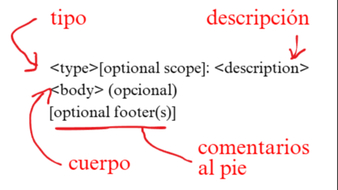

##### Tipos de commits utilizados:

- `feat`: Nueva funcionalidad
- `fix`: Corrección de errores
- `docs`: Cambios en documentación
- `style`: Cambios en formato/estilo sin afectar la lógica
- `refactor`: Reestructuración del código sin cambio funcional
- `test`: Cambios en tests
- `build`: Cambios que afectan al sistema de compilación o dependencias
- `ci`: Configuraciones de integración continua
- `chore`: Tareas menores de mantenimiento
- `perf`: Mejoras de rendimiento
- `revert`: Reversión de un commit anterior

### 5.1.3. Source Code Style Guide & Conventions

Con el objetivo de mantener un código legible, limpio, coherente y fácilmente mantenible, el proyecto **NursePulse** adopta un conjunto de guías de estilo y convenciones estándar para todos los lenguajes utilizados en la solución. 
Estas buenas prácticas permiten asegurar consistencia entre los miembros del equipo, mejorar la calidad del código y facilitar su escalabilidad en futuras iteraciones.

Como regla principal, **todas las variables, funciones, clases, componentes y archivos se nombran estrictamente en idioma inglés**, evitando el uso del "spanglish", traducciones incorrectas (como *deployar*, *aplicativo*) o nomenclatura en español en la lógica interna del software.

Por lo que todas las variables, funciones, clases, componentes y archivos se nombran en inglés, siguiendo estándares internacionales de la industria del software.


### HTML / CSS (Landing Page y vistas estáticas)

**Guía adoptada:** Google HTML/CSS Style Guide y W3C Standards

### HTML
- Se utiliza una estructura semántica clara usando etiquetas como `header`, `main`, `section`, `article` y `footer`.
- El código HTML se escribe con indentación de 2 espacios.
- Todas las etiquetas deben cerrarse correctamente.
- Se utilizan comillas dobles para atributos HTML.
- Se evita el uso de estilos inline para mantener separación entre estructura y diseño.

### CSS
- Se utiliza la metodología BEM (Block Element Modifier) para la nomenclatura de clases:
    - Ejemplo: `btn--primary`
- Se prioriza el uso de clases reutilizables.
- Se evita la duplicación de estilos.
- Se aplican variables CSS para colores, espaciados y medidas globales.
- Se organiza el CSS de forma modular por componentes o secciones.


### Angular (Frontend Web Application)

**Guías adoptadas:** *Angular Coding Style Guide* y *Google TypeScript Style Guide*.

### Nomenclatura
- `camelCase` para variables, funciones, métodos y propiedades.
- `PascalCase` para clases, interfaces, componentes y enumeraciones (`enums`).
- `UPPER_SNAKE_CASE` para constantes globales.
- `kebab-case` para nombres de archivos y carpetas (ej. `patient-list.ts`).
- Prefijo `_` para los *signals* privados de los stores (ej. `_patients`).

### Buenas prácticas
- Clean Architecture junto con Domain-Driven Design (DDD): Separación lógica en capas (`application`, `domain`, `infrastructure` y `presentation`).
- Inyección de dependencias: Uso de `@Injectable()` y la función `inject()` de Angular para la gestión ágil de dependencias.
- Patrón Assembler/Mapper: Conversión de DTOs a entidades de dominio para no acoplar la respuesta del API directamente a la vista.
- Manejo de estado reactivo: Uso de *Signals* nativos para el control del estado en los componentes.
- Lógica derivada: Uso de `computed` *signals* para variables que dependen reactivamente de otros estados.
- Seguridad en la navegación: Implementación de *Route Guards* para la protección de acceso a rutas privadas o clínicas.

### Estilo de código
- Declaración de variables: Uso estricto de `const` (por defecto) y `let` (solo si mutará). Prohibido el uso de `var`.
- Reusabilidad: Código altamente modular, priorizando componentes "tontos" (Dumb/Presentational Components) y servicios "inteligentes" (Smart Services).
- Manejo de errores estructurado: Uso de bloques `try/catch` o el operador `catchError` de RxJS con mensajes descriptivos y amigables para el usuario.
- Sintaxis moderna: Uso de operadores ternarios y *optional chaining* (`?.`) para simplificar validaciones y evitar errores en consola.
- Seguridad de tipos: Habilitación estricta de *TypeScript Strict Mode* para garantizar la máxima seguridad y detección de errores durante la compilación.


### Java / Spring Boot (RESTful API Backend)

**Guía de referencia:** *Google Java Style Guide*, con indentación de 4 espacios en lugar de los 2 que propone, y convenciones de *Spring Boot Features*.

### Nomenclatura
- `camelCase` para variables, métodos, atributos y parámetros.
- `PascalCase` para clases, interfaces, registros (*records*) y enumeraciones.
- `UPPER_SNAKE_CASE` para constantes (`static final`).
- `kebab-case` para las rutas (URLs) de los endpoints REST (ej. `/api/v1/vital-sign-records`).
- Minúsculas (sin guiones ni mayúsculas) para la estructura de paquetes (ej. `com.brainspark.nursepulse.platform.patients`).

### Buenas prácticas
- Domain-Driven Design (DDD): Organización del código fuente en paquetes alineados con *Bounded Contexts*.
- Arquitectura en capas: Separación lógica estricta en `Controller` (Presentación), `Service` (Aplicación/Lógica de Negocio), `Repository` (Infraestructura) y `Domain Model`.
- Inyección de dependencias: Uso de inyección por constructor mediante anotaciones estándar de Spring (`@RestController`, `@Service`, `@Repository`).
- Patrón DTO y Assembler/Mapper: Conversión entre DTOs y Entidades para evitar exponer el modelo de dominio y la persistencia directamente en la API.
- Persistencia Relacional: Uso de JPA/Hibernate para el mapeo objeto-relacional (ORM).
- Respuestas estandarizadas: Uso consistente de `ResponseEntity` para manejar y estructurar los códigos de estado HTTP y el cuerpo de las respuestas.

### Estilo de código
- Inmutabilidad: Preferencia por variables `final` y uso de Java *Records* para la creación concisa de DTOs inmutables.
- Código modular y aplicación de principios SOLID.
- Manejo de errores estructurado: Excepciones centralizadas globales mediante `@ControllerAdvice` y `@ExceptionHandler` para retornar mensajes de error consistentes (400, 404, 500).
- Seguridad contra nulos: Uso de `Optional<T>` en las consultas de base de datos y flujos lógicos para evitar `NullPointerException`.
- Validación de datos: Implementación de *Jakarta Bean Validation* (`@Valid`, `@NotNull`, `@NotBlank`, etc.) para sanitizar el *request body* directamente en los controladores.

### Convenciones generales del proyecto NursePulse

- Todo el código está escrito en inglés.
- Se aplica el principio SOLID.
- Se sigue el principio DRY.
- Se prioriza la legibilidad sobre la complejidad.

### Gherkin (Especificaciones)

Para la definición de criterios de aceptación en historias de usuario se utiliza Gherkin:

- Given / When / Then
- Lenguaje claro y entendible por el negocio

### Ejemplos:

```gherkin
Given a patient is registered in the system
When vital signs are recorded outside the normal range
Then the system generates an automatic alert

Given I am on the patient view
When I record vital signs data
Then it is saved correctly in the medical record

Given I complete the SBAR form
When I save the shift handover
Then it is stored with the date, time, and responsible user

Given a critical clinical event occurs
When the system records it
Then it is logged in the audit log with full details
````


### 5.1.4. Software Deployment Configuration


En esta sección el equipo especifica la configuración del despliegue de la solución **NursePulse**, incluyendo los procedimientos necesarios para que,
a partir de los repositorios de código fuente, se pueda realizar la publicación exitosa de los productos digitales que componen el sistema: Landing Page, Frontend Web Application y Web Services (Backend).

La solución se encuentra estructurada bajo una arquitectura desacoplada, donde cada componente es desplegado de manera 
independiente utilizando plataformas especializadas en la nube, lo que permite mejorar la escalabilidad, disponibilidad y mantenimiento del sistema.


### Componentes de Despliegue

- **Landing Page**: desplegada en GitHub Pages.
- **Frontend Web Application (Angular)**: desplegada en Vercel.
- **Web Services RESTful API (Backend)**: desplegado como contenedor Docker en Render (PaaS).
- **Base de Datos (MySQL)**: gestionada como servicio administrado en Aiven.
- **Monitoreo de Disponibilidad**: UptimeRobot, encargado de mantener activo el backend y notificar caídas.

### 1. Control de Versiones

El proyecto utiliza **Git** como sistema de control de versiones y **GitHub** como plataforma para la gestión de repositorios.

### Estrategia de ramas

- `main`: contiene la versión estable de cada repositorio.
- `deploy/render-docker`: rama de producción del Backend, desplegada automáticamente en Render.
- `feature/*`, `fix/*` y `chore/*`: ramas de trabajo para funcionalidades, correcciones y mantenimiento (ver 5.1.2).


### 2. Despliegue de Landing Page (GitHub Pages)

La Landing Page es un sitio web responsivo construido con HTML5, CSS3 y JS.

### Pasos de despliegue

#### 1. Inicializar y preparar el repositorio
- `git init`
- `git add .`
- `git commit -m "deploy landing page"`

#### 2. Conectar el repositorio con GitHub
- `git branch -M main`
- `git remote add origin <repo-url>`
- `git push -u origin main`

#### 3. Configurar GitHub Pages
- Ir a **Settings** del repositorio.
- Acceder a la sección **Pages**.
- Seleccionar:
    - **Source**: Deploy from branch
    - **Branch**: main
    - **Folder**: / (root)

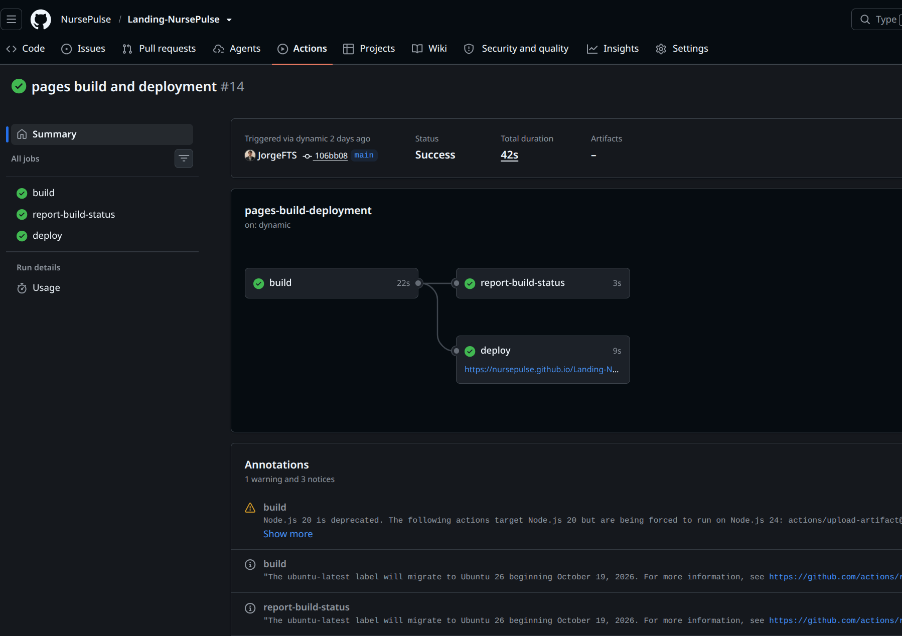

#### Resultado: 
Publicación automática bajo un subdominio HTTPS gestionado por GitHub (ejemplo: `https://nursepulse.github.io/Landing-NursePulse/`).

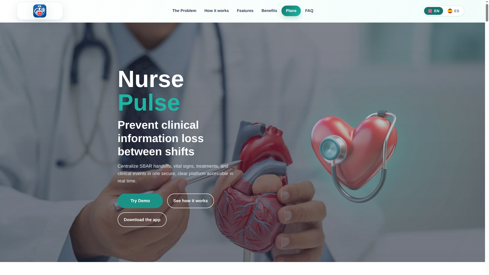

### 3. Despliegue del Frontend Web Application (Angular en Vercel)

La aplicación es una *Single Page Application* (SPA) desarrollada en Angular 21 y se despliega en Vercel mediante integración continua directa con el repositorio de GitHub: cada push a la rama `main` dispara automáticamente un nuevo build y despliegue, sin pasos manuales adicionales.

### Pasos de despliegue

#### 1. Subir el proyecto al repositorio
- `git add .`
- `git commit -m "deploy frontend"`
- `git push origin main`

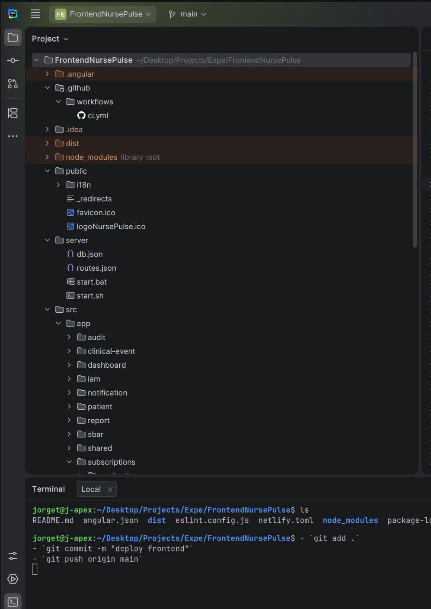

#### 2. Configurar el proyecto en Vercel
- Acceder a: https://vercel.com/
- Iniciar sesión con la cuenta de GitHub e importar el repositorio `Application-Web-Nurse-Pulse`.
- Vercel detecta el archivo `vercel.json` del repositorio, donde se define:
  - **Build command**: `npm run build -- --configuration production`
  - **Output directory**: `dist/FrontNursePulse/browser`
  - Una regla de *rewrite* que redirige todas las rutas sin extensión a `index.html`, necesaria para el enrutamiento de Angular (SPA).

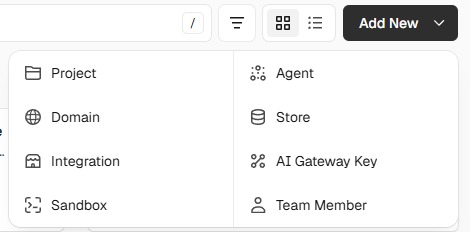

---

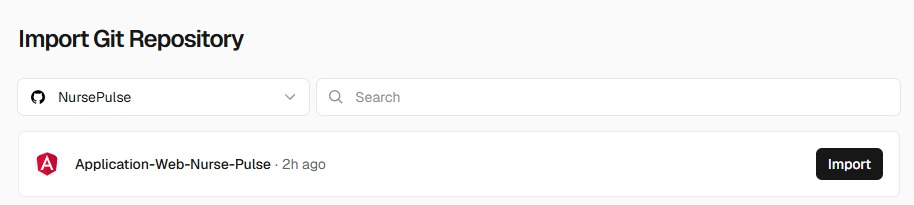
#### 3. Configurar variables de entorno
- Configurar en el panel de Vercel (**Settings → Environment Variables**) la URL pública del RESTful API consumida por el `environment.prod.ts`, apuntando al backend desplegado en Render.

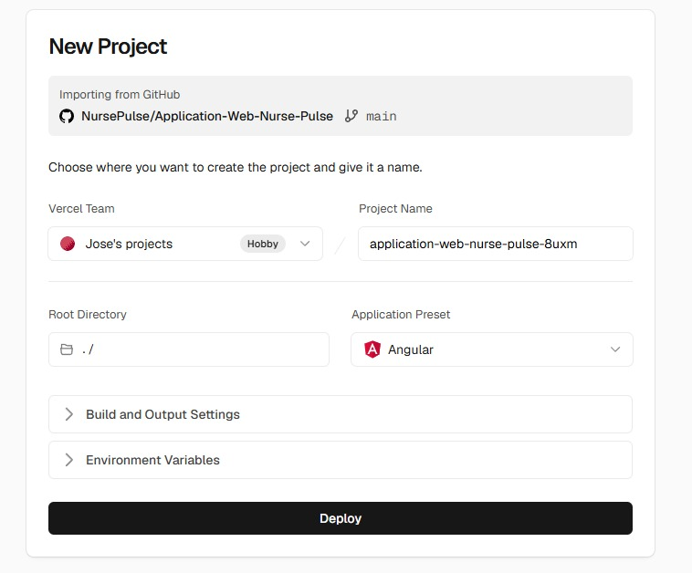

#### 4. Despliegue automático
- A partir de la primera conexión, cada `git push origin main` dispara un nuevo build y despliegue automático en Vercel.
- Vercel genera una URL pública HTTPS (`https://application-web-nurse-pulse.vercel.app`) accesible desde cualquier dispositivo.

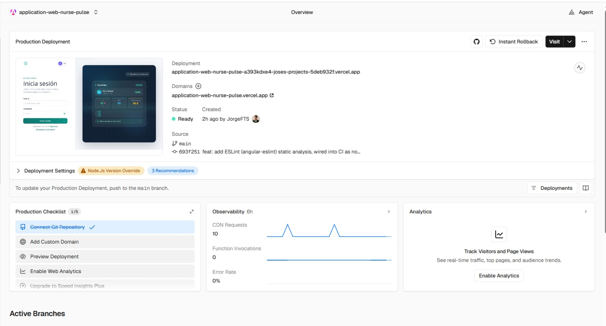
### 4. Despliegue de los Web Services RESTful API (Cloud Provider)

El backend desarrollado en Spring Boot y documentado con OpenAPI (Swagger) ha sido configurado para su despliegue continuo en Render, un servicio Platform as a Service (PaaS), como contenedor Docker construido a partir del `Dockerfile` del repositorio.

### Pasos de despliegue


#### 1. Configurar credenciales y entorno
- Ajustar la configuración del archivo `application-prod.properties`.
- Inyectar dinámicamente las credenciales de entorno para la conexión segura a la base de datos (MySQL gestionado en la nube).

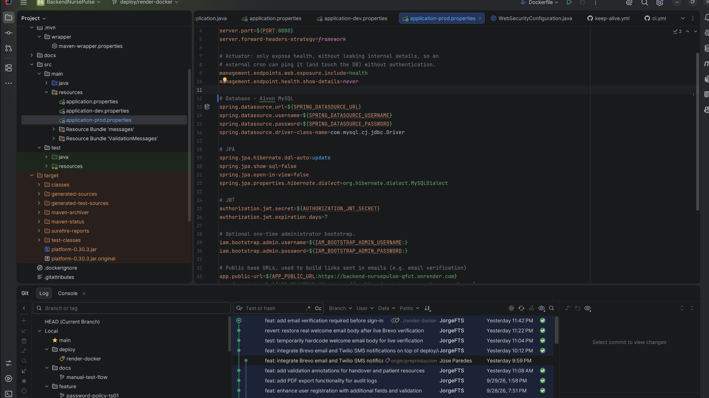

--- 

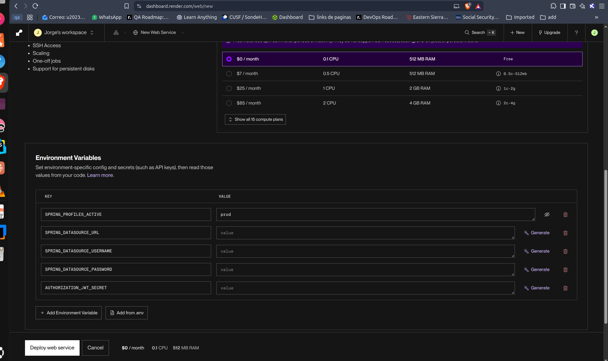

#### 2. Construcción del artefacto
- Empaquetar y construir el archivo `.jar` usando Maven ejecutando el comando:
  - `mvn clean package -DskipTests`

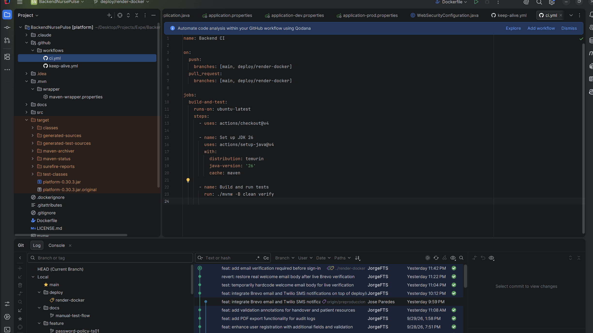

#### 3. Publicación en el servicio Cloud
- Vincular el repositorio (rama `deploy/render-docker`) al servicio PaaS (Render) para disparar el despliegue de la imagen/artefacto.
- El Cloud Provider asigna los recursos, levanta el servidor y genera una URL HTTPS pública.

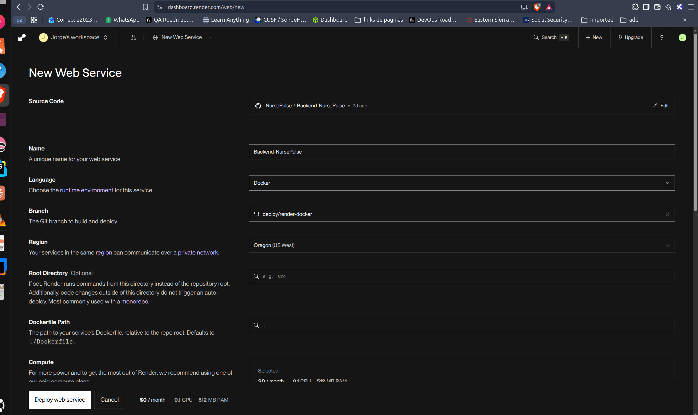

#### 4. Documentación desplegada
- Una vez levantado el servidor, la documentación estandarizada Swagger UI queda expuesta públicamente.
- **Ruta de acceso:** `https://backend-nursepulse-qfct.onrender.com/swagger-ui/index.html`

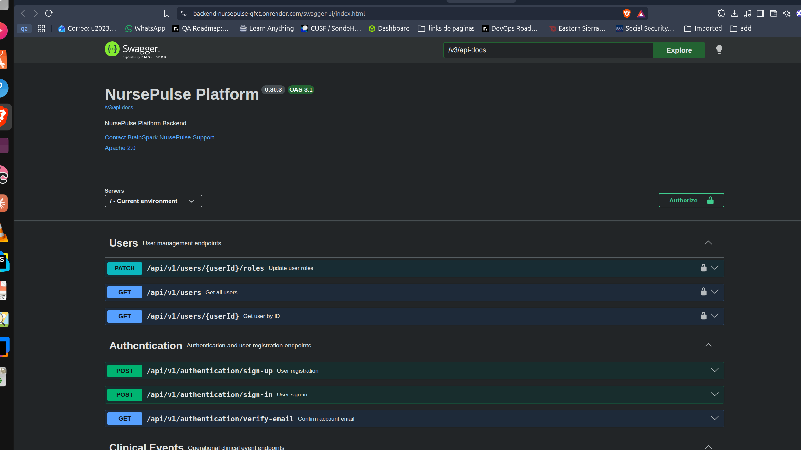

### 5. Integración de Componentes

El sistema funciona de la siguiente manera:

- La **Landing Page** actúa como punto de entrada y promoción, redirigiendo al usuario mediante llamados a la acción (CTA) hacia el frontend.
- El **Frontend** (SPA en Angular) gestiona la experiencia de usuario y consume los servicios expuestos por el backend.
- El **Backend** (Spring Boot RESTful API) procesa la lógica de negocio, se conecta a la base de datos MySQL en la nube para persistir la información y devuelve las respuestas estructuradas al frontend.

### 6. Consideraciones de Despliegue

- Uso obligatorio de variables de entorno para configuraciones sensibles (credenciales de BD, tokens, URIs).
- Separación de entornos (desarrollo y producción).
- Evitar exponer credenciales dentro del código fuente bajo ninguna circunstancia.
- Verificación de URLs públicas y endpoints de Swagger después de cada despliegue.
- Mantener compatibilidad entre versiones de frontend y backend, respetando el control de versiones semántico.


## 5.2. Landing Page, Services & Applications Implementation.

### 5.2.1 Sprint Backlogs

#### Sprint 1: Landing Page

El Sprint 1 se enfocó en el desarrollo e implementación de la Landing Page de NursePulse, la cual representa el primer punto de contacto entre la solución y los usuarios potenciales.
Este sprint tuvo como objetivo establecer una presencia digital sólida que comunique de manera clara la propuesta de valor del producto.

Durante este sprint, se desarrollaron e integraron las secciones principales de la Landing Page, incluyendo presentación del producto, funcionalidades clave, llamadas a la acción, equipo desarrollador, sectores beneficiados, 
preguntas frecuentes, sección de contacto y testimonios, siguiendo los lineamientos de diseño y los wireframes definidos previamente en el Capítulo IV. Asimismo, se priorizó la usabilidad, accesibilidad y coherencia visual, con el fin de ofrecer una experiencia atractiva y profesional.


##### Backlog del Sprint 1

<table>
  <thead>
    <tr>
      <th align="left">Sprint #</th>
      <th align="left" colspan="7">Sprint 1</th>
    </tr>
    <tr>
      <th align="left" colspan="2">User Story</th>
      <th align="left" colspan="6">Work-Item / Task</th>
    </tr>
    <tr>
      <th align="left">Id</th>
      <th align="left">Title</th>
      <th align="left">Id</th>
      <th align="left">Title</th>
      <th align="left">Description</th>
      <th align="left">Estimation<br>(Hours)</th>
      <th align="left">Assigned To</th>
      <th align="left">Status<br>(To-do / In-Process / To-Review / Done)</th>
    </tr>
  </thead>
  <tbody>
    <tr>
      <td>US-01</td>
      <td>Visualizar landing page</td>
      <td>T-01.1</td>
      <td>Layout General Responsive</td>
      <td>Maquetar estructura base HTML5/CSS3 adaptativa para desktop, tablet y móvil.</td>
      <td>6</td>
      <td>Aliaga Ocampo, Alexander</td>
      <td>Done</td>
    </tr>
    <tr>
      <td>US-02</td>
      <td>Ver propuesta de valor</td>
      <td>T-02.1</td>
      <td>Sección Hero y Pitch</td>
      <td>Diseñar e implementar sección principal con pitch interactivo y llamados a la acción.</td>
      <td>4</td>
      <td>Aliaga Ocampo, Alexander</td>
      <td>Done</td>
    </tr>
    <tr>
      <td>US-05</td>
      <td>Visualizar características clave</td>
      <td>T-03.1</td>
      <td>Módulo de Features</td>
      <td>Programar cuadrícula responsive con assets gráficos detallando el funcionamiento del producto.</td>
      <td>5</td>
      <td>Rocca Leon, Anhelo</td>
      <td>Done</td>
    </tr>
    <tr>
      <td>US-11</td>
      <td>Cambiar idioma del sitio</td>
      <td>T-04.1</td>
      <td>Internacionalización</td>
      <td>Configurar lógica de internacionalización (i18n) para soportar idiomas ES y EN en toda la navegación.</td>
      <td>6</td>
      <td>Huamán Cuba, Johan</td>
      <td>Done</td>
    </tr>
    <tr>
      <td>US-10</td>
      <td>Contactar al equipo de NursePulse</td>
      <td>T-05.1</td>
      <td>Formulario de Contacto</td>
      <td>Desarrollar formulario de contacto con validaciones de campos y alertas visuales integradas.</td>
      <td>5</td>
      <td>Huamán Cuba, Johan</td>
      <td>Done</td>
    </tr>
    <tr>
      <td>US-08</td>
      <td>Visualizar testimonios</td>
      <td>T-06.1</td>
      <td>Sección Testimonios y Redes</td>
      <td>Crear carrusel interactivo de testimonios y pie de página con accesos a social media accounts.</td>
      <td>5</td>
      <td>Rocca Leon, Anhelo</td>
      <td>Done</td>
    </tr>
    <tr>
      <td>US-12</td>
      <td>Acceder desde dispositivos móviles</td>
      <td>T-07.1</td>
      <td>Ajustes Media Queries</td>
      <td>Refactorización final de media queries para asegurar que no exista desbordamiento en vistas móviles.</td>
      <td>4</td>
      <td>Rios Cespedes, Adrian</td>
      <td>Done</td>
    </tr>
    <tr>
      <td>US-04</td>
      <td>Revisar cómo funciona NursePulse</td>
      <td>T-08.1</td>
      <td>GitFlow y GitHub Pages</td>
      <td>Configurar repositorios, workflows de CI/CD básicos y desplegar la Landing Page de forma exitosa.</td>
      <td>4</td>
      <td>Rios Cespedes, Adrian</td>
      <td>Done</td>
    </tr>
  </tbody>
</table>

###  Estados de las tareas
- **To-do**: Pendiente
- **InProcess**: En desarrollo
- **ToReview**: En revisión
- **Done**: Finalizado


##### Evidencia de commits del Sprint 1: Landing Page

Commits de la rama `main` del repositorio `Landing-NursePulse`, sin contar los de fusión. El historial del repositorio comienza el 1 de septiembre de 2026.

| Repository | Branch | Commit Id | Commit Message | Commit Message Body | Commited on (Date) |
| :--- | :--- | :--- | :--- | :--- | :--- |
| NursePulse/Landing-NursePulse | main | 7cf8b05b279cb0b914203f36227bc09ad7f9c0f1 | Initial commit | - | 01/09/2026 |
| NursePulse/Landing-NursePulse | main | c5719472097ba56f88307cd8d260cbd80b9a000c | Initial commit: NursePulse landing page | Contenido renombrado de PulseReport a NursePulse y archivos del sitio movidos a la raíz del repositorio. | 04/09/2026 |
| NursePulse/Landing-NursePulse | main | d3ed82750571740433486d61646e90b8b6982593 | Update team member details and add new photos for Jorge Taipe | - | 04/09/2026 |
| NursePulse/Landing-NursePulse | main | 026ee060e10caf13e2b7b8b46116f192406327b2 | chore: Update team affiliation to HatunSolutions and replace team member photos | - | 06/09/2026 |
| NursePulse/Landing-NursePulse | main | 31e3b75b4780adb961a919e40701814392acb704 | Update team member details and roles in English and Spanish translations | - | 06/09/2026 |
| NursePulse/Landing-NursePulse | main | ba8f89374a933e37d0bf4ad29e3a08a33d2ac4ad | Replace logo image with new NursePulse logo | - | 10/09/2026 |
| NursePulse/Landing-NursePulse | main | 581246fcbdd80dd6785319f0b012e0bf1549ba54 | Update footer logo image to new NursePulse design | - | 10/09/2026 |
| NursePulse/Landing-NursePulse | main | 1d0149986424cd475d5b8dd1c2a12590bb4d2378 | Add files via upload | - | 10/09/2026 |
| NursePulse/Landing-NursePulse | main | cf6eaa0a8593af134bd7aa4735b52ef0c7dc32ca | update: student profile photo | - | 12/09/2026 |
| NursePulse/Landing-NursePulse | main | 3efcb28f0fa1f89783f9723d8dd848aecf8185c7 | (index): Update student profile photo | - | 13/09/2026 |
| NursePulse/Landing-NursePulse | main | 7a44e2cd0f79c7964094b138b007d6e7daef0920 | Update hero title to reflect brand name as "Nurse Pulse" | - | 13/09/2026 |
| NursePulse/Landing-NursePulse | main | b1e2e622b4b0eafeff187de6ae642a51f7a41918 | Update hero title components to reflect brand name as "Nurse Pulse" | - | 13/09/2026 |
| NursePulse/Landing-NursePulse | main | 0a4f54d2b4e3251500cad6c6dd9846ec2b5ed07b | Update hero title components to reflect brand name as "Nurse Pulse" | - | 13/09/2026 |
| NursePulse/Landing-NursePulse | main | efa0bac1787fe4b6787f5ce18ee77aa3637d40be | Update product demo video URL in the about section | - | 13/09/2026 |
| NursePulse/Landing-NursePulse | main | 4c5c336f6cb81dd17b84ef25ddb65691a24baf9d | Update demo button link in index.html | - | 29/09/2026 |
| NursePulse/Landing-NursePulse | main | ca01b07035a4c711d41f506584b5af47ad1655c1 | Add download page and hero CTA for the mobile app | Agrega download.html (pantalla de descarga iOS/Android) y un botón "Download the app" en la sección hero, con sus textos i18n en inglés y español. | 29/09/2026 |
| NursePulse/Landing-NursePulse | main | 5d8e7a42105e8b69062ffe759f837d134faddf78 | Update download page with new app icon and improved download links | - | 29/09/2026 |

#### Sprint 2: Web Application y RESTful API

El Sprint 2 se enfocó en la Web Application (Angular) y en el RESTful API (Spring Boot), que sostienen las primeras vistas clínicas del producto: traspaso SBAR, registro de signos vitales y consulta de la evolución del paciente. Los repositorios de ambos componentes registran actividad entre el 3 y el 14 de septiembre de 2026.

Durante este sprint se consolidó el flujo SBAR con campos estructurados y receptor real, el registro y la consulta de signos vitales, los endpoints de pacientes, registros clínicos y traspasos, y la política de contraseñas del registro. También se corrigieron fallos de estabilidad detectados en las pruebas manuales y se preparó el despliegue del backend en Render mediante un `Dockerfile`.

##### Backlog del Sprint 2

<table>
  <thead>
    <tr>
      <th align="left">Sprint #</th>
      <th align="left" colspan="7">Sprint 2</th>
    </tr>
    <tr>
      <th align="left" colspan="2">User Story</th>
      <th align="left" colspan="6">Work-Item / Task</th>
    </tr>
    <tr>
      <th align="left">Id</th>
      <th align="left">Title</th>
      <th align="left">Id</th>
      <th align="left">Title</th>
      <th align="left">Description</th>
      <th align="left">Estimation<br>(Hours)</th>
      <th align="left">Assigned To</th>
      <th align="left">Status<br>(To-do / In-Process / To-Review / Done)</th>
    </tr>
  </thead>
  <tbody>
    <tr>
      <td>US-13</td>
      <td>Registrar traspaso SBAR (8 SP)</td>
      <td>T-13.1</td>
      <td>Formulario SBAR en la Web App</td>
      <td>Formulario de traspaso con paciente, enfermero receptor real y los cuatro campos Situation, Background, Assessment y Recommendation.</td>
      <td>—</td>
      <td>Taipe Sangama, Jorge Francisco</td>
      <td>Done</td>
    </tr>
    <tr>
      <td>US-13</td>
      <td>Registrar traspaso SBAR (8 SP)</td>
      <td>T-13.2</td>
      <td>Campos SBAR estructurados en el backend</td>
      <td>Migrar el traspaso a columnas propias por campo SBAR, con el receptor elegido y el emisor tomado de la sesión (JWT).</td>
      <td>—</td>
      <td>Taipe Sangama, Jorge Francisco</td>
      <td>Done</td>
    </tr>
    <tr>
      <td>US-14</td>
      <td>Consultar traspaso de turno (5 SP)</td>
      <td>T-14.1</td>
      <td>Consulta de traspasos</td>
      <td>Listado de traspasos por paciente y detalle de cada uno, en la web y mediante el API.</td>
      <td>—</td>
      <td>Taipe Sangama, Jorge Francisco</td>
      <td>Done</td>
    </tr>
    <tr>
      <td>US-15</td>
      <td>Confirmar recepción de traspaso (3 SP)</td>
      <td>T-15.1</td>
      <td>Confirmar recepción</td>
      <td>Acción de la enfermera entrante para confirmar el traspaso (`PATCH /handovers/{id}/acknowledge`).</td>
      <td>—</td>
      <td>Taipe Sangama, Jorge Francisco</td>
      <td>Done</td>
    </tr>
    <tr>
      <td>US-16</td>
      <td>Registrar signos vitales (5 SP)</td>
      <td>T-16.1</td>
      <td>Registro de signos vitales</td>
      <td>Formulario web y endpoint para registrar signos vitales de un paciente, con evaluación de riesgo.</td>
      <td>—</td>
      <td>Taipe Sangama, Jorge Francisco</td>
      <td>Done</td>
    </tr>
    <tr>
      <td>US-17</td>
      <td>Consultar evolución clínica (5 SP)</td>
      <td>T-17.1</td>
      <td>Historial y último registro por paciente</td>
      <td>Consulta del historial y del último registro de signos vitales, y vista de seguimiento por paciente.</td>
      <td>—</td>
      <td>Taipe Sangama, Jorge Francisco</td>
      <td>Done</td>
    </tr>
    <tr>
      <td>TS-02</td>
      <td>Gestión de pacientes mediante API (5 SP)</td>
      <td>T-TS02.1</td>
      <td>Endpoints de pacientes</td>
      <td>Crear, consultar, actualizar y eliminar pacientes; corrección del fallo silencioso al crear un paciente desde la web.</td>
      <td>—</td>
      <td>Taipe Sangama, Jorge Francisco</td>
      <td>Done</td>
    </tr>
    <tr>
      <td>TS-03</td>
      <td>Gestión de registros clínicos mediante API (8 SP)</td>
      <td>T-TS03.1</td>
      <td>Endpoints de signos vitales y eventos clínicos</td>
      <td>Registro y consulta de signos vitales y eventos clínicos, por listado y por paciente.</td>
      <td>—</td>
      <td>Taipe Sangama, Jorge Francisco</td>
      <td>Done</td>
    </tr>
    <tr>
      <td>TS-04</td>
      <td>Gestión de traspasos SBAR mediante API (5 SP)</td>
      <td>T-TS04.1</td>
      <td>Endpoints de traspasos SBAR</td>
      <td>Crear, consultar y confirmar traspasos; directorio de personal para que enfermería elija un receptor real.</td>
      <td>—</td>
      <td>Taipe Sangama, Jorge Francisco</td>
      <td>Done</td>
    </tr>
    <tr>
      <td>TS-01</td>
      <td>Autenticación de usuarios (5 SP)</td>
      <td>T-TS01.1</td>
      <td>Política de contraseñas del registro</td>
      <td>Exigir de 12 a 20 caracteres, una mayúscula y un carácter especial, de forma coherente en el backend y en la web.</td>
      <td>—</td>
      <td>Taipe Sangama, Jorge Francisco</td>
      <td>Done</td>
    </tr>
    <tr>
      <td>TS-06</td>
      <td>Manejo consistente de errores del API (3 SP)</td>
      <td>T-TS06.1</td>
      <td>Errores 500 y auditoría con metadatos nulos</td>
      <td>Corregir el fallo de auditoría con metadatos nulos y añadir una respuesta 500 de respaldo.</td>
      <td>—</td>
      <td>Taipe Sangama, Jorge Francisco</td>
      <td>Done</td>
    </tr>
  </tbody>
</table>

Las historias se estiman en Story Points (SP) según el Product Backlog del Capítulo III y se indican junto al título de cada una; las horas por tarea no se incluyen en esta tabla.

##### Evidencia de commits del Sprint 2: Web Application y Backend (resumen)

Selección de los commits funcionales del periodo; el historial completo está en cada repositorio.

| Repository | Branch | Commit Id | Commit Message | Commit Message Body | Commited on (Date) |
| :--- | :--- | :--- | :--- | :--- | :--- |
| NursePulse/Application-Web-Nurse-Pulse | main | 6c7bbf07b565fabfaf47e4e4cb5168e0e4a01e78 | Initial commit: Angular Frontend Nurse Pulse | - | 03/09/2026 |
| NursePulse/Application-Web-Nurse-Pulse | main | 28b3b469e22fadd0d8066c5f5a1aff2a58f70422 | Fix SBAR field parsing regex (Background/Assessment/Recommendation never matched) | El regex de `SbarAssembler.extract()` tenía las barras invertidas duplicadas y nunca coincidía. | 10/09/2026 |
| NursePulse/Application-Web-Nurse-Pulse | main | c4dd54b1f42602b6f9570c2067c0accef2b14977 | Fix silent failures on patient creation and add error handling to clinical stores | La fecha de ingreso en UTC pasaba al día siguiente por la noche y el backend la rechazaba sin que la web mostrara el error. | 10/09/2026 |
| NursePulse/Application-Web-Nurse-Pulse | main | 532ccab4e7fd32900ac03530c5b66d7c0a99af1e | Replace the hardcoded SBAR receiver list with real nurse accounts | La lista fija de receptores no estaba ligada a usuarios reales; ahora se eligen cuentas de enfermería registradas. | 11/09/2026 |
| NursePulse/Application-Web-Nurse-Pulse | main | 988210fbe1757ccac9d31783ac18ed49869aaa1d | feat(sbar): consume structured SBAR fields, drop regex parsing | La web usa el nuevo contrato de campos situation/background/assessment/recommendation en lugar de un texto libre. | 11/09/2026 |
| NursePulse/Application-Web-Nurse-Pulse | main | da549ac7d52d57f30144bc8756dff1e0e68e7623 | Fix sign-up error mapping and sync password validation with the real policy | Los errores 400 y 409 se mostraban como "usuario no disponible"; se alinea la validación con la política real de contraseñas. | 11/09/2026 |
| NursePulse/Application-Web-Nurse-Pulse | main | 2d6aaceacda4c9f1dc39a70f0c9c65924e084959 | Update production API base URL | - | 14/09/2026 |
| NursePulse/Backend-NursePulse | deploy/render-docker | b37b622f975ed73e0d112bbc41845bc9055f92b4 | Initial Commit: Backend NursePulse | - | 03/09/2026 |
| NursePulse/Backend-NursePulse | deploy/render-docker | 6c94bc299b1dc1a5e0e206f12c00f2549d1cfe8a | Tolerate legacy/unknown role names instead of crashing GET /users | Un rol almacenado con un nombre desconocido ya no rompe la consulta de usuarios. | 11/09/2026 |
| NursePulse/Backend-NursePulse | deploy/render-docker | a9d278038b6fa5831bedf194b26e75e25f24ccf3 | Expose a real triggeredAt timestamp on alerts instead of a client-fabricated one | Las alertas exponen su fecha real de creación; antes la web la fabricaba al mostrarla. | 11/09/2026 |
| NursePulse/Backend-NursePulse | deploy/render-docker | f6865f933343ff12365ae42fc9dfe799030850f6 | Fix NPE on audit logs with null metadata and add fallback 500 handler | Corrige el error con entradas de auditoría sin metadatos y agrega una respuesta 500 de respaldo. | 11/09/2026 |
| NursePulse/Backend-NursePulse | deploy/render-docker | 29a879e86d76ba35a47ae8a543f9a756916d7e04 | Enforce password complexity policy on sign-up (TS-01) | La validación solo exigía longitud; ahora exige de 12 a 20 caracteres, mayúscula y carácter especial. | 11/09/2026 |
| NursePulse/Backend-NursePulse | deploy/render-docker | aa55b90f5dc1ea172e931b936227385a50c48e1c | Allow clinical staff to list users as a staff directory | Enfermería y médicos pueden listar usuarios para elegir el receptor de un traspaso SBAR. | 11/09/2026 |
| NursePulse/Backend-NursePulse | deploy/render-docker | 0866820872e79c73e639dfab5c186eeb077c3bd2 | feat(handover): migrate SBAR to structured fields with real receiver | Columnas propias por campo SBAR, receptor elegido y emisor tomado del JWT. | 11/09/2026 |
| NursePulse/Backend-NursePulse | deploy/render-docker | 9e2f4a50bcc24e232300a449f3d4cb8a2d283190 | feat(deploy): add Dockerfile for Render deployment | Construcción en dos etapas (JDK 26 y JRE 26) con el perfil `prod` y el puerto de Render. | 14/09/2026 |

### 5.2.2. Implemented Landing Page Evidence

A continuación se presenta evidencia visual de las secciones implementadas de la Landing Page de NursePulse, desplegada en GitHub Pages: [https://nursepulse.github.io/Landing-NursePulse/](https://nursepulse.github.io/Landing-NursePulse/).

**Sección Hero (presentación y propuesta de valor)**

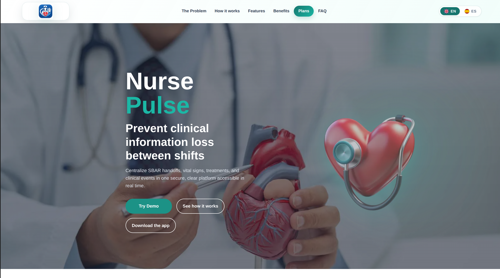

---

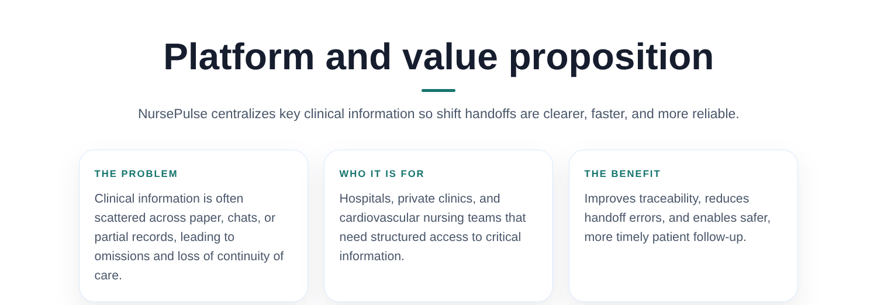

**Sección de características / cómo funciona**

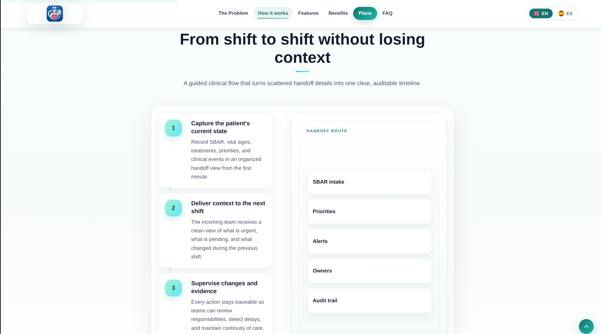

---

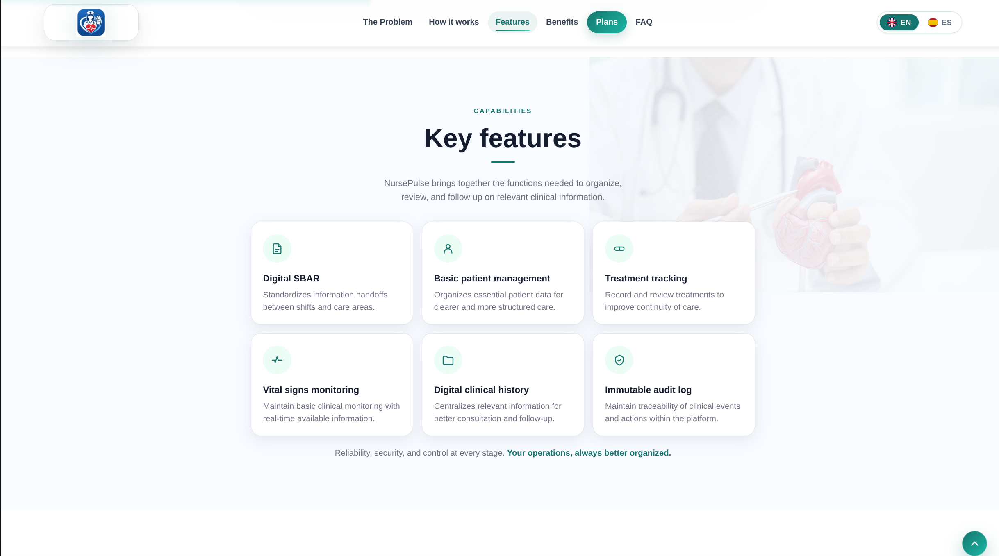

**Sección de planes (pricing)**

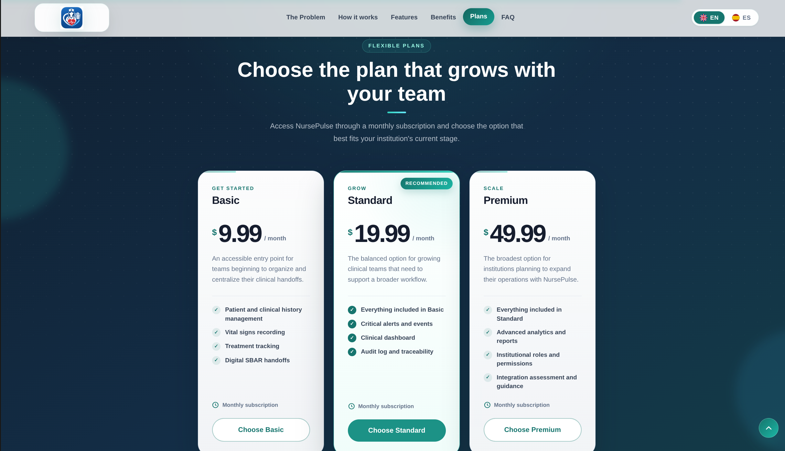

**Sección de equipo y testimonios**

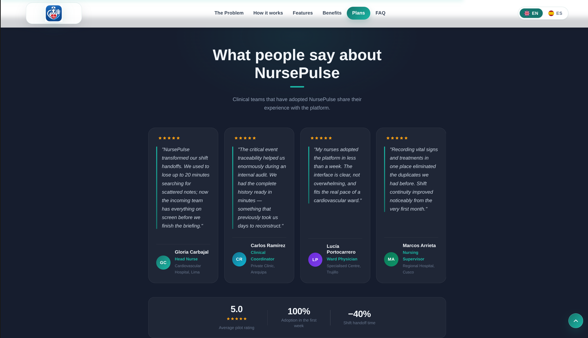

**Página de descarga de la app móvil**

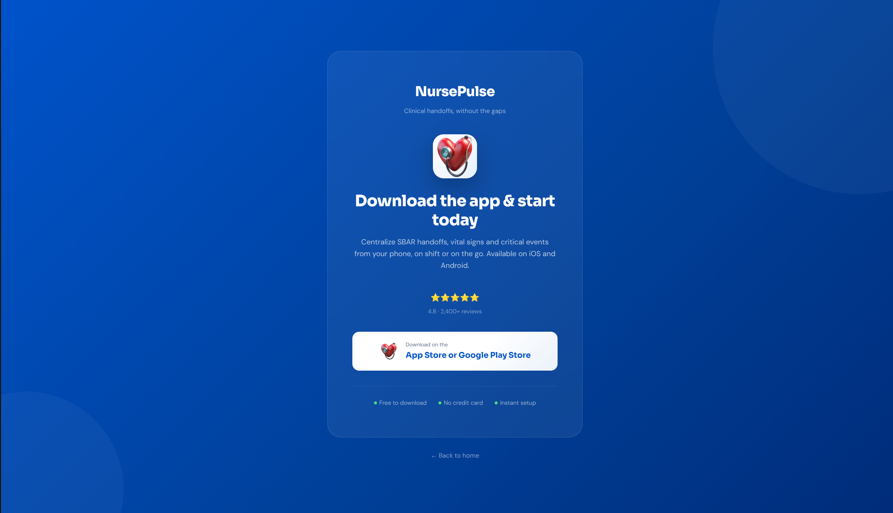

### 5.2.3. Implemented Frontend-Web Application Evidence

A continuación se presenta evidencia visual de los módulos implementados en la Web Application (Angular), desplegada en: [https://application-web-nurse-pulse.vercel.app](https://application-web-nurse-pulse.vercel.app).

**Inicio de sesión**

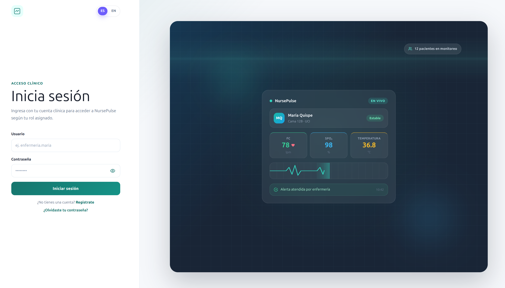

**Registro con verificación de cuenta por correo**

Para evitar que alguien se registre con un correo que no le pertenece, el registro de nuevos usuarios (enfermería/médico) requiere confirmar la cuenta antes de poder iniciar sesión:

1. El usuario completa el formulario de `/sign-up` con sus datos (nombre, apellido, teléfono, edad, correo, rol clínico y contraseña).
2. El backend crea la cuenta marcada como **no verificada** y genera un token de verificación de un solo uso con vigencia de 24 horas.
3. Se envía automáticamente (vía Brevo) un correo de bienvenida con un botón **"Verificar mi cuenta"**.
4. Mientras la cuenta no esté verificada, cualquier intento de inicio de sesión es rechazado (`HTTP 422`) con un mensaje indicando que debe confirmar su correo.
5. Al hacer clic en el botón del correo, el backend valida el token y marca la cuenta como verificada, mostrando una página de confirmación; desde ahí el usuario ya puede iniciar sesión normalmente.


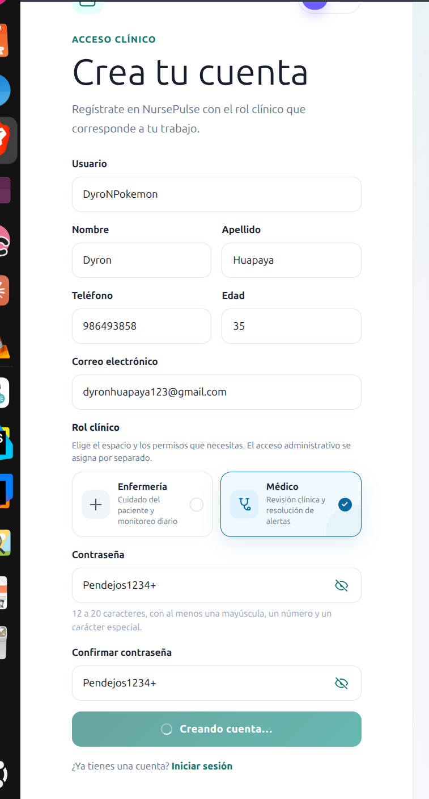

--- 


---

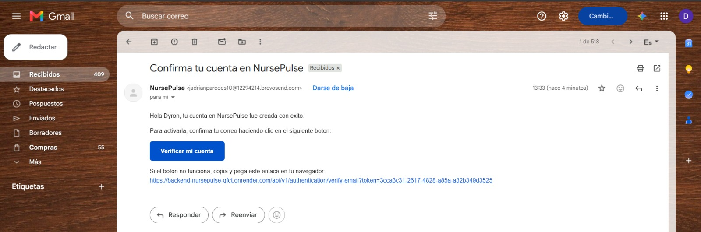

---

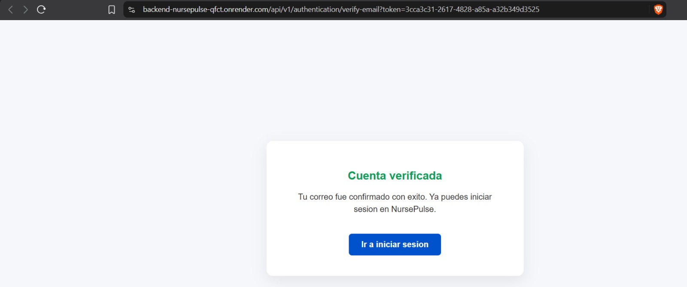

**Dashboard**


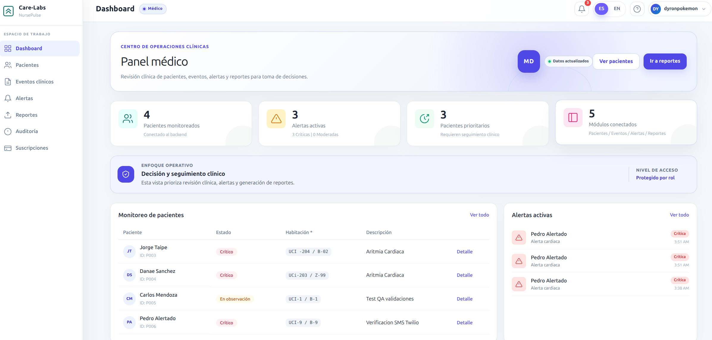

**Gestión de pacientes**


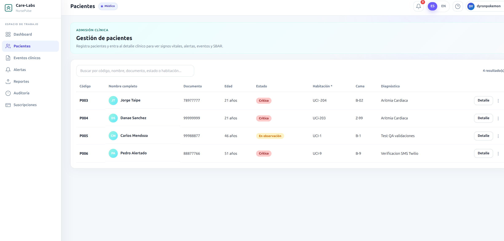

**Signos vitales**

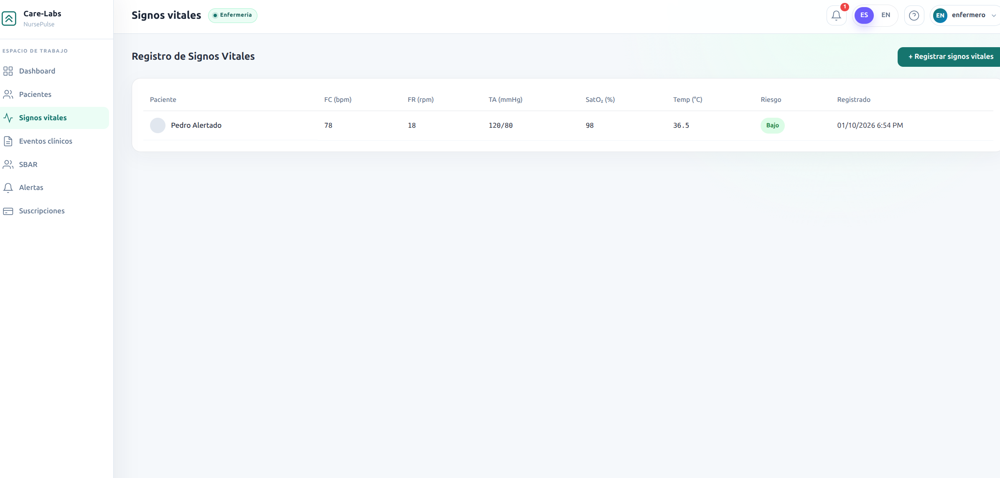

**Eventos clínicos**

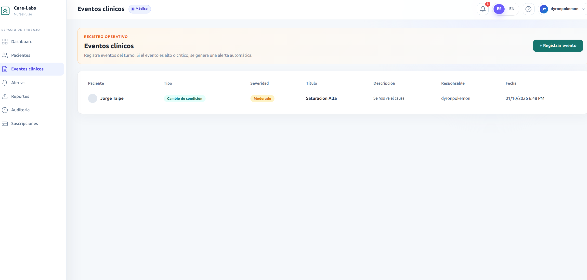

**Traspasos SBAR**

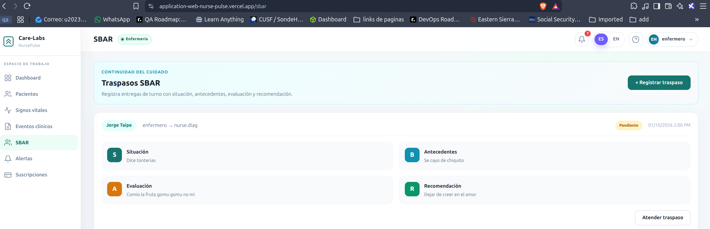

**Alertas clínicas**

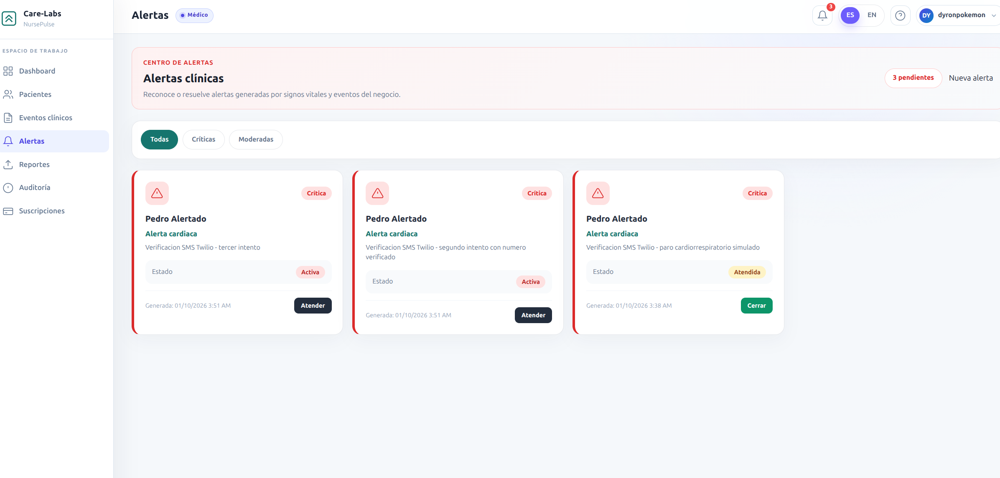

**Auditoría (trazabilidad) y exportación a PDF**

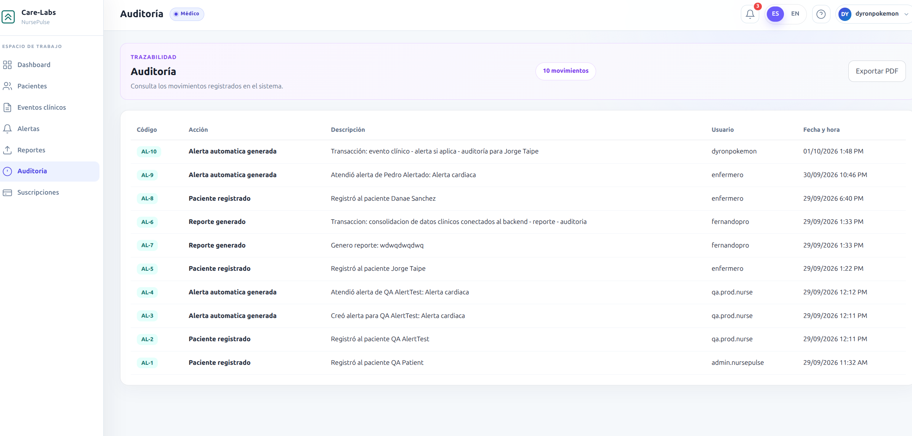

**Gestión de usuarios (solo Administrador)**

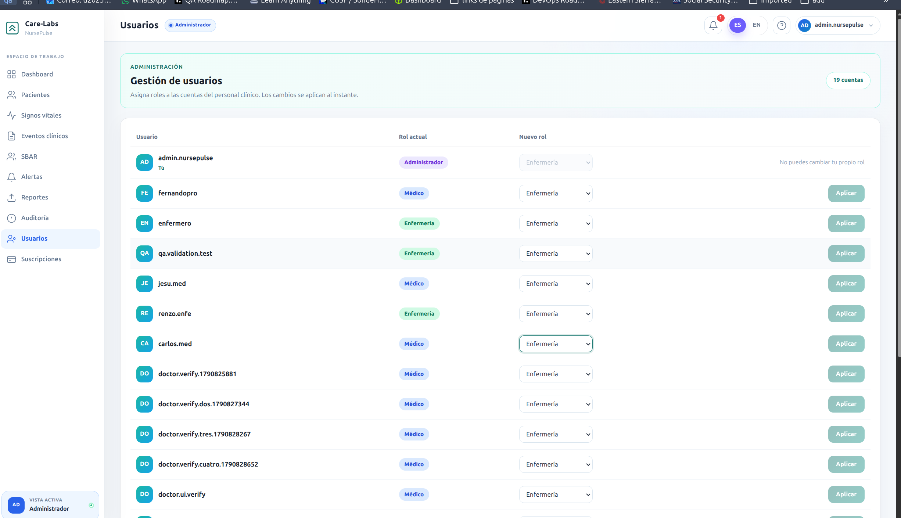

**Reportes**

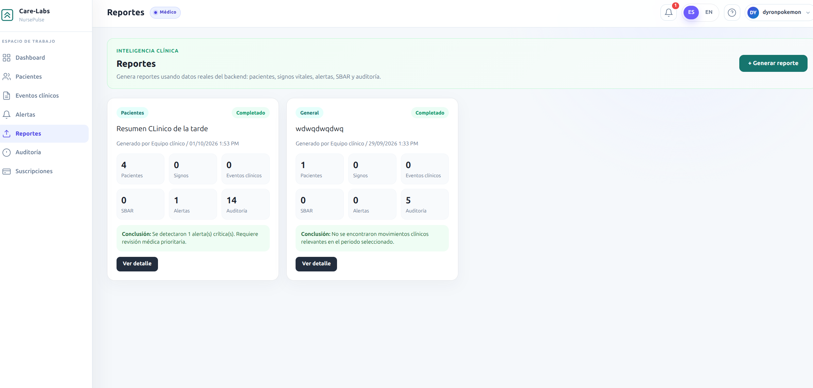

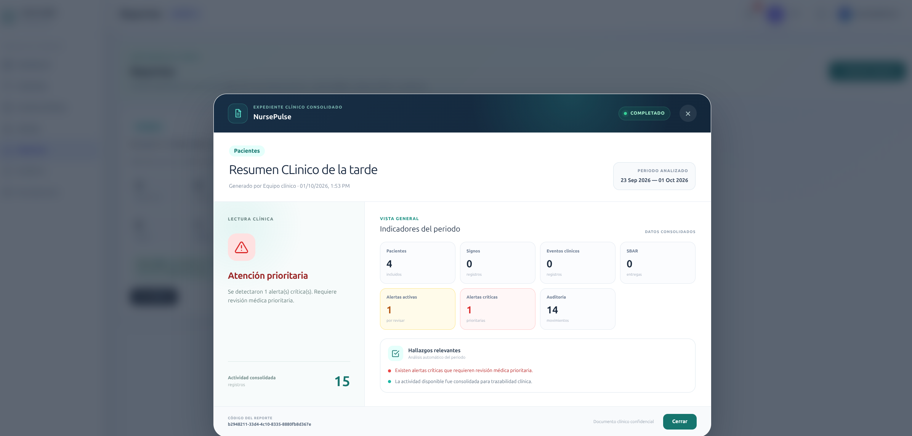

### 5.2.4. Acuerdo de Servicio - SaaS

NursePulse se ofrece bajo un modelo de suscripción SaaS (Software as a Service) con tres planes diferenciados por número de asientos (usuarios clínicos) y funcionalidades habilitadas. Esta sección resume las condiciones comerciales simuladas dentro del producto, implementadas en el módulo de Suscripciones de la Web Application.

| Plan | Precio mensual | Asientos incluidos | Funcionalidades incluidas |
| :--- | :--- | :--- | :--- |
| **Essential** | US$ 0 (gratuito) | Hasta 5 usuarios | Gestión de pacientes, registro de signos vitales, alertas clínicas |
| **Professional** | US$ 49 / mes | Hasta 25 usuarios | Todo lo del plan Essential + Traspasos SBAR + Reportes |
| **Enterprise** | US$ 129 / mes | Hasta 100 usuarios | Todo lo del plan Professional + Auditoría (trazabilidad completa) + Soporte prioritario |

**Condiciones generales del acuerdo de servicio:**

1. **Vigencia**: la suscripción se renueva automáticamente de forma mensual mientras el cliente (institución de salud) mantenga el pago activo.
2. **Cambio de plan**: el cliente puede subir o bajar de plan en cualquier momento; el cambio aplica de forma inmediata sobre los límites de asientos y funcionalidades disponibles.
3. **Datos clínicos**: la información de pacientes, signos vitales, eventos clínicos y traspasos SBAR pertenece a la institución cliente; NursePulse actúa únicamente como proveedor de la plataforma (Data Processor).
4. **Disponibilidad**: el proveedor procura una disponibilidad continua del servicio, monitoreada mediante UptimeRobot sobre el backend desplegado en Render.
5. **Soporte**: los planes Professional y Enterprise incluyen soporte prioritario vía canal de contacto directo; el plan Essential recibe soporte por el canal estándar (formulario de contacto de la Landing Page).
6. **Cancelación**: el cliente puede cancelar la suscripción en cualquier momento, sin penalidad, manteniendo acceso hasta el final del periodo ya pagado.


### 5.2.5. Implemented Native-Mobile Application Evidence

A continuación se presenta evidencia visual de la aplicación móvil multiplataforma (Flutter), la cual replica las funcionalidades clínicas principales de la Web Application para su uso desde el celular del personal de enfermería y médico durante el turno.

**Inicio de sesión y registro**

Pantalla de inicio de sesión (izquierda) y formulario "Crear cuenta clínica" (derecha), con el rol clínico y los requisitos de la contraseña.

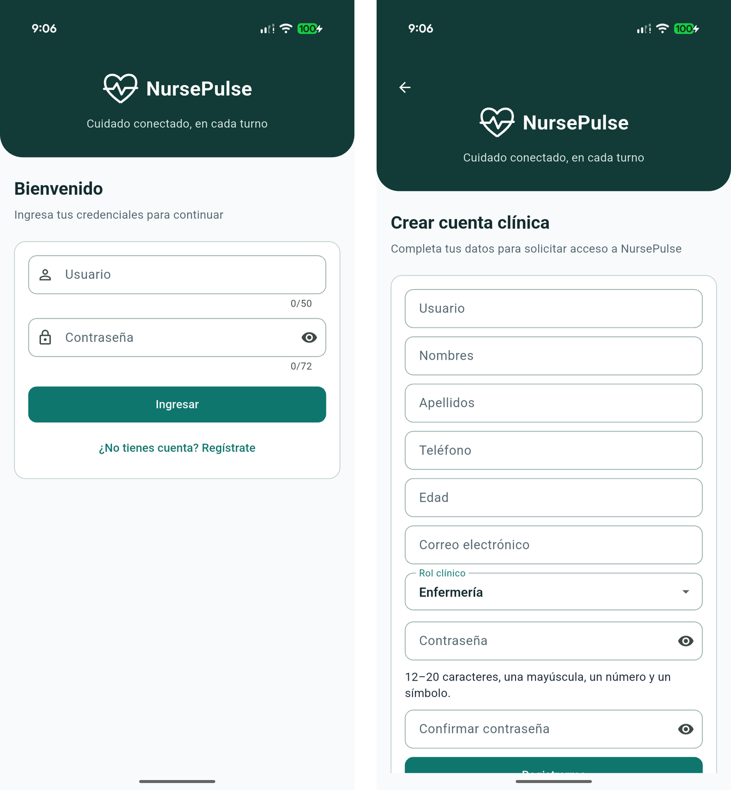

**Gestión de pacientes**

Lista de pacientes con su estado, habitación y diagnóstico (izquierda) y formulario "Nuevo paciente" (derecha).

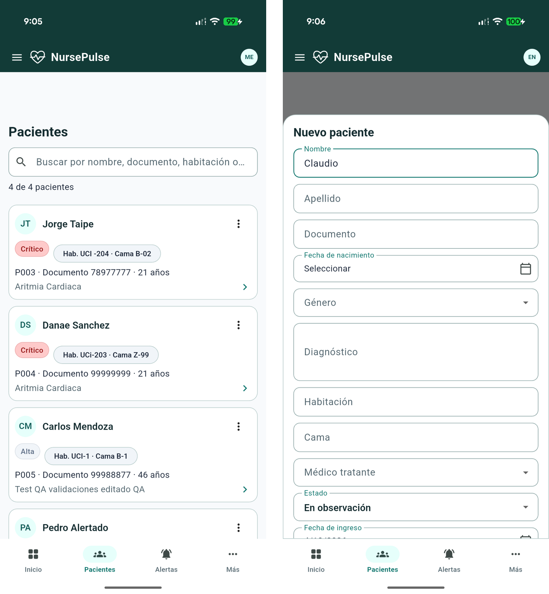

**Signos vitales**

Lista de registros con el nivel de riesgo calculado (izquierda) y formulario "Registrar signos vitales" con el rango válido de cada medición (derecha).

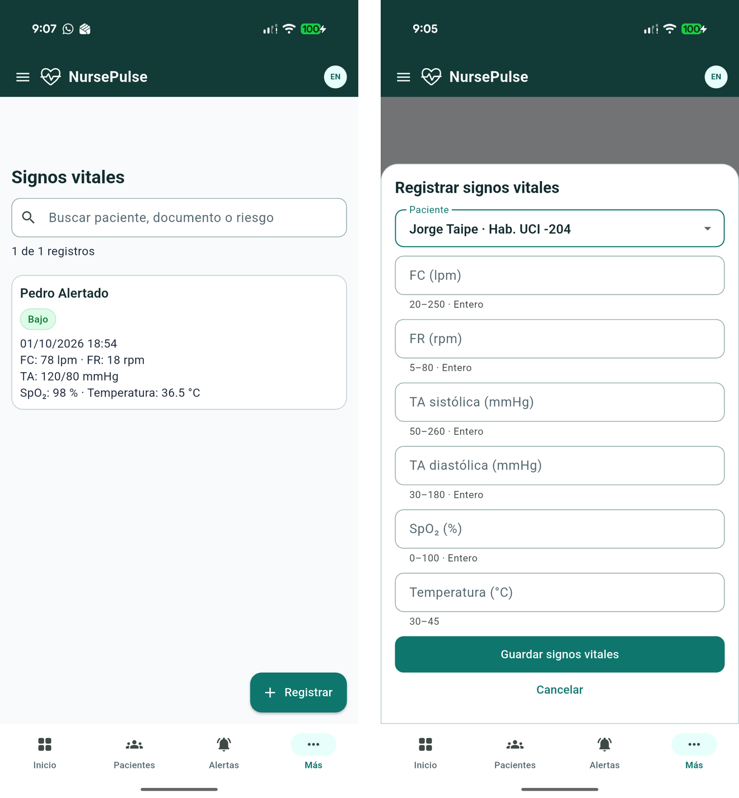

**Descarga del APK**

La aplicación se distribuye como archivo APK, generado automáticamente mediante el pipeline de CI/CD del repositorio `MultiPlatform-App-NursePulse` (ver Capítulo VII) y publicado como GitHub Release. El botón "Download" de la Landing Page enlaza directamente a la última versión disponible:

`https://github.com/NursePulse/MultiPlatform-App-NursePulse/releases/latest/download/app-release.apk`

### 5.2.6. Implemented RESTful API and/or Serverless Backend Evidence

El backend de NursePulse se implementó como una RESTful API utilizando Spring Boot, siguiendo una arquitectura de módulos por *Bounded Context* (Domain-Driven Design). El servicio se encuentra desplegado como contenedor Docker en Render y documentado con Swagger/OpenAPI.

**Swagger UI del backend desplegado**


**Módulos (Bounded Contexts) implementados:**

| Módulo | Responsabilidad |
| :--- | :--- |
| `iam` | Autenticación (sign-in/sign-up), gestión de usuarios y roles (NURSE, DOCTOR, ADMIN) |
| `patients` | Registro, consulta, actualización, alta y eliminación de pacientes |
| `vitalsigns` | Registro y consulta de signos vitales por paciente |
| `clinicalevents` | Registro de eventos clínicos del turno (observación, medicación, complicación, emergencia, etc.) |
| `handover` | Traspasos de turno estructurados en formato SBAR |
| `criticalevents` | Alertas clínicas (creación, atención y cierre) |
| `auditlogs` | Trazabilidad/auditoría de todas las acciones clínicas del sistema, con exportación a PDF |

**Evidencia de ejecución del servicio en producción**

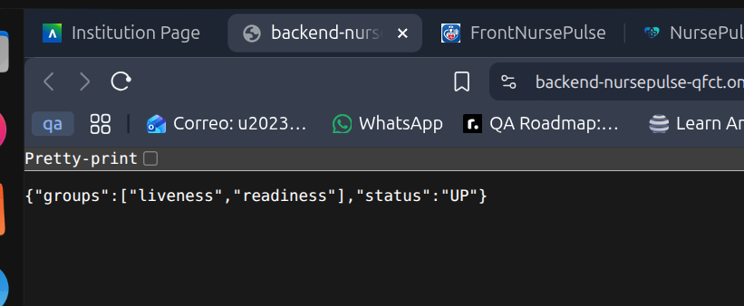

### 5.2.7. RESTful API documentation

La siguiente tabla resume los endpoints principales expuestos por el backend, agrupados por módulo, junto con los roles autorizados para consumirlos según la configuración de seguridad (`WebSecurityConfiguration`) y la Historia de Usuario o Technical Story del Capítulo III que cada uno satisface. Esta trazabilidad permite confirmar que cada recurso del API responde a una necesidad documentada del negocio, y no a una funcionalidad añadida sin respaldo en el backlog.

**Autenticación (`/api/v1/authentication`)** — público

| Método | Endpoint | Descripción | Historia relacionada |
| :--- | :--- | :--- | :--- |
| POST | `/sign-in` | Inicio de sesión, retorna JWT (rechaza con `422` si el correo no ha sido verificado) | US-25, TS-01 |
| POST | `/sign-up` | Registro público de enfermería/médico (ROLE_NURSE o ROLE_DOCTOR); envía un correo de verificación | US-23, TS-01 |
| GET | `/verify-email?token=...` | Confirma la cuenta a partir del link enviado por correo; renderiza una página HTML de confirmación | US-24 |

**Usuarios (`/api/v1/users`)** — NURSE, DOCTOR, ADMIN (lectura) / ADMIN (gestión)

| Método | Endpoint | Roles | Descripción | Historia relacionada |
| :--- | :--- | :--- | :--- | :--- |
| GET | `/users` | NURSE, DOCTOR, ADMIN | Lista de usuarios registrados (directorio de personal) | US-26, TS-01 |
| GET | `/users/{userId}` | ADMIN | Detalle de un usuario | US-26 |
| PATCH | `/users/{userId}/roles` | ADMIN | Cambiar el rol asignado a un usuario | US-26, TS-07 |

**Roles (`/api/v1/roles`)**

| Método | Endpoint | Roles | Descripción | Historia relacionada |
| :--- | :--- | :--- | :--- | :--- |
| GET | `/roles` | ADMIN | Lista de roles disponibles para asignar | US-26 |

**Pacientes (`/api/v1/patients`)**

| Método | Endpoint | Roles | Descripción | Historia relacionada |
| :--- | :--- | :--- | :--- | :--- |
| POST | `/patients` | NURSE, ADMIN | Registrar un nuevo paciente | US-27, TS-02 |
| GET | `/patients` | NURSE, DOCTOR, ADMIN | Listar pacientes | US-28, TS-02 |
| GET | `/patients/{patientId}` | NURSE, DOCTOR, ADMIN | Detalle de un paciente | US-28, TS-02 |
| PUT | `/patients/{patientId}` | NURSE, DOCTOR, ADMIN | Actualizar datos de un paciente | US-27, TS-02 |
| DELETE | `/patients/{patientId}` | ADMIN | Eliminar un paciente | US-27, TS-02 |

**Signos vitales (`/api/v1/vital-sign-records`)**

| Método | Endpoint | Roles | Descripción | Historia relacionada |
| :--- | :--- | :--- | :--- | :--- |
| POST | `/vital-sign-records` | NURSE, ADMIN | Registrar signos vitales | US-16, TS-03 |
| GET | `/vital-sign-records` | NURSE, DOCTOR, ADMIN | Listar registros | US-16, TS-03 |
| GET | `/vital-sign-records/patients/{patientId}` | NURSE, DOCTOR, ADMIN | Historial de un paciente | US-17, US-29, TS-03 |
| GET | `/vital-sign-records/patients/{patientId}/latest` | NURSE, DOCTOR, ADMIN | Último registro de un paciente | US-17, US-29, TS-03 |
| GET | `/vital-sign-records/{vitalSignRecordId}` | NURSE, DOCTOR, ADMIN | Detalle de un registro | US-17, TS-03 |

**Eventos clínicos (`/api/v1/clinical-events`)**

| Método | Endpoint | Roles | Descripción | Historia relacionada |
| :--- | :--- | :--- | :--- | :--- |
| POST | `/clinical-events` | NURSE, DOCTOR, ADMIN | Registrar un evento clínico | US-18, TS-03 |
| GET | `/clinical-events` | NURSE, DOCTOR, ADMIN | Listar eventos | US-18, TS-03 |
| GET | `/clinical-events/patients/{patientId}` | NURSE, DOCTOR, ADMIN | Eventos de un paciente | US-18, US-19, TS-03 |

**Traspasos SBAR (`/api/v1/handovers`)**

| Método | Endpoint | Roles | Descripción | Historia relacionada |
| :--- | :--- | :--- | :--- | :--- |
| POST | `/handovers` | NURSE, ADMIN | Crear un traspaso SBAR | US-13, TS-04 |
| GET | `/handovers/patients/{patientId}` | NURSE, DOCTOR, ADMIN | Traspasos de un paciente | US-14, TS-04 |
| GET | `/handovers/{handoverId}` | NURSE, DOCTOR, ADMIN | Detalle de un traspaso | US-14, TS-04 |
| PATCH | `/handovers/{handoverId}/acknowledge` | NURSE, ADMIN | Confirmar recepción del traspaso | US-15, TS-04 |

**Alertas clínicas (`/api/v1/alerts`)**

| Método | Endpoint | Roles | Descripción | Historia relacionada |
| :--- | :--- | :--- | :--- | :--- |
| POST | `/alerts` | NURSE, DOCTOR, ADMIN | Crear una alerta (la genera la aplicación al evaluar el riesgo) | US-31 |
| GET | `/alerts` | NURSE, DOCTOR, ADMIN | Listar alertas | US-33 |
| GET | `/alerts/{alertId}` | NURSE, DOCTOR, ADMIN | Detalle de una alerta | US-33 |
| GET | `/alerts/patients/{patientId}` | NURSE, DOCTOR, ADMIN | Alertas de un paciente | US-29, US-33 |
| PATCH | `/alerts/{alertId}/attend` | NURSE, DOCTOR, ADMIN | Marcar alerta como atendida | US-32 |
| PATCH | `/alerts/{alertId}/close` | DOCTOR, ADMIN | Cerrar (resolver) una alerta — cierre clínico exclusivo del médico | US-32 |

**Auditoría (`/api/v1/audit-logs`)**

| Método | Endpoint | Roles | Descripción | Historia relacionada |
| :--- | :--- | :--- | :--- | :--- |
| POST | `/audit-logs` | NURSE, DOCTOR, ADMIN | Registrar una entrada de auditoría | TS-05 |
| GET | `/audit-logs` | DOCTOR, ADMIN | Listar entradas de auditoría | US-35, TS-05 |
| GET | `/audit-logs/export/pdf` | DOCTOR, ADMIN | Exportar el registro de auditoría en PDF; cada exportación queda registrada en la propia auditoría | US-36, TS-05 |
| GET | `/audit-logs/{auditLogId}` | DOCTOR, ADMIN | Detalle de una entrada | US-35, TS-05 |
| GET | `/audit-logs/patients/{patientId}/timeline` | DOCTOR, ADMIN | Línea de tiempo de auditoría de un paciente | US-35, TS-05 |
| GET | `/audit-logs/entities/{entityType}/{entityId}` | DOCTOR, ADMIN | Auditoría de una entidad específica | US-35, TS-05 |


La documentación interactiva y siempre actualizada de todos los endpoints (con esquemas de request/response) está disponible públicamente en Swagger UI: [https://backend-nursepulse-qfct.onrender.com/swagger-ui/index.html](https://backend-nursepulse-qfct.onrender.com/swagger-ui/index.html)

### 5.2.8. Team Collaboration Insights

Durante el desarrollo de NursePulse, el equipo mantuvo una dinámica de colaboración apoyada en las herramientas descritas en la sección 5.1.1:

- **Jira Software** se utilizó como tablero central del Sprint Backlog, permitiendo visualizar el estado de cada tarea (To-do, In-Process, To-Review, Done) y distribuir el trabajo entre los integrantes según su rol dentro del equipo (frontend, backend, diseño, documentación).
- **GitHub** funcionó como plataforma de integración de código: las funcionalidades y correcciones se desarrollaron en ramas `feature/*` o `fix/*` y buena parte se integró mediante Pull Requests (21 al 3 de octubre de 2026). Sin embargo, ninguno de esos Pull Requests registra una revisión en GitHub y varios cambios se publicaron directamente en la rama principal (ver Capítulo VI, sección 6.2.2).
- **Google Docs y Google Drive** se usaron para la redacción colaborativa en tiempo real del informe, las historias de usuario y las actas de reunión, permitiendo que todos los integrantes aportaran simultáneamente sin conflictos de versión.
- **Comunicación diaria**: el equipo sostuvo coordinaciones periódicas (estilo daily/stand-up) para reportar avances, bloqueos y reasignar tareas cuando algún integrante encontraba un impedimento técnico.
- **Revisión cruzada**: los cambios de un módulo (por ejemplo, un endpoint nuevo en el backend) se comunicaban al integrante responsable del frontend correspondiente para mantener sincronizados los contratos de datos entre ambas capas, evitando desalineaciones entre lo que el cliente esperaba y lo que el servidor exponía.

Esta forma de trabajo permitió que, pese a ser un equipo distribuido y con integrantes enfocados en distintas capas de la solución (Landing Page, Frontend Web, Backend, Mobile), el producto final mantuviera coherencia funcional y visual entre todos sus componentes.

## 5.3. Video About-the-Product

En esta sección se presenta el video "About the Product", en el cual el equipo muestra el funcionamiento general del sistema NursePulse, explicando su propósito, principales funcionalidades y valor dentro del contexto clínico.

El objetivo del video es evidenciar de manera práctica cómo la solución desarrollada permite mejorar la gestión de información clínica, específicamente en el registro y consulta de signos vitales, facilitando el acceso a datos relevantes para el personal de salud.


### Enlace del video

El video "About the Product" se encuentra disponible en el siguiente enlace:

Youtube: 

Microsft Sharepoint: 

---
