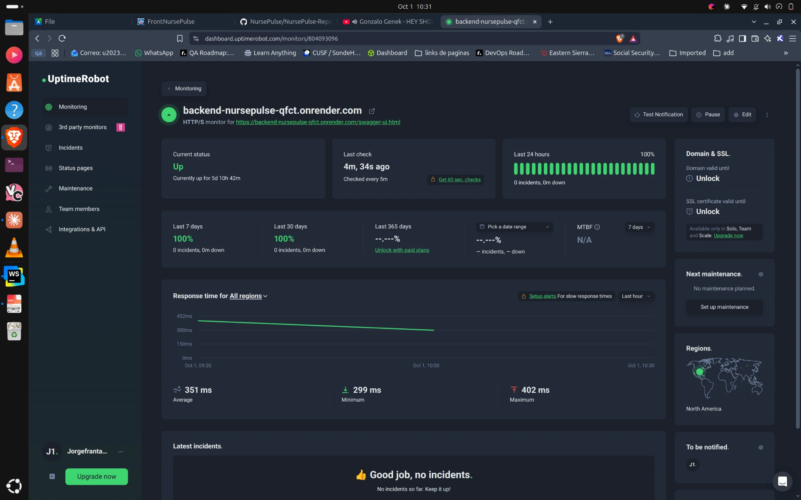
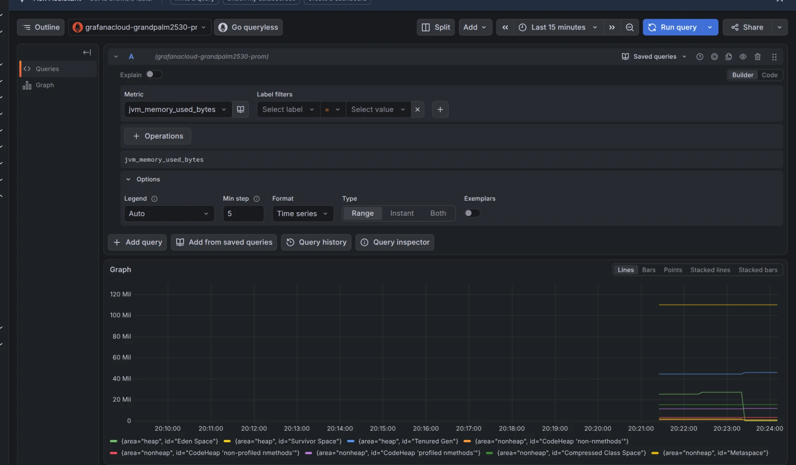
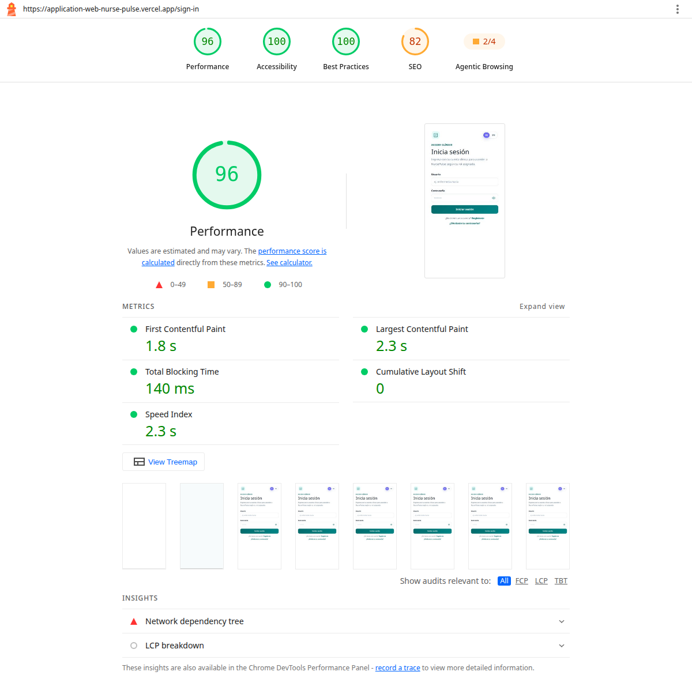

# Capítulo VII: DevOps Practices

## 7.1. Continuous Integration

### 7.1.1. Tools and Practices.

El equipo utiliza un conjunto de herramientas de pruebas automatizadas para asegurar que cada cambio de código mantenga la calidad y el comportamiento esperado antes de integrarse a las ramas principales de cada repositorio (Backend, Frontend y Mobile).

| Herramienta | Tipo | Descripción | Propósito |
| :--- | :--- | :--- | :--- |
| **JUnit 5** | Framework de pruebas unitarias (TDD) | Incluido mediante `spring-boot-starter-test`, se usa para probar entidades de dominio, servicios de aplicación y recursos REST del backend (Spring Boot). | Verificar que las unidades de lógica de negocio (agregados, command services, validaciones) se comporten como se espera. |
| **Mockito** | Herramienta de simulaciones (TDD) | Se usa en pruebas como `UserCommandServiceImplTest` y `AuditLogsControllerTest` para simular repositorios y servicios colaboradores sin depender de la base de datos real. | Aislar la unidad bajo prueba de sus dependencias externas. |
| **Vitest** | Framework de pruebas unitarias (Frontend) | Ejecutado mediante el builder `@angular/build:unit-test` de Angular, corre las pruebas de componentes, stores y assemblers del Frontend Web Application. | Validar la lógica de los componentes standalone, signals y stores de Angular antes de integrarlos. |
| **ESLint** (`angular-eslint`) | Análisis estático (Frontend) | Se ejecuta con `npm run lint` dentro del pipeline del Frontend; revisa el código TypeScript y las plantillas de Angular. | Detectar problemas de calidad y malas prácticas sin ejecutar el código. Corre en modo informativo (`continue-on-error`), por lo que sus hallazgos no bloquean el pipeline. |
| **Lighthouse** | Auditoría de calidad web (Frontend) | Se ejecuta con `npx lighthouse` en el pipeline del Frontend contra la página de inicio de sesión desplegada en Vercel y genera un reporte JSON y HTML. | Medir rendimiento, accesibilidad, buenas prácticas y SEO de la aplicación en producción. Es informativo y no bloquea el pipeline. |
| **GitHub Actions** | Orquestador de CI/CD | Ejecuta automáticamente los pipelines de build y pruebas en cada repositorio (Backend, Frontend, Mobile) ante cada `push`/`pull request`. | Automatizar la integración continua sin depender de ejecución manual. |

**Prácticas:**

- **Feature Branching**: cada funcionalidad se desarrolla en una rama `feature/*` independiente (ver convención de ramas en el Capítulo V, sección 5.1.2), y se integra a la rama principal mediante Pull Request.
- **Conventional Commits**: todos los commits siguen el estándar `tipo(scope): descripción` (`feat`, `fix`, `docs`, `test`, `ci`, etc.), lo que permite identificar rápidamente el propósito de cada cambio dentro del pipeline.
- **Build obligatorio antes de integrar**: ningún Pull Request se fusiona a `main` sin que el pipeline de CI correspondiente haya finalizado en estado exitoso.

### 7.1.2. Build & Test Suite Pipeline Components.

Cada uno de los tres repositorios de código de NursePulse cuenta con su propio workflow de GitHub Actions, disparado en cada `push` y `pull request` hacia su rama principal:

**Backend CI** (`Backend-NursePulse/.github/workflows/ci.yml`)

| Paso | Herramienta | Descripción |
| :--- | :--- | :--- |
| Checkout | `actions/checkout@v4` | Descarga el código fuente del repositorio. |
| Set up JDK | `actions/setup-java@v4` (Temurin 26) | Configura el entorno de ejecución de Java, con caché de dependencias Maven. |
| Build and run tests | `./mvnw -B clean verify` | Compila el proyecto y ejecuta la suite completa de pruebas unitarias e de integración (actualmente 61 pruebas, ver Capítulo VI sección 6.1). |

**Frontend CI** (`Application-Web-Nurse-Pulse/.github/workflows/ci.yml`)

| Paso | Herramienta | Descripción |
| :--- | :--- | :--- |
| Checkout | `actions/checkout@v4` | Descarga el código fuente del repositorio. |
| Set up Node | `actions/setup-node@v4` (Node 22.x) | Configura el entorno de ejecución de Node.js, con caché de dependencias npm. |
| Install dependencies | `npm ci` | Instala las dependencias de forma reproducible según `package-lock.json`. |
| Lint | `npm run lint` (ESLint) | Análisis estático del código. Tiene `continue-on-error: true`: informa hallazgos pero no detiene el pipeline. |
| Run unit tests | `npm test` (Vitest) | Ejecuta las pruebas unitarias de componentes, stores y servicios de Angular. |
| Build | `npm run build` (`ng build`) | Genera el build de producción, validando que no existan errores de compilación de TypeScript/Angular. |
| Lighthouse audit | `npx lighthouse` | Audita la página `/sign-in` desplegada en Vercel y genera un reporte JSON y HTML. Tiene `continue-on-error: true`. |
| Upload Lighthouse report | `actions/upload-artifact@v4` | Publica el reporte como artifact `lighthouse-report` del run, descargable desde la pestaña Actions de GitHub. |

**Mobile CI/CD** (`MultiPlatform-App-NursePulse/.github/workflows/ci.yml`)

| Paso | Herramienta | Descripción |
| :--- | :--- | :--- |
| Checkout | `actions/checkout@v4` | Descarga el código fuente del repositorio. |
| Set up Flutter | `subosito/flutter-action@v2` (canal stable) | Configura el SDK de Flutter/Dart. |
| Install dependencies | `flutter pub get` | Resuelve las dependencias del proyecto móvil. |
| Build release APK | `flutter build apk --release` | Compila el APK de producción, apuntando a la URL pública del backend mediante `--dart-define`. |

En los tres casos, un fallo en cualquiera de los pasos obligatorios (instalación, pruebas y build) detiene el pipeline e impide que el código avance hacia las siguientes etapas (Delivery/Deployment), evitando que código roto llegue a producción. Las únicas excepciones son los pasos informativos del Frontend (Lint y Lighthouse), que reportan resultados sin bloquear el flujo.

## 7.2. Continuous Delivery

En el estado actual del proyecto, NursePulse no cuenta con un entorno de *staging* independiente ni con un paso de aprobación manual explícito entre la integración continua y el despliegue a producción: una vez que el pipeline de CI finaliza exitosamente sobre la rama principal, el mismo pipeline continúa automáticamente hacia Continuous Deployment (sección 7.3). Por este motivo, la "entrega continua" del proyecto se sostiene principalmente en la revisión de código vía Pull Request, que actúa como el equivalente a la aprobación manual previa a la integración.

### 7.2.1. Tools and Practices.

**Tools:**

- **GitHub** (Pull Requests): cada cambio propuesto a `main` (o a `deploy/render-docker` en el caso del backend) pasa por un Pull Request, donde el pipeline de CI debe finalizar en verde antes de que un integrante del equipo pueda aprobarlo y fusionarlo.
- **GitHub Actions**: el mismo motor de CI (sección 7.1.2) sirve como validador de que el código está en un estado "desplegable" en todo momento.

**Practices (Prácticas):**

- **Feature Branching y Pull Requests**: las nuevas funcionalidades se desarrollan en ramas separadas y se integran a la rama principal únicamente a través de un Pull Request, que documenta el cambio y deja trazabilidad de quién lo revisó.
- **Revisión por pares (Code Review)**: actúa como la "aprobación manual" del proyecto — un integrante distinto al autor revisa el Pull Request antes de fusionarlo, cumpliendo un rol equivalente al de aprobación de despliegue descrito en otros proyectos con entornos de staging formales.
- **Build verde obligatorio**: un Pull Request con el pipeline de CI en estado fallido no puede fusionarse a la rama principal.

> **Nota:** a diferencia de un esquema clásico de Continuous Delivery con *staging* y aprobación manual del despliegue, en NursePulse el paso de "listo para desplegar" y el despliegue mismo ocurren en el mismo pipeline (ver sección 7.3). Introducir un entorno de staging y un paso de aprobación manual explícito queda identificado como una mejora pendiente del proyecto.

### 7.2.2. Stages Deployment Pipeline Components.

- **Apertura del Pull Request**: un desarrollador abre un PR desde su rama `feature/*` hacia la rama principal del repositorio correspondiente.
- **Integración Continua (CI)**: se ejecuta automáticamente el pipeline de build y pruebas (sección 7.1.2) sobre el código del PR.
- **Revisión del equipo**: un integrante distinto revisa los cambios, verificando que el CI haya finalizado correctamente.
- **Fusión a la rama principal**: una vez aprobado, el PR se fusiona a `main` (Frontend, Mobile, Landing) o a `deploy/render-docker` (Backend).
- **Disparo automático del despliegue**: la fusión a la rama principal dispara automáticamente el pipeline de Continuous Deployment (sección 7.3), sin pasos manuales adicionales.

## 7.3. Continuous Deployment

El objetivo de Continuous Deployment en NursePulse es que cada cambio fusionado a la rama principal de cada repositorio llegue automáticamente a producción, sin intervención manual, siempre que el pipeline de CI haya finalizado exitosamente.

### 7.3.1. Tools and Practices.

**Tools (Herramientas):**

- **GitHub Actions**: automatiza los pipelines de CI/CD de los cuatro componentes del sistema (Backend, Frontend, Mobile, Landing Page).
- **Docker**: conteneriza el backend (Spring Boot) mediante un `Dockerfile` multi-stage (`build` con Maven + `runtime` con JRE), asegurando que el entorno de ejecución en producción sea idéntico al validado en CI.
- **Render**: plataforma PaaS que aloja el contenedor Docker del backend y lo redespliega automáticamente ante cada push a la rama `deploy/render-docker`.
- **Vercel**: plataforma utilizada para el despliegue automático del Frontend Web Application (Angular), redesplegando ante cada push a `main`.
- **GitHub Pages**: aloja la Landing Page, redesplegando automáticamente el contenido estático ante cada push a `main`.
- **Firebase App Distribution + GitHub Releases**: distribuyen la aplicación móvil (APK) — Firebase a un grupo cerrado de *testers*, y GitHub Releases como fuente pública y estable para el botón de descarga de la Landing Page.
- **Aiven (MySQL administrado)**: base de datos relacional en la nube; el esquema se actualiza automáticamente por Hibernate (`spring.jpa.hibernate.ddl-auto=update`) cuando el backend arranca con un modelo de datos nuevo, sin un paso de migración manual separado.

**Commit-based deployment:**

- Cada push a la rama principal de un repositorio dispara automáticamente su respectivo pipeline de despliegue — no existe un botón de "deploy" manual en ninguno de los cuatro componentes.
- **Rollback**: actualmente el rollback no es automático; ante un despliegue defectuoso, el equipo revierte el cambio mediante un nuevo commit (`git revert`) que dispara un nuevo despliegue automático con la versión anterior del código. No existe todavía un mecanismo de rollback automático ante fallos detectados en producción — se identifica como mejora pendiente.

### 7.3.2. Production Deployment Pipeline Components.

**Componentes del Pipeline del Backend (Render):**

1. **Integración continua**: al hacer push a `deploy/render-docker`, el workflow `Backend CI` compila y ejecuta las pruebas (`mvn clean verify`).
2. **Construcción de la imagen Docker**: Render toma el `Dockerfile` del repositorio y construye la imagen en dos etapas (build con Maven, runtime con JRE únicamente), minimizando el tamaño final de la imagen.
3. **Despliegue**: Render reemplaza el contenedor en ejecución por la nueva imagen, exponiendo el servicio en `https://backend-nursepulse-qfct.onrender.com`.
4. **Verificación de salud**: el endpoint `/actuator/health` (Spring Boot Actuator) permite confirmar que el servicio quedó arriba tras el despliegue (ver sección 7.4).

**Componentes del Pipeline de la Base de Datos (Aiven MySQL):**

1. **Actualización de esquema automática**: al desplegarse una nueva versión del backend con cambios en las entidades JPA, Hibernate aplica automáticamente los cambios de esquema (`ddl-auto=update`) contra la base de datos en Aiven al arrancar la aplicación.
2. **Conexión segura**: la conexión se establece mediante SSL (`--ssl-mode=REQUIRED`), con las credenciales inyectadas como variables de entorno en Render.

**Componentes del Pipeline del Frontend (Vercel):**

1. **Compilación**: al detectar un nuevo push a `main`, Vercel ejecuta `ng build` sobre el proyecto Angular en modo producción.
2. **Ejecución de pruebas**: el workflow `Frontend CI` de GitHub Actions ya validó las pruebas unitarias (Vitest) antes de que el cambio llegara a `main`.
3. **Despliegue en Vercel**: si el build es exitoso, Vercel publica automáticamente la nueva versión en `https://application-web-nurse-pulse.vercel.app`, distribuida mediante su CDN global.

**Componentes del Pipeline de la Landing Page (GitHub Pages):**

1. **Push a `main`**: cualquier cambio en el repositorio `Landing-NursePulse` dispara el build nativo de GitHub Pages (sitio estático HTML/CSS/JS, sin paso de compilación adicional).
2. **Publicación**: GitHub Pages republica automáticamente el contenido en `https://nursepulse.github.io/Landing-NursePulse/`.

**Componentes del Pipeline Móvil (GitHub Actions + Firebase + GitHub Releases):**

1. **Build del APK**: el workflow `Mobile CI/CD` compila el APK de release con Flutter.
2. **Distribución a testers**: el APK se sube a Firebase App Distribution, notificando al grupo `testers`.
3. **Publicación de versión pública**: el mismo workflow crea una GitHub Release (`softprops/action-gh-release`) con el APK como asset, marcada como `latest`.
4. **Descarga desde la Landing Page**: el botón de descarga de la Landing Page apunta a la URL estable `.../releases/latest/download/app-release.apk`, que siempre resuelve a la versión más reciente sin necesidad de actualizar el enlace manualmente.

## 7.4. Continuous monitoring

### 7.4.1. Tools and Practices

El monitoreo continuo de NursePulse combina tres capas complementarias: un *ping* interno programado (keep-alive), un monitor externo de disponibilidad independiente de la plataforma de hosting, y la telemetría de métricas del backend enviada a Grafana Cloud. Además, una auditoría de Lighthouse sobre el frontend desplegado mide su calidad web en cada ejecución del CI.

- **Spring Boot Actuator**: expone el endpoint `/actuator/health`, utilizado tanto manualmente (verificación post-despliegue) como automáticamente (ver siguiente punto) para confirmar que el backend y su conexión a base de datos están operativos.
- **GitHub Actions (workflow programado)**: el workflow `keep-alive.yml` del repositorio Backend se ejecuta automáticamente cada 6 horas (`cron: '0 */6 * * *'`) y hace una petición HTTP al endpoint de salud del backend en producción.
- **UptimeRobot**: monitor externo (SaaS) configurado directamente desde su propio dashboard sobre `https://backend-nursepulse-qfct.onrender.com/swagger-ui.html`, con chequeos cada 5 minutos desde fuera de la infraestructura de Render. **No requiere ningún cambio de código ni credenciales en el proyecto** — a diferencia del Actuator o del workflow `keep-alive.yml`, que sí forman parte del repositorio, UptimeRobot es configuración externa: solo se le indica la URL a vigilar y la frecuencia, y notifica al equipo por correo ante cualquier caída detectada.

- **Grafana Cloud (métricas del backend)**: el backend envía sus métricas de ejecución a una cuenta gratuita de Grafana Cloud mediante el protocolo OpenTelemetry (OTLP). A diferencia de UptimeRobot, que solo informa si el servicio responde o no, Grafana permite observar su comportamiento interno: uso de memoria de la JVM por área (*heap* y *non-heap*), solicitudes HTTP atendidas, tiempo de actividad del proceso, entre otras. La integración sí forma parte del repositorio Backend:
  - **Código**: la dependencia `micrometer-registry-otlp` y el módulo `spring-boot-starter-opentelemetry` en el `pom.xml`, junto con tres propiedades de `application-prod.properties` (`management.otlp.metrics.export.url`, `...headers.Authorization` y `...step=1m`). No se escribió ninguna clase adicional.
  - **Credenciales**: el endpoint y el encabezado de autenticación se leen de las variables de entorno `GRAFANA_OTLP_ENDPOINT` y `GRAFANA_OTLP_AUTH_HEADER`, configuradas en el panel de Render y nunca versionadas en el repositorio.
  - **Modelo de envío (*push*)**: es el propio backend quien envía las métricas cada minuto. Se descartó el modelo *pull* (que Grafana consulte un endpoint `/actuator/prometheus`) porque exigiría mantener un agente recolector (Grafana Alloy) ejecutándose de forma permanente en algún servidor, que el proyecto no tiene.

- **Lighthouse (calidad web del frontend)**: el pipeline `Frontend CI` ejecuta una auditoría de Lighthouse sobre la página de inicio de sesión desplegada en Vercel (`/sign-in`) y publica el reporte como artifact de GitHub Actions. La medición realizada el 3 de octubre de 2026 arrojó:

| Categoría | Puntaje |
| :--- | :---: |
| Rendimiento (*Performance*) | 96 |
| Accesibilidad (*Accessibility*) | 100 |
| Buenas prácticas (*Best Practices*) | 100 |
| SEO | 82 |

  Las métricas de carga que sustentan el puntaje de rendimiento fueron: *First Contentful Paint* 1,8 s, *Largest Contentful Paint* 2,3 s, *Total Blocking Time* 140 ms, *Cumulative Layout Shift* 0 y *Speed Index* 2,3 s. El puntaje de SEO es el más bajo de las cuatro categorías y queda identificado como oportunidad de mejora. La auditoría cubre únicamente la pantalla de inicio de sesión, que es la única accesible sin autenticar; las vistas internas no se auditan.

### 7.4.2. Monitoring Pipeline Components

El pipeline de monitoreo actual consiste en tres flujos independientes:

**Flujo 1: ping programado (keep-alive)**

1. **Disparo programado**: GitHub Actions ejecuta el workflow `Keep-alive (Render + Aiven MySQL)` cada 6 horas, o manualmente mediante `workflow_dispatch`.
2. **Ping de salud**: el workflow ejecuta `curl` contra `https://backend-nursepulse-qfct.onrender.com/actuator/health`.
3. **Efecto doble**: la petición cumple dos propósitos — (a) verificar que el servicio responde, y (b) evitar que el backend (en el plan gratuito de Render) entre en estado inactivo por falta de tráfico, y que la conexión a la base de datos en Aiven se mantenga activa.

**Flujo 2: telemetría de métricas (Grafana Cloud)**

1. **Recolección**: Micrometer, integrado en Spring Boot Actuator, registra de forma continua las métricas de la JVM y de las solicitudes HTTP del backend en ejecución en Render.
2. **Envío**: cada minuto, el registro OTLP de Micrometer envía las métricas por HTTPS al *gateway* OTLP de Grafana Cloud, autenticándose con el encabezado leído de la variable de entorno.
3. **Consulta**: las métricas quedan disponibles para consulta y graficación en Grafana (sección *Explore*), con una retención definida por el plan gratuito.

**Flujo 3: auditoría de calidad web (Lighthouse)**

1. **Disparo**: se ejecuta en cada `push` o `pull request` hacia `main` del repositorio Frontend, después del build.
2. **Auditoría**: Lighthouse analiza la versión desplegada en Vercel de la página `/sign-in`.
3. **Publicación**: el reporte JSON y HTML se sube como artifact `lighthouse-report` del run de GitHub Actions. Como el paso tiene `continue-on-error`, un puntaje bajo no detiene el pipeline.

### 7.4.3. Alerting Pipeline Components

NursePulse recibe métricas de ejecución del backend en Grafana Cloud (sección 7.4.1), pero todavía no tiene reglas de alerta configuradas sobre ellas. Las alertas actuales combinan las notificaciones nativas de cada plataforma del pipeline con un monitor externo de disponibilidad (UptimeRobot, sección 7.4.1):

**Alertas configuradas:**

- **UptimeRobot** notifica por correo al equipo ante cualquier caída detectada en los chequeos cada 5 minutos sobre el backend — es la única alerta de disponibilidad verificada *desde fuera* de la infraestructura de hosting (ver evidencia en 7.4.1).
- Fallo del workflow `Backend CI`, `Frontend CI` o `Mobile CI/CD` ante un error de compilación o una prueba rota (GitHub Actions → correo al autor del commit/PR).
- Fallo del workflow programado `keep-alive.yml` cuando el backend no responde en Render (GitHub Actions → correo a los mantenedores del repositorio).
- Fallo de build o de despliegue del Frontend Web Application en Vercel (notificación nativa de Vercel por correo al equipo del proyecto).
- Fallo de build de la imagen Docker o caída del servicio del backend en Render (notificación nativa de Render por correo al dueño del servicio).
- Fallo en la distribución del APK a través de Firebase App Distribution, si el build sube correctamente pero la subida al grupo de *testers* falla.

**Lo que todavía no existe:**

- Umbrales de rendimiento (latencia, uso de memoria) que generen una alerta automática — UptimeRobot detecta caídas totales del servicio, pero no degradaciones graduales de performance. Las métricas necesarias ya llegan a Grafana, por lo que falta únicamente definir las reglas de alerta.
- Un canal de alertas centralizado para el equipo (Slack, Microsoft Teams); cada integrante depende del correo asociado a su propia cuenta de GitHub/Render/Vercel/UptimeRobot.

> Definir reglas de alerta en Grafana (por ejemplo, sobre uso de memoria de la JVM o tiempo de respuesta HTTP) para detectar degradaciones de rendimiento antes de que se conviertan en una caída total queda identificado como la mejora pendiente más inmediata, ya que la recolección de métricas está operativa.

### 7.4.4. Notification Pipeline Components

De forma análoga a la sección anterior, las notificaciones del proyecto se apoyan en las capacidades nativas de GitHub:

- **Notificaciones de CI/CD**: GitHub notifica automáticamente al autor de un commit o Pull Request cuando un workflow (`Backend CI`, `Frontend CI`, `Mobile CI/CD`) falla, mostrando el detalle del paso que causó el error directamente en la interfaz de GitHub.
- **Notificaciones de monitoreo**: como se describió en 7.4.3, una falla del workflow `keep-alive.yml` genera una notificación automática por correo a los mantenedores del repositorio.

No se utiliza actualmente una herramienta de notificación centralizada (como Slack o Microsoft Teams) para el equipo; las notificaciones dependen del correo asociado a cada cuenta de GitHub de los integrantes.
