<p align="center">
  
</p>

<div align="center">

<p><strong>Universidad Peruana de Ciencias Aplicadas</strong></p>
<p><strong>Carrera de Ingeniería de Software</strong></p>
<p><strong><big>1ASI0732</big></strong></p>
<p><strong><big>Diseño de Experimentos de Ingeniería de Software</big></strong></p>

<p><strong>NRC</strong></p>
<p><strong><big>9095</big></strong></p>

<p><strong><big>Informe del Trabajo Final</big></strong></p>

<p><strong>Docente</strong></p>
<p><strong><big>Julio Manuel Noriega Melendez</big></strong></p>

<p><strong>Startup</strong></p>
<p><strong><big>Nurse Pulse</big></strong></p>

<p><strong>Producto</strong></p>
<p><strong><big>Nurse Pulse</big></strong></p>

<p><strong>Integrantes</strong></p>

| Código UPC   | Apellidos y nombres             |
|--------------|---------------------------------|
| u202414510   | Mansilla Rivero, Carlos Marcelo |
| u202313458   | Taipe Sangama, Jorge Francisco   |
| u202216163   | Paredes Davila, Jose Adrian     |
| u20211A574   | Navarro Flores, Renzo Jesus     |
| u20221c275   | Luque Minaya, Renzo Andres      |

<p><strong>Periodo 202620</strong></p>
<p><strong>Septiembre de 2026</strong></p>

</div>

<div style="page-break-before: always;"></div>

## Registro de Versiones del Informe

<table>
  <thead>
    <tr>
      <th>Versión</th>
      <th>Fecha</th>
      <th>Autor</th>
      <th>Descripción</th>
    </tr>
  </thead>
  <tbody>
    <tr>
      <td rowspan="5" style="text-align: center; vertical-align: middle;"><b>AV1</b></td>
      <td>14/09/2026</td>
      <td>Mansilla Rivero, Carlos Marcelo</td>
      <td>Encargado de la validacion y realizacion del capitulo I , asi como los segmentos objetivos, tambien encargado del despliguede la aplicacion movil perimera version</td>
    </tr>
    <tr>
      <td>14/09/2026</td>
      <td>Taipe Sangama, Jorge Francisco</td>
      <td>Corrección de paridad funcional en Flutter respecto a Angular: gestión completa de pacientes (editar, dar de alta, eliminar, búsqueda), cálculo correcto de riesgo clínico en signos vitales, registro de alertas manuales, validación de política de contraseñas en el registro, y unificación de la paleta de colores con la aplicación web. </td>
    </tr>
    <tr>
      <td>14/09/2026</td>
      <td>Paredes Davila, Jose Adrian</td>
      <td>Elaboración del Capítulo II (investigación de usuarios, entrevistas, segmentos y validación) y del Capítulo V. Encargado del despliegue de la aplicación web en Render.</td>
    </tr>
    <tr>
      <td>14/09/2026</td>
      <td>Navarro Flores, Renzo Jesus</td>
      <td>Elaboración del Capítulo III (Impact Mapping, Product Backlog y User Stories). Encargado de la validación funcional de todo el software: pruebas end-to-end sobre backend, aplicación web y aplicación móvil.</td>
    </tr>
    <tr>
      <td>13/09/2026</td>
      <td>Luque Minaya, Renzo Andrés</td>
      <td>Actualización de la documentación de NursePulse: incorporación del índice de los capítulos I–IV, Registro de Versiones, Project Report Collaboration Insights y estructura del Student Outcome.</td>
    </tr>
    <tr>
      <td rowspan="5" style="text-align: center; vertical-align: middle;"><b>TB1</b></td>
      <td></td>
      <td>Mansilla Rivero, Carlos Marcelo</td>
      <td></td>
    </tr>
    <tr>
      <td></td>
      <td>Taipe Sangama, Jorge Francisco</td>
      <td></td>
    </tr>
    <tr>
      <td></td>
      <td>Paredes Davila, Jose Adrian</td>
      <td></td>
    </tr>
    <tr>
      <td></td>
      <td>Navarro Flores, Renzo Jesus</td>
      <td></td>
    </tr>
    <tr>
      <td></td>
      <td>Luque Minaya, Renzo Andrés</td>
      <td></td>
    </tr>
    <tr>
      <td rowspan="5" style="text-align: center; vertical-align: middle;"><b>AV2</b></td>
      <td></td>
      <td>Mansilla Rivero, Carlos Marcelo</td>
      <td></td>
    </tr>
    <tr>
      <td></td>
      <td>Taipe Sangama, Jorge Francisco</td>
      <td></td>
    </tr>
    <tr>
      <td></td>
      <td>Paredes Davila, Jose Adrian</td>
      <td></td>
    </tr>
    <tr>
      <td></td>
      <td>Navarro Flores, Renzo Jesus</td>
      <td></td>
    </tr>
    <tr>
      <td></td>
      <td>Luque Minaya, Renzo Andrés</td>
      <td></td>
    </tr>
    <tr>
      <td rowspan="5" style="text-align: center; vertical-align: middle;"><b>TB2</b></td>
      <td></td>
      <td>Mansilla Rivero, Carlos Marcelo</td>
      <td></td>
    </tr>
    <tr>
      <td></td>
      <td>Taipe Sangama, Jorge Francisco</td>
      <td></td>
    </tr>
    <tr>
      <td></td>
      <td>Paredes Davila, Jose Adrian</td>
      <td></td>
    </tr>
    <tr>
      <td></td>
      <td>Navarro Flores, Renzo Jesus</td>
      <td></td>
    </tr>
    <tr>
      <td></td>
      <td>Luque Minaya, Renzo Andrés</td>
      <td></td>
    </tr>
  </tbody>
</table>


## Project Report Collaboration Insights

**URL del repositorio del informe:** https://github.com/NursePulse/NursePulse-Report

### AV1

**Descripción de la colaboración en la elaboración del informe:**

Durante el Avance 1, el equipo de NursePulse organizó la elaboración del informe mediante la asignación de tareas a cada integrante, distribuidas por capítulos y apartados. Se coordinaron los avances, se identificaron contenidos pendientes y se acordaron ajustes en las entrevistas, el Product Backlog, el Impact Mapping y los flujos de usuario. Asimismo, se asignó la preparación de la carátula, el índice y la estructura del Student Outcome en el documento Markdown. Esta distribución de responsabilidades facilitó el seguimiento de las tareas y la integración de los aportes del equipo para la entrega.
<div style="page-break-before: always;"></div>

## Contenido

- [Registro de Versiones del Informe](#registro-de-versiones-del-informe)
- [Project Report Collaboration Insights](#project-report-collaboration-insights)
- [Contenido](#contenido)
- [Student Outcome](#student-outcome)
- [Part I: As-Is Software Project](#part-i-as-is-software-project)
- [Capítulo I: Introducción](#capítulo-i-introducción)
  - [1.1. Startup Profile](#11-startup-profile)
    - [1.1.1. Descripción de la Startup](#111-descripción-de-la-startup)
    - [1.1.2. Perfiles de integrantes del equipo](#112-perfiles-de-integrantes-del-equipo)
  - [1.2. Solution Profile](#12-solution-profile)
    - [1.2.1. Antecedentes y problemática](#121-antecedentes-y-problemática)
    - [1.2.2. Lean UX Process](#122-lean-ux-process)
      - [1.2.2.1. Lean UX Problem Statements](#1221-lean-ux-problem-statements)
      - [1.2.2.2. Lean UX Assumptions](#1222-lean-ux-assumptions)
      - [1.2.2.3. Lean UX Hypothesis Statements](#1223-lean-ux-hypothesis-statements)
      - [1.2.2.4. Lean UX Canvas](#1224-lean-ux-canvas)
  - [1.3. Segmentos objetivo](#13-segmentos-objetivo)
- [Capítulo II: Requirements Elicitation & Analysis](#capítulo-ii-requirements-elicitation--analysis)
  - [2.1. Competidores](#21-competidores)
    - [2.1.1. Análisis competitivo](#211-análisis-competitivo)
    - [2.1.2. Estrategias y tácticas frente a competidores](#212-estrategias-y-tácticas-frente-a-competidores)
  - [2.2. Entrevistas](#22-entrevistas)
    - [2.2.1. Diseño de entrevistas](#221-diseño-de-entrevistas)
    - [2.2.2. Registro de entrevistas](#222-registro-de-entrevistas)
    - [2.2.3. Análisis de entrevistas](#223-análisis-de-entrevistas)
  - [2.3. Needfinding](#23-needfinding)
    - [2.3.1. User Personas](#231-user-personas)
    - [2.3.2. User Task Matrix](#232-user-task-matrix)
    - [2.3.3. User Journey Mapping](#233-user-journey-mapping)
    - [2.3.4. Empathy Mapping](#234-empathy-mapping)
    - [2.3.5. As-Is Scenario Mapping](#235-as-is-scenario-mapping)
  - [2.4. Ubiquitous Language](#24-ubiquitous-language)
- [Capítulo III: Requirements Specification](#capítulo-iii-requirements-specification)
  - [3.1 To-Be Scenario Mapping](#31-to-be-scenario-mapping)
  - [3.2. User Stories](#32-user-stories)
  - [3.3. Product Backlog](#33-product-backlog)
  - [3.4. Impact Mapping](#34-impact-mapping)
- [Capítulo IV: Product Design](#capítulo-iv-product-design)
  - [4.1. Style Guidelines](#41-style-guidelines)
    - [4.1.1. General Style Guidelines](#411-general-style-guidelines)
    - [4.1.2. Web Style Guidelines](#412-web-style-guidelines)
    - [4.1.3. Mobile Style Guidelines](#413-mobile-style-guidelines)
      - [4.1.3.1 IOS Mobile Style Guidelines](#4131-ios-mobile-style-guidelines)
      - [4.1.3.2 Android Mobile Style Guidelines](#4132-android-mobile-style-guidelines)
  - [4.2. Information Architecture](#42-information-architecture)
    - [4.2.1. Organization Systems](#421-organization-systems)
    - [4.2.2. Labeling Systems](#422-labeling-systems)
    - [4.2.3. SEO Tags and Meta Tags](#423-seo-tags-and-meta-tags)
    - [4.2.4. Searching Systems.](#424-searching-systems)
    - [4.2.5. Navigation Systems.](#425-navigation-systems)
  - [4.3. Landing Page UI Design.](#43-landing-page-ui-design)
    - [4.3.1. Landing Page Wireframe.](#431-landing-page-wireframe)
    - [4.3.2. Landing Page Mock-up](#432-landing-page-mock-up)
  - [4.4. Mobile Application UX/UI Design](#44-mobile-application-uxui-design)
    - [4.4.1. Mobile Applications Wireframes](#441-mobile-applications-wireframes)
    - [4.4.2. Mobile Applications Wireflow Diagrams](#442-mobile-applications-wireflow-diagrams)
    - [4.4.3. Mobile Applications Mock-ups](#443-mobile-applications-mock-ups)
    - [4.4.4. Mobile Applications User Flow Diagrams](#444-mobile-applications-user-flow-diagrams)
  - [4.5. Mobile Applications Prototyping](#45-mobile-applications-prototyping)
    - [4.5.1. Android Mobile Applications Prototyping](#451-android-mobile-applications-prototyping)
    - [4.5.2. iOS Mobile Applications Prototyping](#452-ios-mobile-applications-prototyping)
  - [4.6. Web Applications UX/UI Design](#46-web-applications-uxui-design)
    - [4.6.1. Web Applications Wireframes](#461-web-applications-wireframes)
    - [4.6.2. Web Applications Wireflow Diagrams](#462-web-applications-wireflow-diagrams)
    - [4.6.3. Web Applications Mock-ups](#463-web-applications-mock-ups)
    - [4.6.4. Web Applications User Flow Diagrams](#464-web-applications-user-flow-diagrams)
  - [4.7. Web Applications Prototyping.](#47-web-applications-prototyping)
  - [4.8. Domain-Driven Software Architecture](#48-domain-driven-software-architecture)
    - [4.8.1. Software Architecture Context Diagram](#481-software-architecture-context-diagram)
    - [4.8.2. Software Architecture Container Diagrams](#482-software-architecture-container-diagrams)
    - [4.8.3. Software Architecture Components Diagrams](#483-software-architecture-components-diagrams)
  - [4.9. Software Object-Oriented Design](#49-software-object-oriented-design)
    - [4.9.1. Class Diagrams.](#491-class-diagrams)
    - [4.9.2. Class Dictionary](#492-class-dictionary)
  - [4.10. Database Design.](#410-database-design)
    - [4.10.1. Relational/Non-Relational Database Diagram.](#4101-relationalnon-relational-database-diagram)
- [Capítulo V: Product Implementation, Validation & Deployment](#capítulo-v-product-implementation-validation--deployment)
  - [5.1. Software Configuration Management.](#51-software-configuration-management)
    - [5.1.1. Software Development Environment Configuration.](#511-software-development-environment-configuration)
    - [5.1.2. Source Code Management](#512-source-code-management)
    - [5.1.3. Source Code Style Guide & Conventions](#513-source-code-style-guide--conventions)
    - [5.1.4. Software Deployment Configuration](#514-software-deployment-configuration)
  - [5.2. Landing Page, Services & Applications Implementation.](#52-landing-page-services--applications-implementation)
    - [5.2.1 Sprint 1](#521-sprint-1)
      - [5.2.1.1. Sprint Planning 1](#5211-sprint-planning-1)
      - [5.2.1.2. Aspect Leaders and Collaborators](#5212-aspect-leaders-and-collaborators)
      - [5.2.1.3. Sprint Backlog 1](#5213-sprint-backlog-1)
      - [5.2.1.4. Development Evidence for Sprint Review.](#5214-development-evidence-for-sprint-review)
      - [5.2.1.5. Execution Evidence for Sprint Review](#5215-execution-evidence-for-sprint-review)
      - [5.2.1.6. Services Documentation Evidence for Sprint Review.](#5216-services-documentation-evidence-for-sprint-review)
      - [5.2.1.7. Software Deployment Evidence for Sprint Review.](#5217-software-deployment-evidence-for-sprint-review)
      - [5.2.1.8. Team Collaboration Insights during Sprint.](#5218-team-collaboration-insights-during-sprint)
  - [5.3. Validation Interviews](#53-validation-interviews)
    - [5.3.1. Diseño de Entrevistas](#531-diseño-de-entrevistas)
    - [5.3.2. Registro de Entrevistas](#532-registro-de-entrevistas)
    - [5.3.3. Evaluaciones según heurísticas](#533-evaluaciones-según-heurísticas)
  - [5.4. Video About-the-Product](#54-video-about-the-product)
  - [Conclusiones](#conclusiones)
  - [Bibliografía](#bibliografía)
  - [Anexos](#anexos)

    <div style="page-break-before: always;"></div>

## Student Outcome

El curso contribuye al cumplimiento del Student Outcome ABET:

**ABET – EAC - Student Outcome 4**

**Criterio:** La capacidad de reconocer responsabilidades éticas y profesionales en situaciones de ingeniería y hacer juicios informados, que deben considerar el impacto de las soluciones de ingeniería en contextos globales, económicos, ambientales y sociales.

En el siguiente cuadro se describe las acciones realizadas y enunciados de conclusiones por parte del grupo, que permiten sustentar el haber alcanzado el logro del ABET – EAC - Student Outcome 4.

| Criterio específico | Acciones realizadas | Conclusiones |
| --- | --- | --- |
| 4.c.1 Reconoce responsabilidad ética y profesional en situaciones de ingeniería de software | **Mansilla Rivero, Carlos Marcelo**<br>**AV1:** Al validar y redactar el Capítulo I, cuidé que la descripción de los segmentos objetivo y del problema que resuelve NursePulse reflejara con precisión las necesidades reales del personal de enfermería cardiovascular, evitando sobredimensionar el alcance de la solución. En el despliegue de la primera versión de la aplicación móvil, prioricé verificar que la configuración de conexión al backend y las credenciales de prueba no quedaran expuestas antes de dejarla disponible, reconociendo que un descuido en ese punto compromete la confidencialidad de información clínica simulada.<br><br>**Taipe Sangama, Jorge Francisco**<br>**AV1:** Durante la migración del módulo SBAR a campos estructurados y la revisión de paridad funcional en la aplicación móvil, encontré que el nivel de riesgo clínico de los signos vitales se mostraba siempre como "Sin evaluar", incluso en registros con valores claramente críticos, porque el backend nunca calculaba ese dato. Prioricé corregir este error antes de continuar con otras mejoras, ya que ocultar el riesgo real de un paciente en una aplicación clínica tiene consecuencias directas sobre decisiones de cuidado. También decidí no habilitar el registro de cuentas de médico en la aplicación móvil hasta implementar sus permisos reales, para evitar que el sistema mostrara acciones que luego serían rechazadas silenciosamente por el backend.<br><br>**Paredes Davila, Jose Adrian**<br>**AV1:** Al elaborar el Capítulo II, procuré representar de forma fiel lo expresado por los usuarios entrevistados, sin ajustar sus respuestas para que coincidieran con la propuesta de valor que el equipo ya tenía en mente. En el despliegue de la aplicación web en Render, asumí la responsabilidad de mantener el servicio disponible y de comunicar al equipo cualquier cambio de configuración que pudiera afectar el acceso de los demás integrantes durante las pruebas.<br><br>**Navarro Flores, Renzo Jesus**<br>**AV1:** Al redactar el Capítulo III y priorizar el Product Backlog, procuré que el orden de las historias respondiera al valor real para el usuario clínico y no únicamente a la facilidad de implementación. En la validación funcional del software, reporté los errores encontrados en backend, web y aplicación móvil tal como se presentaban, incluso cuando implicaba señalar funcionalidades que el equipo consideraba terminadas, entendiendo que ocultar fallos para acelerar la entrega compromete la calidad del producto final.<br><br>**Luque Minaya, Renzo Andres**<br>**AV1:** Contribuí a la documentación de NursePulse y al código de la landing page. Verifiqué la implementación de las historias de usuario en la aplicación web y apoyé en la corrección de errores cuando el comportamiento no correspondía con lo especificado. Estas actividades contribuyeron a la responsabilidad profesional de comprobar la coherencia entre los requisitos, la documentación y el funcionamiento del software. Asimismo, en la documentación se reconoce a PulseReport como antecedente del proyecto. | **AV1:** Como equipo, la responsabilidad ética y profesional se reflejó en mantener coherencia entre lo documentado, lo especificado por los usuarios entrevistados y lo realmente implementado en el software, priorizando corregir errores y omisiones detectados (como el cálculo de riesgo clínico o la configuración de los despliegues) antes de reportar avances como concluidos. Se evitó exponer información sensible en los entornos desplegados y se reconoció explícitamente a PulseReport como antecedente del proyecto, sustentando un desarrollo transparente y honesto frente al usuario final y al equipo docente. |
| 4.c.2 Emite juicios informados considerando el impacto de las soluciones de ingeniería de software en contextos globales, económicos, ambientales y sociales | **Mansilla Rivero, Carlos Marcelo**<br>**AV1:** Al definir los segmentos objetivo en el Capítulo I, consideré el contexto social de instituciones de salud con recursos limitados, para que la propuesta de NursePulse no asumiera una infraestructura tecnológica que estas no necesariamente tienen. En el primer despliegue de la aplicación móvil, tuve en cuenta que el personal de enfermería suele usar dispositivos compartidos o de gama media, por lo que evalué el rendimiento de la aplicación en condiciones similares a las de un entorno hospitalario real.<br><br>**Taipe Sangama, Jorge Francisco**<br>**AV1:** Al corregir el cálculo de riesgo clínico faltante en signos vitales, consideré el impacto social que tiene para el personal de enfermería confiar en una indicación visual incorrecta durante el monitoreo de pacientes cardiovasculares, un contexto donde una alerta tardía puede tener consecuencias graves. Asimismo, al preparar el despliegue del backend en un contenedor Docker para Render, evalué el uso de una imagen liviana en tiempo de ejecución (JRE en lugar de JDK completo) para reducir el consumo de recursos del servicio desplegado, considerando el costo económico del hosting como parte de una decisión técnica responsable.<br><br>**Paredes Davila, Jose Adrian**<br>**AV1:** Al desarrollar el Capítulo V y trabajar junto con el Capítulo II, tuve en cuenta el contexto económico de los clientes institucionales potenciales al describir los planes y el modelo de servicio de NursePulse, evitando plantear un costo que excluyera a instituciones de salud más pequeñas. En el despliegue de la aplicación web en Render, consideré el impacto económico de mantener el servicio activo de forma continua durante el desarrollo, optando por una configuración que equilibrara disponibilidad y costo.<br><br>**Navarro Flores, Renzo Jesus**<br>**AV1:** Al validar de forma end-to-end el backend, la aplicación web y la aplicación móvil, consideré el impacto social de que los tres entornos se comportaran de manera consistente para el mismo usuario clínico, evitando que una enfermera experimentara funcionalidades distintas según el dispositivo que use. Esta validación cruzada también tuvo un componente económico, al identificar errores antes de una eventual puesta en producción, reduciendo el costo de corregirlos una vez el sistema estuviera en uso real.<br><br>**Luque Minaya, Renzo Andres**<br>**AV1:** Al verificar las historias de usuario de la aplicación web, consideré cómo las diferencias entre los requisitos y su implementación podían afectar las tareas de los profesionales de salud. Apoyé en la identificación y corrección de errores para favorecer un funcionamiento acorde con las necesidades descritas. Esta revisión me permitió considerar el impacto social de la calidad del software en el contexto clínico de NursePulse, sin asumir que las correcciones realizadas demuestran por sí solas mejoras en la atención de pacientes. | **AV1:** Como equipo, los juicios sobre el impacto de las decisiones técnicas se orientaron a tres dimensiones: social, al cuidar que la información clínica mostrada al personal de enfermería y a los médicos fuera precisa y consistente entre plataformas; económica, al elegir configuraciones de despliegue que equilibraran disponibilidad y costo de infraestructura; y de accesibilidad, al considerar que las instituciones de salud objetivo pueden operar con recursos tecnológicos limitados. Estas consideraciones se aplicaron de forma incremental conforme el equipo detectaba brechas entre lo documentado y lo implementado. |

<div style="page-break-before: always;"></div>


# Part I: As-Is Software Project

## Capítulo I: Introducción

### 1.1. Startup Profile

#### 1.1.1. Descripción de la Startup

**Nurse Pulse** es una startup tecnológica conformada por estudiantes de la carrera de Ingeniería de Software de la Universidad Peruana de Ciencias Aplicadas. El equipo se enfoca en el desarrollo de soluciones digitales orientadas a mejorar procesos críticos dentro del sector salud, aplicando investigación con usuarios, diseño de experiencias digitales, desarrollo de aplicaciones y construcción de servicios de software.

La propuesta principal de la startup es **Nurse Pulse**, una solución digital orientada a mejorar la gestión de información clínica en entornos cardiovasculares. El producto busca apoyar a profesionales de la salud en actividades como el registro y consulta de signos vitales, documentación de eventos clínicos, comunicación durante cambios de turno y seguimiento de la evolución reciente del paciente.

Nurse Pulse surge a partir de una problemática relacionada con la dispersión de información clínica, la duplicidad de registros, la comunicación no estructurada entre profesionales y la dificultad para mantener trazabilidad sobre eventos, responsables, fechas y horarios. En escenarios cardiovasculares, donde el estado del paciente puede requerir seguimiento constante, disponer de información organizada y actualizada resulta especialmente relevante.

Frente a esta situación, Nurse Pulse propone centralizar información clínica relevante y estructurar determinados procesos utilizados por el personal de enfermería y los médicos especialistas. Entre las funcionalidades consideradas se encuentran el registro de signos vitales, los traspasos de turno mediante SBAR, el registro de eventos clínicos, la visualización de alertas, la consulta de la evolución del paciente y la trazabilidad de las acciones realizadas.

La solución no pretende reemplazar una Historia Clínica Electrónica (EHR), un Hospital Information System (HIS) completo ni el criterio profesional del personal de salud. Nurse Pulse se plantea como una herramienta digital complementaria enfocada en mejorar la comunicación, consulta y trazabilidad de información clínica dentro del contexto cardiovascular.

Como startup, Nurse Pulse busca desarrollar un producto digital accesible, seguro, escalable y centrado en las necesidades reales de sus usuarios. Para ello, el proyecto combina investigación del problema, experimentación, diseño centrado en el usuario, desarrollo de software, documentación técnica y validación de las funcionalidades propuestas.

**Misión:** Desarrollar soluciones digitales que ayuden a mejorar la comunicación, trazabilidad y organización de procesos clínicos cardiovasculares, aportando valor a los profesionales de salud y a las instituciones que buscan fortalecer la continuidad de atención de sus pacientes.

**Visión:** Ser una startup reconocida por crear soluciones tecnológicas confiables, accesibles y escalables para el sector salud, contribuyendo a una mejor gestión de información clínica y a la transformación digital de los procesos de atención.

---

#### 1.1.2. Perfiles de integrantes del equipo

<table>
  <tr>
    <th colspan="2">Mansilla Rivero, Carlos Marcelo</th>
  </tr>
  <tr>
    <td>
      
    </td>
    <td>
      <b>Código:</b> u202414510<br>
      <b>Carrera:</b> Ingeniería de Software<br><br>
      Soy estudiante de Ingeniería de Software en la Universidad Peruana de Ciencias Aplicadas. Cuento con conocimientos en programación, desarrollo web, servicios RESTful, bases de datos y arquitectura de software, utilizando tecnologías como C++, Python, JavaScript, Angular y .NET. Dentro de Nurse Pulse, aporto en el análisis de la solución, desarrollo técnico, documentación del proyecto y revisión de la coherencia entre los requerimientos, los experimentos y las funcionalidades propuestas. También contribuyo con responsabilidad, organización, pensamiento crítico y trabajo colaborativo.
    </td>
  </tr>

  <tr>
    <th colspan="2">Taipe Sangama, Jorge Francisco</th>
  </tr>
  <tr>
    <td>
      
    </td>
    <td>
      <b>Código:</b> u202313458<br>
      <b>Carrera:</b> Ingeniería de Software<br><br>
      Soy estudiante de Ingeniería de Software en la Universidad Peruana de Ciencias Aplicadas. Cuento con conocimientos en desarrollo Front-end y Backend. Dentro de Nurse Pulse, aportaré como líder del equipo las habilidades adquiridas durante ciclos anteriores, incluyendo trabajo colaborativo, organización y puntualidad.
    </td>
  </tr>

  <tr>
    <th colspan="2">Paredes Davila, Jose Adrian</th>
  </tr>
  <tr>
    <td>
      
    </td>
    <td>
      <b>Código:</b> u202216163<br>
      <b>Carrera:</b> Ingeniería de Software<br><br>
      Soy estudiante de Ingeniería de Software en la Universidad Peruana de Ciencias Aplicadas. Cuento con conocimientos en desarrollo de software, gestión de bases de datos y metodologías ágiles. En el proyecto Nurse Pulse, aportaré en la implementación técnica, pruebas de calidad y elaboración de la documentación integral, contribuyendo con atención al detalle, proactividad y trabajo en equipo.
    </td>
  </tr>

  <tr>
    <th colspan="2">Navarro Flores, Renzo Jesus</th>
  </tr>
  <tr>
    <td>
      
    </td>
    <td>
      <b>Código:</b> u20211A574<br>
      <b>Carrera:</b> Ingeniería de Software<br><br>
      Soy estudiante de Ingeniería de Software en la Universidad Peruana de Ciencias Aplicadas. Cuento con conocimientos de desarrollo de documentacion, requisitos y requerimientos, arquitectura de software. Dentro de Nurse Pulse, aportare mi logica de anilisis para buscar vulnerabilidades en el sistema y preparar contramedidas, responsabilidad y trabajo colaborativo.
    </td>
  </tr>

  <tr>
    <th colspan="2">Luque Minaya, Renzo Andres</th>
  </tr>
  <tr>
    <td>
      
    </td>
    <td>
      <b>Código:</b> u20221C275<br>
      <b>Carrera:</b> Ingeniería de Software<br><br>
      Soy estudiante de Ingeniería de Software en la Universidad Peruana de Ciencias Aplicadas (UPC) con sólidos conocimientos en desarrollo de sistemas, gestión de bases de datos y metodologías ágiles. En NursePulse, mi rol se centra en la implementación técnica, el aseguramiento de la calidad y la elaboración de documentación clara.
    </td>
  </tr>
</table>

---

### 1.2. Solution Profile

#### 1.2.1. Antecedentes y problemática

Nurse Pulse toma como antecedente conceptual **PulseReport**, una solución académica desarrollada previamente por el equipo BrainSpark para apoyar la gestión de información clínica en entornos cardiovasculares. El proyecto anterior abordó procesos como el registro de signos vitales, los traspasos de turno mediante SBAR, el registro de eventos clínicos y la trazabilidad de las acciones realizadas por profesionales de la salud.

A partir de dicho antecedente, Nurse Pulse mantiene el enfoque en el contexto cardiovascular y utiliza los conocimientos obtenidos durante el desarrollo previo como punto de partida para una nueva etapa de investigación y experimentación. Las hipótesis, decisiones de diseño y resultados del proyecto actual deberán ser nuevamente evaluados dentro del contexto de este curso.

La problemática identificada se relaciona con la forma en que información clínica relevante puede encontrarse distribuida entre registros físicos, sistemas hospitalarios, hojas de cálculo, reportes escritos y comunicación verbal entre profesionales de la salud.

En áreas cardiovasculares, el personal de enfermería y los médicos especialistas requieren consultar, registrar y comunicar información con rapidez. Datos como signos vitales, eventos clínicos, tratamientos, evolución reciente del paciente y traspasos de turno deben encontrarse disponibles de manera clara y trazable. Cuando la información está fragmentada o no se comunica de manera estructurada, pueden producirse omisiones, duplicidad de registros, retrasos en la consulta y dificultades para reconstruir lo ocurrido durante la atención.

Nurse Pulse plantea una solución digital complementaria que permita centralizar información relevante del paciente cardiovascular y facilitar determinados procesos de comunicación y seguimiento clínico.

##### A. Quiénes están involucrados (Who)

Los principales involucrados son los profesionales de salud y las instituciones relacionadas con la atención de pacientes cardiovasculares.

El **personal de enfermería cardiovascular** participa directamente en el monitoreo del paciente, registro de signos vitales, administración y seguimiento de tratamientos indicados, documentación de eventos clínicos y comunicación de información durante los cambios de turno. Estas actividades requieren rapidez, precisión y continuidad.

Los **médicos especialistas cardiovasculares**, como cardiólogos, intensivistas, cirujanos cardiovasculares y otros profesionales relacionados, necesitan consultar información clínica para evaluar la evolución del paciente, analizar eventos relevantes y tomar decisiones clínicas. Para ellos, la información debe estar disponible de manera organizada, resumida, confiable y actualizada.

También participan las **instituciones de salud**, incluyendo hospitales, clínicas privadas y centros especializados en cardiología, debido a que requieren organizar sus procesos, mantener trazabilidad de la información y garantizar continuidad entre los distintos profesionales que participan en la atención.

Finalmente, los **pacientes cardiovasculares** representan beneficiarios indirectos de la solución, dado que una gestión más organizada de la información puede contribuir a mejorar la continuidad y coordinación de su atención.

##### B. Qué problema resuelve la solución (What)

El problema principal que Nurse Pulse busca abordar es la **gestión dispersa, poco estructurada y con trazabilidad limitada de información clínica en entornos cardiovasculares**.

La información relevante para la atención puede encontrarse distribuida entre diferentes medios o depender de comunicación verbal entre profesionales. Esta situación puede generar dificultades como:

- Pérdida parcial de información durante cambios de turno.
- Duplicidad entre registros físicos y digitales.
- Retrasos al consultar información clínica relevante.
- Posibles omisiones de información durante eventos importantes.
- Dificultad para identificar quién registró una acción y cuándo ocurrió.
- Mayor carga operativa para el personal de salud.
- Dificultad para reconstruir la evolución reciente del paciente.
- Falta de una vista consolidada para la consulta de información relevante.

Nurse Pulse propone centralizar determinados registros clínicos y relacionarlos con el paciente, el profesional responsable, la fecha y la hora correspondiente. Además, plantea estructurar procesos como el traspaso de turno mediante SBAR y facilitar la visualización de signos vitales, eventos y evolución clínica.

##### C. Cuándo ocurre el problema (When)

La problemática puede presentarse durante diferentes momentos de la jornada clínica, especialmente cuando la información debe ser registrada, consultada o comunicada con rapidez.

Entre estos momentos se encuentran:

- Cambios de turno entre equipos de enfermería.
- Registro periódico de signos vitales.
- Aparición y documentación de eventos clínicos.
- Consulta de la evolución reciente del paciente.
- Seguimiento de tratamientos o indicaciones registradas.
- Situaciones en las que se requiere identificar información relevante rápidamente.
- Revisión posterior de eventos para seguimiento o auditoría.

En estos escenarios, la disponibilidad de información estructurada y trazable puede facilitar la continuidad entre los profesionales involucrados en la atención.

##### D. Dónde ocurre el problema (Where)

La problemática se presenta principalmente en instituciones de salud que atienden pacientes cardiovasculares, tales como:

- Hospitales.
- Clínicas privadas.
- Centros especializados en cardiología.
- Unidades de cuidados intensivos.
- Áreas de hospitalización cardiovascular.
- Servicios de emergencia.
- Otras unidades donde se realiza seguimiento de pacientes con condiciones cardiovasculares.

En estos espacios pueden participar diferentes profesionales en la atención de un mismo paciente, por lo que resulta necesario mantener información clínica organizada, accesible y correctamente registrada.

##### E. Por qué es relevante este problema (Why)

El problema resulta relevante porque la información clínica constituye un elemento importante para mantener la continuidad de atención y apoyar la toma de decisiones de los profesionales de salud.

Cuando los datos se encuentran incompletos, duplicados, dispersos o son difíciles de localizar, los usuarios pueden requerir más tiempo para buscar, validar o reconstruir la información disponible.

Esta situación puede relacionarse con:

- Menor eficiencia operativa durante el turno.
- Riesgo de omisiones de información.
- Dificultad para realizar seguimiento de eventos relevantes.
- Comunicación poco estructurada entre profesionales.
- Mayor carga administrativa para el personal de enfermería.
- Mayor tiempo de consulta para los médicos.
- Menor capacidad de auditoría y trazabilidad sobre las acciones realizadas.

Por ello, Nurse Pulse busca evaluar si una herramienta especializada puede reducir parte de esta fricción mediante una experiencia digital enfocada en los principales flujos de información cardiovascular.

##### F. Cómo se gestiona actualmente el problema (How)

La gestión de información clínica puede realizarse mediante una combinación de sistemas hospitalarios, historias clínicas electrónicas, registros físicos, hojas de cálculo, reportes y comunicación verbal.

La forma específica de trabajar depende de cada institución y deberá ser estudiada mediante la investigación con los usuarios objetivo. Nurse Pulse no parte de la premisa de que todos los establecimientos utilizan procesos deficientes ni los mismos sistemas.

Sin embargo, cuando la información necesaria para una actividad se encuentra distribuida entre diferentes fuentes, el profesional puede necesitar consultar varios medios antes de completar una tarea. Del mismo modo, los cambios de turno pueden depender de diferentes métodos de comunicación cuya estructura varía según la organización.

Nurse Pulse plantea evaluar un flujo digital centralizado para determinados procesos cardiovasculares, permitiendo que los profesionales autorizados registren y consulten información desde una misma plataforma.

##### G. Cuánto impacta el problema (How much)

En esta etapa del proyecto no se cuenta todavía con evidencia propia suficiente para determinar exactamente cuánto tiempo pierden los profesionales debido a la fragmentación de información, con qué frecuencia se producen omisiones o qué porcentaje de instituciones presenta esta problemática.

Por esta razón, el proyecto utilizará la investigación y los experimentos para establecer una línea base y medir indicadores como:

- Tiempo necesario para encontrar información clínica determinada.
- Cantidad de fuentes consultadas para completar una tarea.
- Tiempo requerido para registrar signos vitales.
- Porcentaje de elementos relevantes incluidos en un traspaso de turno.
- Tasa de tareas completadas correctamente.
- Tiempo necesario para identificar un evento, responsable, fecha u hora.
- Percepción de claridad, utilidad y facilidad de uso.

Estos resultados permitirán determinar si las funcionalidades propuestas producen mejoras medibles frente a las alternativas evaluadas durante los experimentos.

##### Puntos principales que debe resolver la solución

Nurse Pulse busca abordar los siguientes puntos:

- Centralizar información clínica relevante del paciente cardiovascular.
- Facilitar el registro y consulta de signos vitales.
- Estructurar la comunicación durante cambios de turno mediante SBAR.
- Registrar eventos clínicos relevantes.
- Presentar alertas e información que requiera atención.
- Permitir la consulta de la evolución reciente del paciente.
- Mantener trazabilidad sobre responsables, fechas, horas y acciones realizadas.
- Facilitar el acceso a información para personal de enfermería y médicos autorizados.
- Reducir la dependencia de registros complementarios cuando el flujo digital resulte adecuado.
- Mantener una experiencia clara y comprensible en los productos digitales desarrollados.

##### Objetivos de la solución

**Objetivo general**

Desarrollar una solución digital que apoye la gestión de información clínica cardiovascular, facilitando la comunicación entre profesionales de salud, la trazabilidad de eventos y la continuidad de atención del paciente.

**Objetivos específicos**

- Diseñar una Landing Page que comunique claramente la propuesta de valor de Nurse Pulse.
- Implementar una Web Application que permita registrar y consultar información clínica relevante.
- Desarrollar una Native Mobile Application que permita acceder a los principales flujos definidos para el contexto móvil.
- Desarrollar un RESTful API que brinde soporte a los recursos principales del sistema.
- Integrar las aplicaciones cliente con los servicios desarrollados.
- Incorporar flujos para el registro de signos vitales, eventos clínicos, traspasos SBAR y consulta de evolución.
- Mantener trazabilidad sobre las acciones realizadas por los usuarios autorizados.
- Validar las principales funcionalidades mediante experimentos con usuarios representativos de los segmentos objetivo.
- Utilizar los resultados obtenidos para mantener, modificar o descartar las hipótesis planteadas.

##### Restricciones y alcance del proyecto

- Nurse Pulse será una herramienta de soporte y no realizará diagnósticos médicos.
- La solución no reemplazará una Historia Clínica Electrónica ni un Hospital Information System completo.
- Las decisiones médicas continuarán siendo responsabilidad exclusiva de profesionales autorizados.
- Los experimentos académicos utilizarán escenarios controlados y datos sintéticos, evitando el uso de historias clínicas reales.
- El alcance funcional inicial se concentrará en procesos relacionados con información clínica cardiovascular.
- La solución deberá aplicar roles y permisos para controlar el acceso a información y funcionalidades.
- El proyecto incluirá Landing Page, Frontend Web Application, Native Mobile Application y RESTful API conforme a los requerimientos del curso.
- Las funcionalidades propuestas deberán ser validadas mediante experimentos antes de asumir que generan los resultados esperados.

---

#### 1.2.2. Lean UX Process

El Lean UX Process de Nurse Pulse se plantea como un ciclo de aprendizaje continuo orientado a resultados y no únicamente a la construcción de funcionalidades.

Este proceso permite transformar la problemática identificada en supuestos e hipótesis que puedan ser evaluados mediante entrevistas, pruebas de usabilidad, tareas controladas y otros experimentos.

Siguiendo el enfoque de Lean UX, la lógica utilizada será:

**problema → outcomes → supuestos → hipótesis → experimentos → aprendizaje → iteración**

Para Nurse Pulse se consideran dos segmentos principales de usuarios directos:

1. **Personal de enfermería cardiovascular.**
2. **Médicos especialistas cardiovasculares.**

Además, se reconoce como cliente institucional a los **hospitales, clínicas y centros especializados en cardiología**, debido a que estas organizaciones son quienes podrían adoptar e implementar la solución dentro de sus procesos.

##### Business Outcomes y User Outcomes

**Business Outcomes**

- Reducir el tiempo necesario para registrar y consultar información clínica relevante.
- Disminuir la duplicidad de registros entre diferentes medios.
- Mejorar la trazabilidad de eventos, responsables, fechas y horas.
- Identificar cuáles funcionalidades generan mayor valor para los profesionales cardiovasculares.
- Incrementar el interés de instituciones de salud en conocer o evaluar Nurse Pulse.
- Obtener evidencia que permita priorizar el roadmap del producto.
- Reducir el riesgo de invertir recursos en funcionalidades que no produzcan resultados relevantes para los usuarios.

**User Outcomes**

- El personal de enfermería cardiovascular registra información clínica mediante flujos claros y comprensibles.
- Los enfermeros comunican los cambios de turno de forma estructurada mediante SBAR.
- Los médicos especialistas encuentran con mayor rapidez información sobre la evolución reciente del paciente.
- Los profesionales pueden consultar signos vitales y eventos clínicos desde una vista organizada.
- Los usuarios identifican con facilidad responsables, fechas y horas de los registros.
- Los profesionales reconocen rápidamente eventos o información que requiere atención.
- Los usuarios realizan sus tareas sin incrementar innecesariamente su carga operativa.

---

##### 1.2.2.1. Lean UX Problem Statements

###### Problem Statement 1 - Personal de enfermería cardiovascular

**Domain:** Gestión de información clínica cardiovascular durante los turnos de atención.

**Customer segment:** Personal de enfermería que trabaja con pacientes cardiovasculares y participa en el registro de signos vitales, eventos clínicos y traspasos de turno.

**Pain points:** Posible duplicidad de registros, utilización de múltiples fuentes de información, comunicación no estructurada durante cambios de turno y dificultad para mantener trazabilidad de determinadas acciones.

**Gap:** Los sistemas utilizados en una institución pueden cubrir numerosos procesos hospitalarios, pero determinados flujos de registro, consulta y comunicación pueden requerir varios pasos o encontrarse distribuidos entre diferentes medios.

**Vision / Strategy:** Nurse Pulse busca proporcionar una experiencia digital enfocada en determinados procesos cardiovasculares, incluyendo signos vitales, eventos clínicos, comunicación mediante SBAR y trazabilidad.

**Initial segment:** Enfermeros y enfermeras que atienden pacientes cardiovasculares en hospitalización, unidades críticas, emergencia o áreas especializadas.

**Problem Statement:**

El personal de enfermería que trabaja con pacientes cardiovasculares necesita una manera rápida, estructurada y trazable de registrar y comunicar información clínica relevante porque los datos utilizados durante el turno pueden encontrarse distribuidos entre diferentes medios o presentarse mediante flujos que dificultan su consulta y transferencia.

**Pregunta clave:**

¿Cómo podríamos ayudar al personal de enfermería cardiovascular a registrar y comunicar información clínica de manera rápida, clara y trazable durante su turno?

---

###### Problem Statement 2 - Médicos especialistas cardiovasculares

**Domain:** Consulta, seguimiento y toma de decisiones relacionadas con pacientes cardiovasculares.

**Customer segment:** Médicos cardiólogos, intensivistas, cirujanos cardiovasculares y otros especialistas que requieren consultar información clínica durante el seguimiento de pacientes.

**Pain points:** Necesidad de revisar información proveniente de diferentes registros, dificultad para visualizar rápidamente la evolución reciente y necesidad de validar cuándo y quién realizó determinados registros.

**Gap:** La información relevante para una consulta puede no encontrarse presentada en una única vista resumida que facilite identificar la evolución reciente, signos vitales y eventos registrados.

**Vision / Strategy:** Nurse Pulse busca proporcionar una vista clínica organizada que permita consultar información relevante del paciente y mantener trazabilidad sobre los registros realizados.

**Initial segment:** Médicos especialistas que atienden pacientes cardiovasculares en hospitalización, unidades críticas, emergencia o centros especializados.

**Problem Statement:**

Los médicos especialistas cardiovasculares necesitan acceder a información clínica consolidada, comprensible y trazable porque consultar datos distribuidos entre diferentes fuentes puede aumentar el tiempo requerido para comprender la evolución reciente de un paciente.

**Pregunta clave:**

¿Cómo podríamos ayudar a los médicos especialistas cardiovasculares a consultar información relevante del paciente de forma rápida, resumida y confiable?

---

###### Problem Statement 3 - Instituciones de salud

**Domain:** Gestión y supervisión de procesos relacionados con información clínica cardiovascular.

**Customer segment:** Hospitales, clínicas y centros especializados en cardiología que atienden pacientes cardiovasculares.

**Pain points:** Necesidad de mantener continuidad entre profesionales, supervisar determinados registros y garantizar trazabilidad sobre las actividades realizadas.

**Gap:** Los sistemas hospitalarios pueden abarcar numerosos procesos institucionales, mientras que ciertos flujos especializados de comunicación y seguimiento cardiovascular pueden encontrarse distribuidos entre diferentes herramientas o procedimientos.

**Vision / Strategy:** Nurse Pulse busca funcionar como una solución complementaria enfocada en comunicación, seguimiento y trazabilidad de información relacionada con pacientes cardiovasculares.

**Initial segment:** Instituciones de salud con servicios de atención cardiovascular interesadas en evaluar herramientas digitales complementarias para determinados procesos clínicos.

**Problem Statement:**

Las instituciones de salud que atienden pacientes cardiovasculares necesitan mantener información organizada y trazable entre los profesionales involucrados porque la fragmentación de determinados procesos puede dificultar la supervisión, seguimiento y continuidad de atención.

**Pregunta clave:**

¿Cómo podríamos ofrecer una solución digital complementaria que mejore la comunicación, trazabilidad y consulta de información clínica en entornos cardiovasculares?

---

##### 1.2.2.2. Lean UX Assumptions

###### Supuestos sobre los usuarios

- El personal de enfermería cardiovascular registra información clínica varias veces durante un turno.
- Los cambios de turno requieren transferir información relevante sobre el estado y evolución del paciente.
- Los médicos especialistas necesitan consultar información reciente antes de evaluar determinados casos.
- Los profesionales clínicos valoran interfaces claras y con pocos pasos.
- Los usuarios necesitan conocer quién realizó determinados registros y cuándo ocurrieron.
- Los profesionales estarán dispuestos a utilizar una nueva herramienta si esta aporta valor sin incrementar innecesariamente su carga operativa.
- Los dispositivos utilizados dependerán de las políticas y recursos disponibles en cada institución.

###### Supuestos sobre las necesidades

- La fragmentación de información puede aumentar el tiempo requerido para completar determinadas tareas.
- La comunicación no estructurada durante un cambio de turno puede provocar omisiones.
- El registro digital de signos vitales puede reducir la dependencia de registros complementarios.
- Una vista resumida de la evolución puede facilitar la consulta de información.
- Los eventos clínicos relevantes necesitan quedar registrados de manera clara y trazable.
- La identificación de responsables, fechas y horas genera mayor confianza en los registros.
- La presentación visual de alertas puede ayudar a reconocer información que requiere atención.

###### Supuestos sobre la solución

- Un formulario digital basado en SBAR puede ayudar a estructurar los traspasos de turno.
- Un módulo de signos vitales puede facilitar el registro y consulta de mediciones.
- Una vista de evolución clínica puede reducir el tiempo requerido para encontrar información relevante.
- Un dashboard puede ayudar a visualizar información reciente del paciente.
- Un registro de auditoría puede mejorar la trazabilidad de determinadas acciones.
- Una aplicación móvil puede resultar útil para ciertas actividades realizadas cerca del paciente.
- Una Landing Page clara puede permitir que potenciales usuarios y clientes comprendan la propuesta de valor de Nurse Pulse.

###### Supuestos sobre el negocio

- Hospitales, clínicas y centros especializados pueden reconocer valor en una solución complementaria enfocada en información clínica cardiovascular.
- Las instituciones pueden considerar una solución SaaS si ofrece una implementación comprensible y un costo razonable.
- La adopción dependerá de que Nurse Pulse sea percibido como útil, seguro y compatible con el flujo de trabajo.
- La facilidad de uso, trazabilidad, seguridad y soporte influirán en la decisión institucional.
- La validación con usuarios representativos permitirá identificar las funcionalidades de mayor valor antes de ampliar el producto.

###### Lean UX Assumption Prioritization

Las suposiciones se priorizan considerando principalmente su nivel de riesgo e incertidumbre. Se evaluarán primero aquellos supuestos que, en caso de resultar incorrectos, puedan afectar significativamente la propuesta de valor de Nurse Pulse.

| ID | Supuesto | Riesgo | Incertidumbre | Prioridad |
| -- | -------- | ------ | ------------- | --------- |
| A-01 | Un traspaso mediante SBAR reduce omisiones frente a una comunicación no estructurada. | Alto | Alto | Alta |
| A-02 | El registro digital de signos vitales reduce la dependencia de medios complementarios. | Alto | Alto | Alta |
| A-03 | Una vista resumida permite al médico encontrar información reciente con mayor rapidez. | Alto | Alto | Alta |
| A-04 | La trazabilidad mediante responsable, fecha y hora aporta valor a los usuarios clínicos. | Medio | Medio | Media |
| A-05 | Las instituciones de salud reconocen valor en una solución complementaria especializada. | Alto | Alto | Alta |
| A-06 | Una aplicación móvil facilita determinados registros realizados cerca del paciente. | Medio | Alto | Media |
| A-07 | Una Landing Page clara comunica adecuadamente la propuesta de valor del producto. | Medio | Medio | Media |

---

##### 1.2.2.3. Lean UX Hypothesis Statements

Las hipótesis de Nurse Pulse se redactan como afirmaciones comprobables que relacionan una funcionalidad o experiencia propuesta con un segmento de usuarios, un resultado esperado y una evidencia que permita evaluar el supuesto.

Los valores cuantitativos utilizados inicialmente representan objetivos provisionales y podrán ajustarse cuando se obtenga una línea base mediante investigación preliminar.

###### Hipótesis 1 - Traspaso de turno mediante SBAR

Creemos que proporcionar un **formulario digital estructurado mediante SBAR** al **personal de enfermería cardiovascular** permitirá comunicar información más completa durante los cambios de turno frente a un método no estructurado.

Sabremos que la hipótesis obtiene evidencia favorable si, durante un experimento controlado, los participantes que utilizan SBAR presentan una menor tasa de omisión de los elementos definidos como relevantes frente a la condición de comparación.

---

###### Hipótesis 2 - Registro de signos vitales

Creemos que proporcionar un **módulo digital de registro de signos vitales** al **personal de enfermería cardiovascular** facilitará el registro de las mediciones relevantes del paciente.

Sabremos que la hipótesis obtiene evidencia favorable si los participantes completan correctamente la tarea de registro con una alta tasa de finalización, sin omitir campos definidos como esenciales y sin aumentar los errores frente a la alternativa evaluada.

---

###### Hipótesis 3 - Consulta de evolución clínica

Creemos que proporcionar una **vista resumida de evolución clínica** a los **médicos especialistas cardiovasculares** permitirá localizar con mayor rapidez información relevante sobre el estado reciente de un paciente.

Sabremos que la hipótesis obtiene evidencia favorable si el tiempo medio necesario para encontrar la información solicitada es menor que en una vista donde los datos se encuentran distribuidos en diferentes secciones y no aumenta la tasa de respuestas incorrectas.

---

###### Hipótesis 4 - Trazabilidad clínica

Creemos que mostrar **responsable, fecha y hora** en los registros permitirá a los **profesionales clínicos** identificar con mayor facilidad el origen de una acción realizada durante la atención.

Sabremos que la hipótesis obtiene evidencia favorable si los participantes pueden responder correctamente preguntas relacionadas con quién realizó una acción, cuándo ocurrió y qué registro estuvo involucrado.

---

###### Hipótesis 5 - Alertas y eventos relevantes

Creemos que presentar **eventos y alertas clínicas mediante una jerarquía visual clara** permitirá a los **usuarios clínicos** reconocer con mayor rapidez información que requiere atención.

Sabremos que la hipótesis obtiene evidencia favorable si los participantes identifican correctamente el evento de mayor prioridad en menor tiempo que utilizando una visualización sin priorización.

---

###### Hipótesis 6 - Aplicación móvil

Creemos que proporcionar una **Native Mobile Application** al **personal de enfermería cardiovascular** facilitará determinadas tareas de registro y consulta realizadas cerca del paciente.

Sabremos que la hipótesis obtiene evidencia favorable si los participantes completan las tareas definidas con una tasa de finalización igual o superior a la alternativa de escritorio y reducen el tiempo requerido sin aumentar los errores.

---

###### Hipótesis 7 - Landing Page

Creemos que crear una **Landing Page con una propuesta de valor clara, funcionalidades principales y llamados a la acción** permitirá que los **visitantes y representantes de instituciones de salud** comprendan qué problema resuelve Nurse Pulse.

Sabremos que la hipótesis obtiene evidencia favorable si los participantes pueden explicar correctamente la finalidad del producto después de explorar la página e identificar sin asistencia la acción necesaria para solicitar información o conocer la solución.

---

###### Hipótesis 8 - Adopción institucional

Creemos que presentar Nurse Pulse como una **herramienta digital complementaria enfocada en comunicación, trazabilidad y seguimiento cardiovascular** permitirá que los **representantes de instituciones de salud** comprendan su función sin interpretarla como un reemplazo de su sistema hospitalario completo.

Sabremos que la hipótesis obtiene evidencia favorable si los participantes institucionales pueden diferenciar correctamente el alcance de Nurse Pulse frente a un HIS o EHR y muestran interés en evaluar su utilización dentro de un escenario definido.

---

###### Lean UX Experiments and Learning

Cada hipótesis será evaluada mediante experimentos orientados a obtener evidencia suficiente para tomar decisiones sobre el producto.

| Hipótesis | Experimento inicial | Evidencia principal | Aprendizaje esperado |
| --------- | ------------------- | ------------------- | -------------------- |
| H-01 - SBAR | Comparación entre formulario SBAR y registro no estructurado. | Omisiones, tiempo y errores. | Determinar si SBAR mejora la completitud de la información comunicada. |
| H-02 - Signos vitales | Prueba de registro con escenarios simulados. | Finalización, omisiones, tiempo y errores. | Determinar si el flujo de registro resulta comprensible y eficiente. |
| H-03 - Evolución clínica | Comparación de búsqueda de información entre dos interfaces. | Tiempo y respuestas correctas. | Determinar si una vista resumida facilita la consulta médica. |
| H-04 - Trazabilidad | Escenario simulado de revisión de registros. | Respuestas correctas sobre responsable, fecha y hora. | Evaluar si la trazabilidad permite reconstruir acciones con facilidad. |
| H-05 - Alertas | Prueba de reconocimiento y priorización visual. | Primera alerta identificada y tiempo. | Determinar si la jerarquía visual facilita reconocer eventos relevantes. |
| H-06 - Mobile | Comparación de tareas entre móvil y estación de trabajo. | Tiempo, errores y tasa de finalización. | Evaluar si el dispositivo móvil aporta valor en el escenario estudiado. |
| H-07 - Landing Page | Test de comprensión de propuesta de valor. | Comprensión y localización del CTA. | Determinar si los visitantes comprenden la finalidad del producto. |
| H-08 - Adopción institucional | Entrevista y escenario de evaluación institucional. | Comprensión, interés y objeciones. | Identificar condiciones y barreras para una posible adopción. |

Los experimentos se realizarán en ciclos de aprendizaje. Si una hipótesis obtiene evidencia favorable, podrá mantenerse y continuar su evaluación. Si los resultados contradicen el supuesto, la funcionalidad o planteamiento deberá modificarse, descartarse o someterse a un nuevo experimento.

---

##### 1.2.2.4. Lean UX Canvas

El Lean UX Canvas sintetiza los principales elementos del modelo de aprendizaje de Nurse Pulse y relaciona el problema de negocio con los usuarios, resultados, supuestos, soluciones e hipótesis que serán evaluadas.

| Sección | Descripción para Nurse Pulse |
| ------- | ---------------------------- |
| **1. Business Problem** | En entornos cardiovasculares, determinada información clínica puede encontrarse distribuida entre diferentes sistemas, registros físicos y procesos de comunicación. Esta fragmentación puede dificultar la consulta, comunicación y trazabilidad de información relevante. Nurse Pulse busca evaluar una solución digital complementaria enfocada en centralizar determinados flujos clínicos cardiovasculares. |
| **2. Business Outcomes** | Reducir fricción en procesos de registro y consulta, mejorar trazabilidad, identificar funcionalidades de mayor valor y generar interés institucional en la solución. |
| **3. Users and Customers** | **Usuarios directos:** personal de enfermería cardiovascular y médicos especialistas cardiovasculares. **Cliente institucional:** hospitales, clínicas y centros especializados en cardiología. |
| **4. User Outcomes** | Registrar signos vitales, comunicar traspasos SBAR, consultar evolución clínica, identificar eventos relevantes y conocer la trazabilidad de las acciones realizadas. |
| **5. User Benefits** | Menor esfuerzo para encontrar información, mayor claridad durante cambios de turno, mejor organización de registros y mayor visibilidad sobre responsables, fechas y eventos. |
| **6. Solutions** | Landing Page, Web Application, Native Mobile Application, registro de signos vitales, traspasos SBAR, eventos clínicos, alertas, vista de evolución, dashboard y registros de trazabilidad. |
| **7. Hypotheses** | SBAR puede reducir omisiones; el registro digital puede facilitar el flujo de signos vitales; una vista resumida puede reducir tiempos de consulta; la trazabilidad puede facilitar la revisión de registros; y la priorización visual puede facilitar el reconocimiento de eventos. |
| **8. Assumptions** | Los profesionales valoran rapidez, simplicidad y trazabilidad; determinadas tareas se ven afectadas por la fragmentación de información; y las instituciones pueden reconocer valor en una solución complementaria especializada. |
| **9. Experiments** | Entrevistas, pruebas comparativas, tareas de usabilidad, experimentos SBAR, evaluación de navegación, pruebas móviles y validación de Landing Page. |
| **10. Learning** | Los resultados determinarán qué funcionalidades deben mantenerse, modificarse, descartarse o someterse a nuevos experimentos antes de ampliar el producto. |

> **Artefacto:** Lean UX Canvas

<p align="center">
  
</p>

---

### 1.3. Segmentos objetivo

Nurse Pulse diferencia entre los **usuarios directos** que interactúan con la plataforma dentro de las actividades relacionadas con la atención cardiovascular y el **cliente institucional** responsable de evaluar o adoptar la solución.

Los dos segmentos principales de usuarios definidos para la investigación son el **personal de enfermería cardiovascular** y los **médicos especialistas cardiovasculares**. Como cliente institucional se consideran hospitales, clínicas y centros especializados en cardiología.

---

#### Segmento objetivo #1: Personal de enfermería cardiovascular

Este segmento está conformado por enfermeros y enfermeras que atienden pacientes cardiovasculares en áreas como hospitalización, unidades de cuidados intensivos, emergencia y centros especializados en cardiología.

Sus actividades pueden incluir monitoreo del paciente, registro de signos vitales, seguimiento de tratamientos indicados, documentación de eventos clínicos y transferencia de información durante los cambios de turno.

**Características demográficas y profesionales preliminares:**

- Profesionales de salud con formación técnica o universitaria en enfermería.
- Edad aproximada entre 24 y 55 años, rango que deberá validarse mediante la investigación.
- Experiencia variable, desde profesionales en etapas iniciales hasta personal con amplia experiencia clínica.
- Participación frecuente en turnos rotativos y guardias.
- Trabajo en áreas donde la información del paciente puede cambiar constantemente.
- Uso de herramientas digitales y sistemas institucionales según los recursos disponibles en el establecimiento.

**Características clave del segmento:**

- Registra información clínica con alta frecuencia.
- Necesita consultar información durante diferentes momentos del turno.
- Participa en la transferencia de información entre equipos.
- Trabaja en escenarios donde rapidez y precisión son relevantes.
- Requiere identificar signos vitales y eventos recientes.
- Necesita mantener trazabilidad sobre determinadas acciones realizadas.
- Valora interfaces claras que no añadan pasos innecesarios.

**Necesidades principales:**

- Registrar información clínica de manera rápida y comprensible.
- Consultar signos vitales y eventos recientes.
- Comunicar información estructurada durante el cambio de turno.
- Reducir omisiones durante la transferencia de información.
- Evitar duplicidad innecesaria entre diferentes medios.
- Identificar información que requiere seguimiento.
- Mantener evidencia de las acciones realizadas durante el turno.

---

#### Segmento objetivo #2: Médicos especialistas cardiovasculares

Este segmento está compuesto por médicos cardiólogos, intensivistas, cirujanos cardiovasculares y otros profesionales médicos relacionados con la evaluación y seguimiento de pacientes cardiovasculares.

Su interacción con Nurse Pulse se orienta principalmente a la consulta de información clínica, revisión de signos vitales, análisis de eventos recientes y seguimiento de la evolución del paciente.

**Características demográficas y profesionales preliminares:**

- Profesionales médicos con especialización o experiencia en cardiología, medicina intensiva, cirugía cardiovascular u otras áreas relacionadas.
- Edad aproximada entre 28 y 60 años, rango que deberá validarse mediante la investigación.
- Formación especializada y experiencia clínica variable.
- Trabajo en hospitales, clínicas, centros cardiovasculares, UCI, emergencia o áreas de hospitalización.
- Interacción frecuente con personal de enfermería y otros profesionales.
- Uso de historias clínicas, sistemas hospitalarios y diferentes fuentes de información para evaluar pacientes.

**Características clave del segmento:**

- Consulta información clínica para evaluar la evolución del paciente.
- Necesita revisar signos vitales y eventos relevantes.
- Busca información resumida y fácil de interpretar.
- Requiere conocer información actualizada antes de determinadas decisiones.
- Coordina actividades con personal de enfermería y otros profesionales.
- Valora la trazabilidad para verificar cuándo y quién realizó determinados registros.
- Rechaza herramientas que incrementen innecesariamente la complejidad de su trabajo.

**Necesidades principales:**

- Consultar rápidamente información relevante del paciente.
- Visualizar la evolución reciente.
- Revisar signos vitales registrados.
- Identificar eventos clínicos relevantes.
- Reconocer responsables, fechas y horas de determinados registros.
- Reducir el tiempo requerido para localizar información.
- Contar con una vista organizada y comprensible del estado reciente del paciente.

---

#### Cliente objetivo: Hospitales, clínicas y centros especializados en cardiología

Además de los usuarios directos, Nurse Pulse considera como cliente objetivo a las instituciones de salud que atienden pacientes cardiovasculares.

Estas organizaciones pueden disponer de distintos niveles de digitalización y contar con diferentes sistemas para administrar su información clínica. Nurse Pulse no pretende sustituir esa infraestructura, sino evaluar su valor como herramienta complementaria para determinados procesos de comunicación, consulta y trazabilidad.

**Características del cliente institucional:**

- Instituciones públicas o privadas del sector salud.
- Hospitales y clínicas con atención cardiovascular.
- Centros especializados en cardiología.
- Instituciones con áreas de hospitalización, emergencia o cuidados intensivos.
- Organizaciones que pueden disponer previamente de sistemas hospitalarios.
- Entidades interesadas en mejorar trazabilidad y continuidad de determinados procesos clínicos.

**Necesidades principales:**

- Facilitar la comunicación entre profesionales.
- Reducir la pérdida u omisión de información relevante.
- Mantener trazabilidad de registros y eventos.
- Facilitar la supervisión y revisión de determinadas acciones.
- Implementar soluciones digitales sin reemplazar inmediatamente toda su infraestructura existente.
- Evaluar herramientas que aporten valor sin incrementar excesivamente la complejidad operativa.

---

#### Sustento estadístico de los segmentos

Las enfermedades cardiovasculares representan un problema relevante de salud pública. La Organización Mundial de la Salud señala que constituyen la principal causa de muerte a nivel mundial, lo que evidencia la magnitud de este conjunto de enfermedades y la importancia de los procesos relacionados con su prevención, monitoreo y atención (Organización Mundial de la Salud [OMS], s. f.).

En el contexto de las Américas, la Organización Panamericana de la Salud también identifica a las enfermedades cardiovasculares como una de las principales causas de mortalidad de la región. Este panorama evidencia que los servicios relacionados con atención cardiovascular involucran una demanda permanente de profesionales capaces de monitorear, registrar y evaluar información clínica de estos pacientes (Organización Panamericana de la Salud [OPS], s. f.).

En el Perú, las enfermedades cardiovasculares forman parte de los principales problemas de salud pública. Asimismo, la Encuesta Demográfica y de Salud Familiar correspondiente a 2024 reportó que aproximadamente el **14.2 % de las personas de 15 años a más presentó presión arterial alta**, indicador relacionado con uno de los principales factores de riesgo cardiovascular de la población (Instituto Nacional de Estadística e Informática [INEI], 2025).

Este contexto permite sustentar la selección del **personal de enfermería cardiovascular** y los **médicos especialistas cardiovasculares** como segmentos principales de Nurse Pulse. Ambos participan directamente en procesos de registro, monitoreo, consulta y comunicación de información relacionada con pacientes que presentan enfermedades cardiovasculares o factores de riesgo asociados.

---

#### Justificación de selección de segmentos

Los segmentos seleccionados se relacionan directamente con el problema central de Nurse Pulse: la **gestión y trazabilidad de información clínica cardiovascular**.

El **personal de enfermería cardiovascular** representa principalmente los procesos de monitoreo, registro de signos vitales, documentación de eventos y comunicación entre turnos.

Los **médicos especialistas cardiovasculares** representan los procesos de consulta, interpretación de la evolución clínica y utilización de información relevante para la evaluación del paciente.

Finalmente, los **hospitales, clínicas y centros especializados en cardiología** representan al cliente institucional que podría adoptar la solución, definir sus condiciones de utilización y evaluar su integración dentro de los procesos existentes.

Esta separación permite mantener coherencia entre la problemática, los segmentos objetivo, las entrevistas, los User Personas, las hipótesis, los experimentos y las funcionalidades propuestas para Nurse Pulse.

La investigación deberá evitar asumir que todos los profesionales o instituciones trabajan de la misma manera. Las características, necesidades y dificultades planteadas en este capítulo representan hipótesis iniciales que deberán ser contrastadas posteriormente mediante entrevistas y experimentos con participantes representativos.

<div style="page-break-before: always;"></div>

## Capítulo II: Requirements Elicitation & Analysis

### 2.1. Competidores

En esta sección se identifican y analizan los principales competidores directos e indirectos de NursePulse. 
Debido a que NursePulse se enfoca en la gestión de información clínica cardiovascular, la comunicación entre turnos, 
el registro de eventos y la trazabilidad, la comparación se realiza frente a soluciones digitales que cubren parcial o totalmente 
necesidades similares dentro del sector salud.

NursePulse no busca reemplazar por completo un sistema hospitalario integral. Su propuesta se plantea como una solución complementaria, especializada y más ligera para apoyar procesos clínicos cardiovasculares relacionados con registro, consulta, traspasos SBAR y seguimiento de eventos relevantes.

Los competidores seleccionados son:

| Competidor | Tipo de competencia | Justificación |
| --- | --- | --- |
| **TigerConnect Clinical Collaboration Platform** | Competidor directo | Es una plataforma de comunicación clínica enfocada específicamente en la coordinación de turnos y traspasos de cuidado del paciente entre personal de enfermería y equipos clínicos. Compite de forma directa con NursePulse porque su función de "Roles" está diseñada para que el personal entrante en un turno acceda a las conversaciones y contexto dejado por el turno anterior, cubriendo el mismo problema central de continuidad clínica entre turnos que aborda NursePulse, aunque sin una estructura SBAR explícita ni un enfoque cardiovascular específico. |
| **Philips IntelliVue** | Competidor directo | Es una plataforma de monitores de paciente que mide ECG, SpO2, presión arterial y gasto cardíaco, con alarmas inteligentes y un centro de información que agrega los signos vitales de todo el hospital en red. Compite de forma directa con NursePulse en el pilar de monitoreo cardiovascular y alertas por signos vitales, aunque no cubre traspasos de turno estructurados con SBAR ni el registro de eventos clínicos que sí ofrece NursePulse. |
| **Epic Electronic Health Record** | Competidor indirecto | Es una solución EHR/HIS ampliamente orientada a la gestión integral de información clínica del paciente. Compite de forma indirecta, porque cubre registro y consulta de información médica, aunque con un enfoque más amplio que NursePulse y sin enfocarse específicamente en flujos cardiovasculares ligeros ni en traspasos SBAR como eje principal. |
| **Oracle Health EHR** | Competidor indirecto | Es una solución de historia clínica electrónica orientada a organizaciones de salud. Compite de forma indirecta, porque permite gestionar datos clínicos, pero no se enfoca específicamente en flujos cardiovasculares ligeros ni traspasos SBAR como eje principal. |
| **MEDITECH Expanse** | Competidor indirecto | Es una plataforma digital de historia clínica electrónica orientada a hospitales y centros de salud. Compite de forma indirecta, porque soporta gestión clínica, documentación y consulta de información del paciente, pero su enfoque es más general que el de NursePulse y no está centrado en los procesos específicos de comunicación clínica cardiovascular. |
| **Métodos tradicionales** | Sustituto actual | Incluyen registros físicos, hojas de cálculo, reportes verbales y documentos internos. No son productos digitales competidores, pero representan la forma actual en la que muchos usuarios gestionan parte del problema que NursePulse busca resolver. |

#### 2.1.1. Análisis competitivo

El objetivo de este análisis competitivo es comparar a NursePulse frente a competidores directos e indirectos relacionados con la gestión clínica, monitoreo hospitalario y registro de información médica. Para ello, se evalúan aspectos de perfil, marketing, producto, costos, canales de distribución y análisis SWOT.

**Pregunta guía del análisis:**  
¿Cómo puede NursePulse diferenciarse de las soluciones actuales de gestión clínica y monitoreo para satisfacer de manera más eficiente las necesidades operativas y de comunicación del personal médico cardiovascular?

| Perfil | Criterio | NursePulse | TigerConnect Clinical Collaboration Platform | Philips IntelliVue | Epic Electronic Health Record | Oracle Health EHR | MEDITECH Expanse | Excel / Registros Clínicos |
|---|---|---|---|---|---|---|---|---|
| **Perfil** | **Overview** | Plataforma web enfocada en continuidad clínica cardiovascular. Centraliza pacientes, signos vitales, eventos clínicos, traspasos SBAR, alertas, reportes y auditoría. | Plataforma de comunicación clínica que unifica mensajería segura, voz, video y alertas del EHR, con una función de "Roles" pensada para coordinar turnos y traspasos de cuidado entre el personal saliente y entrante. | Familia de monitores de paciente en red (ECG, SpO2, presión arterial, gasto cardíaco) con un centro de información que centraliza los signos vitales de todo el hospital. | EHR empresarial integral usado por grandes organizaciones de salud. Busca mantener un registro médico completo del paciente y conectar procesos clínicos. | Solución EHR empresarial orientada a modernizar la experiencia clínica, gestionar datos de salud y apoyar flujos de atención con tecnología e IA. | EHR web e interoperable orientado a hospitales y redes de salud. Integra procesos clínicos, administrativos y de atención al paciente. | Alternativa manual o semidigital basada en hojas de cálculo, documentos físicos o archivos compartidos. Depende mucho del orden interno del personal. |
| **Perfil** | **Ventaja competitiva / ¿Qué valor ofrece a los clientes?** | Se especializa en el problema de pérdida de información durante cambios de turno y seguimiento cardiovascular. Es más simple, directo y enfocado en SBAR, trazabilidad y registros críticos. | Centraliza la comunicación del equipo clínico en un solo canal (texto, voz, video y alertas) y facilita que el personal entrante acceda al contexto dejado por el turno anterior, reduciendo errores de comunicación. | Alarmas inteligentes y algoritmos predictivos que detectan cambios sutiles en los signos vitales antes de que se vuelvan críticos, con monitoreo continuo a nivel de cama. | Muy robusto, con amplio ecosistema, interoperabilidad, portal de pacientes y funcionalidades avanzadas para organizaciones grandes. | Fuerte integración empresarial, soporte para datos clínicos, automatización e IA para reducir carga operativa y mejorar decisiones clínicas. | Plataforma EHR moderna, web, interoperable y adaptable a distintos tamaños de organización clínica. | Bajo costo inicial, fácil de crear y conocido por el personal, pero con alto riesgo de errores, duplicidad y pérdida de trazabilidad. |
| **Perfil de Marketing** | **Mercado objetivo** | Clínicas, hospitales, áreas cardiovasculares, UCI cardiovascular y equipos clínicos que necesitan mejorar continuidad de atención y comunicación entre turnos. | Hospitales y sistemas de salud que buscan reemplazar buscapersonas y canales de comunicación dispersos por una sola plataforma de colaboración clínica. | UCI, quirófanos y áreas de emergencia que requieren monitoreo continuo de signos vitales a nivel de cama y en red. | Grandes hospitales, sistemas de salud, redes clínicas y organizaciones con alto presupuesto para transformación digital. | Hospitales, redes de salud, organizaciones públicas o privadas que requieren una solución EHR empresarial escalable. | Hospitales comunitarios, redes de salud, clínicas y organizaciones que buscan un EHR integrado y moderno. | Consultorios, clínicas pequeñas o áreas que todavía no cuentan con un sistema especializado o que usan registros internos temporales. |
| **Perfil de Marketing** | **Estrategias de marketing** | Landing Page con propuesta de valor, problema clínico, beneficios, planes, CTA para demo/contacto y enfoque en eficiencia del traspaso clínico. | Marketing B2B enfocado en reducción de errores de comunicación, casos de éxito hospitalarios, contenido sobre IA aplicada a la orquestación de flujos clínicos y comparativas frente a otros proveedores de comunicación clínica. | Marketing B2B hospitalario centrado en precisión clínica, reducción de falsas alarmas y continuidad del monitoreo desde la cama hasta el traslado del paciente. | Reputación internacional, casos de éxito, ecosistema de partners, eventos, documentación y presencia fuerte en grandes sistemas de salud. | Marketing B2B empresarial, demostraciones, contenido sobre innovación, IA, interoperabilidad y transformación digital en salud. | Promueve Expanse como EHR inteligente, interoperable, cloud y adaptable; usa casos de éxito, webinars y contenido institucional. | No tiene una estrategia formal. Se adopta por facilidad, costumbre, urgencia o falta de presupuesto para sistemas especializados. |
| **Perfil de Producto** | **Productos & Servicios** | Web App clínica, RESTful API, autenticación por roles, gestión de pacientes, signos vitales, eventos clínicos, SBAR, alertas, reportes y auditorías. | Mensajería clínica segura, voz y video, asignación de roles por turno, enrutamiento inteligente de alertas del EHR e integraciones con sistemas hospitalarios existentes. | Monitores de cabecera, monitores de traslado, centro de información en red y ECG diagnóstico de 12 derivaciones. | EHR completo, módulos clínicos, gestión de pacientes, interoperabilidad, portal MyChart, herramientas para médicos y ecosistema de integración. | EHR, soluciones clínicas, gestión de datos, flujos asistenciales, interoperabilidad, analítica y herramientas apoyadas por IA. | EHR Expanse, movilidad clínica, módulos administrativos, clínicos, interoperabilidad, documentación y soluciones de atención conectada. | Hojas de cálculo, formatos físicos, archivos Word/PDF, carpetas compartidas o registros manuales por turno. |
| **Perfil de Producto** | **Precios & Costos** | Modelo SaaS por planes: Basic, Standard y Premium. Costos más accesibles y ajustados al tamaño de la institución. | Modelo de licenciamiento empresarial con cotización personalizada según número de usuarios e integraciones requeridas por la institución. | Alto costo de hardware por unidad de monitor, más costo de licenciamiento del software del centro de información y mantenimiento biomédico. | Alto costo de implementación, licenciamiento, personalización, capacitación y mantenimiento. Orientado a instituciones grandes. | Alto costo empresarial por implementación, integración, soporte, infraestructura y servicios asociados. | Costo medio-alto según módulos, tamaño de organización, implementación y soporte requerido. | Costo inicial bajo, pero costo operativo alto por tiempo perdido, errores, duplicidad y retrabajo. |
| **Perfil de Producto** | **Canales de distribución (Web y/o Móvil)** | Landing Page pública, Web App desplegada, API RESTful documentada con Swagger y acceso mediante navegador. | Aplicación web y móvil (iOS/Android) para el personal clínico, más integraciones directas con el EHR y sistemas de alerta del hospital. | Venta directa e integradores biomédicos; los datos se consultan desde el propio monitor o desde el centro de información en red del hospital. | Plataforma empresarial con acceso web, módulos clínicos, apps conectadas y ecosistema interoperable. | Plataforma empresarial accesible por entornos clínicos y dispositivos según configuración institucional. | Plataforma web con enfoque móvil mediante soluciones como Expanse Now para acceso clínico remoto. | Archivos locales, carpetas compartidas, Google Drive, Excel, impresiones físicas o registros internos. |
| **Perfil de Producto** | **Fortalezas** | Enfoque específico, bajo nivel de complejidad, trazabilidad clínica, SBAR, rapidez de adopción y alineación con necesidades cardiovasculares. | Comunicación unificada en tiempo real, adopción amplia en hospitales de EE. UU., enrutamiento inteligente de alertas y soporte multicanal (texto, voz, video). | Precisión clínica reconocida, alarmas inteligentes que reducen falsas alertas y monitoreo continuo validado en cuidados críticos. | Solución muy completa, madura, reconocida y con gran ecosistema de integración. | Escalabilidad, respaldo empresarial, integración con datos e innovación en IA clínica. | Plataforma web moderna, interoperabilidad y cobertura amplia de procesos clínicos. | Fácil de usar al inicio, flexible y no requiere implementación compleja. |
| **Perfil de Producto** | **Debilidades** | Producto emergente; requiere validación con más instituciones, madurez funcional y crecimiento de integraciones clínicas. | No está diseñado alrededor de un formato estructurado como SBAR ni enfocado en el seguimiento clínico cardiovascular; su función principal es la mensajería, no el registro clínico. | Es hardware especializado sin traspasos de turno estructurados (SBAR) ni un módulo propio de registro de eventos clínicos o reportes de continuidad de atención. | Puede ser costoso, complejo y sobredimensionado para áreas o clínicas pequeñas. | Puede requerir alta inversión, tiempo de implementación y adaptación organizacional. | Puede requerir implementación formal, capacitación e inversión institucional. | Baja trazabilidad, riesgo de pérdida de información, errores manuales, poca seguridad y baja escalabilidad. |
| **Perfil de Producto** | **Oportunidades para NursePulse** | Diferenciarse como solución ligera, especializada y orientada a continuidad clínica cardiovascular, sin competir directamente como EHR hospitalario completo. | TigerConnect resuelve la mensajería del equipo, pero no estructura el traspaso clínico ni el registro de signos vitales; NursePulse puede posicionarse como el complemento que sí documenta y estructura esa información mediante SBAR. | IntelliVue mide y alerta sobre signos vitales, pero no traduce esos datos en un traspaso de turno estructurado; NursePulse puede posicionarse como la capa de continuidad clínica que conecta esas mediciones con el registro y el SBAR. | Epic cubre un alcance amplio; NursePulse puede enfocarse en una necesidad puntual que un EHR grande no siempre resuelve de forma simple. | Oracle se orienta a transformación empresarial; NursePulse puede vender rapidez, simplicidad y foco en traspasos clínicos. | MEDITECH cubre procesos amplios; NursePulse puede posicionarse como complemento especializado para equipos cardiovasculares. | Reemplazar procesos manuales con registros trazables, alertas, historial y reportes sin obligar a una transformación digital enorme. |

A partir del análisis competitivo, NursePulse no busca reemplazar a un EHR hospitalario completo como Epic, Oracle Health EHR o MEDITECH Expanse, ni compite directamente en el terreno de la mensajería clínica general que cubre TigerConnect o el monitoreo de signos vitales por hardware que cubre Philips IntelliVue. Su propuesta se diferencia por enfocarse en una necesidad específica: mejorar la continuidad clínica cardiovascular mediante traspasos SBAR, registros de signos vitales, eventos clínicos, alertas, reportes y trazabilidad de acciones. Frente al uso de Excel o registros clínicos manuales, NursePulse ofrece mayor orden, seguridad, disponibilidad de información y reducción de pérdida de datos durante los cambios de turno.

#### 2.1.2. Estrategias y tácticas frente a competidores

A partir del análisis competitivo, el equipo plantea estrategias orientadas a diferenciar NursePulse sin competir directamente contra sistemas hospitalarios integrales. La solución se posiciona como una herramienta complementaria, especializada y enfocada en procesos clínicos cardiovasculares específicos.

| Estrategia | Tácticas propuestas | Relación con el análisis competitivo |
| --- | --- | --- |
| **Diferenciación por especialización cardiovascular** | Enfocar la comunicación del producto en procesos cardiovasculares, signos vitales, eventos clínicos y continuity de atención. | Epic y Oracle Health ofrecen soluciones amplias, mientras que NursePulse puede destacar por atender un flujo más específico y concreto. |
| **Diferenciación frente a plataformas de mensajería clínica** | Posicionar a NursePulse como una herramienta que estructura y registra el traspaso clínico (SBAR, signos vitales, eventos), no solo lo comunica. | TigerConnect resuelve la mensajería y coordinación de roles entre turnos, pero no estructura la información clínica del traspaso; NursePulse cubre ese vacío. |
| **Diferenciación frente a hardware de monitoreo** | Posicionar a NursePulse como la capa de software que da continuidad clínica a los datos de signos vitales, en lugar de competir como fabricante de monitores. | Philips IntelliVue mide y alerta sobre signos vitales a nivel de cama, pero no estructura el traspaso de turno ni el registro de eventos clínicos; NursePulse se apoya en ese vacío. |
| **Uso de SBAR como elemento diferenciador** | Incorporar formularios y flujos de traspaso de turno basados en Situation, Background, Assessment y Recommendation. | Los sistemas generales pueden registrar información clínica, pero no siempre priorizan una estructura simple para comunicación entre turnos. |
| **Complementariedad frente a sistemas hospitalarios** | Presentar NursePulse como una herramienta que puede apoyar procesos internos sin reemplazar por completo el EHR/HIS institucional. | Esto reduce la resistencia frente a competidores grandes y posiciona la solución como apoyo operativo. |
| **Simplicidad de uso** | Diseñar flujos con pocos pasos, lenguaje claro, vistas resumidas y navegación adaptable a distintos dispositivos. | Los sistemas empresariales pueden ser robustos, pero también complejos para tareas rápidas del turno clínico. |
| **Trazabilidad clínica visible** | Mostrar responsable, fecha, hora y tipo de acción en registros clínicos relevantes. | Frente a métodos tradicionales, NursePulse ofrece mayor control y evidencia sobre lo ocurrido durante la atención. |
| **Validación con usuarios representativos** | Realizar entrevistas, pruebas de navegación y evaluación heurística con personal relacionado al dominio clínico. | La validación permite ajustar el producto según necesidades reales y no solo según supuestos del equipo. |
| **Comunicación clara desde la Landing Page** | Presentar problema, solución, beneficios, características, testimonios, contacto y llamados a la acción dirigidos a los segmentos objetivo. | Permite que visitantes y clientes institucionales comprendan rápidamente el valor de NursePulse. |
| **Escalabilidad gradual del producto** | Iniciar con un MVP funcional y luego ampliar módulos según retroalimentación: reportes, alertas, auditoría avanzada e integración con otros sistemas. | Permite competir desde un alcance realista frente a soluciones consolidadas y reducir el riesgo de sobredimensionar el producto. |

En conclusión, NursePulse compite principalmente por especialización, simplicidad, trazabilidad y enfoque en continuidad clínica cardiovascular. Su principal oportunidad no está en sustituir sistemas hospitalarios completos, sino en cubrir de forma clara un conjunto de necesidades operativas que pueden quedar dispersas entre EHR, monitoreo de dispositivos y métodos tradicionales.

### 2.2. Entrevistas

La presente sección desarrolla el diseño de entrevistas planificado para los representantes de los segmentos objetivo definidos para NursePulse. El propósito de estas entrevistas es comprender necesidades, frustraciones, comportamientos y dificultades relacionadas con el registro de información clínica, monitoreo de pacientes, comunicación entre turnos y trazabilidad dentro del entorno clínico cardiovascular.

#### 2.2.1. Diseño de entrevistas

El diseño de entrevistas se elaboró considerando los segmentos objetivo principales de NursePulse: personal de enfermería cardiovascular y médicos especialistas o profesionales médicos relacionados con procesos clínicos cardiovasculares. Para el diseño de las entrevistas, se ha optado por un enfoque semiestructurado, aplicando buenas prácticas como el uso de preguntas abiertas y un lenguaje conversacional para evitar sesgar al entrevistado y fomentar respuestas sinceras. 

El objetivo principal es recolectar tanto información demográfica como datos conductuales y psicográficos que nos permitan construir los arquetipos (User Personas) con alta fidelidad a la realidad del mercado clínico. A continuación, se detalla la batería de preguntas agrupadas por categorías para cada segmento:

##### Segmento objetivo 1: Personal de enfermería cardiovascular

###### Descripción del segmento
Este segmento está conformado por enfermeros y enfermeras que trabajan en áreas cardiovasculares dentro de hospitales, clínicas, unidades de cuidados intensivos, hospitalización o emergencia. Sus responsabilidades incluyen monitoreo de pacientes, registro de signos vitales, administración de medicamentos, documentación de eventos clínicos y comunicación durante cambios de turno.

Debido a la naturaleza crítica de sus actividades, este segmento requiere herramientas rápidas, intuitivas y accesibles que ayuden a reducir carga operativa, evitar omisiones y mejorar la continuidad de atención del paciente.

###### Batería de preguntas

*   **Perfil Demográfico y Background:**
    *   ¿Podría indicarme su edad, género y en qué distrito reside actualmente?
    *   ¿Cuál es su estado civil y cómo está conformada su familia?
    *   ¿Podría contarme brevemente sobre su trayectoria profesional (biografía) y cuánto tiempo lleva ejerciendo su ocupación actual en el área cardiovascular u hospitalización?
*   **Personalidad, Marcas e Influencias:**
    *   ¿Cómo describiría su personalidad en el entorno laboral (ej. detallista, rápido, analítico)?
    *   ¿Qué marcas o referentes (instituciones, aplicaciones de salud, blogs) sigue o considera como influencia en su día a día?
*   **Tecnología, Dispositivos y Canales (Habilidades):**
    *   ¿Qué dispositivos (smartphone, tablet, PC) utiliza con mayor preferencia tanto en su vida personal como durante su turno?
    *   ¿Cuáles son los canales digitales de interacción que más utiliza para comunicarse con su equipo (WhatsApp, correo, apps internas)?
    *   Del 1 al 10, ¿qué tan cómodo se siente cuando tiene que usar una nueva tecnología o aplicación móvil en su trabajo?
*   **Objetivos y Frustraciones (Pain Points):**
    *   ¿Qué es lo más importante que debe dejar listo o terminado antes de irse a casa para sentir que tuvo un "buen turno"?
    *   ¿Qué proceso o tarea (ej. registro de signos vitales, traspaso de turno) le genera mayor frustración o le toma más tiempo del necesario? ¿Por qué?
    *   ¿Cómo se maneja actualmente cuando necesita encontrar información urgente de un paciente y no está en el sistema principal?

##### Segmento objetivo 2: Médicos especialistas cardiovasculares y profesionales médicos relacionados

###### Descripción del segmento
Este segmento está conformado por médicos especialistas cardiovasculares, médicos intensivistas, cirujanos cardiovasculares y profesionales médicos relacionados con el registro, consulta y toma de decisiones clínicas. Estos usuarios requieren acceso rápido, confiable y trazable a información del paciente para evaluar su evolución, validar eventos, coordinar acciones con enfermería y tomar decisiones oportunas.

###### Batería de preguntas

*   **Perfil Demográfico y Background:**
    *   ¿Cuál es su edad, género y distrito de residencia?
    *   ¿Cuál es su estado civil y situación familiar?
    *   ¿Cómo ha sido su evolución profesional hasta llegar a su actual especialidad o cargo de coordinación clínica?
*   **Personalidad, Marcas e Influencias:**
    *   ¿Qué rasgos de personalidad considera clave para liderar, tomar decisiones y supervisar la atención de sus pacientes?
    *   ¿Qué herramientas de gestión, marcas de software hospitalario o referentes del sector salud influyen en su metodología de trabajo?
*   **Tecnología, Dispositivos y Canales (Habilidades):**
    *   ¿A través de qué dispositivos de preferencia suele consultar el historial clínico o monitorear el avance de los turnos?
    *   ¿Qué canales digitales emplea para emitir indicaciones o comunicarse rápidamente con el personal de enfermería?
*   **Objetivos y Frustraciones (Pain Points):**
    *   Al revisar la información clínica o supervisar a los enfermeros, ¿qué es lo que más le preocupa que se registre o se anote correctamente?
    *   ¿Qué le genera más frustración al momento de consultar la evolución de un paciente o verificar si hubo algún incidente durante un turno?
    *   ¿Qué barreras tecnológicas o de proceso le impiden tener una toma de decisiones más eficiente en su clínica u hospital?

##### Buenas prácticas aplicadas en el diseño de entrevistas

- Se utilizaron preguntas abiertas para obtener respuestas descriptivas y no respuestas cerradas.
- Se evitó inducir al entrevistado hacia una respuesta positiva sobre NursePulse.
- Se priorizaron experiencias reales dentro del entorno clínico.
- Se recolectó información objetiva y subjetiva para construir arquetipos.
- Se abordaron necesidades funcionales, frustraciones, hábitos tecnológicos y percepción sobre digitalización.

#### 2.2.2. Registro de entrevistas

Las entrevistas fueron registradas en video y se organizaron según el segmento objetivo correspondiente. Cada registro incluye información básica del entrevistado, captura del video, enlace, timing, duración y un resumen descriptivo de sus respuestas, prestando especial atención a sus hábitos tecnológicos y pain points en el entorno clínico.

**Enlace del video consolidado de entrevistas:** [Entrevistas juntas](https://upcedupe-my.sharepoint.com/:v:/g/personal/u202313458_upc_edu_pe/IQAPzP1oOB6ERoo5BGwKcdS9AV0_u2uJuW7fUmAUufOfWnY?nav=eyJyZWZlcnJhbEluZm8iOnsicmVmZXJyYWxBcHAiOiJTdHJlYW1XZWJBcHAiLCJyZWZlcnJhbFZpZXciOiJTaGFyZURpYWxvZy1MaW5rIiwicmVmZXJyYWxBcHBQbGF0Zm9ybSI6IldlYiIsInJlZmVycmFsTW9kZSI6InZpZXcifX0%3D&e=FeJD7b)
##### Segmento objetivo 1: Personal de enfermería cardiovascular

**Entrevista 1 — Marcelo Garriazo**
*   **Edad:** 26
*   **Distrito:** Ayacucho
*   **Ocupación:** Enfermero
*   **Inicio en el video (Timing):** 00:04
*   **Duración:** 06:33
*   **Link de Video:** [Entrevista](https://upcedupe-my.sharepoint.com/:v:/g/personal/u20211a574_upc_edu_pe/IQBXdADPJDniQqaW_lCr9cUGAUm5djB4n84-bS-LSykaTzk?e=VjZaWJ&nav=eyJyZWZlcnJhbEluZm8iOnsicmVmZXJyYWxBcHAiOiJTdHJlYW1XZWJBcHAiLCJyZWZlcnJhbFZpZXciOiJTaGFyZURpYWxvZy1MaW5rIiwicmVmZXJyYWxBcHBQbGF0Zm9ybSI6IldlYiIsInJlZmVycmFsTW9kZSI6InZpZXcifX0%3D) 
*   **Screenshot:**
    
*   **Resumen descriptivo:** Marcelo Garriazo es un enfermero de 26 años con 2 años de experiencia clinica en hospitales grandes y clinicas pequeñas se destaca por empatia, templanza y el caracter para la toma de decisiones. Adaptable a las tecnologias, le cuesta un poco al incio pero luego su manejo es preciso, cuenta con un Laptop y usa recurrentemente WhatsApp para la comunicación en su area de trabajo. Su mayor fruntacion es no lograr encontrar los documentos de manera oportuna junto con los problemas de caida de sistema que lo frustran más frente a una emergencia. Presenta un problema real de gestion ya que la mayoria de documento o diagnosticos son diseñadas manualmente y no por un sistema que lo registre y guarde de forma rapida u oportuna.

**Entrevista 2 — Andrew Sanchez**
*   **Edad:** 25
*   **Distrito:** San Borja
*   **Ocupación:** Enfermero
*   **Inicio en el video (Timing):** 00:04
*   **Duración:** 06:21
*   **Link de Video:** [Entrevista](https://upcedupe-my.sharepoint.com/:v:/g/personal/u202313458_upc_edu_pe/IQB3WB7P_GbdSKjvbaiKWvGCAWcp-O7mdxV9P8m4FPu8EBo?nav=eyJyZWZlcnJhbEluZm8iOnsicmVmZXJyYWxBcHAiOiJTdHJlYW1XZWJBcHAiLCJyZWZlcnJhbFZpZXciOiJTaGFyZURpYWxvZy1MaW5rIiwicmVmZXJyYWxBcHBQbGF0Zm9ybSI6IldlYiIsInJlZmVycmFsTW9kZSI6InZpZXcifX0%3D&e=61VxAb)
*   **Screenshot:**
    
*   **Resumen descriptivo:** Andrew Sánchez es un enfermero de 25 años con cinco años de experiencia clínica que destaca por su enfoque metódico y práctico en el área de hospitalización. Tecnológicamente adaptable pero intolerante a sistemas lentos, confía en su PC de escritorio y en WhatsApp para la comunicación médica operativa. Su mayor frustración laboral es la ineficiencia causada por la duplicidad de tareas, específicamente la transcripción manual de signos vitales del papel al sistema y las demoras al buscar historiales físicos por información urgente, subrayando la necesidad de una solución digital ágil que centralice los datos y optimice los traspasos de turno.

**Entrevista 3 — Sofia Ortega**
*   **Edad:** 20
*   **Distrito:** Breña
*   **Ocupación:** Practicante de Medicina Humana (Área Cardiovascular y Hospitalización)
*   **Inicio en el video (Timing):** 00:00
*   **Duración:** 06:21
*   **Link de Video:** [Entrevista](https://youtu.be/KqQPt1-ARGE)
*   **Screenshot:**
     
*   **Resumen descriptivo:** Sofia Ortega es una estudiante de los últimos ciclos de Medicina Humana de 20 años que realiza sus prácticas preprofesionales en hospitalización y cardiología preventiva desde hace 8 meses. En el entorno clínico destaca por ser observadora, adaptable y comunicativa al coordinar con médicos y personal de enfermería. Presenta una alta familiaridad y apertura hacia la tecnología digital (nivel 9-10), utilizando preferentemente su smartphone y tablet para el monitoreo durante el turno y WhatsApp como canal ágil de coordinación con su equipo. Su mayor frustración radica en el proceso de traspaso de turno y la lentitud de los sistemas hospitalarios actuales, los cuales obligan a registrar datos manualmente en papel para luego transcribirlos, generando demoras y riesgo de omisión de información. Ante la falta de datos urgentes en el sistema, debe recurrir a la búsqueda física de notas o carpetas en camilla, evidenciando una clara necesidad de centralización digital y optimización móvil para el registro oportuno de constantes vitales.

##### Segmento objetivo 2: Médicos especialistas cardiovasculares y profesionales médicos relacionados

**Entrevista 1 — Olenka Vela**
*   **Edad:** 28 años
*   **Distrito:** Rumisapa
*   **Ocupación:** Médico General (Área de Hospitalización y Seguimiento Cardiovascular)
*   **Inicio en el video (Timing):** 00:00
*   **Duración:** 06:10
*   **Link de Video:** [Entrevista](https://youtu.be/yWTwLYsYlXY)
*   **Screenshot:**
    
*   **Resumen descriptivo:** Olenka Vela es una médico general de 28 años con cuatro años de trayectoria profesional, dedicando los últimos dos al área de hospitalización y seguimiento de pacientes cardiovasculares. Destaca en su entorno laboral por su empatía, templanza bajo presión y claridad para coordinar indicaciones con el personal asistencial. Emplea activamente su smartphone y aplicaciones de soporte clínico como UpToDate y MDCalc, recurriendo a WhatsApp como canal principal para la coordinación ágil de urgencias del servicio. Su principal frustración radica en la fragmentación y desorganización de los registros físicos en papel, lo cual retrasa la identificación oportuna de incidentes previos durante el pase de turno. Enfrenta barreras por la ausencia de sistemas digitales móviles integrados, obligándola a rastrear manualmente notas y carpetas físicas, lo que evidencia la necesidad urgente de una plataforma centralizada y accesible para la toma de decisiones clínicas inmediatas.


#### 2.2.3. Análisis de entrevistas

El análisis de entrevistas permite identificar patrones recurrentes, características objetivas, características subjetivas, necesidades operativas y oportunidades de mejora relacionadas con el dominio clínico de NursePulse.

##### Resumen de entrevistas analizadas

| Segmento | Entrevistas analizadas | Cantidad |
| :--- | :--- | :--- |
| Personal de enfermería cardiovascular | Marcelo Garriazo, Andrew Sánchez, Sofia Ortega | 3 |
| Médico especialista cardiovascular | Olenka Vela | 1 |
| **Total** | — | **4** |

##### Análisis del Segmento 1: Personal de enfermería cardiovascular

###### Análisis de características objetivas

| Característica objetiva | Evidencia identificada | Porcentaje |
| :--- | :--- | :--- |
| Registro manual en papel antes de trasladar la información al sistema | Presente en 3 de 3 entrevistas (Marcelo, Andrew, Sofia) | 100% |
| Dificultad o demora para ubicar información/documentos durante el turno | Presente en 3 de 3 entrevistas (Marcelo, Andrew, Sofia) | 100% |
| Uso de WhatsApp como canal principal de comunicación clínica | Presente en 3 de 3 entrevistas (Marcelo, Andrew, Sofia) | 100% |
| Uso de dispositivo móvil (smartphone/tablet) durante el monitoreo del turno | Presente en 1 de 3 entrevistas (Sofia) | 33% |

###### Análisis de características subjetivas

| Característica subjetiva | Evidencia identificada | Porcentaje |
| :--- | :--- | :--- |
| Frustración por lentitud o caídas de los sistemas hospitalarios | Presente en 2 de 3 entrevistas (Marcelo, Sofia) | 67% |
| Riesgo percibido de omisión de información por presión operativa | Presente en 1 de 3 entrevistas (Sofia) | 33% |
| Preferencia por una herramienta digital ágil que centralice la información | Presente en 3 de 3 entrevistas (Marcelo, Andrew, Sofia) | 100% |

**Interpretación del segmento:**  
Las tres entrevistas del personal de enfermería coinciden en un mismo patrón: el registro de información clínica todavía depende del papel como paso intermedio antes de llegar a cualquier sistema digital, lo que genera demoras al ubicar historiales durante el turno y aumenta el riesgo de perder información relevante en el traspaso. El uso de WhatsApp como canal de comunicación en los tres casos evidencia una necesidad de inmediatez que los sistemas actuales no cubren. Esto respalda la hipótesis de que NursePulse debe ofrecer un flujo de registro rápido, centrado en el modelo SBAR, y con una versión móvil que reduzca la dependencia de estaciones de trabajo fijas, especialmente en escenarios de traspaso de turno.

##### Análisis del Segmento 2: Médico especialista cardiovascular


###### Análisis de características objetivas

| Característica objetiva | Evidencia identificada | Porcentaje |
| :--- | :--- | :--- |
| Dificultad para acceder a la evolución clínica consolidada rápidamente | Presente en 1 de 1 entrevista (Olenka) | 100% (n=1) |
| Uso de múltiples medios (apps clínicas, WhatsApp, notas físicas) para validar datos | Presente en 1 de 1 entrevista (Olenka) | 100% (n=1) |

###### Análisis de características subjetivas

| Característica subjetiva | Evidencia identificada | Porcentaje |
| :--- | :--- | :--- |
| Frustración por información clínica fragmentada al momento de tomar decisiones | Presente en 1 de 1 entrevista (Olenka) | 100% (n=1) |
| Necesidad de centralizar la información para decisiones clínicas inmediatas | Presente en 1 de 1 entrevista (Olenka) | 100% (n=1) |

**Interpretación del segmento:**  
La única entrevista disponible para este segmento describe una fricción similar a la del personal de enfermería, pero enfocada en la toma de decisiones: la fragmentación de los registros físicos retrasa la identificación de incidentes previos del paciente, obligando a la médica a apoyarse en aplicaciones externas (UpToDate, MDCalc) y en WhatsApp para suplir la falta de un sistema centralizado. Aunque el hallazgo es consistente con la propuesta de valor de NursePulse, al provenir de una sola entrevista no permite todavía generalizar al segmento completo de médicos especialistas.

##### Conclusiones generales del análisis

Con la evidencia disponible, ambos segmentos coinciden en un mismo problema de fondo: la dependencia de registros físicos y canales informales (papel, WhatsApp) genera demoras y riesgo de pérdida de información en momentos clínicamente sensibles, ya sea durante el traspaso de turno de enfermería o durante la revisión del estado del paciente por parte del médico. Esto valida la propuesta de valor de NursePulse como una plataforma centralizada que digitaliza el traspaso SBAR y consolida la evolución clínica del paciente. Sin embargo, dado que el segmento de médicos especialistas se sustenta hasta el momento en una sola entrevista, se recomienda ampliar esa muestra antes de dar por validados los hallazgos de dicho segmento con el mismo nivel de confianza que el de enfermería.

### 2.3. Needfinding

La presente sección desarrolla los artefactos de Needfinding del proyecto NursePulse. Estos artefactos permiten transformar los hallazgos obtenidos en entrevistas, análisis competitivo y definición de segmentos objetivo en representaciones más claras de los usuarios, sus tareas, recorridos, emociones, frustraciones y oportunidades de mejora.

El propósito de esta sección es comprender con mayor profundidad cómo trabajan actualmente los usuarios dentro del entorno clínico cardiovascular, qué problemas enfrentan y qué necesidades deben ser consideradas en el diseño de la solución.

#### 2.3.1. User Personas

La presente sección desarrolla los User Personas del proyecto NursePulse. Estos arquetipos fueron elaborados a partir de los segmentos objetivo definidos, el análisis de entrevistas y la comprensión del dominio clínico cardiovascular.

Es importante precisar que los User Personas no representan entrevistados reales de manera literal, sino perfiles sintéticos construidos para representar patrones, necesidades y comportamientos recurrentes de los usuarios objetivo. Por ello, los nombres utilizados corresponden a arquetipos de diseño.

Los User Personas permiten orientar las decisiones posteriores de requisitos, diseño de experiencia de usuario, arquitectura de información y priorización del producto. Para su construcción se consideran características objetivas, como rol, edad aproximada, experiencia, área de trabajo y herramientas utilizadas; y características subjetivas, como motivaciones, frustraciones, objetivos, necesidades y actitud frente a la tecnología.

<p align="center">
  
</p>

<p align="center">
  
</p>

#### 2.3.2. User Task Matrix

La presente sección desarrolla el User Task Matrix del proyecto NursePulse. Este artefacto permite organizar y comparar las principales tareas que realizan los User Personas dentro del entorno cardiovascular hospitalario para cumplir sus objetivos profesionales.

El análisis se basa en los hallazgos obtenidos en entrevistas, User Personas y comprensión del dominio clínico. Su finalidad es identificar cuáles son las tareas más frecuentes e importantes para cada segmento objetivo, con el propósito de orientar posteriormente la priorización de requerimientos del sistema.

Es importante precisar que las tareas incluidas en esta matriz no representan botones, pantallas, módulos ni funcionalidades de NursePulse. Las tareas corresponden a actividades reales que los usuarios ya realizan actualmente dentro de su flujo laboral, independientemente de la existencia de la solución.

Los User Personas considerados son:

| User Persona         | Segmento objetivo                     |
|----------------------|---------------------------------------|
| Daniela Ríos         | Personal de enfermería cardiovascular |
| Dr. Alejandro Torres | Médico especialista cardiovascular    |

Para cada tarea se evalúan dos criterios:

| Criterio        | Descripción                                                                                                                   |
|-----------------|-------------------------------------------------------------------------------------------------------------------------------|
| **Frecuencia**  | Qué tan seguido realiza el User Persona dicha tarea dentro de su jornada laboral.                                             |
| **Importancia** | Nivel de impacto que tiene la tarea en la continuidad clínica, seguridad del paciente y cumplimiento del trabajo profesional. |

##### User Task Matrix — NursePulse

| Tarea identificada                                           | Daniela Ríos — Frecuencia | Daniela Ríos — Importancia | Dr. Alejandro Torres — Frecuencia | Dr. Alejandro Torres — Importancia |
|--------------------------------------------------------------|--------------------------:|---------------------------:|----------------------------------:|-----------------------------------:|
| Registrar signos vitales del paciente                        |                  Muy alta |                    Crítica |                             Media |                               Alta |
| Registrar administración de medicamentos                     |                  Muy alta |                    Crítica |                              Baja |                               Alta |
| Consultar evolución clínica reciente del paciente            |                      Alta |                    Crítica |                          Muy alta |                            Crítica |
| Comunicar información relevante durante cambio de turno      |                  Muy alta |                    Crítica |                              Alta |                            Crítica |
| Revisar indicaciones médicas actualizadas                    |                      Alta |                    Crítica |                          Muy alta |                            Crítica |
| Reportar eventos clínicos relevantes del paciente            |                      Alta |                    Crítica |                              Alta |                            Crítica |
| Confirmar evolución y registros previos del paciente         |                     Media |                       Alta |                              Alta |                            Crítica |
| Coordinar acciones clínicas con otros profesionales de salud |                      Alta |                       Alta |                              Alta |                            Crítica |
| Priorizar pacientes según su estado clínico                  |                      Alta |                    Crítica |                              Alta |                            Crítica |
| Reunir información clínica desde diferentes fuentes          |                      Alta |                       Alta |                          Muy alta |                            Crítica |
| Validar información registrada por otros miembros del equipo |                     Media |                       Alta |                              Alta |                               Alta |
| Identificar cambios críticos en el estado del paciente       |                      Alta |                    Crítica |                          Muy alta |                            Crítica |
| Preparar información para rondas o evaluación médica         |                     Media |                       Alta |                              Alta |                               Alta |
| Actualizar información clínica luego de una intervención     |                      Alta |                    Crítica |                             Media |                               Alta |
| Consultar reportes físicos o registros complementarios       |                      Alta |                      Media |                             Media |                              Media |
| Completar información pendiente después de una emergencia    |                      Alta |                       Alta |                              Baja |                              Media |
| Revisar balance general del paciente                         |                     Media |                       Alta |                              Alta |                            Crítica |
| Confirmar cumplimiento de indicaciones clínicas              |                      Alta |                    Crítica |                              Alta |                            Crítica |

##### Tareas con mayor frecuencia e importancia

A partir del User Task Matrix se identifican tareas que presentan alta frecuencia e importancia crítica para ambos segmentos objetivo. Estas tareas representan actividades esenciales dentro del flujo clínico cardiovascular, debido a que tienen impacto directo en la seguridad del paciente, la continuidad de atención y la coordinación entre profesionales de salud.

| Tarea crítica                                           | Justificación                                                                              |
|---------------------------------------------------------|--------------------------------------------------------------------------------------------|
| Consultar evolución clínica reciente del paciente       | Permite comprender rápidamente el estado actual del paciente y tomar decisiones adecuadas. |
| Comunicar información relevante durante cambio de turno | Reduce el riesgo de pérdida de información entre equipos clínicos.                         |
| Revisar indicaciones médicas actualizadas               | Permite ejecutar tratamientos correctamente y evitar acciones desactualizadas.             |
| Reportar eventos clínicos relevantes del paciente       | Facilita el seguimiento de situaciones críticas y mejora la trazabilidad del caso.         |
| Identificar cambios críticos en el estado del paciente  | Permite responder oportunamente ante deterioros clínicos.                                  |
| Confirmar cumplimiento de indicaciones clínicas         | Reduce riesgos asociados a omisiones, duplicidad de acciones o errores de coordinación.    |

##### Tareas más relevantes para Daniela Ríos

Daniela Ríos representa al personal de enfermería cardiovascular. Sus tareas se concentran principalmente en el registro, monitoreo, ejecución de indicaciones y comunicación operativa durante el turno.

| Tarea                                                     | Frecuencia | Importancia |
|-----------------------------------------------------------|-----------:|------------:|
| Registrar signos vitales del paciente                     |   Muy alta |     Crítica |
| Registrar administración de medicamentos                  |   Muy alta |     Crítica |
| Comunicar información relevante durante cambio de turno   |   Muy alta |     Crítica |
| Actualizar información clínica luego de una intervención  |       Alta |     Crítica |
| Confirmar cumplimiento de indicaciones clínicas           |       Alta |     Crítica |
| Completar información pendiente después de una emergencia |       Alta |        Alta |
| Consultar reportes físicos o registros complementarios    |       Alta |       Media |

El perfil de Daniela evidencia que el personal de enfermería cardiovascular realiza tareas operativas de alta frecuencia y alta precisión. El registro de signos vitales, administración de medicamentos y actualización de información clínica son actividades recurrentes que deben ejecutarse con rapidez para mantener continuidad en la atención del paciente.

También se identifica que la comunicación durante cambios de turno es una tarea crítica, ya que representa un punto vulnerable donde puede perderse información relevante. Esta situación confirma la necesidad de estructurar mejor la transferencia de información clínica entre equipos.

Desde la perspectiva de requerimientos, NursePulse debe priorizar flujos que permitan registrar información de forma rápida, estructurada y con mínima carga cognitiva para el personal de enfermería.

##### Tareas más relevantes para Dr. Alejandro Torres

El Dr. Alejandro Torres representa a médicos especialistas cardiovasculares. Sus tareas se enfocan principalmente en consultar, interpretar, validar y utilizar información clínica para la toma de decisiones médicas.

| Tarea                                                        | Frecuencia | Importancia |
|--------------------------------------------------------------|-----------:|------------:|
| Consultar evolución clínica reciente del paciente            |   Muy alta |     Crítica |
| Revisar indicaciones médicas actualizadas                    |   Muy alta |     Crítica |
| Reunir información clínica desde diferentes fuentes          |   Muy alta |     Crítica |
| Identificar cambios críticos en el estado del paciente       |   Muy alta |     Crítica |
| Confirmar evolución y registros previos del paciente         |       Alta |     Crítica |
| Revisar balance general del paciente                         |       Alta |     Crítica |
| Coordinar acciones clínicas con otros profesionales de salud |       Alta |     Crítica |

El perfil del Dr. Alejandro evidencia que los médicos especialistas cardiovasculares requieren información centralizada, precisa y disponible de forma inmediata. A diferencia del personal de enfermería, sus tareas no se concentran principalmente en registrar información, sino en revisarla, interpretarla y tomar decisiones clínicas a partir de ella.

La tarea de reunir información clínica desde diferentes fuentes aparece como una de las más frecuentes e importantes. Esto evidencia un problema relevante identificado en las entrevistas: la información del paciente suele encontrarse dispersa entre sistemas hospitalarios, reportes físicos, comunicación verbal y registros complementarios.

Desde la perspectiva de requerimientos, NursePulse debe priorizar vistas clínicas resumidas, acceso rápido a información relevante y mecanismos de trazabilidad que permitan validar la evolución del paciente de manera eficiente.

##### Coincidencias entre ambos User Personas

| Coincidencia identificada                                 | Explicación                                                                                    | Implicancia para NursePulse                                                |
|-----------------------------------------------------------|------------------------------------------------------------------------------------------------|----------------------------------------------------------------------------|
| Ambos necesitan acceder rápidamente a información clínica | Tanto enfermería como médicos dependen de información actualizada para cumplir sus tareas.     | El sistema debe priorizar navegación simple y visualización resumida.      |
| Ambos participan en continuidad de atención               | Ambos perfiles intervienen en procesos de cambio de turno, seguimiento y coordinación clínica. | Debe incorporarse comunicación estructurada mediante SBAR.                 |
| Ambos requieren trazabilidad de información               | Necesitan conocer qué ocurrió, cuándo ocurrió y quién registró determinada información.        | El sistema debe registrar responsables, horarios y cambios relevantes.     |
| Ambos enfrentan información dispersa                      | Las entrevistas evidencian uso de sistemas, registros físicos y comunicación verbal.           | NursePulse debe centralizar datos relevantes del paciente.                 |
| Ambos rechazan procesos complejos                         | Los usuarios priorizan rapidez y simplicidad en contextos clínicos.                            | La interfaz debe reducir pasos operativos y carga cognitiva.               |
| Ambos trabajan bajo presión clínica                       | Las tareas se realizan en contextos donde el tiempo tiene impacto directo en la atención.      | El sistema debe estar optimizado para rapidez, claridad y mínima fricción. |

##### Diferencias entre ambos User Personas

| Diferencia                      | Daniela Ríos                                   | Dr. Alejandro Torres                      | Implicancia para NursePulse                                                        |
|---------------------------------|------------------------------------------------|-------------------------------------------|------------------------------------------------------------------------------------|
| Tipo de tarea principal         | Registro, ejecución y comunicación operativa   | Consulta, análisis y decisión clínica     | Se requieren flujos diferenciados según rol.                                       |
| Frecuencia de registro          | Muy alta                                       | Media o baja                              | El flujo de enfermería debe minimizar pasos para ingresar datos.                   |
| Uso principal de la información | Registrar y comunicar información clínica      | Interpretar y validar información clínica | El sistema debe incluir tanto registro rápido como visualización clínica resumida. |
| Riesgo principal                | Omisión o retraso en registro clínico          | Decisión con información incompleta       | Se requieren alertas, trazabilidad y centralización de información.                |
| Momento crítico                 | Cambio de turno y atención directa al paciente | Evaluación clínica y toma de decisiones   | El sistema debe soportar continuidad y análisis clínico.                           |
| Necesidad dominante             | Agilidad operativa                             | Acceso rápido a información consolidada   | Deben existir vistas y prioridades adaptadas a cada perfil.                        |

##### Conclusión del User Task Matrix

El User Task Matrix evidencia que las tareas más importantes dentro del entorno cardiovascular hospitalario están relacionadas con registro clínico, consulta rápida de información, comunicación entre turnos, trazabilidad médica y seguimiento de eventos críticos.

Para el personal de enfermería cardiovascular, las tareas prioritarias se concentran en registrar, actualizar y comunicar información clínica de forma rápida y precisa. Para los médicos especialistas cardiovasculares, las tareas prioritarias se enfocan en acceder, interpretar y validar información crítica para la toma de decisiones.

A partir de este análisis, NursePulse debe priorizar funcionalidades orientadas a:

- Registro clínico rápido.
- Comunicación estructurada mediante SBAR.
- Visualización resumida de evolución clínica.
- Centralización de información del paciente.
- Trazabilidad de eventos clínicos.
- Reducción de pasos operativos.
- Soporte a la toma de decisiones clínicas.

#### 2.3.3. User Journey Mapping

La presente sección desarrolla los User Journey Maps As-Is del proyecto NursePulse. Estos artefactos representan el recorrido actual que realizan los User Personas dentro del entorno cardiovascular hospitalario antes de la implementación de la solución propuesta.

Los Journey Maps se elaboran a partir de los hallazgos obtenidos en entrevistas, análisis de entrevistas, User Personas y User Task Matrix. Su propósito es comprender cómo los usuarios realizan actualmente sus actividades, qué puntos de contacto utilizan, qué emociones experimentan, qué dificultades enfrentan y qué oportunidades de mejora pueden ser consideradas posteriormente en el diseño del sistema.


<p align="center">
  
</p>

<p align="center">
  
</p>


#### 2.3.4. Empathy Mapping

La presente sección desarrolla los Empathy Maps correspondientes a los User Personas definidos para el proyecto NursePulse. Este artefacto permite comprender de manera más profunda el contexto, necesidades, emociones, frustraciones, comportamientos y expectativas de los usuarios dentro del entorno cardiovascular hospitalario.

El proceso de elaboración consistió en colocar a cada User Persona en el centro del análisis y organizar la información obtenida. A partir de estos insumos, se identificó qué piensa y siente cada usuario, qué observa en su entorno, qué escucha de otros actores, qué dice y hace durante su trabajo, cuáles son sus principales pains y qué gains podrían ayudarlo a resolver sus problemas.

<p align="center">
  
</p>

<p align="center">
  
</p>


### 2.3.5. As-Is Scenario Mapping

En el *As-Is Scenario Map* se representa el proceso real que vive un usuario previo a la existencia del producto solución (NursePulse). Este mapa ayuda a encontrar puntos clave que usualmente forman obstáculos en las metas de los User Persona y ayudan a formar ideas de solución a estos obstáculos que se integran en el producto a diseñar.

De esta forma, se diseñaron ambos mapas AS-IS para cada User Persona de NursePulse. El proceso de diseño empezó con la identificación de fases de eventos más resaltantes dentro del flujo clínico cardiovascular. Luego, de cada fase, se identificaron las labores que realiza comúnmente cada persona. A continuación, nos colocamos en los zapatos de cada persona e imaginamos qué pensamientos surgirían al realizar cada actividad. Finalmente, se identifica el sentimiento del pensamiento y se analiza el porqué de la aparición de dicho sentimiento, identificando áreas positivas y negativas para cada persona dependiendo de su situación.

#### User Persona 1: Personal de enfermería cardiovascular (Daniela Ríos)

En esta primera tabla/imagen se detalla el proceso por el que pasa Daniela al momento de iniciar su jornada clínica. Se visualiza el recorrido desde que recibe la información del turno saliente, realiza el monitoreo de sus pacientes, hace anotaciones de apoyo debido a la lentitud del sistema actual y, finalmente, entrega la información al siguiente equipo enfrentándose a posibles omisiones.

**AS-IS Scenario Map: Personal de enfermería cardiovascular**

| PHASES | Recibe el turno clínico | Monitorea y atiende al paciente | Registra información clínica | Entrega el turno al equipo entrante |
| :--- | :--- | :--- | :--- | :--- |
| **DOING** | Escucha el reporte verbal del turno anterior y revisa los apuntes rápidos entregados por sus colegas. | Toma signos vitales y administra medicación. Toma notas en un papel o libreta personal porque el sistema de la clínica es lento. | Busca una computadora disponible y transcribe las notas físicas de su libreta al sistema EHR general del hospital. | Organiza sus notas dispersas y transmite la información más importante verbalmente a la enfermera del siguiente turno. |
| **THINKING** | *"¿Se le habrá olvidado mencionarme algo importante sobre el cambio de medicación de la cama 4?"* 👎 | *"Anotaré esto rápido aquí en mi libreta para no olvidarlo y luego, cuando tenga tiempo, lo paso al sistema."* 👎 | *"Pierdo mucho tiempo pasando los datos del papel a la computadora, ojalá fuera más directo."* 👎 | *"Espero que entiendan mis apuntes rápidos y que no se me pase mencionarles ningún detalle crítico."* 👎 |
| **FEELING** | **Incertidumbre** al no contar con un reporte estandarizado y depender solo de la memoria del colega. | **Estrés y premura** por tener que hacer doble trabajo (anotar en físico para luego pasarlo a digital) ante una emergencia. | **Frustración** por la carga operativa y la pérdida de tiempo transcribiendo datos de forma manual. | **Angustia** por la responsabilidad de transferir toda la información correctamente sin olvidar datos clave. |

---

#### User Persona 2: Médico especialista cardiovascular (Dr. Alejandro Torres)

En esta segunda tabla/imagen, se visualiza el *As-Is Scenario Map* del segundo User Persona. Aquí se detalla el proceso por el que pasa el Dr. Alejandro al coordinar sus rondas médicas, donde debe buscar información clínica fragmentada en distintos medios, validar datos con el equipo de enfermería y, finalmente, lograr tomar una decisión clínica sobre el tratamiento de un paciente.

**AS-IS Scenario Map: Médico especialista cardiovascular**

| PHASES | Inicia la ronda médica | Busca información clínica | Valida datos con enfermería | Toma una decisión clínica |
| :--- | :--- | :--- | :--- | :--- |
| **DOING** | Revisa la lista de pacientes cardiovasculares asignados y trata de priorizar a los más críticos del día. | Abre el sistema del hospital, busca reportes en papel y revisa los monitores biomédicos de la UCI. | Busca físicamente a la enfermera de turno para confirmar quién anotó un evento clínico y a qué hora fue. | Con la información recolectada de distintas fuentes, ajusta la medicación y anota la nueva indicación médica. |
| **THINKING** | *"¿Cuál de estos pacientes habrá presentado cambios críticos o alertas durante la madrugada?"* 👎 | *"Tengo que revisar tres pantallas y buscar la carpeta física para lograr entender la evolución reciente del paciente."* 👎 | *"¿Quién anotó esta caída de presión arterial? Necesito confirmar si ya se le administró el medicamento."* 👎 | *"Finalmente tengo el panorama claro para decidir, pero me tomó demasiado tiempo reunir las piezas."* 👍 |
| **FEELING** | **Expectativa** y necesidad de organización para saber por dónde empezar su jornada laboral. | **Impaciencia y frustración** debido a la fragmentación de la información en múltiples medios y sistemas. | **Duda y preocupación** por la falta de trazabilidad clara sobre qué profesional registró la acción y a qué hora. | **Alivio** por poder definir el tratamiento, pero con desgaste por el esfuerzo y tiempo invertido en la búsqueda. |

### 2.4. Ubiquitous Language

La presente sección desarrolla el Ubiquitous Language del proyecto NursePulse. Este artefacto permite establecer un vocabulario común entre los miembros del equipo, usuarios del dominio clínico y futuros stakeholders del producto.

El objetivo del Ubiquitous Language es reducir ambigüedades durante el análisis, diseño y desarrollo de la solución. Para ello, se definen términos propios del dominio clínico cardiovascular, especialmente aquellos relacionados con monitoreo, registro clínico, comunicación entre turnos, trazabilidad y continuidad de atención.

| Term                            | Equivalent in Spanish               | Definition                                                                                                                                                |
|---------------------------------|-------------------------------------|-----------------------------------------------------------------------------------------------------------------------------------------------------------|
| **Cardiovascular Patient**      | Paciente cardiovascular             | Paciente que presenta una condición relacionada con el sistema cardiovascular y que requiere monitoreo, seguimiento clínico o intervención especializada. |
| **Cardiovascular Care Unit**    | Unidad de cuidado cardiovascular    | Área hospitalaria especializada en la atención, monitoreo y seguimiento de pacientes con condiciones cardiovasculares.                                    |
| **Clinical Shift**              | Turno clínico                       | Periodo de trabajo asignado al personal de salud durante el cual se realiza atención, monitoreo, registro y seguimiento de pacientes.                     |
| **Incoming Shift**              | Turno entrante                      | Equipo de profesionales que inicia su periodo de atención y recibe información clínica del turno anterior.                                                |
| **Outgoing Shift**              | Turno saliente                      | Equipo de profesionales que finaliza su periodo de atención y entrega información clínica al siguiente equipo.                                            |
| **Shift Handover**              | Traspaso de turno                   | Proceso mediante el cual el equipo saliente comunica al equipo entrante la información clínica relevante del paciente.                                    |
| **SBAR Report**                 | Reporte SBAR                        | Formato estructurado de comunicación clínica basado en Situación, Antecedentes, Evaluación y Recomendación.                                               |
| **Situation**                   | Situación                           | Primer componente del SBAR que describe el problema actual o motivo principal de comunicación.                                                            |
| **Background**                  | Antecedentes                        | Segundo componente del SBAR que resume información previa relevante del paciente.                                                                         |
| **Assessment**                  | Evaluación                          | Tercer componente del SBAR que describe la valoración actual del paciente.                                                                                |
| **Recommendation**              | Recomendación                       | Cuarto componente del SBAR que indica la acción sugerida o siguiente paso clínico.                                                                        |
| **Clinical Information**        | Información clínica                 | Conjunto de datos relevantes sobre el estado del paciente, evolución, signos vitales, medicamentos, indicaciones, eventos y observaciones.                |
| **Clinical Record**             | Registro clínico                    | Documentación formal de información relevante del paciente durante la atención médica o de enfermería.                                                    |
| **Nursing Record**              | Registro de enfermería              | Registro elaborado por el personal de enfermería sobre cuidados, signos vitales, medicamentos, eventos y observaciones del paciente.                      |
| **Physical Record**             | Registro físico                     | Documento en papel utilizado para anotar información clínica, usualmente como respaldo o apoyo temporal.                                                  |
| **Digital Record**              | Registro digital                    | Información clínica registrada en un sistema informático hospitalario.                                                                                    |
| **Duplicate Record**            | Registro duplicado                  | Información registrada en más de un medio, como papel y sistema digital, generando doble trabajo o riesgo de inconsistencia.                              |
| **Pending Documentation**       | Documentación pendiente             | Información clínica que aún no ha sido registrada formalmente en el sistema correspondiente.                                                              |
| **Information Regularization**  | Regularización de información       | Proceso de completar o actualizar registros clínicos que quedaron pendientes durante el turno.                                                            |
| **Patient Status**              | Estado del paciente                 | Condición clínica actual del paciente, considerando signos vitales, evolución, síntomas, riesgos y respuesta al tratamiento.                              |
| **Vital Signs**                 | Signos vitales                      | Indicadores fisiológicos básicos del paciente, como frecuencia cardíaca, presión arterial, frecuencia respiratoria, temperatura y saturación de oxígeno.  |
| **Cardiac Monitoring**          | Monitoreo cardíaco                  | Observación continua o periódica de parámetros cardiovasculares para detectar cambios relevantes en el estado del paciente.                               |
| **Patient Monitoring**          | Monitoreo del paciente              | Observación sistemática del estado del paciente para detectar cambios o riesgos clínicos.                                                                 |
| **Clinical Evolution**          | Evolución clínica                   | Secuencia de cambios observados en el estado del paciente durante un periodo determinado.                                                                 |
| **Recent Evolution**            | Evolución reciente                  | Cambios clínicos ocurridos en un periodo cercano al momento de consulta o evaluación médica.                                                              |
| **Clinical Event**              | Evento clínico                      | Situación relevante ocurrida durante la atención del paciente que debe ser registrada, comunicada o evaluada.                                             |
| **Relevant Clinical Event**     | Evento clínico relevante            | Evento que puede afectar la evolución del paciente o requerir una acción clínica, comunicación inmediata o seguimiento posterior.                         |
| **Critical Change**             | Cambio crítico                      | Variación significativa en el estado del paciente que puede requerir atención inmediata o decisión médica urgente.                                        |
| **Clinical Deterioration**      | Deterioro clínico                   | Empeoramiento del estado del paciente evidenciado por signos vitales, síntomas, evolución o respuesta al tratamiento.                                     |
| **Clinical Alert**              | Alerta clínica                      | Aviso relacionado con un cambio, riesgo o evento relevante en el estado del paciente.                                                                     |
| **Medical Indication**          | Indicación médica                   | Orden emitida por el médico para realizar una acción clínica, administrar un medicamento, solicitar seguimiento o modificar un tratamiento.               |
| **Updated Indication**          | Indicación actualizada              | Indicación médica modificada o añadida luego de una nueva evaluación clínica.                                                                             |
| **Pending Indication**          | Indicación pendiente                | Indicación médica que aún no ha sido ejecutada o cuyo cumplimiento no ha sido confirmado.                                                                 |
| **Indication Compliance**       | Cumplimiento de indicación          | Confirmación de que una indicación médica fue ejecutada correctamente.                                                                                    |
| **Medication Administration**   | Administración de medicamento       | Acción de suministrar un medicamento al paciente según la indicación médica correspondiente.                                                              |
| **Medication Record**           | Registro de medicación              | Constancia del medicamento administrado, incluyendo horario, dosis, responsable y observaciones relevantes.                                               |
| **Clinical Traceability**       | Trazabilidad clínica                | Capacidad de identificar qué ocurrió, cuándo ocurrió, quién registró la información y qué cambios se realizaron.                                          |
| **Event Traceability**          | Trazabilidad de eventos             | Seguimiento de los eventos clínicos relevantes ocurridos durante la atención del paciente.                                                                |
| **Responsible Staff**           | Responsable clínico                 | Profesional de salud que ejecuta, registra o valida una acción clínica.                                                                                   |
| **Clinical Validation**         | Validación clínica                  | Confirmación de que la información registrada o comunicada es correcta y útil para la toma de decisiones.                                                 |
| **Clinical Decision**           | Decisión clínica                    | Determinación tomada por un profesional de salud respecto al diagnóstico, tratamiento, seguimiento o intervención del paciente.                           |
| **Clinical Follow-up**          | Seguimiento clínico                 | Observación y evaluación continua del paciente después de una indicación, evento o intervención médica.                                                   |
| **Clinical Communication**      | Comunicación clínica                | Intercambio de información relevante entre profesionales de salud para coordinar la atención del paciente.                                                |
| **Verbal Communication**        | Comunicación verbal                 | Transmisión oral de información clínica entre profesionales de salud.                                                                                     |
| **Structured Communication**    | Comunicación estructurada           | Comunicación organizada bajo un formato definido para reducir ambigüedad y omisiones.                                                                     |
| **Clinical Summary**            | Resumen clínico                     | Síntesis de información relevante del paciente para facilitar comprensión rápida del caso.                                                                |
| **Patient Handover Summary**    | Resumen de traspaso del paciente    | Información organizada que se entrega al siguiente turno para asegurar continuidad de atención.                                                           |
| **Continuity of Care**          | Continuidad de atención             | Mantenimiento coherente y seguro del cuidado del paciente entre turnos, profesionales y etapas clínicas.                                                  |
| **Care Coordination**           | Coordinación de atención            | Organización de acciones clínicas entre médicos, enfermería y otros profesionales de salud.                                                               |
| **Clinical Workload**           | Carga clínica                       | Cantidad de tareas asistenciales, administrativas y de registro que debe realizar el personal de salud.                                                   |
| **Operational Burden**          | Carga operativa                     | Esfuerzo adicional generado por procesos manuales, duplicidad de registros o sistemas complejos.                                                          |
| **Clinical Risk**               | Riesgo clínico                      | Posibilidad de que una omisión, retraso, error o falta de información afecte la seguridad del paciente.                                                   |
| **Omission**                    | Omisión                             | Información o acción clínica que no fue registrada, comunicada o ejecutada oportunamente.                                                                 |
| **Delayed Record**              | Registro tardío                     | Registro realizado después del momento en que ocurrió la acción o evento clínico.                                                                         |
| **Information Fragmentation**   | Fragmentación de información        | Situación en la que la información clínica se encuentra distribuida en múltiples fuentes, dificultando su consulta completa.                              |
| **Biomedical Monitor**          | Monitor biomédico                   | Equipo médico que mide y muestra variables fisiológicas del paciente, como signos vitales o parámetros cardiovasculares.                                  |
| **Hospital Information System** | Sistema de información hospitalaria | Plataforma utilizada por la institución para registrar, consultar y administrar información clínica y hospitalaria.                                       |
| **Clinical Dashboard**          | Panel clínico                       | Vista organizada de información clínica relevante para facilitar interpretación rápida del estado del paciente.                                           |


<div style="page-break-before: always;"></div>

## Capítulo III: Requirements Specification
### 3.1 To-Be Scenario Mapping

Para entender hacia dónde se dirige el producto, es necesario visualizar la experiencia deseada. Si el mapa del estado actual (*As-Is Scenario Mapping*) nos ayudó a diagnosticar los problemas de dispersión y demoras en el flujo clínico habitual, el **To-Be Scenario Mapping** (Mapa de Escenarios Futuros) es la herramienta de diseño de experiencia con la que proyectamos el **estado ideal** de interacción. 

Su propósito es modelar cómo el personal de salud (enfermeros y médicos especialistas) interactuará con **Nurse Pulse** para resolver sus tareas diarias, eliminando los cuellos de botella identificados. Este mapa organiza el recorrido en cuatro dimensiones clave:

- **Phases (Fases):** Las etapas cronológicas que atraviesa el usuario para completar un objetivo clínico (por ejemplo: recepción de guardia, registro a pie de cama, traspaso SBAR).
- **Doing (Acciones):** Las tareas operativas concretas que realiza el profesional dentro y fuera del sistema digital.
- **Thinking (Pensamientos):** Las preguntas, expectativas y razonamientos que pasan por la mente del profesional mientras ejecuta la tarea.
- **Feeling (Emociones):** La carga emocional y nivel de satisfacción del usuario a lo largo del proceso, evidenciando la reducción de estrés y el aumento de confianza y seguridad clínica.

---

#### Proceso metodológico desarrollado por el equipo

Para construir un escenario futuro viable, riguroso y centrado en las necesidades reales de los profesionales de la salud, el equipo de Nurse Pulse siguió un flujo de diseño iterativo de cinco pasos:

1. **Preparación:** El equipo consolidó los hallazgos del diagnóstico clínico, los *Lean UX Problem Statements* y los dolores documentados previamente en los mapas de estado actual (*As-Is*), definiendo los objetivos de eficiencia y trazabilidad esperados para cada segmento.
2. **Lluvia de ideas individual:** Cada integrante del equipo formuló propuestas de interacción digital enfocadas en resolver las fricciones existentes (por ejemplo: estandarización de formularios SBAR, alertas visuales automáticas y acceso consolidado a signos vitales desde dispositivos móviles y web).
3. **Revisión e identificación de fases:** Se agruparon las propuestas por afinidad funcional para establecer las columnas cronológicas que marcan el ciclo de trabajo del profesional de salud durante una jornada o turno.
4. **Nombrado y consolidación de fases:** Se nombraron las etapas de forma estandarizada y se completaron los carriles de *Phases*, *Doing*, *Thinking* y *Feeling* para cada User Persona representativo.
5. **Comparación y validación frente al As-Is:** Se contrastó cada paso del escenario futuro contra el escenario actual para garantizar que **Nurse Pulse** no introdujera pasos redundantes ni sobrecarga administrativa, verificando que los momentos de frustración y ansiedad del *As-Is* se transformen en certezas y tranquilidad en el *To-Be*.

---

#### Artefactos del To-Be Scenario Mapping

A continuación, se presentan los escenarios futuros proyectados para los dos segmentos objetivos del sistema.

##### A. To-Be Scenario Mapping: Personal de Enfermería Cardiovascular
*Enfocado en el flujo de recepción de turno, monitoreo continuo a pie de cama con la Native Mobile Application y entrega de guardia estandarizada mediante SBAR.*

<div align="center">

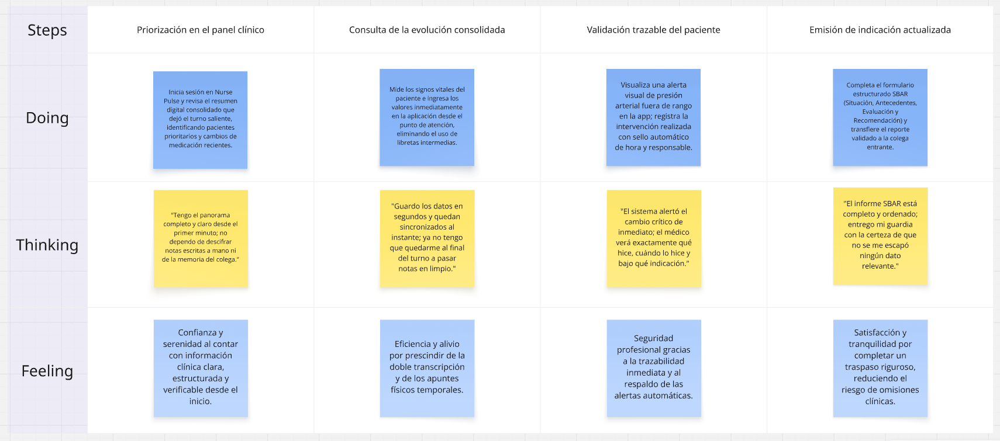

</div>
<p align="center"><em>Figura 1.1 Mapa de escenario futuro para el personal de enfermería cardiovascular.</em></p>

---

##### B. To-Be Scenario Mapping: Médico Especialista Cardiovascular
*Enfocado en la ronda médica matutina, consulta rápida del estado del paciente en el Dashboard Web consolidado, toma de decisiones informada e indicación trazable de nuevas conductas médicas.*

<div align="center">

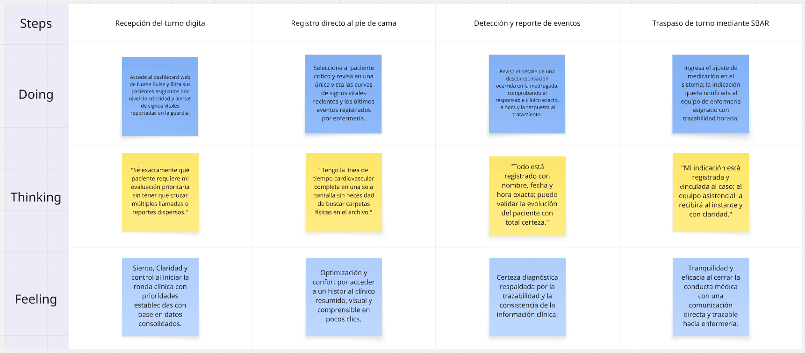

</div>
<p align="center"><em>Figura 2.1 Mapa de escenario futuro para el médico especialista cardiovascular.</em></p>

---

#### Espacio de Trabajo Colaborativo

Para auditar en detalle la matriz completa de post-its virtuales, interacciones de usuario y trazabilidad de cada fase de los mapas *To-Be*, puede acceder al tablero colaborativo del proyecto en el siguiente enlace:

> 🔗 **Acceso al Tablero de Diseño (Miro / Canvas):**  
> [Ver To-Be Scenario Mapping interactivo en Miro](https://miro.com/app/board/uXjVHnjGnd0=/?share_link_id=39885473758)


### 3.2. User Stories

La presente sección desarrolla el conjunto de Epics, User Stories y Technical Stories definidos para el proyecto NursePulse. Estos requisitos fueron elaborados a partir de los hallazgos obtenidos en entrevistas, User Personas, User Task Matrix, User Journey Maps, Empathy Maps, Big Picture Event Storming, Ubiquitous Language y el avance desarrollado de la Landing Page.

Las User Stories representan necesidades funcionales desde la perspectiva de los usuarios finales y visitantes del sitio web. Las Technical Stories representan necesidades técnicas necesarias para implementar los recursos del RESTful API, utilizando el rol Developer. Asimismo, se incluyen historias correspondientes al sitio web estático o Landing Page, tomando como rol base al visitante, debido a que la página comunica la propuesta de valor, funcionamiento, características, beneficios, testimonios, equipo, preguntas frecuentes y canales de contacto de **Nurse Pulse**.

Los criterios de aceptación se redactan en formato Gherkin, siguiendo la estructura Given – When – Then. Además, se mantienen en tiempo presente, tercera persona, sin referencia innecesaria a detalles específicos de interfaz gráfica y con condiciones comprobables.

Cuadro de Epics, User Stories y Technical Stories

**Cuadro de Epics, User Stories y Technical Stories**

<!-- EP-01 -->
<table width="100%">
  <tr>
    <th width="20%">Story ID</th>
    <th width="30%">User</th>
    <th width="25%">Priority</th>
    <th width="25%">Epic</th>
  </tr>
  <tr>
    <td align="center"><b>—</b></td>
    <td>Visitante</td>
    <td>Alta</td>
    <td>EP-01</td>
  </tr>
  <tr>
    <th>Title</th>
    <td colspan="3">Landing Page informativa</td>
  </tr>
  <tr>
    <th colspan="4">Description</th>
  </tr>
  <tr>
    <td colspan="4">Como visitante, quiero conocer la propuesta de valor, funcionamiento, beneficios, planes y canales de contacto de Nurse Pulse para evaluar si la solución responde a necesidades clínicas de comunicación, trazabilidad y continuidad asistencial.</td>
  </tr>
  <tr>
    <th colspan="4">Acceptance Criteria</th>
  </tr>
  <tr>
    <td colspan="4">
      <b>Given</b> que el visitante accede al sitio web, <b>When</b> revisa la información disponible, <b>Then</b> comprende el propósito general de Nurse Pulse.<br><br>
      <b>Given</b> que el visitante desea conocer la solución, <b>When</b> navega por las secciones del sitio, <b>Then</b> encuentra información sobre propuesta de valor, funcionamiento, características, beneficios, planes, preguntas frecuentes, testimonios, equipo, llamados a la acción y contacto.
    </td>
  </tr>
</table>

<br>

<!-- EP-02 -->
<table width="100%">
  <tr>
    <th width="20%">Story ID</th>
    <th width="30%">User</th>
    <th width="25%">Priority</th>
    <th width="25%">Epic</th>
  </tr>
  <tr>
    <td align="center"><b>—</b></td>
    <td>Personal clínico</td>
    <td>Media</td>
    <td>EP-02</td>
  </tr>
  <tr>
    <th>Title</th>
    <td colspan="3">Gestión de traspaso clínico SBAR</td>
  </tr>
  <tr>
    <th colspan="4">Description</th>
  </tr>
  <tr>
    <td colspan="4">Como personal clínico, quiero estructurar la información del cambio de turno para reducir omisiones y mejorar la continuidad de atención.</td>
  </tr>
  <tr>
    <th colspan="4">Acceptance Criteria</th>
  </tr>
  <tr>
    <td colspan="4">
      <b>Given</b> que el personal clínico realiza un cambio de turno, <b>When</b> registra información bajo estructura SBAR, <b>Then</b> la información queda organizada en situación, antecedentes, evaluación y recomendación.<br><br>
      <b>Given</b> que el nuevo turno recibe información, <b>When</b> consulta el traspaso clínico, <b>Then</b> comprende el estado del paciente y los pendientes relevantes.
    </td>
  </tr>
</table>

<br>

<!-- EP-03 -->
<table width="100%">
  <tr>
    <th width="20%">Story ID</th>
    <th width="30%">User</th>
    <th width="25%">Priority</th>
    <th width="25%">Epic</th>
  </tr>
  <tr>
    <td align="center"><b>—</b></td>
    <td>Personal clínico</td>
    <td>Media</td>
    <td>EP-03</td>
  </tr>
  <tr>
    <th>Title</th>
    <td colspan="3">Registro y seguimiento clínico del paciente</td>
  </tr>
  <tr>
    <th colspan="4">Description</th>
  </tr>
  <tr>
    <td colspan="4">Como personal clínico, quiero registrar y consultar información clínica relevante para mantener actualizado el estado del paciente cardiovascular.</td>
  </tr>
  <tr>
    <th colspan="4">Acceptance Criteria</th>
  </tr>
  <tr>
    <td colspan="4">
      <b>Given</b> que el personal clínico registra información del paciente, <b>When</b> la información es guardada correctamente, <b>Then</b> queda disponible para seguimiento clínico.<br><br>
      <b>Given</b> que un profesional consulta al paciente, <b>When</b> accede a su información clínica, <b>Then</b> revisa datos relevantes para su atención.
    </td>
  </tr>
</table>

<br>

<!-- EP-04 -->
<table width="100%">
  <tr>
    <th width="20%">Story ID</th>
    <th width="30%">User</th>
    <th width="25%">Priority</th>
    <th width="25%">Epic</th>
  </tr>
  <tr>
    <td align="center"><b>—</b></td>
    <td>Equipo clínico</td>
    <td>Media</td>
    <td>EP-04</td>
  </tr>
  <tr>
    <th>Title</th>
    <td colspan="3">Trazabilidad clínica</td>
  </tr>
  <tr>
    <th colspan="4">Description</th>
  </tr>
  <tr>
    <td colspan="4">Como equipo clínico, quiero conocer la secuencia de eventos, responsables y horarios para mejorar seguimiento, auditoría y continuidad de atención.</td>
  </tr>
  <tr>
    <th colspan="4">Acceptance Criteria</th>
  </tr>
  <tr>
    <td colspan="4">
      <b>Given</b> que se registra una acción clínica, <b>When</b> la información queda guardada, <b>Then</b> se almacena responsable, fecha y hora.<br><br>
      <b>Given</b> que se consulta la trazabilidad de un paciente, <b>When</b> existen registros asociados, <b>Then</b> se muestra la secuencia de eventos clínicos registrados.
    </td>
  </tr>
</table>

<br>

<!-- EP-05 -->
<table width="100%">
  <tr>
    <th width="20%">Story ID</th>
    <th width="30%">User</th>
    <th width="25%">Priority</th>
    <th width="25%">Epic</th>
  </tr>
  <tr>
    <td align="center"><b>—</b></td>
    <td>Médico especialista cardiovascular</td>
    <td>Baja</td>
    <td>EP-05</td>
  </tr>
  <tr>
    <th>Title</th>
    <td colspan="3">Soporte a la toma de decisiones clínicas</td>
  </tr>
  <tr>
    <th colspan="4">Description</th>
  </tr>
  <tr>
    <td colspan="4">Como médico especialista cardiovascular, quiero acceder rápidamente a información consolidada para tomar decisiones clínicas oportunas y seguras.</td>
  </tr>
  <tr>
    <th colspan="4">Acceptance Criteria</th>
  </tr>
  <tr>
    <td colspan="4">
      <b>Given</b> que el médico evalúa a un paciente cardiovascular, <b>When</b> consulta su información clínica, <b>Then</b> accede a datos relevantes para la toma de decisiones.<br><br>
      <b>Given</b> que existen cambios relevantes del paciente, <b>When</b> el médico revisa la evolución, <b>Then</b> identifica información clínica reciente.
    </td>
  </tr>
</table>

<br>

<!-- EP-06 -->
<table width="100%">
  <tr>
    <th width="20%">Story ID</th>
    <th width="30%">User</th>
    <th width="25%">Priority</th>
    <th width="25%">Epic</th>
  </tr>
  <tr>
    <td align="center"><b>—</b></td>
    <td>Developer</td>
    <td>Baja</td>
    <td>EP-06</td>
  </tr>
  <tr>
    <th>Title</th>
    <td colspan="3">RESTful API de Nurse Pulse</td>
  </tr>
  <tr>
    <th colspan="4">Description</th>
  </tr>
  <tr>
    <td colspan="4">Como Developer, quiero contar con una API RESTful para exponer de forma segura los recursos clínicos necesarios para la aplicación Nurse Pulse.</td>
  </tr>
  <tr>
    <th colspan="4">Acceptance Criteria</th>
  </tr>
  <tr>
    <td colspan="4">
      <b>Given</b> que un cliente autorizado realiza una solicitud válida, <b>When</b> el API procesa la solicitud, <b>Then</b> responde con el recurso solicitado y código HTTP correspondiente.<br><br>
      <b>Given</b> que ocurre un error de validación o autorización, <b>When</b> el API procesa la solicitud, <b>Then</b> responde con código HTTP y mensaje consistente.
    </td>
  </tr>
</table>

<!-- US-01 -->
<table width="100%">
  <tr>
    <th width="20%">Story ID</th>
    <th width="30%">User</th>
    <th width="25%">Priority</th>
    <th width="25%">Epic</th>
  </tr>
  <tr>
    <td align="center"><b>US-01</b></td>
    <td>Visitante</td>
    <td>Alta</td>
    <td>EP-01</td>
  </tr>
  <tr>
    <th>Title</th>
    <td colspan="3">Visualizar landing page</td>
  </tr>
  <tr>
    <th colspan="4">Description</th>
  </tr>
  <tr>
    <td colspan="4">Como visitante, quiero visualizar la landing page de Nurse Pulse para conocer rápidamente la solución propuesta.</td>
  </tr>
  <tr>
    <th colspan="4">Acceptance Criteria</th>
  </tr>
  <tr>
    <td colspan="4">
      <b>Given</b> que el visitante accede al sitio web, <b>When</b> la página carga correctamente, <b>Then</b> visualiza información general de Nurse Pulse.<br><br>
      <b>Given</b> que el visitante usa un navegador compatible, <b>When</b> ingresa al sitio, <b>Then</b> visualiza el contenido principal sin errores de carga.
    </td>
  </tr>
</table>

<br>

<!-- US-02 -->
<table width="100%">
  <tr>
    <th width="20%">Story ID</th>
    <th width="30%">User</th>
    <th width="25%">Priority</th>
    <th width="25%">Epic</th>
  </tr>
  <tr>
    <td align="center"><b>US-02</b></td>
    <td>Visitante</td>
    <td>Alta</td>
    <td>EP-01</td>
  </tr>
  <tr>
    <th>Title</th>
    <td colspan="3">Ver propuesta de valor</td>
  </tr>
  <tr>
    <th colspan="4">Description</th>
  </tr>
  <tr>
    <td colspan="4">Como visitante, quiero conocer la propuesta de valor de Nurse Pulse para entender qué problema clínico busca resolver.</td>
  </tr>
  <tr>
    <th colspan="4">Acceptance Criteria</th>
  </tr>
  <tr>
    <td colspan="4">
      <b>Given</b> que el visitante revisa la información principal, <b>When</b> lee la propuesta presentada, <b>Then</b> identifica que Nurse Pulse se enfoca en comunicación clínica y trazabilidad en tiempo real.<br><br>
      <b>Given</b> que el visitante pertenece al sector salud, <b>When</b> revisa la propuesta de valor, <b>Then</b> reconoce beneficios relacionados con continuidad asistencial, trazabilidad de eventos críticos y comunicación entre turnos.
    </td>
  </tr>
</table>

<br>

<!-- US-03 -->
<table width="100%">
  <tr>
    <th width="20%">Story ID</th>
    <th width="30%">User</th>
    <th width="25%">Priority</th>
    <th width="25%">Epic</th>
  </tr>
  <tr>
    <td align="center"><b>US-03</b></td>
    <td>Visitante</td>
    <td>Alta</td>
    <td>EP-01</td>
  </tr>
  <tr>
    <th>Title</th>
    <td colspan="3">Consultar el problema que resuelve Nurse Pulse</td>
  </tr>
  <tr>
    <th colspan="4">Description</th>
  </tr>
  <tr>
    <td colspan="4">Como visitante, quiero entender por qué existe la necesidad de Nurse Pulse para reconocer el problema actual de información clínica dispersa.</td>
  </tr>
  <tr>
    <th colspan="4">Acceptance Criteria</th>
  </tr>
  <tr>
    <td colspan="4">
      <b>Given</b> que el visitante consulta la sección informativa del problema, <b>When</b> lee la explicación presentada, <b>Then</b> identifica que la información clínica dispersa dificulta la continuidad asistencial y la trazabilidad.<br><br>
      <b>Given</b> que el visitante analiza la necesidad del producto, <b>When</b> revisa el problema descrito, <b>Then</b> comprende que Nurse Pulse busca centralizar procesos esenciales de enfermería cardiovascular.
    </td>
  </tr>
</table>

<br>

<!-- US-04 -->
<table width="100%">
  <tr>
    <th width="20%">Story ID</th>
    <th width="30%">User</th>
    <th width="25%">Priority</th>
    <th width="25%">Epic</th>
  </tr>
  <tr>
    <td align="center"><b>US-04</b></td>
    <td>Visitante</td>
    <td>Alta</td>
    <td>EP-01</td>
  </tr>
  <tr>
    <th>Title</th>
    <td colspan="3">Revisar cómo funciona Nurse Pulse</td>
  </tr>
  <tr>
    <th colspan="4">Description</th>
  </tr>
  <tr>
    <td colspan="4">Como visitante, quiero conocer cómo funciona Nurse Pulse en pasos simples para comprender el flujo general de uso de la solución.</td>
  </tr>
  <tr>
    <th colspan="4">Acceptance Criteria</th>
  </tr>
  <tr>
    <td colspan="4">
      <b>Given</b> que el visitante revisa la explicación de funcionamiento, <b>When</b> consulta los pasos presentados, <b>Then</b> identifica las etapas generales de registro, monitoreo y trazabilidad.<br><br>
      <b>Given</b> que el visitante desea entender el funcionamiento general, <b>When</b> revisa los pasos descritos, <b>Then</b> comprende que la solución permite digitalizar traspasos SBAR, consultar información clínica y mantener historial de eventos.
    </td>
  </tr>
</table>

<br>

<!-- US-05 -->
<table width="100%">
  <tr>
    <th width="20%">Story ID</th>
    <th width="30%">User</th>
    <th width="25%">Priority</th>
    <th width="25%">Epic</th>
  </tr>
  <tr>
    <td align="center"><b>US-05</b></td>
    <td>Visitante</td>
    <td>Alta</td>
    <td>EP-01</td>
  </tr>
  <tr>
    <th>Title</th>
    <td colspan="3">Visualizar características clave</td>
  </tr>
  <tr>
    <th colspan="4">Description</th>
  </tr>
  <tr>
    <td colspan="4">Como visitante, quiero conocer las características principales de Nurse Pulse para evaluar si la solución responde a necesidades del entorno clínico cardiovascular.</td>
  </tr>
  <tr>
    <th colspan="4">Acceptance Criteria</th>
  </tr>
  <tr>
    <td colspan="4">
      <b>Given</b> que el visitante consulta la información de características, <b>When</b> revisa el contenido disponible, <b>Then</b> identifica capacidades relacionadas con SBAR digital, gestión de pacientes, seguimiento de tratamientos, monitoreo de signos vitales, historial clínico digital y trazabilidad.<br><br>
      <b>Given</b> que el visitante compara beneficios funcionales, <b>When</b> revisa cada característica presentada, <b>Then</b> comprende el valor de cada capacidad descrita.
    </td>
  </tr>
</table>

<br>

<!-- US-06 -->
<table width="100%">
  <tr>
    <th width="20%">Story ID</th>
    <th width="30%">User</th>
    <th width="25%">Priority</th>
    <th width="25%">Epic</th>
  </tr>
  <tr>
    <td align="center"><b>US-06</b></td>
    <td>Visitante</td>
    <td>Alta</td>
    <td>EP-01</td>
  </tr>
  <tr>
    <th>Title</th>
    <td colspan="3">Visualizar beneficios</td>
  </tr>
  <tr>
    <th colspan="4">Description</th>
  </tr>
  <tr>
    <td colspan="4">Como visitante, quiero revisar los beneficios de Nurse Pulse para comprender el valor que aporta al entorno clínico.</td>
  </tr>
  <tr>
    <th colspan="4">Acceptance Criteria</th>
  </tr>
  <tr>
    <td colspan="4">
      <b>Given</b> que el visitante consulta la información de beneficios, <b>When</b> revisa los beneficios disponibles, <b>Then</b> identifica mejoras relacionadas con comunicación entre turnos, reducción de omisiones, trazabilidad, organización de información y atención oportuna.<br><br>
      <b>Given</b> que el visitante evalúa la utilidad del producto, <b>When</b> revisa los beneficios, <b>Then</b> comprende cómo Nurse Pulse puede aportar valor a hospitales, clínicas o centros especializados.
    </td>
  </tr>
</table>

<br>

<!-- US-07 -->
<table width="100%">
  <tr>
    <th width="20%">Story ID</th>
    <th width="30%">User</th>
    <th width="25%">Priority</th>
    <th width="25%">Epic</th>
  </tr>
  <tr>
    <td align="center"><b>US-07</b></td>
    <td>Visitante</td>
    <td>Alta</td>
    <td>EP-01</td>
  </tr>
  <tr>
    <th>Title</th>
    <td colspan="3">Consultar preguntas frecuentes</td>
  </tr>
  <tr>
    <th colspan="4">Description</th>
  </tr>
  <tr>
    <td colspan="4">Como visitante, quiero revisar preguntas frecuentes para resolver dudas básicas sobre alcance, uso y modelo de servicio de Nurse Pulse.</td>
  </tr>
  <tr>
    <th colspan="4">Acceptance Criteria</th>
  </tr>
  <tr>
    <td colspan="4">
      <b>Given</b> que el visitante consulta las preguntas frecuentes, <b>When</b> revisa las respuestas disponibles, <b>Then</b> obtiene información sobre orientación del producto, consulta de información, público objetivo y modelo de servicio.<br><br>
      <b>Given</b> que el visitante tiene dudas sobre la solución, <b>When</b> revisa las preguntas frecuentes, <b>Then</b> encuentra respuestas claras sobre el alcance de Nurse Pulse.
    </td>
  </tr>
</table>

<br>

<!-- US-08 -->
<table width="100%">
  <tr>
    <th width="20%">Story ID</th>
    <th width="30%">User</th>
    <th width="25%">Priority</th>
    <th width="25%">Epic</th>
  </tr>
  <tr>
    <td align="center"><b>US-08</b></td>
    <td>Visitante</td>
    <td>Alta</td>
    <td>EP-01</td>
  </tr>
  <tr>
    <th>Title</th>
    <td colspan="3">Visualizar testimonios</td>
  </tr>
  <tr>
    <th colspan="4">Description</th>
  </tr>
  <tr>
    <td colspan="4">Como visitante, quiero revisar testimonios sobre Nurse Pulse para aumentar mi confianza en la solución.</td>
  </tr>
  <tr>
    <th colspan="4">Acceptance Criteria</th>
  </tr>
  <tr>
    <td colspan="4">
      <b>Given</b> que el visitante consulta los testimonios disponibles, <b>When</b> revisa las opiniones presentadas, <b>Then</b> identifica percepciones positivas relacionadas con organización, seguimiento y mejora del trabajo clínico.<br><br>
      <b>Given</b> que el visitante evalúa la credibilidad del producto, <b>When</b> lee los testimonios, <b>Then</b> obtiene información que respalda la propuesta de valor.
    </td>
  </tr>
</table>

<br>

<!-- US-09 -->
<table width="100%">
  <tr>
    <th width="20%">Story ID</th>
    <th width="30%">User</th>
    <th width="25%">Priority</th>
    <th width="25%">Epic</th>
  </tr>
  <tr>
    <td align="center"><b>US-09</b></td>
    <td>Visitante</td>
    <td>Alta</td>
    <td>EP-01</td>
  </tr>
  <tr>
    <th>Title</th>
    <td colspan="3">Conocer al equipo</td>
  </tr>
  <tr>
    <th colspan="4">Description</th>
  </tr>
  <tr>
    <td colspan="4">Como visitante, quiero conocer al equipo detrás de Nurse Pulse para identificar quiénes desarrollan la solución.</td>
  </tr>
  <tr>
    <th colspan="4">Acceptance Criteria</th>
  </tr>
  <tr>
    <td colspan="4">
      <b>Given</b> que el visitante consulta la información del equipo, <b>When</b> revisa los datos presentados, <b>Then</b> visualiza integrantes y roles asociados al proyecto.<br><br>
      <b>Given</b> que el visitante evalúa confianza institucional, <b>When</b> revisa el equipo del proyecto, <b>Then</b> reconoce que existe un equipo responsable detrás de la solución.
    </td>
  </tr>
</table>

<br>

<!-- US-10 -->
<table width="100%">
  <tr>
    <th width="20%">Story ID</th>
    <th width="30%">User</th>
    <th width="25%">Priority</th>
    <th width="25%">Epic</th>
  </tr>
  <tr>
    <td align="center"><b>US-10</b></td>
    <td>Visitante</td>
    <td>Alta</td>
    <td>EP-01</td>
  </tr>
  <tr>
    <th>Title</th>
    <td colspan="3">Contactar al equipo de Nurse Pulse</td>
  </tr>
  <tr>
    <th colspan="4">Description</th>
  </tr>
  <tr>
    <td colspan="4">Como visitante, quiero contactar al equipo de Nurse Pulse para solicitar información adicional o una demostración.</td>
  </tr>
  <tr>
    <th colspan="4">Acceptance Criteria</th>
  </tr>
  <tr>
    <td colspan="4">
      <b>Given</b> que el visitante desea contactar al equipo, <b>When</b> proporciona los datos requeridos, <b>Then</b> la solicitud queda lista para ser enviada.<br><br>
      <b>Given</b> que existen datos obligatorios, <b>When</b> el visitante intenta enviar información incompleta, <b>Then</b> el sistema solicita completar los datos requeridos.
    </td>
  </tr>
</table>

<br>

<!-- US-11 -->
<table width="100%">
  <tr>
    <th width="20%">Story ID</th>
    <th width="30%">User</th>
    <th width="25%">Priority</th>
    <th width="25%">Epic</th>
  </tr>
  <tr>
    <td align="center"><b>US-11</b></td>
    <td>Visitante</td>
    <td>Alta</td>
    <td>EP-01</td>
  </tr>
  <tr>
    <th>Title</th>
    <td colspan="3">Cambiar idioma del sitio</td>
  </tr>
  <tr>
    <th colspan="4">Description</th>
  </tr>
  <tr>
    <td colspan="4">Como visitante, quiero cambiar el idioma del sitio entre español e inglés para revisar la información en el idioma de mi preferencia.</td>
  </tr>
  <tr>
    <th colspan="4">Acceptance Criteria</th>
  </tr>
  <tr>
    <td colspan="4">
      <b>Given</b> que el visitante se encuentra en la landing page, <b>When</b> selecciona un idioma disponible, <b>Then</b> el contenido del sitio se muestra en el idioma seleccionado.<br><br>
      <b>Given</b> que el visitante vuelve a ingresar al sitio, <b>When</b> existe una preferencia de idioma guardada, <b>Then</b> el sitio mantiene el idioma previamente seleccionado.
    </td>
  </tr>
</table>

<br>

<!-- US-12 -->
<table width="100%">
  <tr>
    <th width="20%">Story ID</th>
    <th width="30%">User</th>
    <th width="25%">Priority</th>
    <th width="25%">Epic</th>
  </tr>
  <tr>
    <td align="center"><b>US-12</b></td>
    <td>Visitante</td>
    <td>Alta</td>
    <td>EP-01</td>
  </tr>
  <tr>
    <th>Title</th>
    <td colspan="3">Acceder desde dispositivos móviles</td>
  </tr>
  <tr>
    <th colspan="4">Description</th>
  </tr>
  <tr>
    <td colspan="4">Como visitante, quiero acceder al sitio web desde dispositivos móviles para revisar información de Nurse Pulse desde cualquier lugar.</td>
  </tr>
  <tr>
    <th colspan="4">Acceptance Criteria</th>
  </tr>
  <tr>
    <td colspan="4">
      <b>Given</b> que el visitante accede desde un dispositivo móvil, <b>When</b> carga el sitio web, <b>Then</b> el contenido se adapta al tamaño del dispositivo.<br><br>
      <b>Given</b> que el visitante navega desde un dispositivo móvil, <b>When</b> revisa las secciones del sitio, <b>Then</b> consulta la información sin pérdida de contenido relevante.
    </td>
  </tr>
</table>

<br>

<!-- US-13 -->
<table width="100%">
  <tr>
    <th width="20%">Story ID</th>
    <th width="30%">User</th>
    <th width="25%">Priority</th>
    <th width="25%">Epic</th>
  </tr>
  <tr>
    <td align="center"><b>US-13</b></td>
    <td>Enfermera cardiovascular</td>
    <td>Media</td>
    <td>EP-02</td>
  </tr>
  <tr>
    <th>Title</th>
    <td colspan="3">Registrar traspaso SBAR</td>
  </tr>
  <tr>
    <th colspan="4">Description</th>
  </tr>
  <tr>
    <td colspan="4">Como enfermera cardiovascular, quiero registrar un traspaso clínico usando SBAR para comunicar información relevante al siguiente turno[cite: 1, 2].</td>
  </tr>
  <tr>
    <th colspan="4">Acceptance Criteria</th>
  </tr>
  <tr>
    <td colspan="4">
      <b>Given</b> que la enfermera necesita entregar información clínica, <b>When</b> registra situación, antecedentes, evaluación y recomendación, <b>Then</b> el traspaso queda registrado con estructura SBAR[cite: 1, 2].<br><br>
      <b>Given</b> que falta información obligatoria, <b>When</b> la enfermera intenta guardar el traspaso, <b>Then</b> el sistema solicita completar la información requerida.
    </td>
  </tr>
</table>

<br>

<!-- US-14 -->
<table width="100%">
  <tr>
    <th width="20%">Story ID</th>
    <th width="30%">User</th>
    <th width="25%">Priority</th>
    <th width="25%">Epic</th>
  </tr>
  <tr>
    <td align="center"><b>US-14</b></td>
    <td>Enfermera entrante</td>
    <td>Media</td>
    <td>EP-02</td>
  </tr>
  <tr>
    <th>Title</th>
    <td colspan="3">Consultar traspaso de turno</td>
  </tr>
  <tr>
    <th colspan="4">Description</th>
  </tr>
  <tr>
    <td colspan="4">Como enfermera entrante, quiero consultar el traspaso clínico del turno anterior para continuar la atención del paciente sin perder información relevante[cite: 2].</td>
  </tr>
  <tr>
    <th colspan="4">Acceptance Criteria</th>
  </tr>
  <tr>
    <td colspan="4">
      <b>Given</b> que existe un traspaso registrado, <b>When</b> la enfermera entrante consulta la información del paciente, <b>Then</b> visualiza la información clínica entregada por el turno anterior[cite: 2].<br><br>
      <b>Given</b> que el traspaso contiene pendientes, <b>When</b> la enfermera lo revisa, <b>Then</b> identifica acciones pendientes para el nuevo turno.
    </td>
  </tr>
</table>

<br>

<!-- US-15 -->
<table width="100%">
  <tr>
    <th width="20%">Story ID</th>
    <th width="30%">User</th>
    <th width="25%">Priority</th>
    <th width="25%">Epic</th>
  </tr>
  <tr>
    <td align="center"><b>US-15</b></td>
    <td>Enfermera entrante</td>
    <td>Media</td>
    <td>EP-02</td>
  </tr>
  <tr>
    <th>Title</th>
    <td colspan="3">Confirmar recepción de traspaso</td>
  </tr>
  <tr>
    <th colspan="4">Description</th>
  </tr>
  <tr>
    <td colspan="4">Como enfermera entrante, quiero confirmar que recibí el traspaso clínico para dejar constancia de continuidad de atención[cite: 2].</td>
  </tr>
  <tr>
    <th colspan="4">Acceptance Criteria</th>
  </tr>
  <tr>
    <td colspan="4">
      <b>Given</b> que la enfermera entrante revisa el traspaso, <b>When</b> confirma la recepción, <b>Then</b> el sistema registra que el traspaso fue recibido.<br><br>
      <b>Given</b> que el traspaso aún no fue confirmado, <b>When</b> se consulta su estado, <b>Then</b> aparece como pendiente de recepción.
    </td>
  </tr>
</table>

<br>

<!-- US-16 -->
<table width="100%">
  <tr>
    <th width="20%">Story ID</th>
    <th width="30%">User</th>
    <th width="25%">Priority</th>
    <th width="25%">Epic</th>
  </tr>
  <tr>
    <td align="center"><b>US-16</b></td>
    <td>Enfermera cardiovascular</td>
    <td>Media</td>
    <td>EP-03</td>
  </tr>
  <tr>
    <th>Title</th>
    <td colspan="3">Registrar signos vitales</td>
  </tr>
  <tr>
    <th colspan="4">Description</th>
  </tr>
  <tr>
    <td colspan="4">Como enfermera cardiovascular, quiero registrar signos vitales del paciente para mantener actualizado el monitoreo clínico[cite: 1, 2].</td>
  </tr>
  <tr>
    <th colspan="4">Acceptance Criteria</th>
  </tr>
  <tr>
    <td colspan="4">
      <b>Given</b> que la enfermera registra signos vitales, <b>When</b> ingresa los valores requeridos, <b>Then</b> el sistema guarda el registro asociado al paciente[cite: 1].<br><br>
      <b>Given</b> que falta un valor obligatorio, <b>When</b> la enfermera intenta guardar el registro, <b>Then</b> el sistema informa que falta información requerida.
    </td>
  </tr>
</table>

<br>

<!-- US-17 -->
<table width="100%">
  <tr>
    <th width="20%">Story ID</th>
    <th width="30%">User</th>
    <th width="25%">Priority</th>
    <th width="25%">Epic</th>
  </tr>
  <tr>
    <td align="center"><b>US-17</b></td>
    <td>Médico especialista cardiovascular</td>
    <td>Media</td>
    <td>EP-03</td>
  </tr>
  <tr>
    <th>Title</th>
    <td colspan="3">Consultar evolución clínica</td>
  </tr>
  <tr>
    <th colspan="4">Description</th>
  </tr>
  <tr>
    <td colspan="4">Como médico especialista cardiovascular, quiero consultar la evolución clínica reciente del paciente para tomar decisiones con información actualizada[cite: 1, 2].</td>
  </tr>
  <tr>
    <th colspan="4">Acceptance Criteria</th>
  </tr>
  <tr>
    <td colspan="4">
      <b>Given</b> que existen registros clínicos del paciente, <b>When</b> el médico consulta su evolución, <b>Then</b> el sistema muestra eventos y registros recientes asociados al paciente[cite: 1, 2].<br><br>
      <b>Given</b> que no existen registros recientes, <b>When</b> el médico consulta la evolución, <b>Then</b> el sistema informa que no hay información registrada en el periodo consultado.
    </td>
  </tr>
</table>

<br>

<!-- US-18 -->
<table width="100%">
  <tr>
    <th width="20%">Story ID</th>
    <th width="30%">User</th>
    <th width="25%">Priority</th>
    <th width="25%">Epic</th>
  </tr>
  <tr>
    <td align="center"><b>US-18</b></td>
    <td>Enfermera cardiovascular</td>
    <td>Media</td>
    <td>EP-03</td>
  </tr>
  <tr>
    <th>Title</th>
    <td colspan="3">Registrar evento clínico relevante</td>
  </tr>
  <tr>
    <th colspan="4">Description</th>
  </tr>
  <tr>
    <td colspan="4">Como enfermera cardiovascular, quiero registrar eventos clínicos relevantes para que el equipo pueda dar seguimiento oportuno al paciente[cite: 1, 2].</td>
  </tr>
  <tr>
    <th colspan="4">Acceptance Criteria</th>
  </tr>
  <tr>
    <td colspan="4">
      <b>Given</b> que ocurre un evento clínico relevante, <b>When</b> la enfermera registra el evento, <b>Then</b> el sistema guarda descripción, fecha, hora y responsable[cite: 1, 2].<br><br>
      <b>Given</b> que un médico consulta la evolución del paciente, <b>When</b> existen eventos relevantes registrados, <b>Then</b> aparecen asociados al historial clínico del paciente[cite: 1, 2].
    </td>
  </tr>
</table>

<br>

<!-- US-19 -->
<table width="100%">
  <tr>
    <th width="20%">Story ID</th>
    <th width="30%">User</th>
    <th width="25%">Priority</th>
    <th width="25%">Epic</th>
  </tr>
  <tr>
    <td align="center"><b>US-19</b></td>
    <td>Médico especialista cardiovascular</td>
    <td>Media</td>
    <td>EP-04</td>
  </tr>
  <tr>
    <th>Title</th>
    <td colspan="3">Consultar historial de eventos</td>
  </tr>
  <tr>
    <th colspan="4">Description</th>
  </tr>
  <tr>
    <td colspan="4">Como médico especialista cardiovascular, quiero consultar el historial de eventos clínicos para reconstruir la evolución del paciente[cite: 1, 2].</td>
  </tr>
  <tr>
    <th colspan="4">Acceptance Criteria</th>
  </tr>
  <tr>
    <td colspan="4">
      <b>Given</b> que el paciente tiene eventos registrados, <b>When</b> el médico consulta el historial, <b>Then</b> el sistema muestra los eventos ordenados cronológicamente[cite: 1, 2].<br><br>
      <b>Given</b> que el médico necesita validar un evento específico, <b>When</b> revisa el historial, <b>Then</b> identifica fecha, hora y responsable del registro[cite: 1, 2].
    </td>
  </tr>
</table>

<br>

<!-- US-20 -->
<table width="100%">
  <tr>
    <th width="20%">Story ID</th>
    <th width="30%">User</th>
    <th width="25%">Priority</th>
    <th width="25%">Epic</th>
  </tr>
  <tr>
    <td align="center"><b>US-20</b></td>
    <td>Usuario clínico</td>
    <td>Baja</td>
    <td>EP-04</td>
  </tr>
  <tr>
    <th>Title</th>
    <td colspan="3">Identificar responsable de registro</td>
  </tr>
  <tr>
    <th colspan="4">Description</th>
  </tr>
  <tr>
    <td colspan="4">Como usuario clínico, quiero identificar quién registró una información clínica para asegurar trazabilidad y responsabilidad profesional[cite: 1, 2].</td>
  </tr>
  <tr>
    <th colspan="4">Acceptance Criteria</th>
  </tr>
  <tr>
    <td colspan="4">
      <b>Given</b> que existe un registro clínico guardado, <b>When</b> el usuario consulta el detalle del registro, <b>Then</b> el sistema muestra el responsable asociado[cite: 1, 2].<br><br>
      <b>Given</b> que el registro fue actualizado, <b>When</b> se consulta su información, <b>Then</b> el sistema conserva evidencia del responsable de la actualización[cite: 1, 2].
    </td>
  </tr>
</table>

<br>

<!-- US-21 -->
<table width="100%">
  <tr>
    <th width="20%">Story ID</th>
    <th width="30%">User</th>
    <th width="25%">Priority</th>
    <th width="25%">Epic</th>
  </tr>
  <tr>
    <td align="center"><b>US-21</b></td>
    <td>Médico especialista cardiovascular</td>
    <td>Baja</td>
    <td>EP-05</td>
  </tr>
  <tr>
    <th>Title</th>
    <td colspan="3">Consultar resumen clínico del paciente</td>
  </tr>
  <tr>
    <th colspan="4">Description</th>
  </tr>
  <tr>
    <td colspan="4">Como médico especialista cardiovascular, quiero consultar un resumen clínico del paciente para comprender rápidamente su estado actual[cite: 1, 2].</td>
  </tr>
  <tr>
    <th colspan="4">Acceptance Criteria</th>
  </tr>
  <tr>
    <td colspan="4">
      <b>Given</b> que el paciente tiene información clínica registrada, <b>When</b> el médico consulta el resumen, <b>Then</b> el sistema muestra datos relevantes del estado actual del paciente[cite: 2].<br><br>
      <b>Given</b> que existe información reciente, <b>When</b> el médico revisa el resumen, <b>Then</b> identifica evolución, eventos e indicaciones relevantes[cite: 1, 2].
    </td>
  </tr>
</table>

<br>

<!-- US-22 -->
<table width="100%">
  <tr>
    <th width="20%">Story ID</th>
    <th width="30%">User</th>
    <th width="25%">Priority</th>
    <th width="25%">Epic</th>
  </tr>
  <tr>
    <td align="center"><b>US-22</b></td>
    <td>Médico especialista cardiovascular</td>
    <td>Baja</td>
    <td>EP-05</td>
  </tr>
  <tr>
    <th>Title</th>
    <td colspan="3">Identificar cambios críticos</td>
  </tr>
  <tr>
    <th colspan="4">Description</th>
  </tr>
  <tr>
    <td colspan="4">Como médico especialista cardiovascular, quiero identificar cambios críticos del paciente para responder oportunamente ante deterioros clínicos[cite: 1, 2].</td>
  </tr>
  <tr>
    <th colspan="4">Acceptance Criteria</th>
  </tr>
  <tr>
    <td colspan="4">
      <b>Given</b> que existen registros clínicos recientes, <b>When</b> se identifica un cambio crítico definido por reglas clínicas, <b>Then</b> el sistema marca el evento como relevante[cite: 1, 2].<br><br>
      <b>Given</b> que el médico consulta la evolución, <b>When</b> existen cambios críticos registrados, <b>Then</b> puede identificarlos dentro del historial del paciente[cite: 1, 2].
    </td>
  </tr>
</table>

<br>

<!-- TS-01 -->
<table width="100%">
  <tr>
    <th width="20%">Story ID</th>
    <th width="30%">User</th>
    <th width="25%">Priority</th>
    <th width="25%">Epic</th>
  </tr>
  <tr>
    <td align="center"><b>TS-01</b></td>
    <td>Developer</td>
    <td>Baja</td>
    <td>EP-06</td>
  </tr>
  <tr>
    <th>Title</th>
    <td colspan="3">Autenticación de usuarios</td>
  </tr>
  <tr>
    <th colspan="4">Description</th>
  </tr>
  <tr>
    <td colspan="4">Como Developer, quiero implementar autenticación para proteger el acceso a recursos clínicos del sistema, incluyendo una política de contraseñas seguras en el registro de nuevas cuentas[cite: 1, 2].</td>
  </tr>
  <tr>
    <th colspan="4">Acceptance Criteria</th>
  </tr>
  <tr>
    <td colspan="4">
      <b>Given</b> que un usuario envía credenciales válidas, <b>When</b> el API procesa la autenticación, <b>Then</b> responde con un token válido.<br><br>
      <b>Given</b> que un usuario envía credenciales inválidas, <b>When</b> el API procesa la autenticación, <b>Then</b> responde con estado 401.<br><br>
      <b>Given</b> que un usuario se registra con una contraseña de entre 12 y 20 caracteres, que incluye al menos una mayúscula y un carácter especial, <b>When</b> el API procesa el registro, <b>Then</b> crea la cuenta correctamente.<br><br>
      <b>Given</b> que un usuario se registra con una contraseña que no cumple la longitud requerida, <b>When</b> el API procesa el registro, <b>Then</b> responde con estado 400 indicando el requisito de longitud.<br><br>
      <b>Given</b> que un usuario se registra con una contraseña sin mayúscula o sin carácter especial, <b>When</b> el API procesa el registro, <b>Then</b> responde con estado 400 indicando qué requisito de complejidad falta.
    </td>
  </tr>
</table>

<br>

<!-- TS-02 -->
<table width="100%">
  <tr>
    <th width="20%">Story ID</th>
    <th width="30%">User</th>
    <th width="25%">Priority</th>
    <th width="25%">Epic</th>
  </tr>
  <tr>
    <td align="center"><b>TS-02</b></td>
    <td>Developer</td>
    <td>Baja</td>
    <td>EP-06</td>
  </tr>
  <tr>
    <th>Title</th>
    <td colspan="3">Gestión de pacientes mediante API</td>
  </tr>
  <tr>
    <th colspan="4">Description</th>
  </tr>
  <tr>
    <td colspan="4">Como Developer, quiero exponer endpoints de pacientes para crear, consultar y actualizar información básica del paciente cardiovascular[cite: 1, 2].</td>
  </tr>
  <tr>
    <th colspan="4">Acceptance Criteria</th>
  </tr>
  <tr>
    <td colspan="4">
      <b>Given</b> que un cliente autorizado solicita un paciente existente, <b>When</b> el API recibe la solicitud, <b>Then</b> responde con la información del paciente y estado 200.<br><br>
      <b>Given</b> que el paciente no existe, <b>When</b> el API recibe la solicitud, <b>Then</b> responde con estado 404.
    </td>
  </tr>
</table>

<br>

<!-- TS-03 -->
<table width="100%">
  <tr>
    <th width="20%">Story ID</th>
    <th width="30%">User</th>
    <th width="25%">Priority</th>
    <th width="25%">Epic</th>
  </tr>
  <tr>
    <td align="center"><b>TS-03</b></td>
    <td>Developer</td>
    <td>Baja</td>
    <td>EP-06</td>
  </tr>
  <tr>
    <th>Title</th>
    <td colspan="3">Gestión de registros clínicos mediante API</td>
  </tr>
  <tr>
    <th colspan="4">Description</th>
  </tr>
  <tr>
    <td colspan="4">Como Developer, quiero exponer endpoints de registros clínicos para permitir el registro y consulta de signos vitales, eventos e indicaciones[cite: 1, 2].</td>
  </tr>
  <tr>
    <th colspan="4">Acceptance Criteria</th>
  </tr>
  <tr>
    <td colspan="4">
      <b>Given</b> que un cliente autorizado envía un registro clínico válido, <b>When</b> el API procesa la solicitud, <b>Then</b> guarda el registro y responde con estado 201.<br><br>
      <b>Given</b> que el registro clínico contiene datos inválidos, <b>When</b> el API procesa la solicitud, <b>Then</b> responde con estado 400 y detalle de validación.
    </td>
  </tr>
</table>

<br>

<!-- TS-04 -->
<table width="100%">
  <tr>
    <th width="20%">Story ID</th>
    <th width="30%">User</th>
    <th width="25%">Priority</th>
    <th width="25%">Epic</th>
  </tr>
  <tr>
    <td align="center"><b>TS-04</b></td>
    <td>Developer</td>
    <td>Baja</td>
    <td>EP-06</td>
  </tr>
  <tr>
    <th>Title</th>
    <td colspan="3">Gestión de traspasos SBAR mediante API</td>
  </tr>
  <tr>
    <th colspan="4">Description</th>
  </tr>
  <tr>
    <td colspan="4">Como Developer, quiero implementar endpoints de traspasos SBAR para registrar y consultar entregas de turno[cite: 1, 2].</td>
  </tr>
  <tr>
    <th colspan="4">Acceptance Criteria</th>
  </tr>
  <tr>
    <td colspan="4">
      <b>Given</b> que un cliente autorizado envía un traspaso SBAR válido, <b>When</b> el API procesa la solicitud, <b>Then</b> guarda el traspaso asociado al paciente y responde con estado 201[cite: 1, 2].<br><br>
      <b>Given</b> que falta un campo requerido del SBAR, <b>When</b> el API procesa la solicitud, <b>Then</b> responde con estado 400[cite: 1, 2].
    </td>
  </tr>
</table>

<br>

<!-- TS-05 -->
<table width="100%">
  <tr>
    <th width="20%">Story ID</th>
    <th width="30%">User</th>
    <th width="25%">Priority</th>
    <th width="25%">Epic</th>
  </tr>
  <tr>
    <td align="center"><b>TS-05</b></td>
    <td>Developer</td>
    <td>Baja</td>
    <td>EP-06</td>
  </tr>
  <tr>
    <th>Title</th>
    <td colspan="3">Trazabilidad de acciones clínicas</td>
  </tr>
  <tr>
    <th colspan="4">Description</th>
  </tr>
  <tr>
    <td colspan="4">Como Developer, quiero registrar auditoría de acciones clínicas para conservar responsable, fecha y tipo de operación realizada[cite: 1, 2].</td>
  </tr>
  <tr>
    <th colspan="4">Acceptance Criteria</th>
  </tr>
  <tr>
    <td colspan="4">
      <b>Given</b> que un usuario autorizado crea o actualiza un registro clínico, <b>When</b> el API completa la operación, <b>Then</b> almacena usuario, fecha, hora y tipo de acción[cite: 1, 2].<br><br>
      <b>Given</b> que se consulta la auditoría de un registro, <b>When</b> existe información de trazabilidad, <b>Then</b> el API responde con la secuencia de acciones registradas[cite: 1, 2].
    </td>
  </tr>
</table>

<br>

<!-- TS-06 -->
<table width="100%">
  <tr>
    <th width="20%">Story ID</th>
    <th width="30%">User</th>
    <th width="25%">Priority</th>
    <th width="25%">Epic</th>
  </tr>
  <tr>
    <td align="center"><b>TS-06</b></td>
    <td>Developer</td>
    <td>Baja</td>
    <td>EP-06</td>
  </tr>
  <tr>
    <th>Title</th>
    <td colspan="3">Manejo consistente de errores del API</td>
  </tr>
  <tr>
    <th colspan="4">Description</th>
  </tr>
  <tr>
    <td colspan="4">Como Developer, quiero estandarizar las respuestas de error para facilitar el consumo del API por parte del frontend.</td>
  </tr>
  <tr>
    <th colspan="4">Acceptance Criteria</th>
  </tr>
  <tr>
    <td colspan="4">
      <b>Given</b> que ocurre un error de validación, <b>When</b> el API responde, <b>Then</b> incluye código HTTP 400 y detalle del error.<br><br>
      <b>Given</b> que un usuario no autorizado solicita un recurso protegido, <b>When</b> el API procesa la solicitud, <b>Then</b> responde con estado 401 o 403 según corresponda.
    </td>
  </tr>
</table>


#### Resumen de Epics, User Stories y Technical Stories

| Epic ID   | Bloque                                      | Historias relacionadas | Propósito                                                                                                                                                      |
|-----------|---------------------------------------------|------------------------|----------------------------------------------------------------------------------------------------------------------------------------------------------------|
| **EP-01** | Landing Page informativa                    | US-01 a US-12          | Comunicar la propuesta de valor de Nurse Pulse, explicar el problema, presentar beneficios, generar confianza y facilitar contacto con visitantes interesados. |
| **EP-02** | Gestión de traspaso clínico SBAR            | US-13 a US-15          | Estructurar la comunicación clínica durante cambios de turno mediante el modelo SBAR.                                                                          |
| **EP-03** | Registro y seguimiento clínico del paciente | US-16 a US-18          | Registrar información clínica relevante como signos vitales, eventos clínicos.                                                |
| **EP-04** | Trazabilidad clínica                        | US-19 a US-21          | Consultar historial, responsables y cumplimiento de indicaciones para fortalecer seguimiento, auditoría y continuidad clínica.                                 |
| **EP-05** | Soporte a la toma de decisiones clínicas    | US-22 a US-23          | Facilitar consulta de información consolidada, identificación de cambios críticos y validación de información con enfermería.                                  |
| **EP-06** | RESTful API de Nurse Pulse                  | TS-01 a TS-06          | Implementar recursos técnicos del backend necesarios para exponer pacientes, registros clínicos, traspasos, trazabilidad, autenticación y manejo de errores.   |

La distribución de Epics, User Stories y Technical Stories permite mantener trazabilidad entre la investigación de usuarios, los Business Goals, el Impact Mapping, el Product Backlog y las funcionalidades implementadas en los sprints del proyecto.

### 3.3. Product Backlog

La presente sección desarrolla el Product Backlog del proyecto Nurse Pulse, incluyendo la priorización y estimación de las User Stories y Technical Stories definidas previamente. El orden del backlog se establece considerando el valor para el negocio, la validación temprana del producto, la relación con los Business Goals y la necesidad de contar con una primera versión funcional del sistema.

De acuerdo con el criterio solicitado, las historias relacionadas con el sitio web estático o Landing Page se consideran desde el primer sprint, ya que permiten comunicar la propuesta de valor, captar visitantes interesados y validar el interés inicial del mercado. Posteriormente se priorizan las funcionalidades clínicas centrales relacionadas con traspaso SBAR, registro clínico, trazabilidad, consulta de información y soporte a la toma de decisiones.

La estimación se realiza utilizando Story Points con valores **1, 2, 3, 5 y 8**, considerando complejidad funcional, esfuerzo técnico, validaciones requeridas, dependencias y riesgo de implementación.

#### Criterios de priorización

| Criterio | Descripción |
| -------- | ----------- |
| **Valor para el negocio** | Se priorizan primero las historias que permiten comunicar la propuesta de valor, validar interés inicial y demostrar funcionalidad clínica central. |
| **Relación con Business Goals** | Las historias se ordenan considerando su aporte a los objetivos definidos en el Impact Mapping. |
| **Validación temprana** | Se colocan primero historias que permiten obtener retroalimentación de visitantes, usuarios clínicos y potenciales clientes institucionales. |
| **Dependencias funcionales** | Algunas historias requieren que primero existan pacientes, registros, traspasos o recursos base del sistema. |
| **Riesgo técnico** | Las Technical Stories se priorizan según su necesidad para soportar funcionalidades clínicas y no únicamente por seguridad o autenticación. |
| **Alcance por sprints** | El backlog considera la evolución del producto desde Landing Page hasta Web Application, RESTful API, validación y cierre final. |

#### Product Backlog — Nurse Pulse

| # Orden | User Story Id | Título | Descripción | Story Points |
| ------: | ------------- | ------ | ----------- | -----------: |
| 1 | US-01 | Visualizar landing page | Como visitante, deseo visualizar la landing page de Nurse Pulse para conocer rápidamente la solución propuesta. | 3 |
| 2 | US-02 | Ver propuesta de valor | Como visitante, deseo conocer la propuesta de valor de Nurse Pulse para entender qué problema clínico busca resolver. | 3 |
| 3 | US-03 | Consultar el problema que resuelve Nurse Pulse | Como visitante, deseo entender por qué existe la necesidad de Nurse Pulse para reconocer el problema actual de información clínica dispersa. | 3 |
| 4 | US-04 | Revisar cómo funciona Nurse Pulse | Como visitante, deseo conocer cómo funciona Nurse Pulse en pasos simples para comprender el flujo general de uso de la solución. | 3 |
| 5 | US-05 | Visualizar características clave | Como visitante, deseo conocer las características principales de Nurse Pulse para evaluar si la solución responde a necesidades del entorno clínico cardiovascular. | 3 |
| 6 | US-06 | Visualizar beneficios | Como visitante, deseo revisar los beneficios de Nurse Pulse para comprender el valor que aporta al entorno clínico. | 3 |
| 7 | US-10 | Contactar al equipo de Nurse Pulse | Como visitante, deseo contactar al equipo de Nurse Pulse para solicitar información adicional o una demostración. | 5 |
| 8 | US-12 | Acceder desde dispositivos móviles | Como visitante, deseo acceder al sitio web desde dispositivos móviles para revisar información de Nurse Pulse desde cualquier lugar. | 5 |
| 9 | US-11 | Cambiar idioma del sitio | Como visitante, deseo cambiar el idioma del sitio entre español e inglés para revisar la información en el idioma de mi preferencia. | 5 |
| 10 | US-07 | Consultar preguntas frecuentes | Como visitante, deseo revisar preguntas frecuentes para resolver dudas básicas sobre alcance, uso y modelo de servicio de Nurse Pulse. | 2 |
| 11 | US-08 | Visualizar testimonios | Como visitante, deseo revisar testimonios sobre Nurse Pulse para aumentar mi confianza en la solución. | 2 |
| 12 | US-09 | Conocer al equipo | Como visitante, deseo conocer al equipo detrás de Nurse Pulse para identificar quiénes desarrollan la solución. | 2 |
| 13 | US-13 | Registrar traspaso SBAR | Como enfermera cardiovascular, deseo registrar un traspaso clínico usando SBAR para comunicar información relevante al siguiente turno. | 8 |
| 14 | US-14 | Consultar traspaso de turno | Como enfermera entrante, deseo consultar el traspaso clínico del turno anterior para continuar la atención del paciente sin perder información relevante. | 5 |
| 15 | US-15 | Confirmar recepción de traspaso | Como enfermera entrante, deseo confirmar que recibí el traspaso clínico para dejar constancia de continuidad de atención. | 3 |
| 16 | US-16 | Registrar signos vitales | Como enfermera cardiovascular, deseo registrar signos vitales del paciente para mantener actualizado el monitoreo clínico. | 5 |
| 17 | US-19 | Registrar evento clínico relevante | Como enfermera cardiovascular, deseo registrar eventos clínicos relevantes para que el equipo pueda dar seguimiento oportuno al paciente. | 5 |
| 18 | US-17 | Consultar evolución clínica | Como médico especialista cardiovascular, deseo consultar la evolución clínica reciente del paciente para tomar decisiones con información actualizada. | 5 |
| 20 | US-23 | Consultar resumen clínico del paciente | Como médico especialista cardiovascular, deseo consultar un resumen clínico del paciente para comprender rápidamente su estado actual. | 8 |
| 21 | US-20 | Consultar historial de eventos | Como médico especialista cardiovascular, deseo consultar el historial de eventos clínicos para reconstruir la evolución del paciente. | 5 |
| 22 | US-21 | Identificar responsable de registro | Como usuario clínico, deseo identificar quién registró una información clínica para asegurar trazabilidad y responsabilidad profesional. | 5 |
| 23 | US-24 | Identificar cambios críticos | Como médico especialista cardiovascular, deseo identificar cambios críticos del paciente para responder oportunamente ante deterioros clínicos. | 8 |
| 24 | TS-02 | Gestión de pacientes mediante API | Como Developer, deseo exponer endpoints de pacientes para crear, consultar y actualizar información básica del paciente cardiovascular. | 5 |
| 25 | TS-03 | Gestión de registros clínicos mediante API | Como Developer, deseo exponer endpoints de registros clínicos para permitir el registro y consulta de signos vitales, eventos e indicaciones. | 8 |
| 26 | TS-04 | Gestión de traspasos SBAR mediante API | Como Developer, deseo implementar endpoints de traspasos SBAR para registrar y consultar entregas de turno. | 5 |
| 27 | TS-05 | Trazabilidad de acciones clínicas | Como Developer, deseo registrar auditoría de acciones clínicas para conservar responsable, fecha y tipo de operación realizada. | 5 |
| 28 | TS-01 | Autenticación de usuarios | Como Developer, deseo implementar autenticación para proteger el acceso a recursos clínicos del sistema. | 5 |
| 29 | TS-06 | Manejo consistente de errores del API | Como Developer, deseo estandarizar las respuestas de error para facilitar el consumo del API por parte del frontend. | 3 |

#### Distribución por bloques funcionales

| Bloque | Historias incluidas | Propósito |
| ------ | ------------------- | --------- |
| **Landing Page** | US-01 a US-12 | Comunicar la propuesta de valor, captar interesados y validar interés inicial. |
| **Traspaso SBAR** | US-13 a US-15 | Mejorar comunicación clínica durante cambios de turno. |
| **Registro clínico** | US-16, US-18, US-19 | Reducir duplicidad, registrar información relevante y disminuir dependencia de papel. |
| **Consulta clínica** | US-17, US-20, US-23 | Facilitar acceso rápido a evolución, historial y estado actual del paciente. |
| **Trazabilidad clínica** | US-21, US-22 | Reconstruir responsables, horarios y cumplimiento de indicaciones. |
| **Soporte a decisiones clínicas** | US-24, US-25 | Identificar cambios críticos y validar información relevante con enfermería. |
| **RESTful API** | TS-01 a TS-06 | Habilitar recursos técnicos para pacientes, registros, traspasos, trazabilidad, autenticación y errores. |

#### Relación del Product Backlog con los Business Goals

| Business Goal | Historias principales relacionadas | Justificación |
| ------------- | ---------------------------------- | ------------- |
| **BG-01** | US-01 a US-12 | Estas historias permiten comunicar el valor de Nurse Pulse, generar confianza y facilitar contacto desde la Landing Page. |
| **BG-02** | US-13, US-14, US-15, TS-04 | Estas historias permiten validar el flujo de traspaso SBAR digital con usuarios clínicos e instituciones. |
| **BG-03** | US-16, US-17, US-20, US-23 | Estas historias reducen fricción al registrar y consultar información clínica relevante. |
| **BG-04** | US-13, US-16, US-18, US-19, TS-02, TS-03, TS-04 | Estas historias permiten reemplazar registros físicos complementarios por flujos digitales funcionales. |
| **BG-05** | US-20, US-21, US-22, US-24, US-25, TS-01, TS-05, TS-06 | Estas historias fortalecen trazabilidad clínica, seguridad, auditoría y soporte a decisiones clínicas. |

#### Relación del Product Backlog con los sprints

| Sprint | Historias principales consideradas | Enfoque |
| ------ | --------------------------------- | ------- |
| **Sprint 1** | US-01, US-02, US-03, US-04, US-05, US-06, US-07, US-08, US-09, US-10, US-11, US-12, US-13, US-14, US-15, US-16, US-17, US-18, US-19, US-20, US-21, US-22 | Desarrollo inicial de Landing Page, comunicación de propuesta de valor, secciones principales, contacto y responsive design. Mejora de Landing Page, primeras vistas de Web Application, traspaso SBAR, signos vitales y consulta clínica inicial  Implementación de Web Services, registros clínicos, eventos, trazabilidad, endpoints REST y documentación de API. Cierre de funcionalidades, validación final, autenticación, manejo de errores, evidencias finales y mejoras del producto.
|

#### Captura y URL del Product Backlog

La siguiente captura corresponde al Product Backlog elaborado en la herramienta de gestión utilizada por el equipo. En ella se evidencia la priorización de historias, estimación mediante Story Points y organización del backlog según valor para el negocio.

<p align="center">
  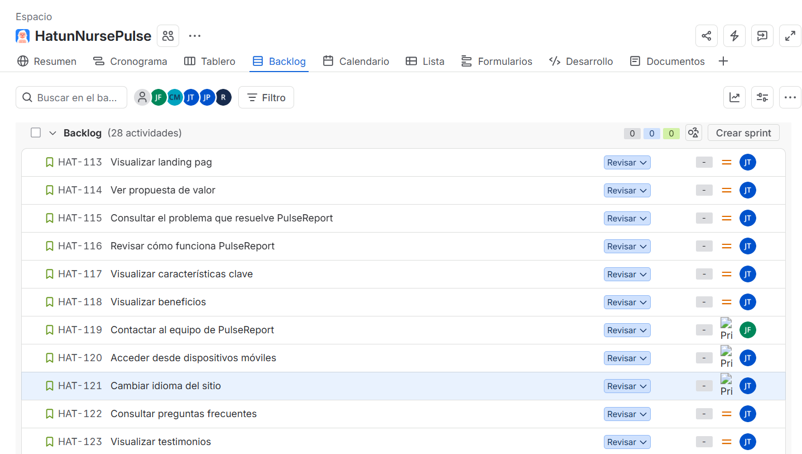
</p>

**URL del Product Backlog:**  
https://jorgefrantas1.atlassian.net/jira/software/projects/HAT/boards/101/backlog

#### Conclusión del Product Backlog

El Product Backlog de Nurse Pulse prioriza primero las historias relacionadas con la Landing Page porque permiten comunicar la propuesta de valor, presentar beneficios, mostrar planes, validar interés inicial y obtener contacto con visitantes interesados mediante llamados a la acción. Luego se priorizan funcionalidades clínicas centrales relacionadas con traspaso SBAR, registro de signos vitales, eventos clínicos, consulta de evolución, trazabilidad y soporte a decisiones clínicas.

Las Technical Stories se ubican después de las historias funcionales principales porque su propósito es habilitar técnicamente los recursos necesarios para la Web Application y el RESTful API. Esta organización evita priorizar autenticación o seguridad al inicio sin una relación directa con valor de negocio visible, y mantiene coherencia con el enfoque solicitado para el Product Backlog.


### 3.4. Impact Mapping

La presente sección desarrolla el Impact Mapping del proyecto Nurse Pulse, elaborado para el modelo de negocio digital a partir de los User Personas, User Stories, User Journey Maps, Empathy Maps, Big Picture Event Storming y Ubiquitous Language.

El Impact Mapping permite conectar los objetivos de negocio con los actores que pueden contribuir a lograrlos, los cambios de comportamiento esperados, los entregables digitales necesarios y las User Stories que permiten construir dichos entregables. De esta manera, se evita que las funcionalidades sean definidas de forma aislada y se mantiene trazabilidad entre investigación, requerimientos, diseño e implementación.

La estructura utilizada responde a las siguientes preguntas:

| Elemento | Pregunta que responde |
| -------- | --------------------- |
| **Business Goal** | ¿Qué objetivo de negocio se quiere alcanzar? |
| **Actor / Persona** | ¿Quién puede ayudar a lograr la meta? |
| **Impact** | ¿Qué tendría que hacer el actor para contribuir al objetivo? |
| **Deliverable** | ¿Qué puede construir el negocio digital para provocar ese impacto? |
| **User Stories** | ¿Qué historias permiten desarrollar los features necesarios para producir los entregables? |

Para este proyecto se consideran Business Goals definidos bajo criterios SMART, los User Personas previamente identificados y las User Stories del backlog del proyecto Nurse Pulse.

#### Business Goals SMART

| Business Goal ID | Business Goal SMART |
| ---------------- | ------------------- |
| **BG-01** | Lograr que al menos **60 visitantes interesados** soliciten información o una demostración de Nurse Pulse mediante la Landing Page durante los primeros **4 meses** posteriores a su publicación. |
| **BG-02** | Conseguir que al menos **3 instituciones de salud o áreas clínicas cardiovasculares** validen el flujo de traspaso SBAR digital durante los primeros **6 meses** del proyecto. |
| **BG-03** | Reducir en un **30% el tiempo estimado de búsqueda y revisión de información clínica relevante** durante escenarios simulados de UCI cardiovascular en un periodo de **6 meses**. |
| **BG-04** | Lograr que al menos el **80% de usuarios clínicos participantes en pruebas piloto** registre eventos clínicos, signos vitales o traspasos usando Nurse Pulse sin recurrir a registros físicos complementarios en un periodo de **8 meses**. |
| **BG-05** | Alcanzar un nivel mínimo de **85% de trazabilidad completa** en eventos clínicos registrados durante pruebas piloto, considerando responsable, fecha, hora y tipo de acción, en un periodo de **8 meses**. |

#### Actors / Personas considerados

| Actor / Persona | Relación con Nurse Pulse |
| --------------- | ------------------------ |
| **Visitante de la Landing Page** | Persona interesada en conocer la solución, revisar beneficios, evaluar confianza y solicitar información o una demostración. |
| **Daniela Ríos — Personal de enfermería cardiovascular** | User Persona encargado de registrar signos vitales, eventos clínicos, administración y traspasos SBAR durante el turno. |
| **Dr. Alejandro Torres — Médico especialista cardiovascular** | User Persona encargado de consultar información clínica, validar evolución del paciente y tomar decisiones médicas oportunas. |
| **Cliente institucional** | Hospital, clínica privada o centro especializado en cardiología que puede adoptar Nurse Pulse para mejorar procesos internos. |
| **Developer** | Actor técnico encargado de implementar y consumir recursos del RESTful API que soportan la Web Application. |

#### Capturas del Impact Mapping

El Impact Mapping visual fue elaborado en una herramienta colaborativa y organizado en tres capturas para facilitar su lectura. Cada captura relaciona Business Goals, actores, impactos, entregables y User Stories asociadas.

<p align="center">
  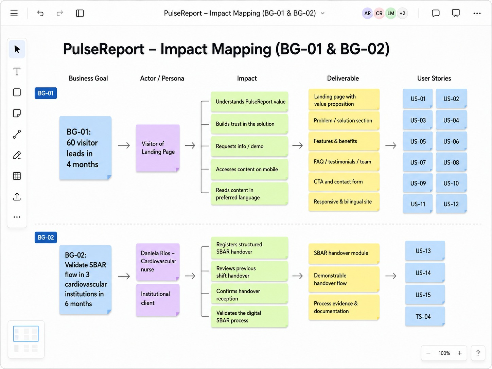
</p>

<p align="center">
  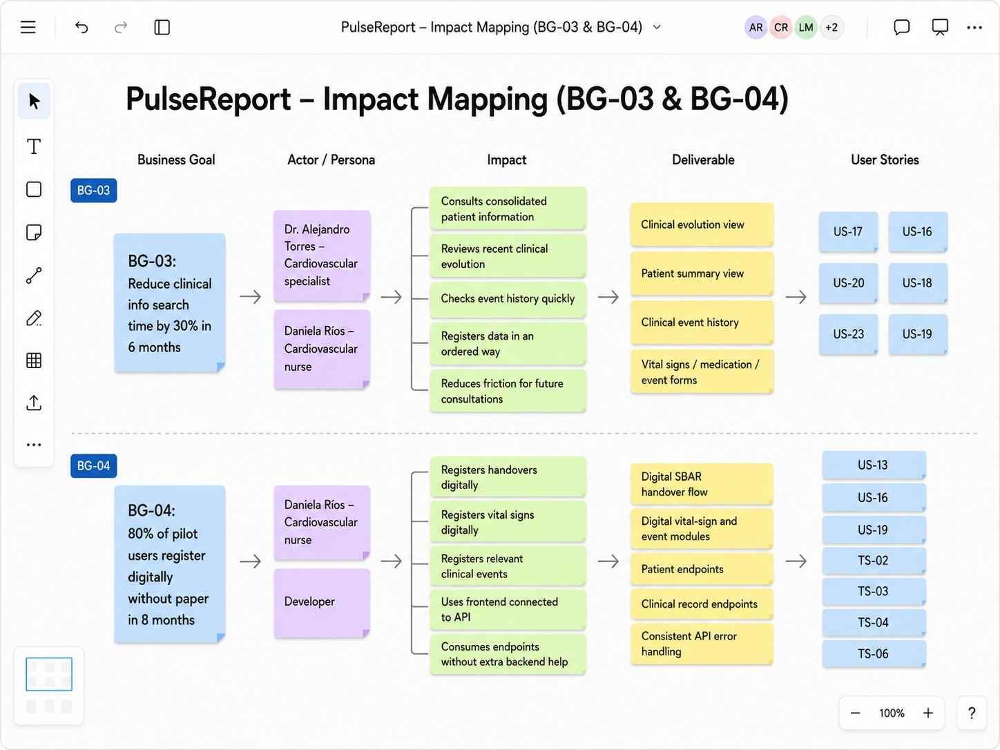
</p>

<p align="center">
  
</p>

#### Impact Mapping detallado

Debido a que las capturas visuales presentan los identificadores principales para mantener legibilidad, la siguiente tabla detalla la relación completa entre Business Goals, actores, impactos esperados, entregables digitales y User Stories asociadas.

| Business Goal | Actor / Persona | Impact esperado | Deliverable | User Stories relacionadas |
| ------------- | --------------- | --------------- | ----------- | ------------------------- |
| **BG-01** | Visitante de la Landing Page | Comprender rápidamente qué es Nurse Pulse, qué problema resuelve y por qué puede aportar valor al entorno clínico cardiovascular. | Landing Page informativa con propuesta de valor, explicación del problema, funcionamiento y beneficios. | **US-01:** Como visitante, deseo visualizar la landing page de Nurse Pulse para conocer rápidamente la solución propuesta. <br><br> **US-02:** Como visitante, deseo conocer la propuesta de valor de Nurse Pulse para entender qué problema clínico busca resolver. <br><br> **US-03:** Como visitante, deseo entender por qué existe la necesidad de Nurse Pulse para reconocer el problema actual de información clínica dispersa. |
| **BG-01** | Visitante de la Landing Page | Evaluar confianza, resolver dudas y decidir si desea solicitar información adicional. | Secciones de características, beneficios, planes, preguntas frecuentes, testimonios, equipo, llamados a la acción y contacto. | **US-04:** Como visitante, deseo conocer cómo funciona Nurse Pulse en pasos simples para comprender el flujo general de uso de la solución. <br><br> **US-05:** Como visitante, deseo conocer las características principales de Nurse Pulse para evaluar si la solución responde a necesidades del entorno clínico cardiovascular. <br><br> **US-06:** Como visitante, deseo revisar los beneficios de Nurse Pulse para comprender el valor que aporta al entorno clínico. <br><br> **US-07:** Como visitante, deseo revisar preguntas frecuentes para resolver dudas básicas sobre alcance, uso y modelo de servicio de Nurse Pulse. <br><br> **US-08:** Como visitante, deseo revisar testimonios sobre Nurse Pulse para aumentar mi confianza en la solución. <br><br> **US-09:** Como visitante, deseo conocer al equipo detrás de Nurse Pulse para identificar quiénes desarrollan la solución. <br><br> **US-10:** Como visitante, deseo contactar al equipo de Nurse Pulse para solicitar información adicional o una demostración. |
| **BG-01** | Visitante de la Landing Page | Acceder a la información desde distintos dispositivos y revisar el contenido en su idioma de preferencia. | Landing Page responsive e internacionalizada. | **US-11:** Como visitante, deseo cambiar el idioma del sitio entre español e inglés para revisar la información en el idioma de mi preferencia. <br><br> **US-12:** Como visitante, deseo acceder al sitio web desde dispositivos móviles para revisar información de Nurse Pulse desde cualquier lugar. |
| **BG-02** | Daniela Ríos — Personal de enfermería cardiovascular | Registrar información del cambio de turno de manera estructurada para reducir omisiones y mejorar continuidad clínica. | Módulo de traspaso clínico SBAR. | **US-13:** Como enfermera cardiovascular, deseo registrar un traspaso clínico usando SBAR para comunicar información relevante al siguiente turno. <br><br> **US-14:** Como enfermera entrante, deseo consultar el traspaso clínico del turno anterior para continuar la atención del paciente sin perder información relevante. <br><br> **US-15:** Como enfermera entrante, deseo confirmar que recibí el traspaso clínico para dejar constancia de continuidad de atención. |
| **BG-02** | Cliente institucional | Validar si el flujo SBAR digital puede aplicarse como apoyo operativo dentro de áreas cardiovasculares. | Flujo demostrable de traspaso SBAR, evidencias de uso, documentación del proceso y validación con usuarios. | **US-13:** Como enfermera cardiovascular, deseo registrar un traspaso clínico usando SBAR para comunicar información relevante al siguiente turno. <br><br> **US-14:** Como enfermera entrante, deseo consultar el traspaso clínico del turno anterior para continuar la atención del paciente sin perder información relevante. <br><br> **TS-04:** Como Developer, deseo implementar endpoints de traspasos SBAR para registrar y consultar entregas de turno. |
| **BG-03** | Dr. Alejandro Torres — Médico especialista cardiovascular | Consultar información clínica consolidada y reducir el tiempo de búsqueda entre múltiples fuentes. | Vista de evolución clínica, resumen clínico del paciente e historial de eventos. | **US-17:** Como médico especialista cardiovascular, deseo consultar la evolución clínica reciente del paciente para tomar decisiones con información actualizada. <br><br> **US-20:** Como médico especialista cardiovascular, deseo consultar el historial de eventos clínicos para reconstruir la evolución del paciente. <br><br> **US-22:** Como médico especialista cardiovascular, deseo consultar un resumen clínico del paciente para comprender rápidamente su estado actual. |
| **BG-03** | Daniela Ríos — Personal de enfermería cardiovascular | Registrar información clínica de manera ordenada para que luego pueda ser consultada con menor fricción por otros profesionales. | Formularios de registro clínico para signos vitales y eventos relevantes. | **US-16:** Como enfermera cardiovascular, deseo registrar signos vitales del paciente para mantener actualizado el monitoreo clínico. <br><br> **US-18:** Como enfermera cardiovascular, deseo registrar eventos clínicos relevantes para que el equipo pueda dar seguimiento oportuno al paciente. |
| **BG-04** | Daniela Ríos — Personal de enfermería cardiovascular | Registrar signos vitales, eventos y traspasos en un flujo digital para reducir dependencia de apuntes físicos complementarios. | Módulos digitales de registro clínico, eventos relevantes y traspaso SBAR. | **US-13:** Como enfermera cardiovascular, deseo registrar un traspaso clínico usando SBAR para comunicar información relevante al siguiente turno. <br><br> **US-16:** Como enfermera cardiovascular, deseo registrar signos vitales del paciente para mantener actualizado el monitoreo clínico. <br><br> **US-18:** Como enfermera cardiovascular, deseo registrar eventos clínicos relevantes para que el equipo pueda dar seguimiento oportuno al paciente. |
| **BG-04** | Developer | Exponer recursos técnicos que permitan al frontend registrar y consultar información clínica desde el RESTful API. | Endpoints de pacientes, registros clínicos, traspasos y manejo consistente de errores. | **TS-02:** Como Developer, deseo exponer endpoints de pacientes para crear, consultar y actualizar información básica del paciente cardiovascular. <br><br> **TS-03:** Como Developer, deseo exponer endpoints de registros clínicos para permitir el registro y consulta de signos vitales, eventos e indicaciones. <br><br> **TS-04:** Como Developer, deseo implementar endpoints de traspasos SBAR para registrar y consultar entregas de turno. <br><br> **TS-06:** Como Developer, deseo estandarizar las respuestas de error para facilitar el consumo del API por parte del frontend. |
| **BG-05** | Dr. Alejandro Torres — Médico especialista cardiovascular | Identificar responsables, horarios, secuencia de eventos y cumplimiento de indicaciones para tomar decisiones con información trazable. | Historial de eventos, detalle de responsable de registro, cumplimiento de indicaciones y resumen clínico. | **US-19:** Como médico especialista cardiovascular, deseo consultar el historial de eventos clínicos para reconstruir la evolución del paciente. <br><br> **US-20:** Como usuario clínico, deseo identificar quién registró una información clínica para asegurar trazabilidad y responsabilidad profesional. <br><br> **US-22:** Como médico especialista cardiovascular, deseo consultar un resumen clínico del paciente para comprender rápidamente su estado actual. |
| **BG-05** | Daniela Ríos — Personal de enfermería cardiovascular | Registrar información con responsable, fecha, hora y estado para fortalecer continuidad de atención. | Registro trazable de signos vitales, eventos y traspasos. | **US-16:** Como enfermera cardiovascular, deseo registrar signos vitales del paciente para mantener actualizado el monitoreo clínico. <br><br> **US-19:** Como enfermera cardiovascular, deseo registrar eventos clínicos relevantes para que el equipo pueda dar seguimiento oportuno al paciente. |
| **BG-05** | Developer | Garantizar que las acciones clínicas registradas mantengan evidencia técnica de auditoría, seguridad y trazabilidad. | Auditoría de acciones clínicas, autenticación, autorización y protección de recursos del API. | **TS-01:** Como Developer, deseo implementar autenticación para proteger el acceso a recursos clínicos del sistema. <br><br> **TS-05:** Como Developer, deseo registrar auditoría de acciones clínicas para conservar responsable, fecha y tipo de operación realizada. <br><br> **TS-06:** Como Developer, deseo estandarizar las respuestas de error para facilitar el consumo del API por parte del frontend. |
| **BG-05** | Dr. Alejandro Torres — Médico especialista cardiovascular | Identificar cambios críticos y validar información con enfermería para responder oportunamente ante deterioros clínicos. | Alertas o marcadores de cambios críticos y registro de validación clínica entre médico y enfermería. | **US-24:** Como médico especialista cardiovascular, deseo identificar cambios críticos del paciente para responder oportunamente ante deterioros clínicos. <br><br> **US-25:** Como médico especialista cardiovascular, deseo validar información relevante con enfermería para reducir incertidumbre antes de tomar una decisión clínica. |

#### Conclusión del Impact Mapping

El Impact Mapping permite evidenciar que las funcionalidades priorizadas de Nurse Pulse responden a objetivos de negocio concretos. La Landing Page se relaciona con la adquisición de visitantes interesados y la comunicación de la propuesta de valor. Los módulos clínicos de traspaso SBAR, signos vitales, eventos, resumen clínico e historial se relacionan con la mejora de comunicación, reducción del tiempo de búsqueda de información, disminución de dependencia de registros físicos y fortalecimiento de trazabilidad. Finalmente, las Technical Stories del RESTful API permiten sostener técnicamente los entregables necesarios para registro, consulta, seguridad, auditoría y continuidad clínica.


<div style="page-break-before: always;"></div>

## Capítulo IV: Product Design
### 4.1. Style Guidelines
#### 4.1.1. General Style Guidelines

El diseño de estilo general de **NursePulse** responde a la necesidad de transmitir profesionalismo, seguridad, claridad y confianza, valores fundamentales en una solución digital orientada al sector salud. La propuesta visual busca reflejar una identidad moderna y ordenada, alineada con el propósito del producto: mejorar la comunicación clínica, la trazabilidad de la información y el seguimiento de pacientes cardiovasculares dentro de entornos asistenciales.

- **Colores**: la paleta seleccionada combina azul oscuro (#0F172A), teal oscuro (#0F766E), turquesa (#14B8A6), blanco (#FFFFFF) y tonos grises suaves (#E5E7EB y #1F2937). El azul transmite confianza, estabilidad y profesionalismo, cualidades importantes en plataformas relacionadas con procesos clínicos. El turquesa refuerza la idea de innovación, accesibilidad y tecnología en salud. Los tonos neutros equilibran la interfaz, mejoran el contraste y favorecen la lectura del contenido.


- **Tipografía**: se utiliza una tipografía sans serif como base visual por su claridad, legibilidad y apariencia profesional en entornos web. La elección de fuentes como Arial y Helvetica responde a la necesidad de mantener una lectura fluida en títulos, botones, menús y descripciones, además de proyectar una imagen moderna, limpia y confiable para el usuario.

- 


- **Distribución y espaciado**: se adopta una estructura visual ordenada, con bloques bien definidos, espaciado consistente y una jerarquía clara entre secciones. La landing page organiza su contenido de manera progresiva, permitiendo que el usuario identifique fácilmente el propósito del producto, sus características, beneficios y medios de contacto. Esta distribución mejora la navegación y facilita una experiencia visual limpia y comprensible.


- **Lenguaje y tono**: la comunicación es directa, clara y profesional, evitando tecnicismos innecesarios. Los textos de la interfaz emplean un tono formal y accesible para transmitir confianza y facilitar la comprensión de la propuesta de valor tanto a instituciones de salud como a usuarios interesados en la solución. Expresiones como “Solicitar demo”, “Ver cómo funciona” y “¡Hablemos!” refuerzan un lenguaje orientado a la acción y a la claridad informativa.


- **Iconografía**: se emplean símbolos visuales vinculados al entorno médico y a la comunicación asistencial, como íconos relacionados con salud, registro clínico, monitoreo y comunicación entre usuarios. Esto permite reforzar visualmente el enfoque del producto, reducir la complejidad de interpretación y mejorar la usabilidad general de la landing page.


#### 4.1.2. Web Style Guidelines

El diseño web de **NursePulse** se implementa como una solución digital orientada al sector salud, buscando que tanto la Landing Page como la Web Application mantengan una experiencia uniforme, clara, responsiva y accesible. El objetivo es asegurar una interfaz confiable y profesional que facilite la interacción de visitantes, personal de enfermería cardiovascular, médicos especialistas y clientes institucionales.

- **Diseño adaptable**: la interfaz se ajusta a distintos dispositivos (desktop, tablet y móvil), manteniendo consistencia visual entre la Landing Page y la Web Application. Esto permite que los usuarios puedan acceder al sistema desde diferentes contextos, facilitando la consulta de información y el uso de la plataforma en distintos entornos de trabajo.


- **Componentes de interfaz**: los botones principales se presentan con colores más intensos para resaltar acciones relevantes como solicitar una demo, registrar información o confirmar procesos, mientras que los elementos secundarios mantienen un estilo más neutral. Esto establece jerarquía visual y permite que el usuario identifique con rapidez las acciones prioritarias dentro de la interfaz.


- **Notificaciones y estados**: los mensajes del sistema utilizan convenciones visuales claras para comunicar el estado de una acción o proceso. Los estados positivos se muestran en verde para indicar confirmación o guardado exitoso, las advertencias en amarillo para señalar elementos pendientes o en revisión, y los errores en rojo para representar fallos o problemas de sincronización. Esta diferenciación mejora la comprensión y reduce la posibilidad de confusión por parte del usuario.


- **Tablas y dashboards**: se prioriza una presentación clara y ordenada de la información dentro de tablas y paneles de control, facilitando la consulta y el análisis de datos relevantes. La organización visual de registros, métricas y estados permite que el usuario interprete rápidamente la información y pueda dar seguimiento a los procesos del sistema de manera más eficiente.


- **Accesibilidad**: se consideran contrastes adecuados, una disposición clara del contenido y elementos visuales comprensibles para favorecer la interacción de distintos tipos de usuarios. Además, se busca mantener una navegación sencilla y una lectura legible en toda la interfaz, fortaleciendo la usabilidad general de la plataforma.


### 4.1.3. Mobile Style Guidelines

#### 4.1.3.1 IOS Mobile Style Guidelines

En iOS, la aplicación mantiene el mismo lenguaje visual de Material Design definido para Android, en lugar de adoptar los componentes nativos de Cupertino (Human Interface Guidelines). Esta decisión responde a que la aplicación móvil se desarrolla con Flutter, framework que permite un único código base para ambas plataformas manteniendo consistencia visual total entre Android e iOS.
**Adaptaciones principales**
- Los componentes visuales (Navigation Drawer, FAB, Cards, Snackbar) se renderizan de forma idéntica a la versión Android, priorizando la consistencia de marca sobre las convenciones nativas de iOS.
- El sistema respeta automáticamente los elementos propios del sistema operativo, como el *safe area* (notch y barra inferior de gestos), la tipografía del sistema y los gestos nativos de navegación (deslizar desde el borde izquierdo para retroceder).
- Los indicadores de carga y desplazamiento (scroll bounce) siguen el comportamiento nativo de iOS proporcionado por el framework, sin necesidad de personalización adicional.
- Se mantiene la misma paleta de color y jerarquía visual (teal `#0F766E` como color primario) que en Android y en la Web Application, asegurando consistencia de marca entre las tres plataformas.

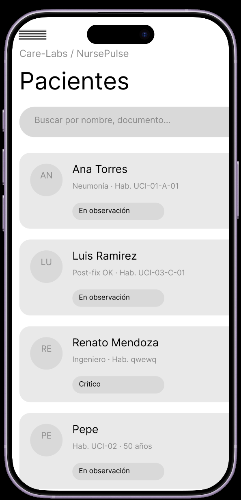
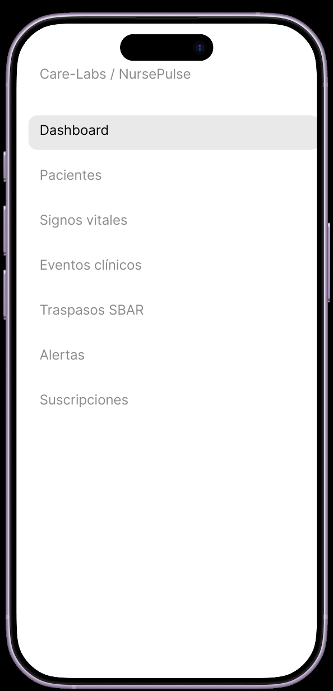
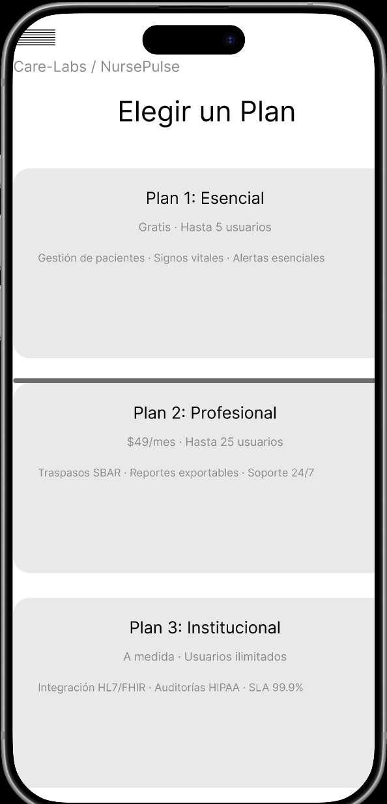
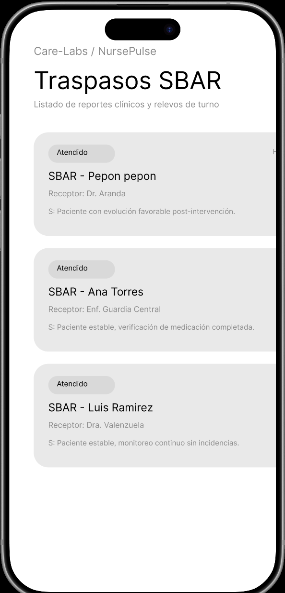
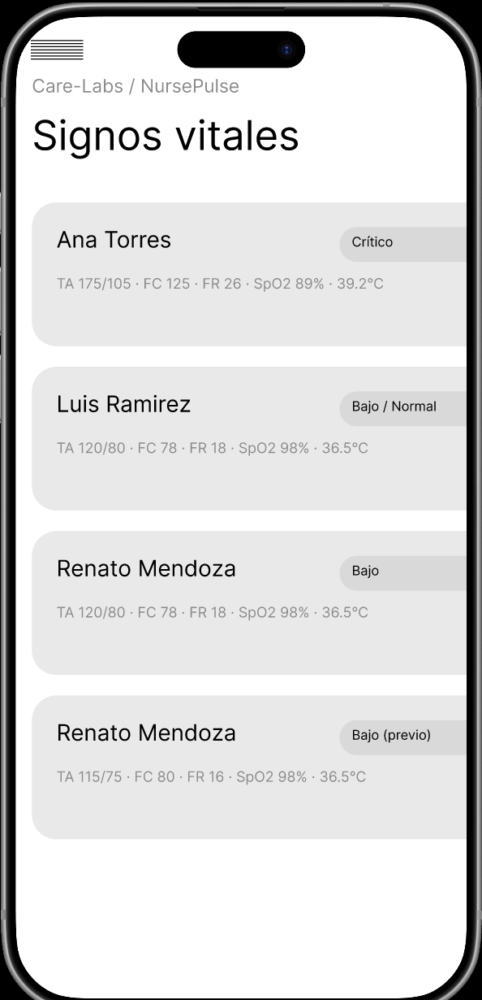

#### 4.1.3.2 Android Mobile Style Guidelines

En Android, la interfaz utiliza la misma base visual definida en el Web Style Guidelines (paleta de color, tipografía y jerarquía), adaptándose a los principios de Material Design.

**Adaptaciones principales**

- Uso de **Navigation Drawer** para la navegación principal en pantallas angostas (teléfono), reemplazado por un **Navigation Rail** en pantallas más anchas (tablet), manteniendo siempre el mismo orden de módulos: Dashboard, Pacientes, Signos vitales, Eventos clínicos, Traspasos SBAR, Alertas y Suscripciones.
- Inclusión de **Floating Action Button (FAB)** para la acción principal de cada módulo: "Nuevo paciente", "Registrar" (signos vitales), "Registrar traspaso" (SBAR) y "Registrar alerta".
- Tarjetas (**Card**) con bordes redondeados y contorno sutil en lugar de sombras pronunciadas, para conservar el mismo estilo plano y ordenado de la Web Application.
- Feedback táctil mediante el efecto **ripple** nativo de Material en listas, botones y elementos interactivos.
- Uso de **Snackbar** para mensajes temporales de error o confirmación (por ejemplo, al perder la conexión con el servidor o al completar un registro exitosamente).
- Misma paleta de color y tipografía que la Web Application (teal `#0F766E` como color primario sobre fondo claro), asegurando consistencia de marca entre ambas plataformas.

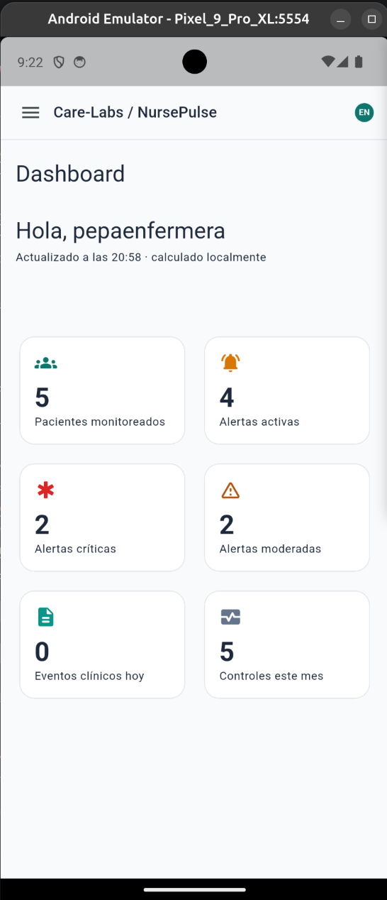

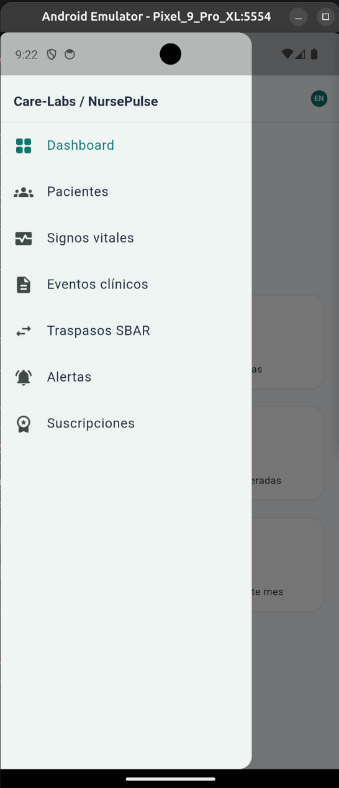

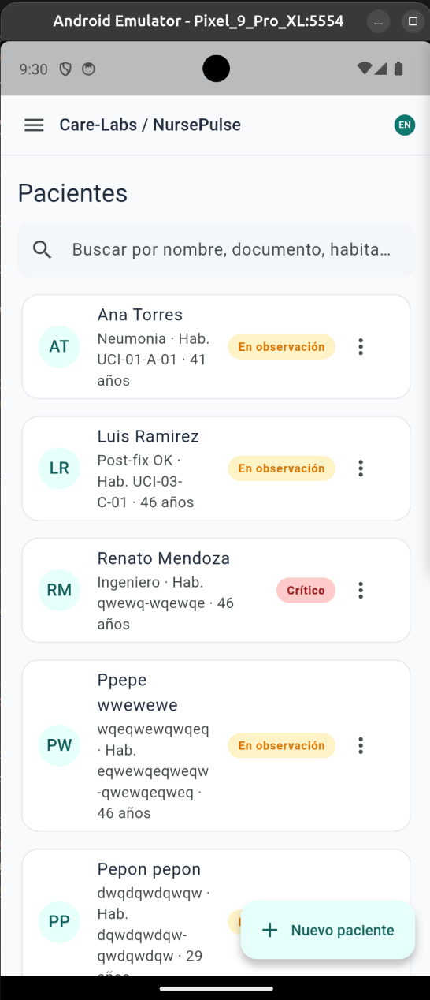

### 4.2. Information Architecture
#### 4.2.1. Organization Systems

1. Organization Scheme (Esquema de organización)
- Temático/Funcional: la información se organiza según las funciones principales del sistema:
    - Gestión de usuarios (registro, login, perfil, documentos).
    - Gestión clínica (pacientes, tratamientos, signos vitales, historial clínico).
    - Traspasos y comunicación asistencial (SBAR, seguimiento entre turnos y áreas).
    - Landing Page (información y promoción del producto).
    - Reportes y analítica.

2. Organization Structure (Estructura de organización)

- Jerárquica (Árbol): desde la Landing Page como entrada, se navega a los módulos principales del sistema.
- Lineal: en procesos como registro de cuenta, ingreso de pacientes o traspaso SBAR, los pasos siguen una secuencia.
- Matriz: en búsquedas y filtrados, por ejemplo en pacientes o reportes, donde la información puede organizarse por fecha, estado clínico, área asistencial o tipo de registro.

3. Organization System (Sistema de organización aplicado)
- Global navigation (menú principal en el header): acceso a
    - Home (Landing Page)
    - Pacientes
    - Traspasos SBAR
    - Tratamientos
    - Reportes
    - Contacto

- Local navigation (submenús dentro de cada sección):
    - Pacientes → Registrar, Historial, Signos vitales.
    - Traspasos SBAR → Pendientes, En revisión, Aprobados.
    - Tratamientos → Activos, Seguimiento, Finalizados.
    - Reportes → Pacientes, Tratamientos, Eventos críticos.

- Contextual navigation (botones de acción dentro de un flujo):
    - “Registrar paciente”
    - “Guardar SBAR”
    - “Actualizar signos vitales”
    - “Generar reporte”


### 4.2.2. Labeling Systems

**Objetivos**

- Facilitar la identificación rápida de módulos, secciones y funciones dentro de la Landing Page y la Web Application.
- Mantener consistencia en los nombres utilizados en navegación, formularios, tablas y reportes.
- Mejorar la comprensión del sistema por parte de los usuarios, empleando etiquetas claras, breves y fáciles de reconocer.
- Favorecer una navegación intuitiva y una mejor organización del contenido, tanto en la parte informativa como en la operativa.

**Estructura recomendada**

- Estructura: **Módulo principal → Submódulo → Acción o estado**.
  - Ejemplo: **Inventario > Registrar ítem > Guardar**
  - Ejemplo: **Inspecciones > Pendientes > Revisar**
  - Ejemplo: **Perfil > Documentos > Cargar archivo**

- Tipos de etiquetas:
  - **Módulos**: nombres principales de navegación, como `Inicio`, `Inventario`, `Inspecciones`, `Perfil`, `Reportes`, `Contacto`.
  - **Submódulos**: categorías internas dentro de cada sección, como `Stock actual`, `Historial`, `Pendientes`, `Aprobados`, `Documentos`.
  - **Acciones**: etiquetas orientadas a tareas, como `Registrar`, `Editar`, `Guardar`, `Enviar`, `Generar reporte`.
  - **Estados**: etiquetas para representar la situación de un elemento, como `Pendiente`, `En revisión`, `Aprobado`, `Rechazado`, `Activo`.

**Convenciones (formato)**

- Uso de palabras claras y comprensibles para el usuario final.
- Etiquetas breves, directas y consistentes en toda la interfaz.
- En navegación y botones se priorizan etiquetas de **1 a 3 palabras**.
- Para URLs y slugs se utiliza formato en minúsculas y con guiones.
  - Ejemplo: `inventario/stock-actual`
  - Ejemplo: `inspecciones/en-revision`
- En la interfaz visible se emplean nombres legibles y amigables.
  - Ejemplo: `Stock actual`
  - Ejemplo: `Generar reporte`

**Modelo de datos (ejemplo JSON)**

```json
{
  "id": "lbl_001",
  "type": "module",
  "slug": "inventario",
  "name": "Inventario",
  "parent_id": null,
  "created_at": "2026-04-21T10:00:00Z"
}

```

#### Interfaz de gestión
- Gestión centralizada de etiquetas para mantener uniformidad entre la Landing Page y la Web Application.
- Posibilidad de reutilizar etiquetas en menús, tablas, formularios y botones.
- Edición sencilla de nombres visibles sin afectar la lógica interna del sistema.
- Vista previa del uso de cada etiqueta dentro de menús, breadcrumbs o secciones.

#### Reglas y validaciones
- No se permiten etiquetas duplicadas dentro de un mismo contexto.
- Cada etiqueta debe tener un nombre visible y un identificador interno único.
- Se valida que las etiquetas sean consistentes con la jerarquía del sistema.
- Se recomienda reutilizar etiquetas existentes antes de crear nuevas.
- Los nombres deben evitar tecnicismos innecesarios o abreviaturas confusas.

#### Ejemplos de uso en URLs
- `/inventario/stock-actual`
- `/inventario/historial`
- `/inspecciones/aprobados`

#### 4.2.3. SEO Tags and Meta Tags

**Objetivos**

- Mejorar la visibilidad de la **Landing Page** de **PulseReport** en motores de búsqueda.
- Aumentar el CTR en resultados de búsqueda mediante títulos y descripciones claras y atractivas.
- Optimizar la vista previa al compartir enlaces en redes sociales usando **Open Graph** y **Twitter Cards**.
- Controlar qué páginas deben indexarse y cuáles no, diferenciando entre la **Landing Page pública** y la **Web Application privada**.
- Incorporar datos estructurados para describir el producto digital y la organización.

**Meta tags clave (plantilla)**

```html
<title>{{page_title}} | Care-Labs</title>
<meta name="description" content="{{page_description}}" />
<link rel="canonical" href="{{canonical_url}}" />
<meta name="robots" content="{{robots_value}}" />

<!-- Open Graph -->
<meta property="og:title" content="{{page_title}} | Care-Labs" />
<meta property="og:description" content="{{page_description}}" />
<meta property="og:image" content="{{og_image}}" />
<meta property="og:url" content="{{canonical_url}}" />
<meta property="og:type" content="website" />
<meta property="og:site_name" content="Care-Labs" />

<!-- Twitter Card -->
<meta name="twitter:card" content="summary_large_image" />
<meta name="twitter:title" content="{{page_title}} | Care-Labs" />
<meta name="twitter:description" content="{{page_description}}" />
<meta name="twitter:image" content="{{twitter_image}}" />
```
**Reglas prácticas**

- **Título**: entre 50 y 60 caracteres, incluyendo el nombre del producto o de la empresa.
- **Meta description**: entre 120 y 160 caracteres, explicando de forma clara la propuesta de valor.
- **Canonical**: obligatorio en páginas públicas para evitar contenido duplicado.
- **Meta robots**:
  - `index, follow` para la **Landing Page** y secciones públicas.
  - `noindex, nofollow` para páginas privadas del sistema como dashboard, perfil o reportes internos.
- Las palabras clave deben enfocarse en términos como:
  - comunicación clínica,
  - trazabilidad en tiempo real,
  - continuidad asistencial,
  - software de gestión clínica,
  - plataforma de salud digital.

**JSON-LD (ejemplo para el producto digital)**

```html
<script type="application/ld+json">
{
  "@context": "https://schema.org",
  "@type": "SoftwareApplication",
  "name": "PulseReport",
  "applicationCategory": "HealthApplication",
  "operatingSystem": "Web",
  "description": "Plataforma web de Pulse-Report orientada a mejorar la comunicación clínica, la trazabilidad y el seguimiento en tiempo real.",
  "publisher": {
    "@type": "Organization",
    "name": "Care-Labs"
  },
  "url": "https://care-labs.com/pulsereport"
}
</script>
```
**Renderizado (server vs client)**

- Para la **Landing Page**, es recomendable utilizar **prerendering** o **SSR**, de modo que los meta tags estén disponibles desde la carga inicial y sean interpretados correctamente por los motores de búsqueda.
- En el caso de Angular, esto puede implementarse mediante opciones de **Angular SSR** o **prerender** para mejorar el posicionamiento SEO.
- Para la **Web Application interna**, el SEO no es prioritario, ya que su contenido es funcional y de acceso restringido.

**Sitemaps y robots.txt**

- `sitemap.xml`: incluir únicamente las rutas públicas relevantes, como:
  - Inicio
  - Características
  - Beneficios
  - Preguntas frecuentes
  - Contacto
- `robots.txt`: permitir el rastreo de la Landing Page y bloquear secciones privadas o internas del sistema.
- Ejemplo:
  - permitir indexación de `/`
  - bloquear rutas como `/dashboard`, `/perfil`, `/reportes-internos` o cualquier módulo autenticado.

#### 4.2.4. Searching Systems.

**Requerimientos funcionales**

- Búsqueda por texto en módulos clave como pacientes, tratamientos, traspasos SBAR y reportes.
- Autocomplete / sugerencias para acelerar la localización de pacientes, registros o áreas asistenciales.
- Filtros por estado, fecha, área, tipo de registro o nivel de prioridad.
- Búsqueda por historial clínico o eventos asociados al paciente.
- Ordenamiento de resultados por fecha, estado, prioridad o coincidencia.
- Visualización clara de resultados para facilitar la identificación rápida de la información.
- Posibilidad de combinar búsqueda + filtros en tablas y paneles del sistema.

**Opciones de tecnología (comparativa rápida)**

- **PostgreSQL Full-Text Search**
  - Pros: integrado, práctico y suficiente para búsquedas básicas dentro del sistema.
  - Contras: menor flexibilidad para búsquedas avanzadas o ranking complejo.

- **Elasticsearch / OpenSearch**
  - Pros: alto rendimiento, búsquedas avanzadas, filtros potentes y mejor relevancia.
  - Contras: requiere infraestructura adicional y mayor mantenimiento.

- **Algolia (SaaS)**
  - Pros: búsqueda muy rápida, autocomplete eficiente y buena experiencia de usuario.
  - Contras: dependencia de un servicio externo y costo adicional.

**Esquema de índice (ejemplo para Elastic)**

```json
{
  "mappings": {
    "properties": {
      "id": { "type": "keyword" },
      "patient_name": { "type": "text", "analyzer": "standard" },
      "clinical_area": { "type": "keyword" },
      "sbar_status": { "type": "keyword" },
      "treatment_status": { "type": "keyword" },
      "record_type": { "type": "keyword" },
      "created_at": { "type": "date" },
      "priority": { "type": "keyword" }
    }
  }
}
```

#### 4.2.5. Navigation Systems.

A continuación, se presenta el sistema de navegación de **PulseReport**, el cual permite al usuario desplazarse tanto en la **Landing Page** como en la **Web Application** de manera clara, ordenada y consistente.

La navegación fue definida considerando los principales perfiles del producto: visitantes interesados en conocer la solución, personal de enfermería cardiovascular, médicos especialistas cardiovasculares y usuarios administradores de la plataforma. Esto permite diferenciar la navegación informativa de la Landing Page y la navegación operativa de la Web Application.

Se implementará un sistema de navegación que facilite el acceso rápido a las principales secciones del producto, manteniendo consistencia visual y funcional en toda la experiencia web. Esto permitirá que los usuarios identifiquen fácilmente dónde se encuentran y hacia dónde pueden dirigirse dentro de la plataforma.

**Estructura del Sistema de Navegación**

- **Navegación global**: ubicada en el header principal, permite acceder a las secciones principales de la Landing Page, como inicio, beneficios, características, planes, preguntas frecuentes, equipo y contacto. En la Web Application, permite acceder a módulos como dashboard, pacientes, signos vitales, traspasos SBAR, eventos clínicos, reportes, auditoría y suscripciones.

- **Navegación local**: presente dentro de cada módulo de la Web Application, facilita el acceso a subsecciones específicas. Por ejemplo:
  - Pacientes → listado, detalle del paciente, registros clínicos y signos vitales.
  - Traspasos SBAR → creación de traspaso, consulta de traspasos y confirmación de recepción.
  - Signos vitales → registro, historial y último registro del paciente.
  - Suscripciones → visualización de planes, selección de plan y estado de suscripción.

- **Navegación contextual**: integrada mediante botones y acciones dentro de cada flujo, permitiendo ejecutar tareas específicas como:
  - “Registrar paciente”
  - “Registrar signos vitales”
  - “Guardar SBAR”
  - “Ver historial”
  - “Seleccionar plan”
  - “Generar reporte”

- **Consistencia de navegación**: los menús, accesos y botones mantienen una ubicación y estilo uniforme, ayudando a que el usuario navegue de manera intuitiva y sin confusión entre las distintas secciones.


### 4.3. Landing Page UI Design.
La Landing Page de NursePulse fue diseñada como el principal punto de entrada público al producto. Su objetivo es comunicar rápidamente la propuesta de valor, explicar el problema de información clínica dispersa, presentar beneficios, características, planes, preguntas frecuentes, equipo y canales de contacto.

El diseño considera distintos perfiles de visitantes. Para usuarios recurrentes, se priorizan llamados a la acción visibles en la parte superior. Para visitantes emocionales, se utiliza una sección hero clara con mensaje directo sobre continuidad clínica y reducción de pérdida de información. Para visitantes racionales, se incluyen secciones de características, beneficios, planes, preguntas frecuentes y testimonios que permiten evaluar el valor de la solución.

#### 4.3.1. Landing Page Wireframe.

El wireframe de la landing page de **NursePulse** presenta una estructura clara y ordenada, diseñada para comunicar la propuesta de valor del producto de forma directa. La página incluye secciones estratégicas como hero section, funcionamiento, características, beneficios, preguntas frecuentes, contacto y llamados a la acción que orientan al usuario durante la navegación.

- **Inicio**: en la parte superior se ubica el logo principal de **NursePulse** junto con la barra de navegación, que permite acceder a las principales secciones de la landing page. Además, se incluye un botón de **“Solicitar demo”** como llamado a la acción destacado, con el objetivo de captar rápidamente el interés del usuario.


- **¿Cómo funciona?**: en esta sección se explica de forma breve y visual cómo funciona la solución, mostrando el flujo general del producto en pasos simples. Esto permite que el usuario comprenda rápidamente la lógica de uso de **NursePulse** dentro del entorno clínico.


- **Características**: se presentan las funcionalidades principales de la plataforma, como traspasos SBAR, gestión de pacientes, seguimiento de tratamientos, monitoreo de signos vitales, historial clínico digital y log de auditoría. Estas características se muestran en bloques simples con descripciones breves para facilitar la comprensión del producto.


- **Beneficios y FAQs**: esta sección destaca el valor agregado de la solución, resaltando beneficios como una mejor comunicación entre turnos, mayor trazabilidad clínica, organización de la información y atención más confiable. Además, se incluye una sección de preguntas frecuentes para resolver dudas comunes y reforzar la claridad de la propuesta.


- **Contacto y Footer**: en la parte final se encuentra el formulario de contacto, que permite a los usuarios interesados enviar consultas o solicitar información adicional sobre la plataforma. Finalmente, el footer incluye información general de la marca y accesos complementarios a secciones relevantes de la landing page.


#### 4.3.2. Landing Page Mock-up


### 4.4. Mobile Application UX/UI Design

El diseño UX/UI de la aplicación móvil de **NursePulse** sigue un proceso iterativo desde baja hasta alta fidelidad, partiendo de wireframes que definen la estructura y jerarquía de cada pantalla, hasta llegar a mock-ups de alta fidelidad y un prototipo interactivo navegable. El objetivo es validar los flujos de trabajo del personal de enfermería (registro de pacientes, signos vitales, traspasos SBAR y alertas) antes de su implementación final.

#### 4.4.1. Mobile Applications Wireframes

Los wireframes representan la estructura base de las pantallas principales de la aplicación móvil, priorizando la disposición de elementos y la jerarquía de información sobre el estilo visual.

**Pantallas incluidas**
- Inicio de sesión y registro
- Dashboard
- Listado de pacientes y formulario de registro/edición
- Listado y registro de signos vitales
- Listado y registro de traspasos SBAR
- Listado y registro de alertas


### Register 
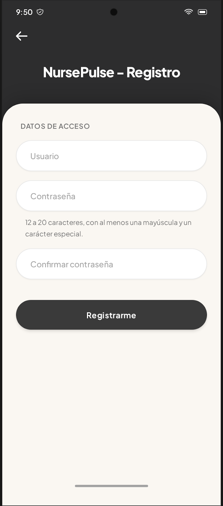

### Login
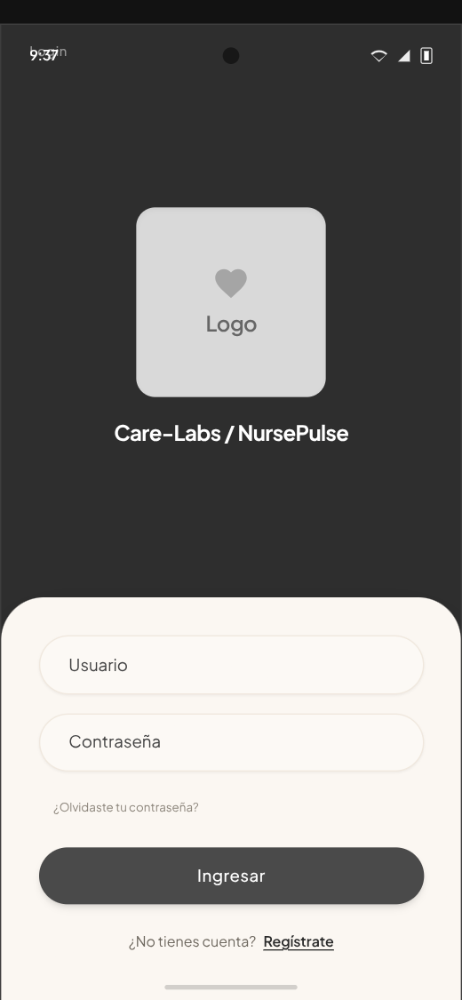

### Dashboard
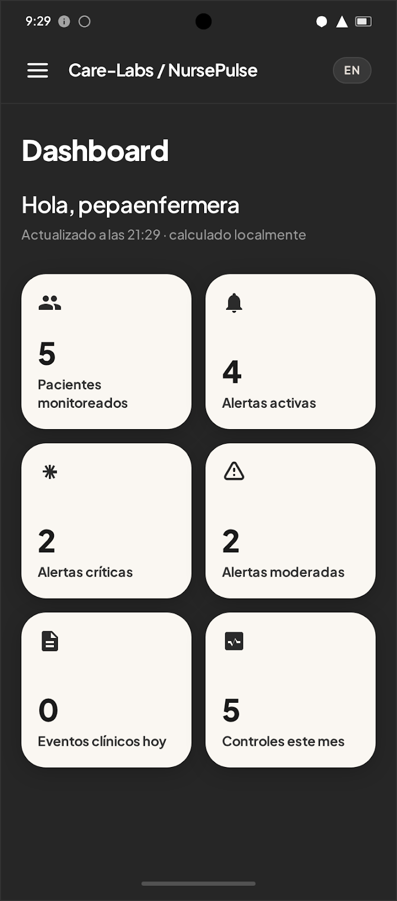

### List of Patients
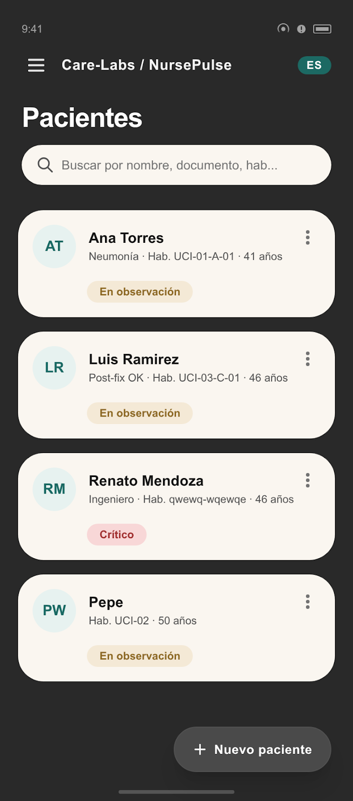

### Signos Vitales
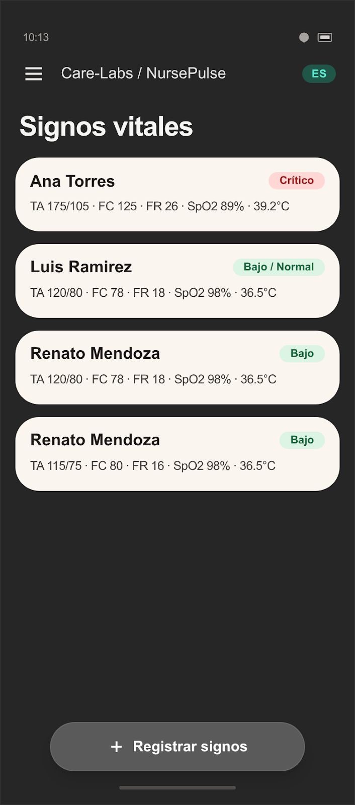

### SBAR
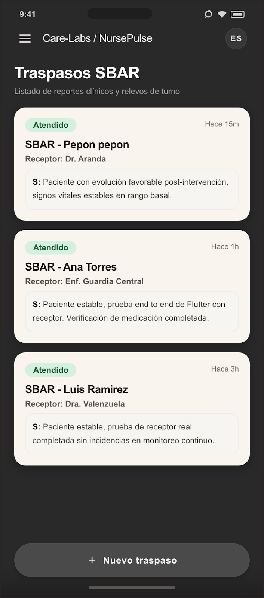

### Alertas
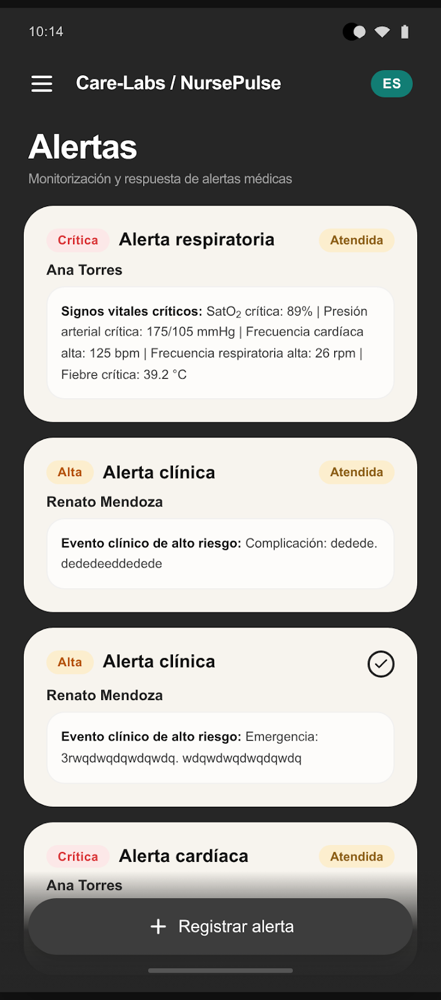


#### 4.4.2. Mobile Applications Wireflow Diagrams

Los wireflow diagrams combinan los wireframes de cada pantalla con flechas de navegación, mostrando cómo el usuario se desplaza entre pantallas al completar una acción (por ejemplo, registrar un paciente y luego navegar a su monitoreo, o registrar un traspaso SBAR y volver al listado).

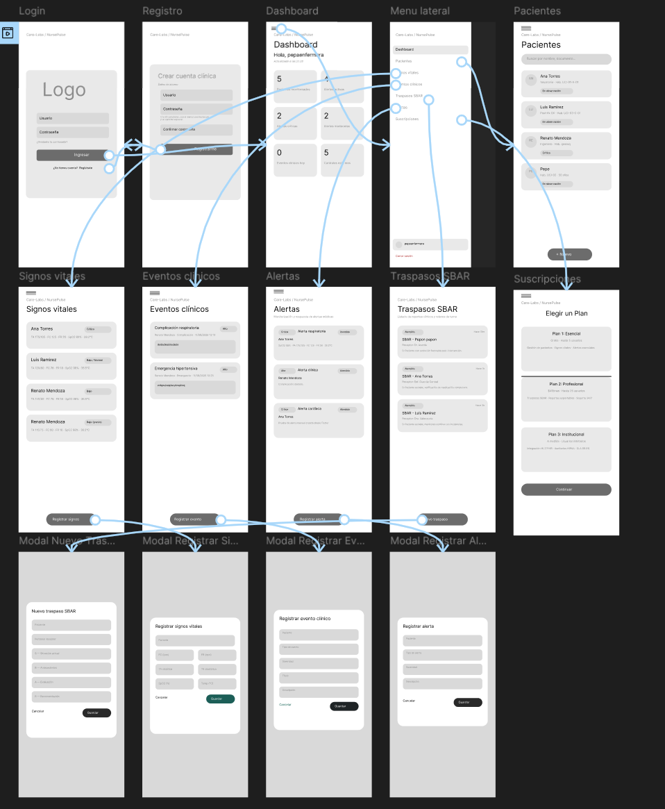

#### 4.4.3. Mobile Applications Mock-ups


Los mock-ups aplican la paleta de color, tipografía e iconografía definidas en el Style Guidelines sobre los wireframes ya validados, representando la apariencia final de la aplicación tal como la ve el usuario.

  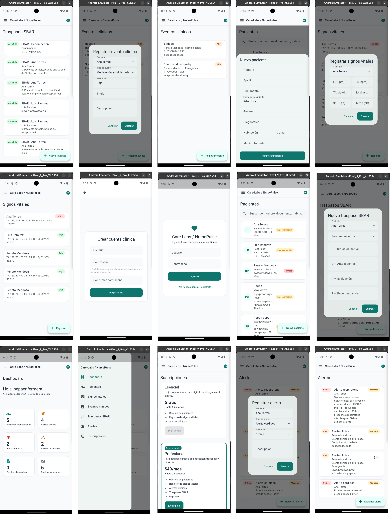

#### 4.4.4. Mobile Applications User Flow Diagrams

Los user flow diagrams documentan el recorrido completo del usuario dentro de la aplicación móvil para cumplir una tarea específica, considerando puntos de decisión y posibles caminos alternativos (por ejemplo, el flujo de una enfermera al recibir un traspaso SBAR: revisar el listado, abrir el detalle, y confirmar la recepción).

#### User Goal 1: Usuario desea registrarse en la aplicación

#### Happy Path

En esta ruta esperada, el flujo concentra un proceso de registro de cuenta clínica en la aplicación. El usuario es recibido por la pantalla de inicio de sesión, presiona "Regístrate" y completa el formulario con usuario, tipo de cuenta, contraseña y confirmación de contraseña. Al validarse correctamente los datos, la cuenta se crea y el usuario puede iniciar sesión.

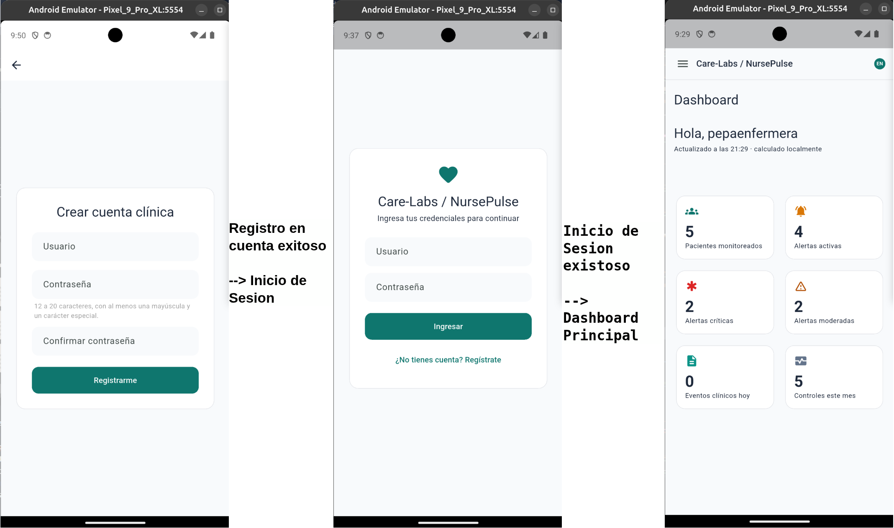

#### Unhappy Path

Estas rutas alternas consideran que el usuario ingresó una contraseña que no cumple la política de seguridad (menos de 12 caracteres, sin mayúscula o sin carácter especial), que las contraseñas no coinciden entre sí, o que el nombre de usuario ya existe en el sistema, impidiendo la creación de la cuenta hasta corregir el dato señalado.

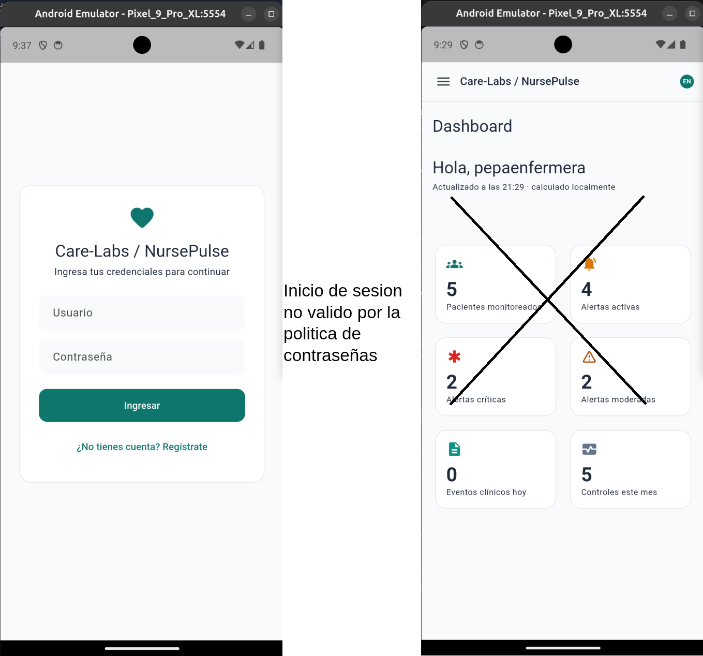

#### User Goal 2: Enfermero(a) desea registrar un nuevo paciente

#### Happy Path

En esta ruta esperada, el flujo concentra el registro de un paciente en el módulo de Pacientes. El usuario presiona "Nuevo paciente", completa nombre, apellido, documento, fecha de nacimiento, género, diagnóstico, habitación, cama y médico tratante. Al guardar, el paciente aparece inmediatamente en el listado con estado "En observación".

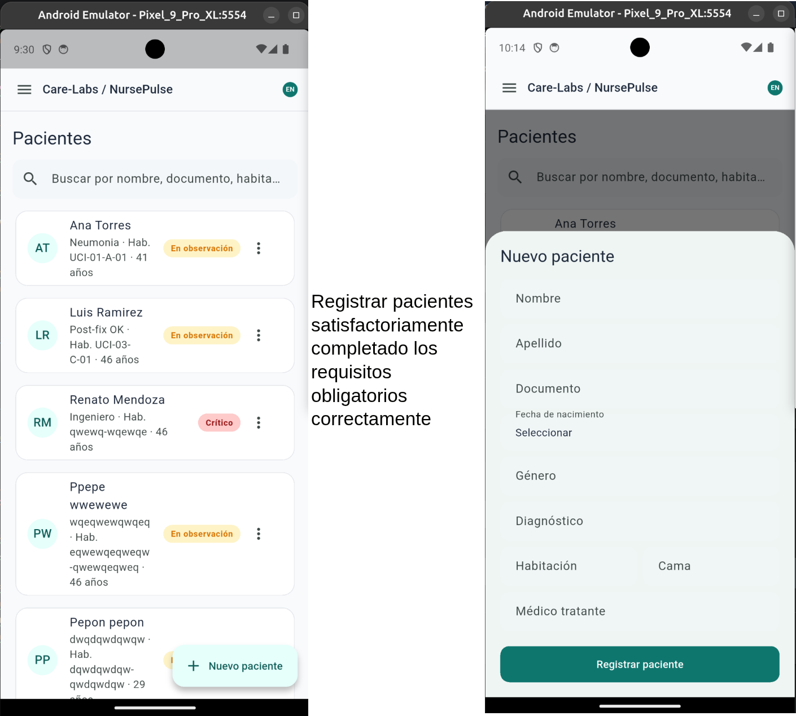

#### Unhappy Path

Estas rutas alternas toman en cuenta que el usuario dejó algún campo obligatorio vacío, o que el número de documento ingresado ya pertenece a otro paciente registrado en el sistema, mostrando un mensaje de error y evitando la duplicidad de registros.


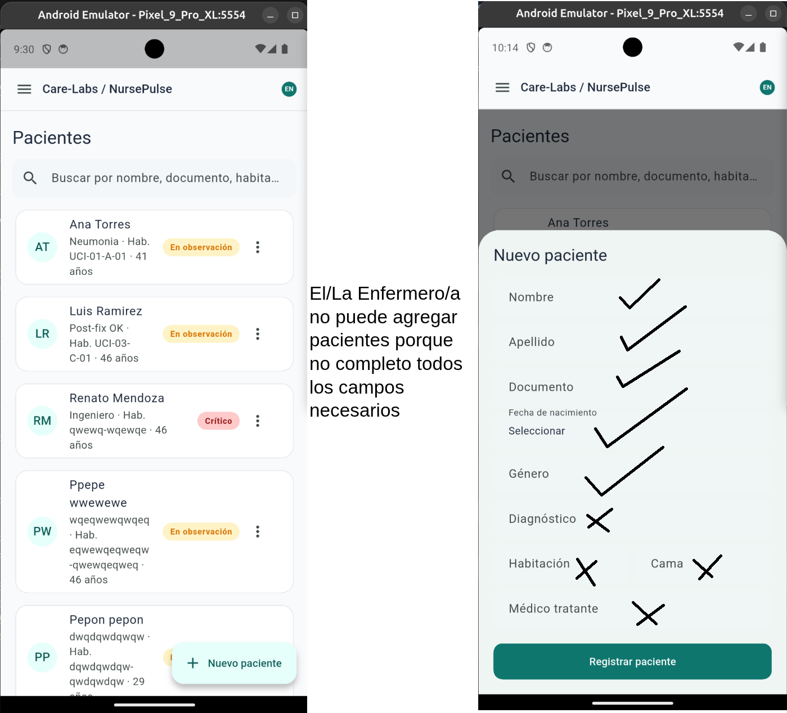


#### User Goal 3: Enfermero(a) desea registrar signos vitales de un paciente

#### Happy Path

En esta ruta esperada, el flujo concentra el registro de signos vitales desde el módulo correspondiente. El usuario presiona "Registrar", selecciona al paciente e ingresa frecuencia cardíaca, frecuencia respiratoria, presión arterial, saturación de oxígeno y temperatura. Al guardar, el sistema calcula automáticamente el nivel de riesgo clínico y lo muestra en el listado.

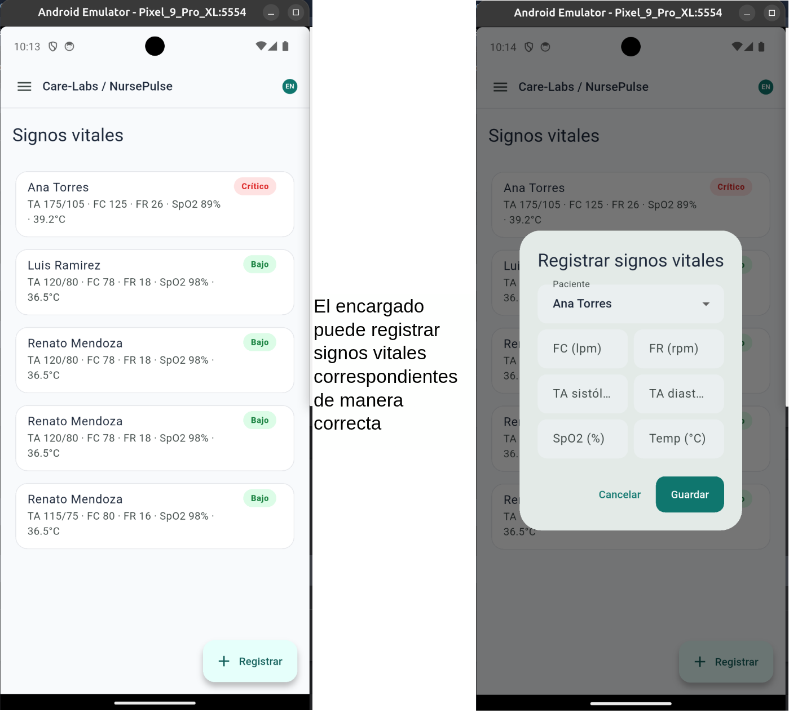

#### Unhappy Path

Estas rutas alternas consideran que el usuario ingresó un valor fuera del rango clínico permitido (por ejemplo, una frecuencia cardíaca de 999 lpm), o que la presión sistólica ingresada es menor o igual a la diastólica, bloqueando el guardado hasta que los valores sean clínicamente coherentes.

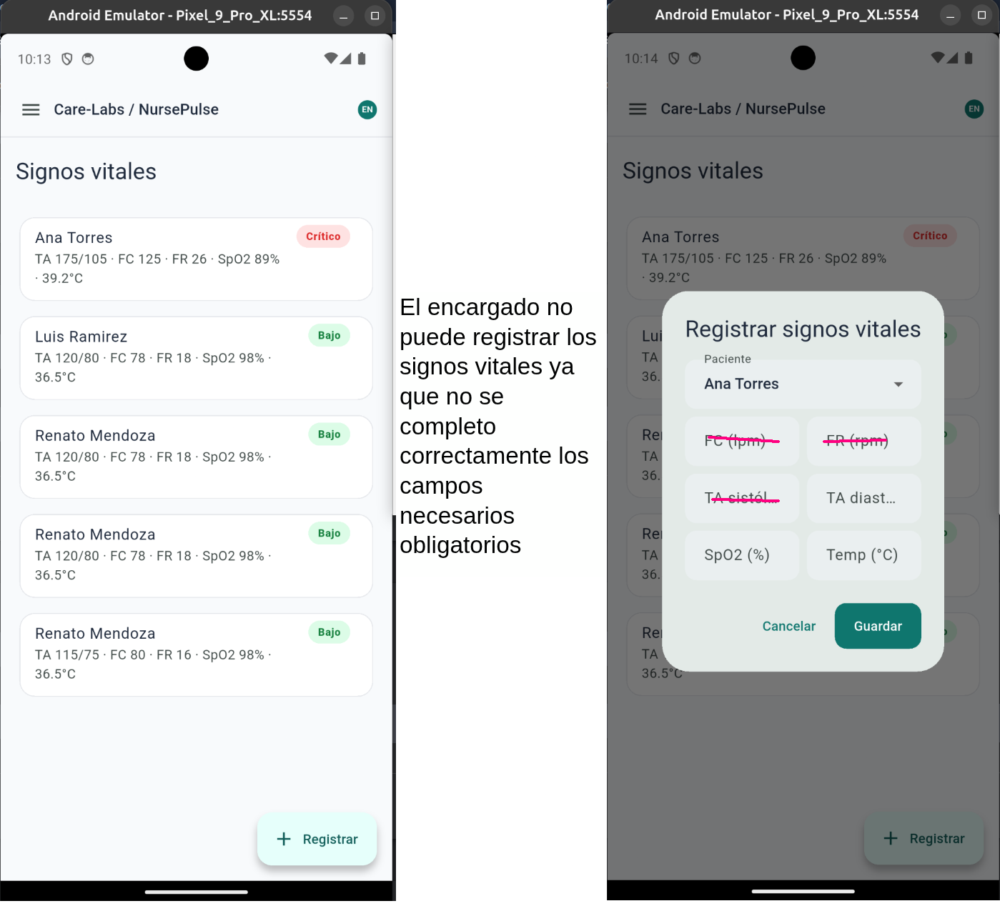


#### User Goal 4: Enfermero(a) desea registrar un traspaso SBAR

#### Happy Path

En esta ruta esperada, el flujo concentra la creación de un traspaso de turno. El usuario presiona "Nuevo traspaso", selecciona al paciente y al personal receptor, y completa los cuatro campos estructurados: Situación, Antecedentes, Evaluación y Recomendación. Al guardar, el traspaso queda visible para el receptor con estado "Pendiente" hasta que este confirme la recepción.


#### Unhappy Path

Estas rutas alternas toman en cuenta que el usuario no seleccionó un personal receptor, o que dejó alguno de los cuatro campos SBAR vacío, impidiendo el envío del traspaso hasta completar la información requerida.

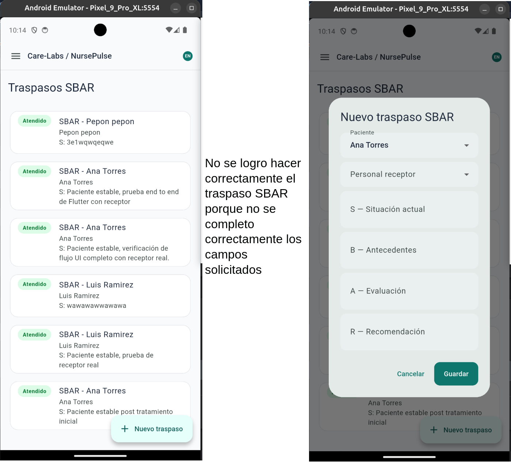

#### User Goal 5: Enfermero(a) desea registrar una alerta clínica

#### Happy Path

En esta ruta esperada, el flujo concentra el registro manual de una alerta clínica. El usuario presiona "Registrar alerta", selecciona al paciente, el tipo de alerta (cardíaca, respiratoria, neurológica, caída o medicación), la severidad y una descripción del evento. Al guardar, la alerta aparece en el listado con estado "Activa", disponible para ser atendida por el personal de turno.

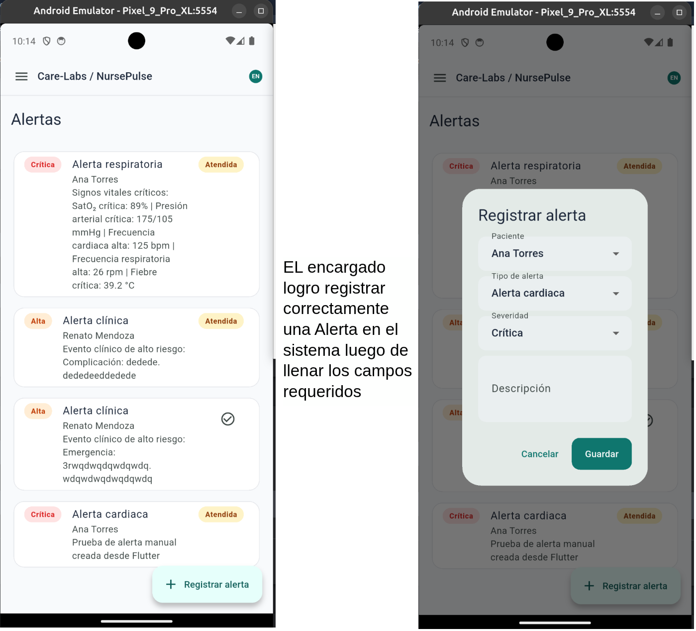

#### Unhappy Path

Estas rutas alternas consideran que el usuario dejó la descripción vacía, o que intentó registrar la alerta sin seleccionar previamente un paciente, mostrando un mensaje de validación y evitando el registro de una alerta incompleta.


### 4.5. Mobile Applications Prototyping
El prototipo interactivo permite validar la navegación real entre pantallas y los flujos críticos de la aplicación antes de su desarrollo, simulando la experiencia final del usuario sobre los mock-ups de alta fidelidad.


#### 4.5.1. Android Mobile Applications Prototyping
El prototipo para Android reproduce fielmente los componentes de Material Design definidos en el Style Guidelines (Navigation Drawer, FAB, Cards, Snackbar), permitiendo navegar entre el listado de pacientes, el registro de signos vitales y los traspasos SBAR de forma interactiva.

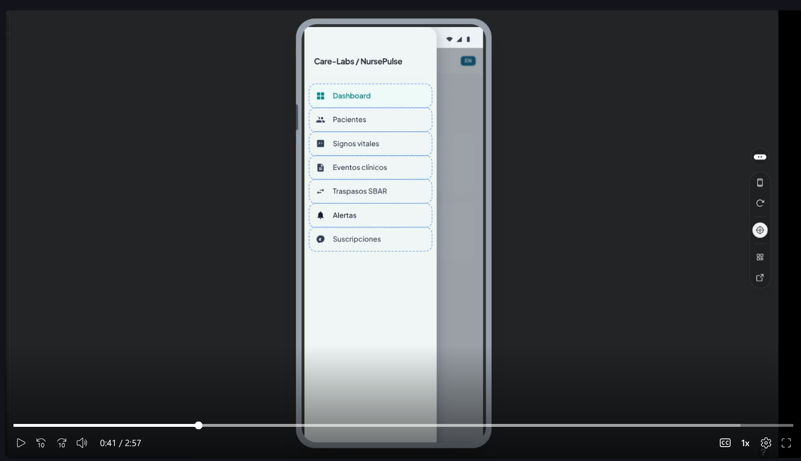

**Prototipo de Android:** [Video Android](https://upcedupe-my.sharepoint.com/:v:/g/personal/u202313458_upc_edu_pe/IQBbxeDWgAbDSZDhf4L2BzW7Ac6eRDZvO-kiqTK9NjEEUdI?nav=eyJyZWZlcnJhbEluZm8iOnsicmVmZXJyYWxBcHAiOiJTdHJlYW1XZWJBcHAiLCJyZWZlcnJhbFZpZXciOiJTaGFyZURpYWxvZy1MaW5rIiwicmVmZXJyYWxBcHBQbGF0Zm9ybSI6IldlYiIsInJlZmVycmFsTW9kZSI6InZpZXcifX0%3D&e=eVSzdP)
#### 4.5.2. iOS Mobile Applications Prototyping
El prototipo para iOS reutiliza las mismas pantallas y flujos definidos para Android, dado que ambas plataformas comparten un único diseño visual basado en Material Design, adaptado únicamente a las convenciones propias del sistema operativo (safe area y gestos nativos).

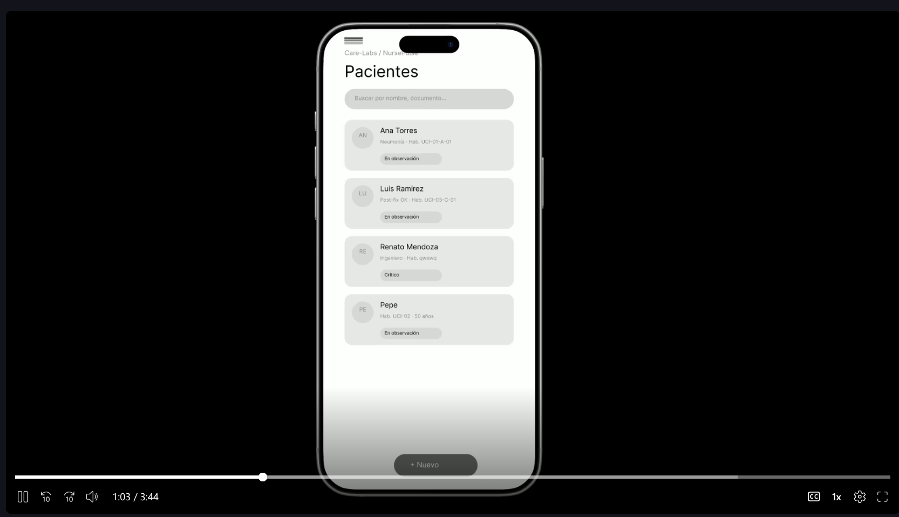

**Prototipo IOS: ** [Video iOS](https://upcedupe-my.sharepoint.com/:v:/g/personal/u202313458_upc_edu_pe/IQAfEjEEL4pDQbMwtBbhrwyqAXkSaqFvZuvOyDn2tJcdTHA?nav=eyJyZWZlcnJhbEluZm8iOnsicmVmZXJyYWxBcHAiOiJTdHJlYW1XZWJBcHAiLCJyZWZlcnJhbFZpZXciOiJTaGFyZURpYWxvZy1MaW5rIiwicmVmZXJyYWxBcHBQbGF0Zm9ybSI6IldlYiIsInJlZmVycmFsTW9kZSI6InZpZXcifX0%3D&e=FnRXm1)
### 4.6. Web Applications UX/UI Design
#### 4.6.1. Web Applications Wireframes


#### 4.6.2. Web Applications Wireflow Diagrams

#### User Goal 1

Segmento: Personal de enfermería cardiovascular
User Goal: Registrar signos vitales y evaluar la evolución clínica del paciente.
Explicación: El usuario ingresa al perfil del paciente y selecciona registrar signos vitales. En la ruta esperada (happy path), ingresa los valores, el sistema los valida, guarda el registro y actualiza la gráfica en tiempo real. Como flujos alternativos (unhappy paths), si el usuario ingresa valores incompletos o fuera de los rangos biológicos lógicos, el sistema detiene el flujo y muestra advertencias de validación para evitar errores médicos.


#### User Goal 2
Segmento: Personal de enfermería cardiovascular
User Goal: Realizar el traspaso de información clínica entre turnos utilizando el modelo SBAR.
Explicación: El enfermero inicia un nuevo reporte SBAR. El flujo principal lo guía obligatoriamente por las 4 secciones (Situación, Antecedentes, Evaluación, Recomendación) hasta su publicación exitosa. En rutas alternativas, si el usuario intenta cancelar el proceso o cerrar la ventana, el sistema interrumpe la acción con un modal de confirmación para evitar la pérdida de documentación crítica.


#### User Goal 3
Segmento: Hospitales, clínicas privadas y centros especializados en cardiología
User Goal: Monitorear procesos críticos y revisar la trazabilidad del área cardiovascular.
Explicación: El supervisor ingresa al Dashboard para revisar el estado general. El flujo ideal permite hacer clic en una métrica o alerta activa para ser redirigido al log de auditoría detallado del paciente involucrado. En un flujo alternativo, si el supervisor aplica filtros de búsqueda para fechas sin actividad registrada, el sistema le indica claramente que no existen eventos, permitiéndole reajustar su búsqueda rápidamente.


#### 4.6.3. Web Applications Mock-ups 

#### Perfil

Esta interfaz está dedicada a la gestión de la información personal y profesional del usuario, ya sea personal de enfermería o administrador. Permite la configuración de la cuenta, visualización de roles y administración de credenciales de acceso.


#### Detalle Clínico

Vista especializada que expone la información médica detallada de un paciente específico. Centraliza diagnósticos cardiovasculares, tratamientos activos, medicación y notas clínicas relevantes para asegurar la continuidad del cuidado.


#### Alertas

Panel de notificaciones y advertencias críticas del sistema. Está diseñado para informar al personal de salud de manera inmediata sobre anomalías en los parámetros de los pacientes, garantizando un tiempo de respuesta rápido ante emergencias.


#### Eventos Clínicos

Interfaz orientada al registro y visualización de sucesos médicos importantes ocurridos durante el turno. Facilita la trazabilidad de las intervenciones y apoya directamente la comunicación estructurada mediante el modelo SBAR.


#### Signos Vitales

Módulo enfocado en el monitoreo y registro de los parámetros fisiológicos del paciente. Permite un seguimiento preciso de métricas clave en cardiología, como la presión arterial y la frecuencia cardíaca, mostrando su evolución temporal.


#### Paciente
Sección general para la administración de los datos demográficos, información de contacto y estado de admisión de los pacientes dentro del centro de salud, sirviendo como punto de partida para acceder a su historial completo.


#### Dashboard
Panel de control principal que ofrece una visión panorámica y resumida del entorno clínico. Muestra indicadores clave de rendimiento, el estado general del área cardiovascular y un resumen de las tareas y pacientes de mayor prioridad.


#### 4.6.4. Web Applications User Flow Diagrams

En esta sección se presentan los diagramas de flujo de usuario que detallan la lógica de navegación y los puntos de decisión dentro de Care-Labs. Estos flujos han sido diseñados para garantizar que el personal de enfermería y los administradores cumplan sus objetivos de manera eficiente, integrando rutas principales y alternativas para el manejo de datos críticos.  Los diagramas reflejan la interacción completa del sistema, asegurando la consistencia con los wireflows previos y validando cada paso del proceso clínico, desde el registro de signos vitales hasta la supervisión de alertas en el dashboard.  


### 4.7. Web Applications Prototyping.

En esta sección se presentan los prototipos de interfaz web de Care-Labs, desarrollados para simular los principales flujos de interacción de la plataforma en navegador web. Los prototipos fueron diseñados considerando una arquitectura de información organizada por perfiles de usuario: personal de enfermería cardiovascular y administración o supervisión clínica.

Las decisiones de interacción se enfocan en facilitar una navegación rápida, segura y orientada a procesos críticos, dada la alta exigencia del entorno médico. Para el personal de enfermería, se prioriza la búsqueda ágil de pacientes, el acceso directo al historial clínico, el registro eficiente de signos vitales y la documentación estructurada de eventos y traspasos mediante el modelo SBAR. Para la administración y supervisores, se presenta un dashboard centralizado que permite monitorear el estado general del área cardiovascular, visualizar alertas críticas y acceder al log de auditoría para asegurar la trazabilidad.

Los prototipos incluyen interacciones como botones de acción rápida, formularios clínicos especializados, tarjetas de pacientes seleccionables, filtros de búsqueda, indicadores de estado visuales, notificaciones de alertas en tiempo real y transiciones fluidas entre pantallas. Estas decisiones están estrictamente alineadas con los User Flow Diagrams y con las User Stories definidas para Care-Labs.


### 4.8. Domain-Driven Software Architecture

El Design-Level Event Storming constituye una técnica colaborativa proveniente del marco Lean UX y Domain-Driven Design (DDD) que permite modelar el comportamiento interno de un sistema a nivel de diseño de software. A diferencia del Big Picture Event Storming —orientado a explorar el dominio de negocio de forma amplia—, el nivel de diseño desciende a la granularidad de los comandos, políticas, modelos de lectura y bounded contexts que estructuran la solución técnica.

En el contexto del sistema pulsereport para la UCI Cardiovascular, este ejercicio permitió identificar los flujos de eventos más críticos del proceso de atención, mapear los actores involucrados en cada contexto delimitado y detectar los puntos de fricción que generan riesgos clínicos o ineficiencias operativas.


#### Objetivo del Design-Level Event Storming

El propósito de esta sesión fue descomponer el flujo clínico de la UCI Cardiovascular en eventos de dominio concretos, identificar los bounded contexts que agrupan responsabilidades cohesivas, y derivar los comandos e invariantes que debe respetar el diseño del sistema pulsereport.


#### Paso 1: Recolección de Domain Events

El primer paso consistió en identificar todos los eventos de dominio relevantes del proceso clínico, es decir, hechos concretos que ocurren en el sistema y que son significativos para el negocio. Siguiendo la convención de Event Storming, cada evento se expresa en pasado y se representa con una tarjeta de color naranja.

Los domain events identificados para el sistema pulsereport en la UCI Cardiovascular fueron:

- Información clínica entregada al nuevo turno
- Turno anterior finalizado
- Pacientes asignados revisados
- Estado inicial del paciente verificado
- Signos vitales registrados
- Signos vitales monitoreados
- Medicamento administrado
- Indicación médica revisada
- Evolución reciente del paciente revisada
- Evolución posterior monitoreada
- Evento clínico relevante detectado
- Cambio crítico identificado
- Médico informado sobre cambio clínico
- Cumplimiento de indicación registrado
- Medicación e indicaciones validadas
- Información clínica consultada por el médico
- Nueva indicación médica registrada
- Indicación ejecutada por enfermería

Estos eventos representan el ciclo completo de atención en la UCI, desde el cambio de turno hasta la ejecución de nuevas indicaciones médicas, pasando por el monitoreo continuo del paciente y la detección de eventos críticos.


#### Paso 2: Identificación de Bounded Contexts

Una vez identificados los eventos, el segundo paso consistió en agruparlos en bounded contexts: subdominios con una lógica cohesiva y una responsabilidad bien delimitada. La definición de estos contextos se basa en el análisis de los requerimientos del proyecto Care-Labs, las recomendaciones del enunciado para plataformas SaaS y los principios de Domain-Driven Design.

##### BC-01: Identity and Access Management (IAM) Context — Subdominio Genérico

Subdominio genérico responsable de garantizar que solo el personal autorizado pueda acceder a la información sensible de los pacientes en la UCI Cardiovascular.

- **Domain Events clave:** Usuario autenticado, Rol asignado (RBAC), Sesión iniciada, Permiso denegado
- **Responsabilidades:** Autenticación de usuarios, gestión de roles basada en atributos (RBAC) y control de sesiones activas
- **Alineación arquitectónica:** Actúa como proveedor de identidad para todos los demás bounded contexts del sistema


##### BC-02: Patient Administration Context — Profiles and Preferences Management

Centraliza la información base de los pacientes, alineado con el subdominio de Profiles and Preferences Management. Actúa como el directorio maestro de identidad clínica dentro del sistema.

- **Domain Events clave:** Paciente admitido, Datos demográficos registrados, Estado de admisión actualizado, Paciente dado de alta
- **Responsabilidades:** Registro de datos demográficos, gestión del estado de admisión y mantenimiento del directorio general de pacientes
- **Alineación arquitectónica:** Proporciona el contexto de identidad del paciente al Clinical Monitoring y Clinical Documentation contexts


##### BC-03: Clinical Monitoring Context — CORE DOMAIN

Este es el corazón de pulsereport y donde reside la mayor ventaja competitiva del sistema. Se alinea con el subdominio Service Execution and Monitoring. Concentra la lógica clínica crítica de monitoreo en tiempo real.

- **Domain Events clave:** Signos vitales registrados, Alerta crítica generada, Tratamiento actualizado, Medicamento administrado, Cumplimiento de indicación registrado
- **Responsabilidades:** Registro y monitoreo de signos vitales (presión arterial, frecuencia cardíaca), seguimiento de tratamientos y gestión de alertas críticas en tiempo real
- **Pain Point identificado:** Registro tardío de eventos críticos y duplicidad entre papel y sistema EHR
- **Solución pulsereport:** Dashboard de monitoreo en tiempo real con alertas automáticas y flujo de registro simplificado


##### BC-04: Clinical Documentation Context — Trazabilidad Clínica

Específico para la trazabilidad y comunicación clínica entre turnos. Garantiza que todo evento clínico relevante quede registrado de forma inmutable y auditable.

- **Domain Events clave:** Entrega SBAR registrada, Turno finalizado, Log de auditoría creado, Cambio crítico documentado
- **Responsabilidades:** Implementación del modelo SBAR para el traspaso de turnos y mantenimiento del log de auditoría inalterable
- **Pain Point identificado:** Comunicación verbal no trazable durante cambios de turno y pérdida de información clínica
- **Solución pulsereport:** Protocolo SBAR estandarizado con resumen estructurado y registro inmutable de cada entrega de turno


##### BC-05: Appointments & Scheduling Context — Service Design and Planning

Alineado con el subdominio de Service Design and Planning. Gestiona la programación y coordinación de citas médicas para los pacientes del área cardiovascular.

- **Domain Events clave:** Cita programada, Cita cancelada, Agenda actualizada, Recordatorio enviado
- **Responsabilidades:** Gestión y programación de citas médicas para los pacientes del área cardiovascular
- **Alineación con el flujo clínico:** Conecta con Patient Administration para verificar disponibilidad y con Clinical Monitoring para priorizar citas según estado clínico


#### BC-06: Health Analytics & Dashboard Context — Dashboard and Analytics

Alineado con el subdominio de Dashboard and Analytics. Proporciona inteligencia clínica operacional a supervisores y jefaturas, consolidando datos de todos los contextos para la toma de decisiones estratégicas.

- **Domain Events clave:** Métrica generada, Tendencia de salud calculada, Panel de control actualizado, Reporte exportado
- **Responsabilidades:** Generación de métricas de rendimiento, visualización de tendencias de salud y paneles de control para supervisores y jefaturas clínicas
- **Fuentes de datos:** Consume eventos del Clinical Monitoring, Clinical Documentation, Patient Administration y Appointments contexts


### Tabla Resumen de Bounded Contexts

| Bounded Context | Tipo | Actor Principal | Domain Events Clave | Dominio |
|---|---|---|---|---|
| IAM Context | Genérico | Enfermeros / Administradores | Usuario autenticado, Rol asignado, Sesión iniciada | Seguridad y acceso |
| Patient Administration | Soporte | Personal administrativo / Enfermeros | Paciente admitido, Datos demográficos registrados, Estado actualizado | Gestión de pacientes |
| Clinical Monitoring | **Core Domain** | Enfermero cardiovascular / Médico | Signos vitales registrados, Alerta crítica generada, Tratamiento actualizado | Monitoreo en tiempo real |
| Clinical Documentation | Soporte | Enfermera saliente / entrante | Entrega SBAR registrada, Log de auditoría creado, Turno finalizado | Trazabilidad clínica |
| Appointments & Scheduling | Soporte | Médico / Coordinador | Cita programada, Cita cancelada, Agenda actualizada | Gestión de citas |
| Health Analytics & Dashboard | Soporte | Supervisor / Jefatura clínica | Métrica generada, Tendencia calculada, Panel actualizado | Analítica y reportes |


#### Paso 3: Identificación de Comandos y Políticas

El tercer paso consistió en derivar los comandos que desencadenan los eventos y las políticas que conectan eventos con acciones subsecuentes. Los comandos representan la intención del usuario o del sistema de ejecutar una acción, mientras que las políticas definen las reglas automáticas del negocio que se activan ante determinados eventos.

**Comandos identificados:**

- Registrar signos vitales del paciente
- Iniciar entrega de turno
- Reportar evento clínico crítico
- Emitir nueva indicación médica
- Marcar indicación como ejecutada
- Consultar evolución del paciente

**Políticas de dominio identificadas:**

- Cuando se registra un cambio crítico → notificar al médico de guardia de forma inmediata
- Cuando se emite una nueva indicación médica → habilitar el flujo de ejecución para enfermería
- Cuando se inicia el cambio de turno → generar un resumen estructurado SBAR de los pacientes asignados
- Cuando un signo vital supera el umbral configurado → generar alerta en el dashboard


#### Paso 4: Modelos de Lectura y Vistas del Sistema

En este paso se identificaron los read models: las vistas que necesitan los actores para tomar decisiones y ejecutar comandos. Cada modelo de lectura representa información consolidada que el sistema debe presentar de forma eficiente al usuario correcto en el momento correcto.

- **Vista de entrega de turno:** Resumen SBAR de cada paciente con eventos pendientes del turno anterior
- **Dashboard de monitoreo:** Signos vitales en tiempo real, alertas activas y tendencias de evolución
- **Panel de indicaciones:** Lista priorizada de indicaciones médicas activas con estado de cumplimiento
- **Historial de eventos críticos:** Registro trazable de eventos clínicos con timestamp, actor y acción tomada
- **Vista de decisión médica:** Información consolidada del paciente para el médico: signos, indicaciones, evolución


#### Síntesis y Derivaciones de Diseño

El Design-Level Event Storming del sistema pulsereport reveló que el flujo clínico de la UCI Cardiovascular puede modelarse en seis bounded contexts con responsabilidades claramente delimitadas: IAM, Patient Administration, Clinical Monitoring (Core Domain), Clinical Documentation, Appointments & Scheduling y Health Analytics. Esta descomposición permite:

- Diseñar módulos de software independientes y desacoplados para cada contexto
- Priorizar el desarrollo iterativo según el impacto clínico de cada contexto
- Establecer contratos claros entre contextos para garantizar la integridad del flujo de información
- Validar el diseño directamente con los usuarios clave (enfermeras y médicos) usando el lenguaje del dominio

Esta metodología, alineada con los principios de Lean UX de reducir el desperdicio y validar rápidamente con usuarios reales, garantiza que el diseño de pulsereport responde a necesidades clínicas concretas y no a supuestos técnicos desconectados de la realidad del servicio.

#### 4.8.1. Software Architecture Context Diagram

Este diagrama presenta una vista general de la plataforma Care-Labs. En la imagen se identifican sus actores principales y los sistemas externos con los que se comunica directamente:


#### 4.8.2. Software Architecture Container Diagrams

Este diagrama de nivel C2 aplica un zoom al sistema para identificar sus contenedores internos. En esta estructura, la aplicación API funciona bajo una arquitectura de monolito.


#### 4.8.3. Software Architecture Components Diagrams

El nivel C3 permite explorar a detalle cada uno de los contenedores del sistema. En esta sección, el análisis incluye la estructura de los bounded contexts para representar la arquitectura de forma clara y precisa.

Frontend:
La siguiente vista detalla los componentes internos de la aplicación web, donde se organiza la lógica de los servicios, los modelos de dominio y las interfaces de usuario.


### 4.9. Software Object-Oriented Design
#### 4.9.1. Class Diagrams.


En esta sección, el equipo presenta el Diagrama de Clases UML enfocado en el diseño orientado a objetos de la plataforma Care-Labs. Este diseño se estructura en base a los *Bounded Contexts* (Contextos Delimitados) identificados en la arquitectura, asegurando una alta cohesión y un bajo acoplamiento entre los módulos del sistema.

El diagrama expone un alto nivel de detalle técnico para cada contexto, incluyendo:
* **Clases, Interfaces y Enumeraciones:** Clasificadas mediante estereotipos (`<<Service>>`, `<<Assembler>>`, `<<Entity>>`, `<<Resource>>`) para identificar claramente su rol en la arquitectura.
* **Miembros de Clase:** Se detallan los atributos y métodos con sus respectivos tipos de datos y parámetros.
* **Alcance (Scope):** Se definen los niveles de visibilidad utilizando la notación estándar UML (`+` público, `-` privado, `#` protegido).
* **Relaciones:** Se especifican las dependencias, asociaciones y composiciones, indicando la dirección de la lectura, el nombre de la relación y su multiplicidad exacta (ej. `1` a `0..*`).

**Contextos Delimitados Principales:**
1.  **Clinical Bounded Context:** Constituye el núcleo del sistema. Gestiona las entidades críticas de enfermería cardiovascular, como el registro de signos vitales (`VitalSign`) y los traspasos de pacientes (`SbarTransfer`).
2.  **Patient Bounded Context:** Administra la información demográfica de los pacientes, sus historiales médicos y la programación de citas.
3.  **Security & Audit Bounded Context:** Controla el acceso del personal médico y mantiene un registro inalterable (`AuditLog`) de las acciones críticas para asegurar la trazabilidad.
4.  **Notification Bounded Context:** Procesa y emite alertas en tiempo real frente a anomalías en los signos vitales de los pacientes.

A continuación, se presenta el diagrama general modelado con la herramienta PlantUML:


#### 4.9.2. Class Dictionary

El siguiente diccionario describe las clases de dominio principales del sistema y sus atributos.

**Patient**

| Atributo | Tipo | Descripción |
|---|---|---|
| id | Long | Identificador único del paciente |
| firstName | String | Nombre(s) del paciente |
| lastName | String | Apellido(s) del paciente |
| documentNumber | String | Número de documento de identidad (único) |
| birthDate | LocalDate | Fecha de nacimiento |
| gender | String | Género del paciente |
| diagnosis | String | Diagnóstico clínico actual |
| roomNumber | String | Número de habitación asignada |
| bedNumber | String | Número de cama asignada |
| attendingPhysician | String | Médico tratante responsable |
| status | PatientStatus | Estado clínico: STABLE, OBSERVATION, CRITICAL, DISCHARGED |
| admissionDate | LocalDate | Fecha de ingreso al centro asistencial |

**VitalSignRecord**

| Atributo | Tipo | Descripción |
|---|---|---|
| id | Long | Identificador único del registro |
| patientId | Long | Paciente al que pertenece el registro |
| nurseId | Long | Enfermero(a) que registró el signo vital |
| heartRate | Integer | Frecuencia cardíaca (lpm) |
| respiratoryRate | Integer | Frecuencia respiratoria (rpm) |
| bloodPressure | BloodPressure | Presión arterial sistólica/diastólica |
| oxygenSaturation | Integer | Saturación de oxígeno (%) |
| temperature | BigDecimal | Temperatura corporal (°C) |
| riskLevel | RiskLevel | Nivel de riesgo clínico: LOW, MEDIUM, HIGH, CRITICAL |
| recordedAt | LocalDateTime | Fecha y hora del registro |

**Handover (Traspaso SBAR)**

| Atributo | Tipo | Descripción |
|---|---|---|
| id | Long | Identificador único del traspaso |
| createdAt | Date | Fecha de creación |
| patientId | Long | Paciente asociado al traspaso |
| title | String | Título del traspaso |
| situation | String | Situación actual del paciente (S) |
| background | String | Antecedentes relevantes (B) |
| assessment | String | Evaluación clínica (A) |
| recommendation | String | Recomendación para el siguiente turno (R) |
| registeredBy | String | Usuario que registró el traspaso |
| targetNurseId | Long | Enfermero(a) receptor(a) designado(a) |
| status | HandoverStatus | Estado: PENDING, ACKNOWLEDGED, COMPLETED, CANCELLED |
| incomingNurseId | Long | Enfermero(a) que confirmó la recepción |
| additionalNotes | String | Notas adicionales al confirmar recepción |

**Alert**

| Atributo | Tipo | Descripción |
|---|---|---|
| id | Long | Identificador único de la alerta |
| patientId | Long | Paciente asociado a la alerta |
| type | AlertType | Tipo: CARDIAC, RESPIRATORY, NEUROLOGICAL, FALL, MEDICATION, OTHER |
| severity | AlertSeverity | Severidad: LOW, MEDIUM, HIGH, CRITICAL |
| description | String | Descripción de la alerta |
| status | AlertStatus | Estado: OPEN, ATTENDED, CLOSED |
| triggeredBy | String | Origen de la alerta (usuario o sistema) |
| triggeredAt | LocalDateTime | Fecha y hora en que se generó |
| attendedBy | String | Usuario que atendió la alerta |
| attendedAt | LocalDateTime | Fecha y hora de atención |
| closedBy | String | Usuario que cerró la alerta |
| resolutionNotes | String | Notas de resolución |
| closedAt | LocalDateTime | Fecha y hora de cierre |

**ClinicalEvent**

| Atributo | Tipo | Descripción |
|---|---|---|
| id | Long | Identificador único del evento |
| patientId | Long | Paciente asociado al evento |
| eventType | ClinicalEventType | Tipo de evento clínico |
| severity | ClinicalEventSeverity | Severidad del evento |
| title | String | Título del evento |
| description | String | Descripción detallada |
| registeredBy | String | Usuario que registró el evento |
| occurredAt | LocalDateTime | Fecha y hora en que ocurrió |

**User**

| Atributo | Tipo | Descripción |
|---|---|---|
| id | Long | Identificador único del usuario |
| username | String | Nombre de usuario |
| password | String | Contraseña encriptada (BCrypt) |
| roles | Set\<Role\> | Roles asignados: NURSE, DOCTOR, ADMIN |

**AuditLog**

| Atributo | Tipo | Descripción  |
|---|---|---|
| patientId | Long | Paciente asociado a la acción auditada |
| entityType | AuditedEntityType | Tipo de entidad afectada |
| entityId | String | Identificador de la entidad afectada |
| actionType | AuditActionType | Tipo de acción realizada |
| performedBy | String | Usuario que realizó la acción |
| performedAt | Instant | Fecha y hora de la acción |
| metadata | AuditMetadata | Datos adicionales de contexto de la acción |

### 4.10. Database Design.
#### 4.10.1. Relational/Non-Relational Database Diagram.
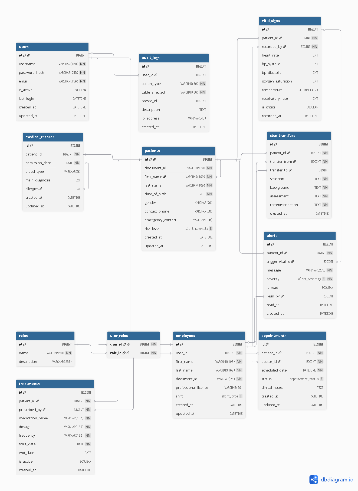


<div style="page-break-before: always;"></div>

## Capítulo V: Product Implementation, Validation & Deployment

### 5.1. Software Configuration Management.

En esta sección se describe la gestión de la configuración del software utilizado en el proyecto de NursePulse, la cual tiene como objetivo garantizar la trazabilidad y digitalización de procesos vitales durante la estadía de un paciente en un hospital cardiovascular.
Desde registro de pacientes hasta generación de alertas y traspasos SBAR. Esta gestión permite mantener la integridad, trazabilidad y consistencia del código fuente, así como coordinar de manera eficiente el trabajo colaborativo del equipo.

El Software Configuration Management en NursePulse se basa en el uso de herramientas de control de versiones y buenas prácticas profesionales de desarrollo que permiten administrar
las distintas versiones del sistema a lo largo del tiempo. Esto incluye la organización de los repositorios del proyecto, la definición de estrategias de ramificación, la gestión
de cambios mediante commits bien documentados y la integración del trabajo realizado por los diferentes miembros del equipo.

#### 5.1.1. Software Development Environment Configuration.

En esta sección se describen las herramientas utilizadas por el equipo encargado de desarrollar NursePulse para colaborar de manera efectiva durante todo el ciclo de vida del producto digital. Estas herramientas han sido seleccionadas estratégicamente con el objetivo de optimizar la comunicación, organización, diseño, desarrollo, despliegue y documentación del sistema, permitiendo un trabajo colaborativo eficiente y escalable.

Las herramientas se organizan según las principales actividades del ciclo de vida del software: gestión del proyecto y requisitos, diseño UX/UI, desarrollo de software, despliegue y documentación técnica.

### Project Management y Requirements Management

- [**Jira Software**](https://www.atlassian.com/es/software/jira): Es la herramienta principal utilizada para la gestión del proyecto bajo un enfoque ágil. Permite organizar tareas en tableros, listas y tarjetas, facilitando el seguimiento del avance del Sprint, la asignación de actividades y el control del backlog del producto NursePulse. Gracias a su interfaz visual, el equipo puede mantener una visión clara del progreso del proyecto.

- [**Google Docs & Google Workspace**](https://docs.google.com/): Google Drive y Google Docs se utilizan como plataforma de almacenamiento y colaboración en la nube. Estas herramientas permiten al equipo crear, editar y compartir documentos en tiempo real, facilitando la elaboración de historias de usuario, informes, entregables y documentación general del proyecto.

### Product UX/UI Design

- [**Figma**](https://www.figma.com/files/team/1542201510350230976/recents-and-sharing?fuid=1227966816494785121): Es la herramienta principal utilizada para el diseño de la interfaz de usuario de NursePulse. Se emplea para crear wireframes, prototipos y diseños finales de la Landing Page. Su funcionalidad colaborativa permite que todo el equipo partícipe en el proceso de diseño de forma simultánea, asegurando coherencia visual y funcional.

- [**UXPressia**](https://uxpressia.com/): Se utiliza para la etapa de Needfinding y análisis centrado en el usuario. Permitió desarrollar los User Personas, así como elaborar el User Journey Mapping, Empathy Mapping e Impact Mapping, facilitando la identificación de necesidades, comportamientos, puntos de dolor y objetivos de los usuarios para estructurar de manera más precisa el diseño y enfoque del sistema.

- [**dbdiagram**](https://dbdiagram.io/): Se utiliza como herramienta de apoyo para la creación de diagramas de base de datos. Permite visualizar y diseñar la estructura de la base de datos de forma colaborativa.


### Software Development

- [**Webstorm**](https://code.visualstudio.com/) Es el editor de código utilizado para el desarrollo de la Landing Page de NursePulse. Permite trabajar de manera eficiente con tecnologías como HTML, CSS y JavaScript, ofreciendo soporte para extensiones, terminal integrada y herramientas de depuración.

- [**IntelliJ IDEA**](https://www.jetbrains.com/idea/): Entorno de desarrollo integrado utilizado para la construcción del Server Side Software (RESTful API) implementado con Spring Boot y Java.

- [**Git**](https://git-scm.com/): Es el sistema de control de versiones utilizado para gestionar el código fuente del proyecto. Permite llevar un registro de los cambios realizados, trabajar de forma colaborativa y mantener un historial organizado del desarrollo del sistema.

- [**GitHub**](https://github.com/): Es la plataforma utilizada para alojar el repositorio del proyecto NursePulse. Facilita la colaboración entre los miembros del equipo, la revisión de código y la integración continua del desarrollo.


### Software Deployment

- [**GitHub Pages**](https://pages.github.com/):  Es el servicio utilizado para desplegar la Landing Page de NursePulse. Permite publicar el sitio web directamente desde el repositorio de GitHub, haciendo que esté disponible de forma pública y accesible desde internet.

- [**Firebase Hosting**](https://firebase.google.com/):  Es una plataforma en la nube utilizada para el despliegue de aplicaciones web. En futuras etapas del proyecto, se utilizará para publicar tanto el frontend como el backend del sistema, permitiendo su acceso desde cualquier dispositivo conectado a internet.

- [**Swagger / OpenAPI**](https://swagger.io/): Herramienta utilizada para la documentación interactiva y estandarizada del RESTful API.

El uso de estos entornos nos permitió mantener una estructura de trabajo clara, con seguimiento de cambios y separación
entre documentación e implementación. Asimismo, se facilita la revisión de avances por parte de los integrantes y se asegura
coherencia entre la propuesta del informe y el producto a desarrollar.

### 5.1.2. Source Code Management

En esta sección se describe la gestión del código fuente del proyecto NursePulse, el cual se ha implementado utilizando GitHub como plataforma principal de control de versiones. 
Este sistema permite al equipo trabajar de forma colaborativa, mantener un historial completo de cambios y asegurar la correcta integración de las funcionalidades desarrolladas durante el proyecto.

El repositorio principal del proyecto es el siguiente:

- **Landing Page Repository**: [https://github.com/NursePulse/Landing-NursePulse](https://github.com/NursePulse/Landing-NursePulse)
- **Frontend Web App Repository**: [https://github.com/NursePulse/Application-Web-Nurse-Pulse](https://github.com/NursePulse/Application-Web-Nurse-Pulse)
- **Backend (Web Services) Repository**: [https://github.com/NursePulse/Backend-NursePulse](https://github.com/NursePulse/Backend-NursePulse)

### GitFlow Workflow implementado

El equipo ha adoptado la metodología GitFlow como modelo de control de versiones, lo cual permite separar el desarrollo de nuevas funcionalidades, la integración de cambios y la preparación de versiones estables.

Las ramas principales utilizadas son:

- **main**: rama principal que contiene la versión estable del proyecto.
- **develop**: rama de integración donde se consolidan todas las funcionalidades completadas antes de ser llevadas a producción.
- **feature/**: ramas utilizadas para el desarrollo de funcionalidades específicas del sistema.
- **release/** : Ramas utilizadas para preparar versiones finales para despliegue y corregir errores críticos en producción, respectivamente.

### Feature Branches utilizados en el proyecto  PENDIENTEE

El desarrollo de la Landing Page de NursePulse se ha organizado mediante ramas feature específicas por componente funcional:

- feature/hero → sección principal de presentación
- feature/benefits → sección de beneficios del sistema
- feature/call-to-action → botones y acciones de conversión
- feature/characteristic → características del producto
- feature/footer → pie de página del sistema
- feature/how-it-works → explicación del funcionamiento de NursePulse
- feature/pricing → sección de planes o precios
- feature/team → sección de equipo desarrollador

Esta organización permite un desarrollo modular, donde cada funcionalidad se implementa de forma independiente antes de integrarse a la rama develop.


### Convención de ramas

El proyecto sigue la siguiente convención de nomenclatura:

- feature/nombre-descriptivo → nuevas funcionalidades
- develop → integración de funcionalidades
- main → versión estable del sistema

### Semantic Versioning

Aunque en esta primera etapa se ha trabajado principalmente en la Landing Page, el proyecto adopta el estándar de versionado semántico:

MAJOR.MINOR.PATCH

- MAJOR: cambios estructurales grandes
- MINOR: nuevas funcionalidades
- PATCH: corrección de errores

Versión actual del proyecto: v1.0.0 (Landing Page inicial)

### Conventional Commits

Para mantener un historial claro de cambios, el equipo utiliza Conventional Commits en todos los commits del repositorio.

##### Tipos de commits utilizados:

- `feat`: Nueva funcionalidad
- `fix`: Corrección de errores
- `docs`: Cambios en documentación
- `style`: Cambios en formato/estilo sin afectar la lógica
- `refactor`: Reestructuración del código sin cambio funcional
- `test`: Cambios en tests
- `build`: Cambios que afectan al sistema de compilación o dependencias
- `ci`: Configuraciones de integración continua
- `chore`: Tareas menores de mantenimiento
- `perf`: Mejoras de rendimiento
- `revert`: Reversión de un commit anterior

### 5.1.3. Source Code Style Guide & Conventions

Con el objetivo de mantener un código legible, limpio, coherente y fácilmente mantenible, el proyecto **NursePulse** adopta un conjunto de guías de estilo y convenciones estándar para todos los lenguajes utilizados en la solución. 
Estas buenas prácticas permiten asegurar consistencia entre los miembros del equipo, mejorar la calidad del código y facilitar su escalabilidad en futuras iteraciones.

Como regla principal, **todas las variables, funciones, clases, componentes y archivos se nombran estrictamente en idioma inglés**, evitando el uso del "spanglish", traducciones incorrectas (como *deployar*, *aplicativo*) o nomenclatura en español en la lógica interna del software.

Por lo que todas las variables, funciones, clases, componentes y archivos se nombran en inglés, siguiendo estándares internacionales de la industria del software.


### HTML / CSS (Landing Page y vistas estáticas)

**Guía adoptada:** Google HTML/CSS Style Guide y W3C Standards

### HTML
- Se utiliza una estructura semántica clara usando etiquetas como `header`, `main`, `section`, `article` y `footer`.
- El código HTML se escribe con indentación de 2 espacios.
- Todas las etiquetas deben cerrarse correctamente.
- Se utilizan comillas dobles para atributos HTML.
- Se evita el uso de estilos inline para mantener separación entre estructura y diseño.

### CSS
- Se utiliza la metodología BEM (Block Element Modifier) para la nomenclatura de clases:
    - Ejemplo: `btn--primary`
- Se prioriza el uso de clases reutilizables.
- Se evita la duplicación de estilos.
- Se aplican variables CSS para colores, espaciados y medidas globales.
- Se organiza el CSS de forma modular por componentes o secciones.


### AngularJS (Frontend Web Application)

**Guías adoptadas:** *Angular Coding Style Guide* y *Google TypeScript Style Guide*.

### Nomenclatura
- `camelCase` para variables, funciones, métodos y propiedades.
- `PascalCase` para clases, interfaces, componentes y enumeraciones (`enums`).
- `UPPER_SNAKE_CASE` para constantes globales.
- `kebab-case` para nombres de archivos y carpetas (ej. `patient-list.component.ts`).
- Prefijo `_` para propiedades privadas y *signals* privados.

### Buenas prácticas
- Clean Architecture junto con Domain-Driven Design (DDD): Separación lógica en capas (`application`, `domain`, `infrastructure` y `presentation`).
- Inyección de dependencias: Uso de `@Injectable()` y la función `inject()` de Angular para la gestión ágil de dependencias.
- Patrón Assembler/Mapper: Conversión de DTOs a entidades de dominio para no acoplar la respuesta del API directamente a la vista.
- Manejo de estado reactivo: Uso de *Signals* nativos para el control del estado en los componentes.
- Lógica derivada: Uso de `computed` *signals* para variables que dependen reactivamente de otros estados.
- Seguridad en la navegación: Implementación de *Route Guards* para la protección de acceso a rutas privadas o clínicas.

### Estilo de código
- Declaración de variables: Uso estricto de `const` (por defecto) y `let` (solo si mutará). Prohibido el uso de `var`.
- Reusabilidad: Código altamente modular, priorizando componentes "tontos" (Dumb/Presentational Components) y servicios "inteligentes" (Smart Services).
- Manejo de errores estructurado: Uso de bloques `try/catch` o el operador `catchError` de RxJS con mensajes descriptivos y amigables para el usuario.
- Sintaxis moderna: Uso de operadores ternarios y *optional chaining* (`?.`) para simplificar validaciones y evitar errores en consola.
- Seguridad de tipos: Habilitación estricta de *TypeScript Strict Mode* para garantizar la máxima seguridad y detección de errores durante la compilación.


### Java / Spring Boot (RESTful API Backend)

**Guía adoptada:** *Google Java Style Guide* y convenciones de *Spring Boot Features*.

### Nomenclatura
- `camelCase` para variables, métodos, atributos y parámetros.
- `PascalCase` para clases, interfaces, registros (*records*) y enumeraciones.
- `UPPER_SNAKE_CASE` para constantes (`static final`).
- `kebab-case` para las rutas (URLs) de los endpoints REST (ej. `/api/v1/vital-signs`).
- Minúsculas (sin guiones ni mayúsculas) para la estructura de paquetes (ej. `com.brainspark.nursepulse.platform.patients`).

### Buenas prácticas
- Domain-Driven Design (DDD): Organización del código fuente en paquetes alineados con *Bounded Contexts*.
- Arquitectura en capas: Separación lógica estricta en `Controller` (Presentación), `Service` (Aplicación/Lógica de Negocio), `Repository` (Infraestructura) y `Domain Model`.
- Inyección de dependencias: Uso de inyección por constructor mediante anotaciones estándar de Spring (`@RestController`, `@Service`, `@Repository`).
- Patrón DTO y Assembler/Mapper: Conversión entre DTOs y Entidades para evitar exponer el modelo de dominio y la persistencia directamente en la API.
- Persistencia Relacional: Uso de JPA/Hibernate para el mapeo objeto-relacional (ORM).
- Respuestas estandarizadas: Uso consistente de `ResponseEntity` para manejar y estructurar los códigos de estado HTTP y el cuerpo de las respuestas.

### Estilo de código
- Inmutabilidad: Preferencia por variables `final` y uso de Java *Records* para la creación concisa de DTOs inmutables.
- Código modular y aplicación de principios SOLID.
- Manejo de errores estructurado: Excepciones centralizadas globales mediante `@ControllerAdvice` y `@ExceptionHandler` para retornar mensajes de error consistentes (400, 404, 500).
- Seguridad contra nulos: Uso de `Optional<T>` en las consultas de base de datos y flujos lógicos para evitar `NullPointerException`.
- Validación de datos: Implementación de *Jakarta Bean Validation* (`@Valid`, `@NotNull`, `@NotBlank`, etc.) para sanitizar el *request body* directamente en los controladores.

### Convenciones generales del proyecto NursePulse

- Todo el código está escrito en inglés.
- Se aplica el principio SOLID.
- Se sigue el principio DRY.
- Se prioriza la legibilidad sobre la complejidad.

### Gherkin (Especificaciones)

Para la definición de criterios de aceptación en historias de usuario se utiliza Gherkin:

- Given / When / Then
- Lenguaje claro y entendible por el negocio

### Ejemplos:

```gherkin
Given a patient is registered in the system
When vital signs are recorded outside the normal range
Then the system generates an automatic alert

Given I am on the patient view
When I record vital signs data
Then it is saved correctly in the medical record

Given I complete the SBAR form
When I save the shift handover
Then it is stored with the date, time, and responsible user

Given a critical clinical event occurs
When the system records it
Then it is logged in the audit log with full details
````


### 5.1.4. Software Deployment Configuration


En esta sección el equipo especifica la configuración del despliegue de la solución **NursePulse**, incluyendo los procedimientos necesarios para que,
a partir de los repositorios de código fuente, se pueda realizar la publicación exitosa de los productos digitales que componen el sistema: Landing Page, Frontend Web Application y Web Services (Backend).

La solución se encuentra estructurada bajo una arquitectura desacoplada, donde cada componente es desplegado de manera 
independiente utilizando plataformas especializadas en la nube, lo que permite mejorar la escalabilidad, disponibilidad y mantenimiento del sistema.


### Componentes de Despliegue

- **Landing Page**: desplegada en GitHub Pages.
- **Frontend Web Application (Angular)**: desplegada en Firebase Hosting.
- **Web Services RESTful API (Backend)**: desplegado en un Cloud Provider (Render / Heroku).

### 1. Control de Versiones

El proyecto utiliza **Git** como sistema de control de versiones y **GitHub** como plataforma para la gestión de repositorios.

### Estrategia de ramas

- `main`: contiene la versión estable lista para producción.
- `develop`: integra las funcionalidades en desarrollo.
- `feature/*`: ramas destinadas al desarrollo de nuevas funcionalidades.


### 2. Despliegue de Landing Page (GitHub Pages)

La Landing Page es un sitio web responsivo construido con HTML5, CSS3 y JS.

### Pasos de despliegue

#### 1. Inicializar y preparar el repositorio
- `git init`
- `git add .`
- `git commit -m "deploy landing page"`

#### 2. Conectar el repositorio con GitHub
- `git branch -M main`
- `git remote add origin <repo-url>`
- `git push -u origin main`

#### 3. Configurar GitHub Pages
- Ir a **Settings** del repositorio.
- Acceder a la sección **Pages**.
- Seleccionar:
    - **Source**: Deploy from branch
    - **Branch**: main
    - **Folder**: / (root)

#### Resultado: 
Publicación automática bajo un subdominio HTTPS gestionado por GitHub (ejemplo: `https://nursepulse.github.io/Landing-NursePulse/`).


### 3. Despliegue del Frontend Web Application (Angular en Firebase Hosting)

La aplicación es una *Single Page Application* (SPA) desarrollada en Angular 17+ y se despliega utilizando Firebase Hosting.

### Pasos de despliegue

#### 1. Subir el proyecto al repositorio
- `git add .`
- `git commit -m "deploy frontend"`
- `git push origin main`

#### 2. Configurar en Firebase
- Acceder a: https://firebase.google.com/
- Iniciar Sesión y dirigirse a 'Ir a Consola'.
- Seleccionar **Crear un proyecto de Firebase nuevo → Escribir el nombre del proyecto (`application-web-nurse-pulse`) → Crear Proyecto**.
- Instalar Firebase CLI: `npm install -g firebase-tools`
- Iniciar sesión en Firebase CLI: `firebase login`
- Inicializar el proyecto: `firebase init`
    - Seleccionar **Hosting**.
    - Seleccionar el proyecto creado en Firebase.
    - Configurar el directorio público: `dist/browser` (o `dist/`).
    - Configurar como SPA: Sí.
    - Por el momento decimos que no se configure GitHub Action para despliegue automático.

#### 3. Configurar variables de entorno
- Configurar el archivo `environment.prod.ts` para apuntar a la URL pública del RESTful API:
  - `apiBaseUrl: 'https://<backend-url>'`

#### 4. Configurar el build
- **Build command**:
  - `ng build`
- **Publish directory**:
  - `dist/browser`

#### 5. Ejecutar Despliegue
- Ejecutamos el comando de compilación: `ng build`
- Ejecutamos el comando de publicación: `firebase deploy --only hosting`
- Firebase genera una URL pública accesible.


### 4. Despliegue de los Web Services RESTful API (Cloud Provider)

El backend desarrollado en Spring Boot y documentado con OpenAPI (Swagger) ha sido configurado para su despliegue continuo en un servicio Platform as a Service (PaaS) como Render o Heroku.

### Pasos de despliegue

#### 1. Configurar credenciales y entorno
- Ajustar la configuración del archivo `application-prod.properties`.
- Inyectar dinámicamente las credenciales de entorno para la conexión segura a la base de datos (MySQL gestionado en la nube).

#### 2. Construcción del artefacto
- Empaquetar y construir el archivo `.jar` usando Maven ejecutando el comando:
  - `mvn clean package -DskipTests`

#### 3. Publicación en el servicio Cloud
- Vincular el repositorio (rama `main`) al servicio PaaS (ej. Render/Heroku) para disparar el despliegue de la imagen/artefacto.
- El Cloud Provider asigna los recursos, levanta el servidor y genera una URL HTTPS pública.

#### 4. Documentación desplegada
- Una vez levantado el servidor, la documentación estandarizada Swagger UI queda expuesta públicamente.
- **Ruta de acceso:** `https://<backend-url>/swagger-ui.html`


### 5. Integración de Componentes

El sistema funciona de la siguiente manera:

- La **Landing Page** actúa como punto de entrada y promoción, redirigiendo al usuario mediante llamados a la acción (CTA) hacia el frontend.
- El **Frontend** (SPA en Angular) gestiona la experiencia de usuario y consume los servicios expuestos por el backend.
- El **Backend** (Spring Boot RESTful API) procesa la lógica de negocio, se conecta a la base de datos MySQL en la nube para persistir la información y devuelve las respuestas estructuradas al frontend.

### 6. Consideraciones de Despliegue

- Uso obligatorio de variables de entorno para configuraciones sensibles (credenciales de BD, tokens, URIs).
- Separación de entornos (desarrollo y producción).
- Evitar exponer credenciales dentro del código fuente bajo ninguna circunstancia.
- Verificación de URLs públicas y endpoints de Swagger después de cada despliegue.
- Mantener compatibilidad entre versiones de frontend y backend, respetando el control de versiones semántico.


### 5.2. Landing Page, Services & Applications Implementation.

#### 5.2.1 Sprint 1

El Sprint 1 se enfocó en el desarrollo e implementación de la Landing Page de NursePulse, la cual representa el primer punto de contacto entre la solución y los usuarios potenciales.
Este sprint tuvo como objetivo establecer una presencia digital sólida que comunique de manera clara la propuesta de valor del producto.

Durante este sprint, se desarrollaron e integraron las secciones principales de la Landing Page, incluyendo presentación del producto, funcionalidades clave, llamadas a la acción, equipo desarrollador, sectores beneficiados, 
preguntas frecuentes, sección de contacto y testimonios, siguiendo los lineamientos de diseño y los wireframes definidos previamente en el Capítulo IV. Asimismo, se priorizó la usabilidad, accesibilidad y coherencia visual, con el fin de ofrecer una experiencia atractiva y profesional.

#### 5.2.1.1. Sprint Planning 1

<table><tr> <th colspan="5">Sprint #</th> <th colspan="9">Sprint 1</th> </tr> <tr> <td colspan="13">Sprint Planning Background</td> </tr> <tr> <td colspan="5">Date</td> <td colspan="8">15-04-2026</td> </tr> <tr> <td colspan="5">Time</td> <td colspan="8">9:30 AM</td> </tr> <tr> <td colspan="5">Location</td> <td colspan="8">Reunion presencial en el campus de la universidad</td> </tr> <tr> <td colspan="5">Prepared By</td> <td colspan="8">Rios Cespedes, Adrian Matias</td> </tr> <tr> <td colspan="5">Attendees (to planning meeting)</td> <td colspan="8">Aliaga Ocampo, Alexander Auden / Huamán Cuba, Johan Giovani / Rios Cespedes, Adrian Matias / Rocca Leon, Anhelo Rodrigo </td> </tr> <tr> <td colspan="5">Sprint n-1 Review Summary</td> <td colspan="8">No aplica - Este es el primer Sprint del proyecto</td> </tr> <tr> <td colspan="5">Sprint n-1 Retrospective Summary</td> <td colspan="8">No aplica - Este es el primer Sprint del proyecto</td> </tr> <tr> <td colspan="13">Sprint Goal & User Stories</td> </tr> <tr> <td colspan="5">Sprint 1 Goal</td> <td colspan="8"> <strong>"Our focus is on delivering a fully functional and user-friendly Landing Page for NursePulse, 
accompanied by complete and well-structured documentation. We believe this will provide an engaging first impression and clearly 
communicate the value proposition of our solution for enhancing clinical processes in cardiovascular nursing. This will 
be validated when the Landing Page is successfully deployed and accessible online, with all core sections (hero, how it works, 
features, benefits, FAQs, and contact) working correctly, and all corresponding documentation completed."</strong> </td> </tr> <tr> <td colspan="5">Sprint 1 Velocity</td> <td colspan="8">22 Story Points</td> </tr> <tr> <td colspan="5">Sum of Story Points</td> <td colspan="8">22 Story Points</td> </tr> </table>


#### 5.2.1.2. Aspect Leaders and Collaborators
<div align="center">
  <table style="width:100%; border-collapse: collapse; font-family: Arial, sans-serif; font-size: 13px; text-align: center;">
    <thead>
      <tr style="background-color: #f2f2f2;">
        <th style="border: 1px solid #dddddd; padding: 10px;">Team Member (Last Name, First Name)</th>
        <th style="border: 1px solid #dddddd; padding: 10px;">GitHub Username</th>
        <th style="border: 1px solid #dddddd; padding: 10px;">Diseño del Layout Principal (L/C)</th>
        <th style="border: 1px solid #dddddd; padding: 10px;">Navegacion (L/C)</th>
        <th style="border: 1px solid #dddddd; padding: 10px;">Llamada a la Accion ( CTA ) (L/C)</th>
        <th style="border: 1px solid #dddddd; padding: 10px;">Despliegue de la Landing (L/C)</th>
      </tr>
    </thead>
    <tbody>
      <tr>
        <td style="border: 1px solid #dddddd; padding: 8px;">Aliaga Ocampo, Alexander Auden</td>
        <td style="border: 1px solid #dddddd; padding: 8px;">AlexanderAliaga19</td>
        <td style="border: 1px solid #dddddd; padding: 8px; font-weight: bold;">L</td>
        <td style="border: 1px solid #dddddd; padding: 8px;">L</td>
        <td style="border: 1px solid #dddddd; padding: 8px; font-weight: bold;">L</td>
        <td style="border: 1px solid #dddddd; padding: 8px;">L</td>
      </tr>
      <tr>
        <td style="border: 1px solid #dddddd; padding: 8px;">Rios Cespedes, Adrian Matias</td>
        <td style="border: 1px solid #dddddd; padding: 8px;">AdrianR16-C</td>
        <td style="border: 1px solid #dddddd; padding: 8px;">C</td>
        <td style="border: 1px solid #dddddd; padding: 8px;">C</td>
        <td style="border: 1px solid #dddddd; padding: 8px;">C</td>
        <td style="border: 1px solid #dddddd; padding: 8px; font-weight: bold;">C</td>
      </tr>
      <tr>
        <td style="border: 1px solid #dddddd; padding: 8px;">Huamán Cuba, Johan Giovani</td>
        <td style="border: 1px solid #dddddd; padding: 8px;">Johancuba</td>
        <td style="border: 1px solid #dddddd; padding: 8px;">C</td>
        <td style="border: 1px solid #dddddd; padding: 8px; font-weight: bold;">C</td>
        <td style="border: 1px solid #dddddd; padding: 8px;">C</td>
        <td style="border: 1px solid #dddddd; padding: 8px;">C</td>
      </tr>
        <tr>
        <td style="border: 1px solid #dddddd; padding: 8px;">Rodrigo Rocca, Anhelo</td>
        <td style="border: 1px solid #dddddd; padding: 8px;">RoccaA4</td>
        <td style="border: 1px solid #dddddd; padding: 8px;">C</td>
        <td style="border: 1px solid #dddddd; padding: 8px;">C</td>
        <td style="border: 1px solid #dddddd; padding: 8px; font-weight: bold;">C</td>
        <td style="border: 1px solid #dddddd; padding: 8px;">C</td>
      </tr>
    </tbody>
  </table>
</div>


#### 5.2.1.3. Sprint Backlog 1

El objetivo principal del Sprint 1 fue implementar la primera versión de la Landing Page de NursePulse, enfocada en comunicar la propuesta de valor, explicar la problemática de información clínica dispersa, presentar beneficios principales, incluir llamados a la acción, habilitar contacto inicial y asegurar una experiencia responsive. Este sprint permitió establecer el primer punto de entrada público del producto y validar la claridad inicial de la solución frente a visitantes interesados.

*Nota: Todas las tareas de ingeniería (Tasks) han sido estimadas rigurosamente en un rango de 4 a 8 horas como máximo, asegurando una descomposición granulada y manejable según los requerimientos del marco Scrum.*

**Board del Sprint (Jira):**


###  Sprint Backlog

<table>
  <thead>
    <tr>
      <th align="left">Sprint #</th>
      <th align="left" colspan="7">Sprint 1</th>
    </tr>
    <tr>
      <th align="left" colspan="2">User Story</th>
      <th align="left" colspan="6">Work-Item / Task</th>
    </tr>
    <tr>
      <th align="left">Id</th>
      <th align="left">Title</th>
      <th align="left">Id</th>
      <th align="left">Title</th>
      <th align="left">Description</th>
      <th align="left">Estimation<br>(Hours)</th>
      <th align="left">Assigned To</th>
      <th align="left">Status<br>(To-do / In-Process / To-Review / Done)</th>
    </tr>
  </thead>
  <tbody>
    <tr>
      <td>US-01</td>
      <td>Visualizar landing page</td>
      <td>T-01.1</td>
      <td>Layout General Responsive</td>
      <td>Maquetar estructura base HTML5/CSS3 adaptativa para desktop, tablet y móvil.</td>
      <td>6</td>
      <td>Aliaga Ocampo, Alexander</td>
      <td>Done</td>
    </tr>
    <tr>
      <td>US-02</td>
      <td>Ver propuesta de valor</td>
      <td>T-02.1</td>
      <td>Sección Hero y Pitch</td>
      <td>Diseñar e implementar sección principal con pitch interactivo y llamados a la acción.</td>
      <td>4</td>
      <td>Aliaga Ocampo, Alexander</td>
      <td>Done</td>
    </tr>
    <tr>
      <td>US-05</td>
      <td>Visualizar características clave</td>
      <td>T-03.1</td>
      <td>Módulo de Features</td>
      <td>Programar cuadrícula responsive con assets gráficos detallando el funcionamiento del producto.</td>
      <td>5</td>
      <td>Rocca Leon, Anhelo</td>
      <td>Done</td>
    </tr>
    <tr>
      <td>US-11</td>
      <td>Cambiar idioma del sitio</td>
      <td>T-04.1</td>
      <td>Internacionalización</td>
      <td>Configurar lógica de internacionalización (i18n) para soportar idiomas ES y EN en toda la navegación.</td>
      <td>6</td>
      <td>Huamán Cuba, Johan</td>
      <td>Done</td>
    </tr>
    <tr>
      <td>US-10</td>
      <td>Contactar al equipo de NursePulse</td>
      <td>T-05.1</td>
      <td>Formulario de Contacto</td>
      <td>Desarrollar formulario de contacto con validaciones de campos y alertas visuales integradas.</td>
      <td>5</td>
      <td>Huamán Cuba, Johan</td>
      <td>Done</td>
    </tr>
    <tr>
      <td>US-08</td>
      <td>Visualizar testimonios</td>
      <td>T-06.1</td>
      <td>Sección Testimonios y Redes</td>
      <td>Crear carrusel interactivo de testimonios y pie de página con accesos a social media accounts.</td>
      <td>5</td>
      <td>Rocca Leon, Anhelo</td>
      <td>Done</td>
    </tr>
    <tr>
      <td>US-12</td>
      <td>Acceder desde dispositivos móviles</td>
      <td>T-07.1</td>
      <td>Ajustes Media Queries</td>
      <td>Refactorización final de media queries para asegurar que no exista desbordamiento en vistas móviles.</td>
      <td>4</td>
      <td>Rios Cespedes, Adrian</td>
      <td>Done</td>
    </tr>
    <tr>
      <td>US-04</td>
      <td>Revisar cómo funciona NursePulse</td>
      <td>T-08.1</td>
      <td>GitFlow y GitHub Pages</td>
      <td>Configurar repositorios, workflows de CI/CD básicos y desplegar la Landing Page de forma exitosa.</td>
      <td>4</td>
      <td>Rios Cespedes, Adrian</td>
      <td>Done</td>
    </tr>
  </tbody>
</table>

###  Estados de las tareas
- **To-do**: Pendiente
- **InProcess**: En desarrollo
- **ToReview**: En revisión
- **Done**: Finalizado

#### 5.2.1.4. Development Evidence for Sprint Review.

| Repository | Branch | Commit Id | Commit Message | Commit Message Body | Commited on (Date) |
| :--- | :--- | :--- | :--- | :--- | :--- |
| NursePulse/Landing-NursePulse | Development | 9ff4a793ddf7ff1873134c071741c287ff50a4c8 | Resolve merge conflicts keeping local version | - | 17/04/2026 |
| NursePulse/Landing-NursePulse | Development | 55b09037de17a616ab3ed8665b8b6506849a3394 | Actualizar README y resolver conflictos restantes | - | 17/04/2026 |
| NursePulse/Landing-NursePulse | Development | c6e40f12a70340ac1c0e2566ec1df686a0536cd6 | Clean conflict markers from angular files | - | 17/04/2026 |
| NursePulse/Landing-NursePulse | Development | 541b310e8007861f3592d9f91685d80ef3d0aff1 | Trigger GitHub Pages deployment | - | 17/04/2026 |
| NursePulse/Landing-NursePulse | Development | 663bc7f2ca819a443b193750f644808035221969 | Fix GitHub Pages artifact path | - | 17/04/2026 |
| NursePulse/Landing-NursePulse | Development | 4ea13236773fc4bbf077099cab40c29f64344e04 | Fix logo path for GitHub Pages | - | 17/04/2026 |
| NursePulse/Landing-NursePulse | Development | 7d04f51cff7f222f8f4ca0f000b7782d84de3545 | Remove unused app.ts and keep bootstrap in main.ts | - | 17/04/2026 |
| NursePulse/Landing-NursePulse | Development | ecf95865b356bb30db6c25c4907b5b392fdcb5dc | Remove duplicated CSS rules | - | 17/04/2026 |
| NursePulse/Landing-NursePulse | Development | b7a5d1e876657e069a3c867cddccc53f6dae48bb | Remove duplicated HTML and CSS | - | 17/04/2026 |
| NursePulse/Landing-NursePulse | Development | 9baa03f8bf6fce32ba693a0a5112aeb4d5189b9d | Update favicon | - | 17/04/2026 |
| NursePulse/Landing-NursePulse | Development | 99921715b9b5216afff51a55171bf845550ca0a8 | feat(landing): add testimonials section with styles and mock data | Added testimonials section to landing page, Included sample testimonial data in component y Styled section with separators and highlighted ratings | 23/04/2026 |
| NursePulse/Landing-NursePulse | Development | 3159ea4356ed8fe07b91cd0c074548009b1fc8fc | feat(team): add team section with member profiles and styles | - | 23/04/2026 |
| NursePulse/Landing-NursePulse | Development | 283ac5e8519ed3e425bbfad5e8661bf58ef5e9cf | fix: update favicon file name to match new naming convention. All in kebab-case | - | 23/04/2026 |
| NursePulse/Landing-NursePulse | Development | d07dba9c161d526743692e87746f95333d637244 | refactor: update section IDs and links to use kebab-case for consistency | - | 23/04/2026 |
| NursePulse/Landing-NursePulse | Development | 6a5443642f334dc1c4aa91ff00d3ce47cbc08d25 | feat(ui): add header actions and improve navigation layout | - | 23/04/2026 |
| NursePulse/Landing-NursePulse | Development | 00b0d5a842a06e24b8314a513447c84b15fc0ed0 | feat(i18n): implement internationalization for navigation and header components | - | 23/04/2026 |
| NursePulse/Landing-NursePulse | Development | d3d73e8eedf656ec4fb9fdf6ccd4cf050aac1ebb | feat(i18n): integrate I18nService and LanguageSwitcher component | - | 23/04/2026 |
| NursePulse/Landing-NursePulse | Development | 2da46c1213b6a28aebc3564cf0de5d6746c7d41c | test(i18n): add unit tests for I18n service | - | 23/04/2026 |
| NursePulse/Landing-NursePulse | Development | 64b091e281796d2243c96e7a9c0a5c7a4d7cf30d | feat(i18n): create I18nService with Signal state and localStorage persistence | - | 23/04/2026 |
| NursePulse/Landing-NursePulse | Development | 6940588d45bb1a41d404277839b89bd0dc563343 | feat(i18n): create LanguageSwitcher component and toggle logic | - | 23/04/2026 |
| NursePulse/Landing-NursePulse | Development | bd0c467ec2e47510f2e09f1165dffcb5e340681c | Delete .github/workflows directory | - | 11/05/2026 |
| NursePulse/Landing-NursePulse | Development | 8e27b36bf65f70792da689add050baeca363ea6e | Delete .vscode directory | - | 11/05/2026 |
| NursePulse/Landing-NursePulse | Development | 2b2e6f919a12325ceecba774ece0c465da0241af | Delete public directory | - | 11/05/2026 |
| NursePulse/Landing-NursePulse | Development | ad2a49e391500a25ac18bdd7d61ebbd31e01cefe | Delete src directory | - | 11/05/2026 |
| NursePulse/Landing-NursePulse | Development | cb0cd1dd35a8ca27a758c4f2527897095b0c3cf9 | Delete .editorconfig | - | 11/05/2026 |
| NursePulse/Landing-NursePulse | Development | 714456b7713ffcdf30b51eb2f1d8bb616b68cee6 | Delete .gitignore | - | 11/05/2026 |
| NursePulse/Landing-NursePulse | Development | ee0ecb8ed16ca62fdfb9a289dfebcd05e7dbef82 | Delete .prettierrc | - | 11/05/2026 |
| NursePulse/Landing-NursePulse | Development | cc790fa7d47a027d667ed35876468c3c8d9e6eca | Delete README.md | - | 11/05/2026 |
| NursePulse/Landing-NursePulse | Development | 6c021310eae77681cb09e152b11cbc4d380efca5 | Delete angular.json | - | 11/05/2026 |
| NursePulse/Landing-NursePulse | Development | c1c2c99efa9a461733ea7497cddeb38ed89de71f | Delete package-lock.json | - | 11/05/2026 |
| NursePulse/Landing-NursePulse | Development | 7544d9392a8430c57f806755a5c9d0e561e42081 | Delete package.json | - | 11/05/2026 |
| NursePulse/Landing-NursePulse | Development | 2d6620d94abc89652f1f99f408a193de3267d5b6 | Delete tsconfig.app.json | - | 11/05/2026 |
| NursePulse/Landing-NursePulse | Development | cd761a5c564e4408764f6e985a86e7076405f231 | Delete tsconfig.json | - | 11/05/2026 |
| NursePulse/Landing-NursePulse | Development | 509148aa54b4ebaf08717e97b323b079c5fd386c | Delete tsconfig.spec.json | - | 11/05/2026 |
| NursePulse/Landing-NursePulse | Development | fac634067aca0bc95ad4471ecca765aa5a3338c0 | Add files via upload | - | 11/05/2026 |

#### 5.2.1.5. Execution Evidence for Sprint Review


## 1. Resumen de Logros del Sprint
En este Sprint, el equipo se ha enfocado en el diseño, maquetación y despliegue de la interfaz principal de **NursePulse**. 
Se ha logrado consolidar la identidad visual de la marca y la arquitectura de información necesaria para comunicar una solución técnica compleja de manera sencilla y efectiva.

**Hitos alcanzados:**
* **Desarrollo de Interfaz:** Implementación completa de la Landing Page utilizando estándares modernos de diseño UI/UX.
* **Optimización de Activos:** Organización y renombrado semántico de recursos visuales para mejorar la mantenibilidad del proyecto.
* **Propuesta de Valor:** Estructuración de las secciones de monetización (Planes) y validación social (Testimonios).
* **Navegación:** Configuración de una experiencia de usuario fluida y orientada a la conversión (CTAs).

## 2. Screenshots de las Principales Vistas

A continuación, se presentan las capturas de pantalla que sirven como evidencia de la implementación funcional del sitio. Las vistas se organizan según las secciones de navegación del Landing Page (Plataforma, El problema, ¿Cómo funciona?, Características, Beneficios, Planes, Nosotros y Preguntas frecuentes), indicando el propósito de cada una y el perfil de visitante al que atiende (racional, emocional o recurrente).

### A. Plataforma (Portada y Propuesta de Valor)


*Sección de portada que presenta la propuesta de valor central de la plataforma: una solución digital diseñada específicamente para mejorar los procesos de enfermería cardiovascular mediante la centralización de información clínica, la facilitación de la comunicación entre turnos y la garantía de trazabilidad en eventos críticos. Incluye los Call-To-Action principales que dirigen al visitante recurrente hacia la aplicación desplegada, así como el selector de idioma (ES/EN) y el acceso a "Iniciar sesión".*

### B. El Problema


<!-- TODO: agregar la captura real de la sección "El problema" (assets/chapter-5/problem.png) -->
*Explica la problemática que da origen a NursePulse: la información clínica dispersa y el registro manual dificultan la continuidad asistencial y la trazabilidad de eventos críticos en enfermería cardiovascular. Esta sección atiende al perfil de visitante racional, ayudándole a reconocer la necesidad que resuelve la plataforma.*


*Complementa la sección del problema mostrando cómo NursePulse impacta directamente en instituciones de salud como hospitales, clínicas privadas y centros especializados en cardiología, proporcionando soluciones concretas para optimizar la gestión de procesos críticos.*

### C. ¿Cómo Funciona?


*Describe el flujo integral de la plataforma, mostrando cómo el personal de enfermería cardiovascular puede registrar signos vitales, documentar traspasos SBAR (Situación, Antecedentes, Evaluación y Recomendaciones), consultar historiales clínicos y mantener trazabilidad de eventos para mejorar la comunicación entre turnos.*

### D. Características


*Detalla las funcionalidades clave como registro de pacientes y citas, monitoreo de signos vitales, gestión de traspasos SBAR, seguimiento de tratamientos, registro de eventos críticos, alertas automáticas ante fluctuaciones cardiovasculares anormales y sistema de auditoría inalterable.*

### E. Beneficios


*Ilustra cómo NursePulse reduce errores en documentación clínica, optimiza el tiempo del personal de salud en tareas de registro, mejora la continuidad del cuidado del paciente y fortalece la eficiencia operativa mediante la digitalización y trazabilidad de procesos críticos.*

### F. Planes


<!-- TODO: agregar la captura real de la sección "Planes" (assets/chapter-5/plans.png) -->
*Presenta los planes y precios disponibles de NursePulse para las instituciones de salud, detallando las características incluidas en cada nivel de servicio. Esta sección atiende al perfil de visitante racional, ya que le entrega la información necesaria para comparar opciones y facilitar la decisión de contratación de la plataforma.*

### G. Nosotros (Equipo)


*Presenta a los integrantes del equipo responsable del diseño, desarrollo e implementación de NursePulse, incluyendo sus perfiles y motivaciones. Esta sección atiende al perfil de visitante emocional, generando confianza al mostrar quiénes están detrás de la solución.*

### H. Preguntas Frecuentes


*Aborda las consultas comunes del personal de enfermería cardiovascular y administradores de instituciones de salud sobre seguridad de datos, facilidad de acceso, integración con sistemas existentes, escalabilidad de la plataforma y soporte técnico disponible.*

### I. Testimonios


*Presenta experiencias y perspectivas del personal de salud e instituciones que han validado NursePulse, destacando mejoras en eficiencia operativa, reducción de errores, mejor comunicación entre turnos y fortalecimiento de la continuidad clínica. Esta sección atiende al perfil de visitante emocional, generando confianza a través de la experiencia de terceros y permitiendo conocer los beneficios del producto sin haberlo usado.*

### J. Contacto con Care-Labs


*Proporciona los canales de comunicación disponibles para hospitales, clínicas, centros especializados y profesionales de salud interesados en conocer más sobre NursePulse, solicitar demostraciones, consultar precios o gestionar suscripciones a la plataforma.*
#### 5.2.1.6. Services Documentation Evidence for Sprint Review.

En esta sección se presenta la documentación relacionada con los servicios que serán ofrecidos a través de la plataforma web de NursePulse. 
Estos servicios incluirán funcionalidades como el registro de pacientes y citas, traspasos SBAR, generación de alertas ante fluctuaciones cardiovasculares inusuales del paciente y registro de los signos vitales del paciente.

Durante el presente Sprint 1, el enfoque del equipo estuvo centrado exclusivamente en el diseño y desarrollo de la Landing Page del producto, 
con el objetivo de definir la propuesta de valor, los segmentos de usuarios y la experiencia inicial del sistema. Debido a este alcance, 
no se implementaron ni desplegaron servicios web funcionales, por lo que no se cuenta aún con endpoints operativos ni documentación técnica asociada 
a su consumo.


#### 5.2.1.7. Software Deployment Evidence for Sprint Review.

En esta sección se describe el proceso de implementación de la plataforma en un entorno de producción. Además, se 
presentarán los hitos más importantes que marcarán el despliegue del proyecto y garantizarán su disponibilidad para los usuarios finales.

URL de despliegue del Landing Page: [Landing Page Desplegado](https://github.com/NursePulse/Landing-NursePulse)

1. Para la Landing Page, nuestro equipo creó una rama denominada “develop” dentro del repositorio, en la cual se organizaron y almacenaron todos los archivos correspondientes al desarrollo de la Landing Page.
<p align="center">
  
</p>

2. Posteriormente, nos dirigimos a configuración y empleamos GitHub Pages, el servicio de alojamiento para sitios estáticos de GitHub, para publicar y poner en línea nuestra Landing Page.
<p align="center">
  
</p>

3. Se seleccionó la rama previamente configurada y se procedió con el despliegue de la página.
<p align="center">
  
</p>


4. Finalmente, obtuvimos el enlace de publicación, que nos permite acceder y visualizar la Landing Page en línea.
<p align="center">
  
</p>

#### 5.2.1.8. Team Collaboration Insights during Sprint.

La herramienta de Insights de GitHub demuestra que todos los miembros del equipo han colaborado activamente mediante la subida de commits. Hubo un esfuerzo distribuido:

Alexander Aliaga gestionó la maquetación principal.
Anhelo Rocca estructuró las secciones interactivas de equipo y testimonios.
Johan Huamán trabajó en la internacionalización.
Adrian Rios resolvió bugs de media queries y gestionó el flujo GitFlow.

<p align="center">
  
</p>

### 5.3. Validation Interviews

En esta sección se describen las entrevistas de validación realizadas con usuarios pertenecientes a los segmentos objetivo de NursePulse. Estas entrevistas tuvieron como propósito evaluar la interacción de los usuarios con el Landing Page y con las funcionalidades del sistema, obteniendo retroalimentación sobre usabilidad, comprensión y valor percibido.

Las entrevistas fueron registradas en video como evidencia y se analizaron en base a tareas asignadas durante la sesión.

---

### 5.3.1. Diseño de Entrevistas

Se definieron los siguientes segmentos objetivo:

- Segmento 1: Personal de salud (médicos/enfermeros)
- Segmento 2: Usuarios con interés en soluciones digitales clínicas

---

#### Elementos evaluados

Durante la sesión de validación, los usuarios interactuaron con:

- Landing Page de NursePulse
- Documentación de endpoints mediante Swagger UI
- Flujo de registro y consulta de signos vitales

---

#### User Flows evaluados

1. Navegación del Landing Page
2. Comprensión de la propuesta de valor
3. Interpretación de funcionalidades del sistema
4. Simulación de uso del sistema (explicación de endpoints)
5. Percepción de utilidad en contexto real

---

#### Estructura de la entrevista

1. Introducción al proyecto
2. Exploración del Landing Page
3. Explicación del sistema (backend)
4. Tareas guiadas
5. Preguntas de validación

---
#### Guion de preguntas por segmento objetivo

Para asegurar una validación adecuada, se diseñaron guiones de preguntas específicos para cada segmento objetivo, considerando su contexto de uso y relación con el sistema.

---

### Segmento 1: Personal de salud (Enfermeros)

**Objetivo:**  
Evaluar la utilidad del sistema en el registro y consulta de información clínica, así como la claridad de las funcionalidades relacionadas a signos vitales.

**Preguntas – Landing Page:**
- ¿Qué entiendes que hace esta plataforma?
- ¿Te queda claro el problema que busca resolver?
- ¿Consideras que la información presentada es relevante para tu trabajo?
- ¿Qué sección te parece más útil o importante?

**Preguntas – Sistema (flujo funcional):**
- ¿Crees que este sistema facilitaría el registro de signos vitales?
- ¿Te parece claro cómo se registra la información del paciente?
- ¿Consideras útil poder consultar el último registro de signos vitales?
- ¿Qué tan fácil crees que sería usar este sistema en tu rutina diaria?

**Preguntas – Experiencia de usuario:**
- ¿Te resulta intuitiva la forma en que se presenta la información?
- ¿Qué mejorarías en el sistema?
- ¿Usarías esta herramienta en tu entorno laboral?

---

### Segmento 2: Personal de salud (Médicos)

**Objetivo:**  
Evaluar la utilidad del sistema en la toma de decisiones clínicas y consulta rápida de información del paciente.

**Preguntas – Landing Page:**
- ¿El landing page transmite claramente el propósito del sistema?
- ¿Te parece relevante la solución presentada para el entorno clínico?
- ¿Qué mejorarías en la forma en que se presenta la información?

**Preguntas – Sistema (flujo funcional):**
- ¿Te resulta útil poder consultar rápidamente los signos vitales de un paciente?
- ¿Consideras importante acceder al último registro clínico?
- ¿La información presentada te parece suficiente para apoyar decisiones médicas?
- ¿Qué otras funcionalidades agregarías?

**Preguntas – Experiencia de usuario:**
- ¿La interfaz te parece clara y comprensible?
- ¿Qué tan útil consideras el sistema en tu práctica médica?
- ¿Qué mejorarías para hacerlo más eficiente?

---

### Segmento 3: Usuarios generales / interesados en tecnología

**Objetivo:**  
Evaluar la comprensión general del sistema y la claridad de la propuesta de valor.

**Preguntas – Landing Page:**
- ¿Qué entiendes que hace este sistema?
- ¿Te parece clara la propuesta de valor?
- ¿El diseño te parece atractivo?

**Preguntas – Sistema:**
- ¿Te resulta fácil entender cómo funciona el sistema?
- ¿Consideras que la solución tiene valor en el sector salud?

**Preguntas – Experiencia de usuario:**
- ¿Te parece fácil de usar?
- ¿Qué mejorarías del sistema?
- ¿Recomendarías esta solución?


### 5.3.2. Registro de Entrevistas

#### Segmento: Usuarios generales / Personal de salud

---

### Entrevista 1
- Nombre: Milagros Mendoza
- Edad: 22
- Distrito: Lima
- Video: https://youtu.be/RMx0DzfhOL0
- Inicio: 00:00
- Duración: 11:55 min
- Screenshot: 

**Resumen:**
El usuario logró identificar correctamente el propósito del sistema. Consideró que el landing page es claro y bien estructurado. Sin embargo, mencionó que algunas funcionalidades técnicas podrían explicarse mejor para usuarios no especializados.

---

### Entrevista 2
- Nombre: Miguel Zevallos
- Edad: 24
- Distrito: Lima
- Video: https://youtu.be/ERz3jkvERR8
- Inicio: 00:00
- Duración: 9:00 min
- Screenshot: 

**Resumen:**
El usuario destacó la organización visual del landing page y la claridad de la información. Indicó que el sistema tiene potencial en entornos clínicos reales. Sugirió mejorar la interfaz para hacerla más intuitiva.

---

### Entrevista 3
- Nombre: Karen Mio
- Edad: 23
- Distrito: Lima
- Video: https://youtu.be/ypqKHHFEOTU
- Inicio: 00:00
- Duración: 8:32 min
- Screenshot: 

**Resumen:**
El usuario comprendió las funcionalidades principales del sistema. Consideró que la solución es innovadora. Recomendó incluir ejemplos prácticos para mejorar la comprensión del sistema.

---

### Entrevista 4
- Nombre: Olenka Rios
- Edad: 25
- Distrito: Lima
- Video: https://youtu.be/Pu3OU6O2b9I
- Inicio: 00:00
- Duración: 9:36 min
- Screenshot:


**Resumen:**
El usuario tuvo una experiencia positiva con el sistema. Destacó la propuesta de valor, pero sugirió optimizar la navegación y simplificar algunos textos.

---

### 5.3.3. Evaluaciones según heurísticas

Se realizó la evaluación basada en heurísticas de usabilidad, arquitectura de información e inclusive design.

---

#### Evaluación heurística (basado en Anexo D)

| # | Heurística | Descripción | Evaluación | Problema identificado | Severidad |
|---|-----------|------------|------------|----------------------|----------|
| 1 | Visibilidad del sistema | El sistema debe comunicar su estado claramente | Alta | No se identificaron problemas graves | Baja |
| 2 | Relación con el mundo real | Uso de lenguaje comprensible | Media | Algunos términos técnicos no claros | Media |
| 3 | Control del usuario | Facilidad de navegación | Media | Navegación puede mejorar | Media |
| 4 | Consistencia | Uniformidad en diseño | Alta | Diseño consistente | Baja |
| 5 | Prevención de errores | Evitar errores del usuario | Media | Falta feedback visual en acciones | Media |
| 6 | Reconocimiento vs memoria | Fácil comprensión visual | Alta | Información clara | Baja |
| 7 | Flexibilidad | Adaptabilidad del sistema | Media | Limitada personalización | Media |
| 8 | Diseño estético | Interfaz atractiva | Alta | Diseño moderno | Baja |

---

### Conclusión de validación

Las entrevistas permitieron validar que NursePulse cumple con comunicar su propuesta de valor y presentar una solución útil para el entorno clínico. No obstante, se identificaron mejoras necesarias en la claridad de algunas funcionalidades, navegación y experiencia de usuario.

El sistema demuestra potencial de aplicación real, especialmente en la gestión de información clínica estructurada.

### 5.4. Video About-the-Product

En esta sección se presenta el video "About the Product", en el cual el equipo muestra el funcionamiento general del sistema NursePulse, explicando su propósito, principales funcionalidades y valor dentro del contexto clínico.

El objetivo del video es evidenciar de manera práctica cómo la solución desarrollada permite mejorar la gestión de información clínica, específicamente en el registro y consulta de signos vitales, facilitando el acceso a datos relevantes para el personal de salud.

---

### Descripción del contenido del video

El video desarrollado incluye los siguientes elementos:

- **Introducción del problema:**  
  Se explica la problemática relacionada a la gestión manual o poco estructurada de la información clínica, especialmente en el registro de signos vitales.

- **Presentación de la solución:**  
  Se introduce NursePulse como una herramienta que busca digitalizar y estructurar la información clínica, mejorando la accesibilidad y organización de los datos.

- **Demostración del Landing Page:**  
  Se muestra la interfaz del landing page, destacando la propuesta de valor, funcionalidades principales y secciones informativas del producto.

- **Demostración del sistema (backend):**  
  Se realiza una demostración utilizando Swagger UI, donde se evidencian los principales endpoints implementados:
  - Registro de signos vitales
  - Consulta de registros por paciente
  - Obtención del último registro clínico

- **Explicación de funcionalidades clave:**  
  Se explica cómo cada endpoint contribuye a resolver el problema identificado, facilitando el trabajo del personal de salud.

- **Conclusión del equipo:**  
  Se resume el impacto de la solución y su potencial aplicación en entornos reales.

---

### Enlace del video

El video "About the Product" se encuentra disponible en el siguiente enlace:
Youtube: [https://youtu.be/3A5RHi0I9Y0]

Upc:[https://upcedupe-my.sharepoint.com/:v:/g/personal/u202217893_upc_edu_pe/IQAYdJDORBeKRLUWSeZyVdoNAbQq78Aig73g8Ok6sZhPcbA?e=5Ar5CS&nav=eyJyZWZlcnJhbEluZm8iOnsicmVmZXJyYWxBcHAiOiJTdHJlYW1XZWJBcHAiLCJyZWZlcnJhbFZpZXciOiJTaGFyZURpYWxvZy1MaW5rIiwicmVmZXJyYWxBcHBQbGF0Zm9ybSI6IldlYiIsInJlZmVycmFsTW9kZSI6InZpZXcifX0%3D]

---

### Conclusión

El video permite validar el funcionamiento del sistema desarrollado, mostrando evidencia real de las funcionalidades implementadas durante el proyecto. Asimismo, refuerza la propuesta de valor de NursePulse, evidenciando su utilidad en la gestión de información clínica y su potencial uso en escenarios reales.
## Conclusiones

### Conclusiones y recomendaciones

Esta sección contrasta los resultados obtenidos en las Validation Interviews (sección 5.3) frente a los Problem Statements, Assumptions e Hypothesis Statements planteados durante el proceso de Lean UX (sección 1.2.2).

**Sobre los Problem Statements**

- **Problem Statement 1 (personal de enfermería cardiovascular):** las entrevistas de validación confirmaron que la propuesta de valor de NursePulse se comprende con claridad y que la comunicación estructurada durante el traspaso de turno es percibida como un problema real. Sin embargo, las sesiones registradas evaluaron principalmente el Landing Page y la documentación de endpoints (Swagger), sin interacción directa con el formulario SBAR ni con el registro de signos vitales, por lo que este Problem Statement queda validado de forma parcial.
- **Problem Statement 2 (médicos especialistas cardiovasculares):** la muestra de entrevistas registrada en la sección 5.3.2 no identifica explícitamente a médicos especialistas entre los participantes, por lo que este Problem Statement todavía no cuenta con validación directa del segmento objetivo.
- **Problem Statement 3 (cliente institucional):** tampoco se registraron entrevistas con responsables institucionales (hospitales o clínicas), por lo que este Problem Statement permanece como validación pendiente.

**Sobre los Assumptions e Hypothesis Statements**

- El supuesto de que los usuarios valoran interfaces simples y directas (sección 1.2.2.2) se confirma parcialmente: los entrevistados destacaron la claridad del Landing Page, pero también señalaron que algunos términos técnicos y la navegación podían mejorar, lo que coincide con los hallazgos de severidad media de la evaluación heurística (relación con el mundo real, control del usuario y prevención de errores).
- La **Hipótesis 6 (Landing Page)** es la que cuenta con mayor evidencia de validación: los usuarios lograron identificar el propósito del sistema y su propuesta de valor sin apoyo adicional.
- Las **Hipótesis 1, 2, 3, 4 y 5** (traspaso SBAR, registro de signos vitales, vista resumida de evolución clínica, trazabilidad y alertas) no fueron validadas mediante interacción directa con la interfaz real de esos módulos, ya que las sesiones registradas se centraron en el Landing Page y en una simulación sobre la documentación Swagger del backend. Quedan como hipótesis abiertas para una siguiente ronda de validación con los prototipos interactivos de esas pantallas.

**Recomendaciones**

1. Ampliar las Validation Interviews a personal de enfermería y médicos especialistas cardiovasculares identificados explícitamente por su rol clínico, ya que la muestra actual (sección 5.3.2) no registra la ocupación de los participantes.
2. Diseñar sesiones de validación sobre el prototipo interactivo del formulario SBAR y del registro de signos vitales, para contrastar directamente las Hipótesis 1, 2, 3, 4 y 5.
3. Simplificar el lenguaje técnico expuesto a usuarios no especializados y mejorar la navegación, atendiendo los hallazgos de severidad media de la evaluación heurística.
4. Incorporar retroalimentación visual ante las acciones del usuario, señalada como punto débil en la evaluación heurística (prevención de errores).
5. Validar con instituciones de salud reales el modelo de precios SaaS (Basic, Standard, Premium) planteado en el Capítulo II, dado que el Problem Statement 3 aún no cuenta con validación directa.

**Conclusiones generales del equipo**

1. Concluimos que el desarrollo de NursePulse ha demostrado el potencial transformador de las tecnologías web en la mejora de los procesos de enfermería cardiovascular, facilitando la digitalización de registros de signos vitales, traspasos SBAR y eventos clínicos, lo que contribuye a reducir errores médicos y mejorar la continuidad del cuidado del paciente.
2. También concluimos que la aplicación de Scrum en el proyecto ha permitido una entrega iterativa y colaborativa, adaptándose a los requerimientos cambiantes del dominio clínico y asegurando que el producto final se alinee con las necesidades reales de los usuarios finales, como enfermeras y médicos especialistas.
3. Por último, a través del proyecto, el equipo ha fortalecido sus habilidades en desarrollo frontend con Angular, gestión de proyectos open-source y colaboración en entornos distribuidos, sentando las bases para futuras contribuciones en el ámbito de la salud digital y el software libre.

### Video About-the-Team

En esta sección se presenta el video About-the-Team de BrainSpark, donde los integrantes explican el proceso de trabajo realizado durante el desarrollo de NursePulse, la distribución de responsabilidades, las actividades desarrolladas en los sprints y la retrospectiva final del equipo.

**URL del video About-the-Team:**  


El video incluye la presentación del equipo, explicación de la colaboración en los repositorios, evidencias de trabajo en Landing Page, Web Application, RESTful API, documentación del informe, validación y despliegue. Asimismo, cada integrante participa explicando su aporte principal y los aprendizajes obtenidos durante el proyecto.

| Integrante | Participación destacada |
|-----------|--------------------------|
| Navarro Flores, Renzo Jesus| Landing Page, comunicación de propuesta de valor, evidencias y soporte en integración final. |
| Luque Minaya, Renzo Andrés | Requirements, entrevistas, validación, Product Backlog y apoyo en despliegue. |
| Paredes Davila, Jose Adrian | UX/UI, prototipos, flujos de usuario, coordinación del equipo y ajustes finales. |
| Taipe Sangama, Jorge Francisco| Arquitectura, base de datos, documentación técnica y soporte en despliegue. |
| Carlos Mansilla | Backend, Vital Signs, documentación OpenAPI, Sprint 4 y revisión final del informe. |

## Bibliografía

- Pressman, R. S., & Maxim, B. R. (2020). Software Engineering: A Practitioner’s Approach (9th ed.). McGraw-Hill Education.
- Angular. (2026). Angular Documentation. Retrieved from https://angular.dev/
- Spring. (2026). Spring Boot Documentation. Retrieved from https://docs.spring.io/spring-boot/
- OpenAPI Initiative. (2026). OpenAPI Specification. Retrieved from https://spec.openapis.org/oas/latest.html
- Swagger. (2026). Swagger UI Documentation. Retrieved from https://swagger.io/tools/swagger-ui/
- GitHub Docs. (2026). GitHub Documentation. Retrieved from https://docs.github.com/
- Vercel. (2026). Vercel Documentation. Retrieved from https://vercel.com/docs
- Railway. (2026). Railway Documentation. Retrieved from https://docs.railway.com/
- World Health Organization. (2025). Cardiovascular diseases. Retrieved from https://www.who.int/

## Anexos
- Link de la organización de GitHub: https://github.com/NursePulse
- Link del repositorio del reporte: https://github.com/NursePulse/NursePulse-Report
- Link de la landing page desplegada: https://nursepulse.github.io/Landing-NursePulse/#funciona
- Link del repositorio del frontend: https://github.com/NursePulse/Application-Web-Nurse-Pulse
- Link del frontend desplegado: https://application-web-nurse-pulse.vercel.app/sign-in
- Link del backend desplegado / Swagger UI: https://backpulsereport-production-7576.up.railway.app/swagger-ui/index.html
- Link del repositorio del backend: https://github.com/NursePulse/Backend-NursePulse
